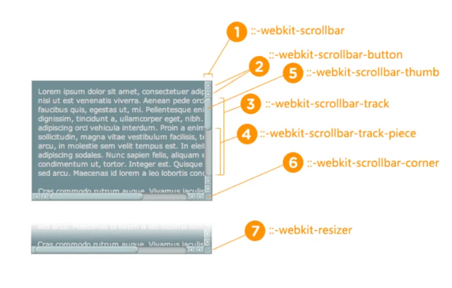
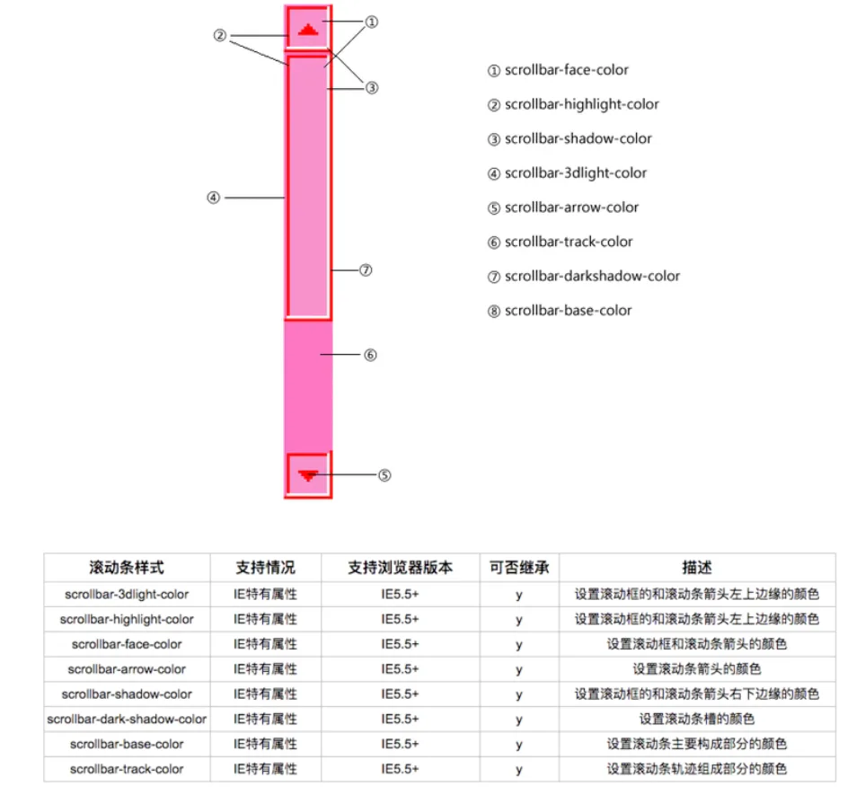
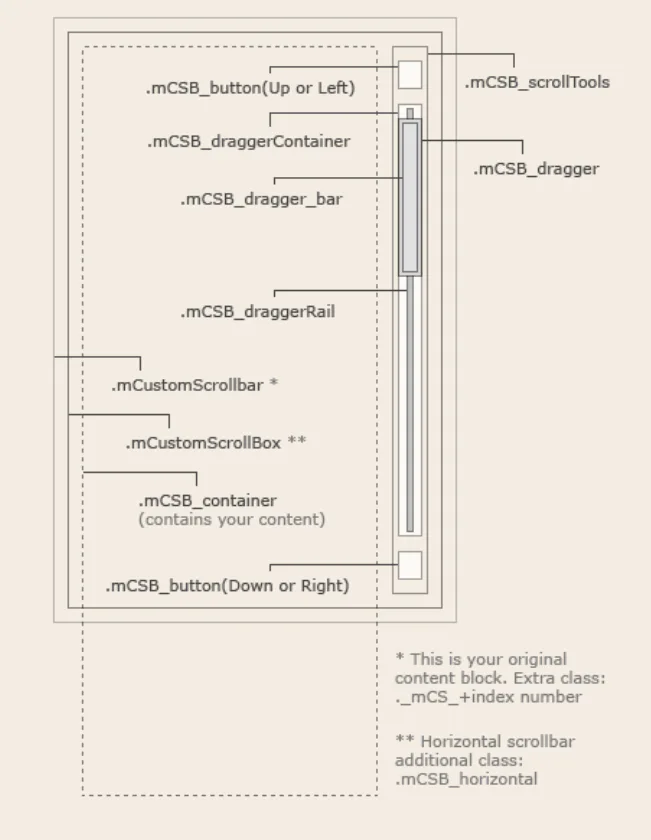

# 滚动条优化

\*\*一：scrollbar  \*\*​

谷歌



\* ::-webkit-scrollbar 滚动条整体部分

\* ::-webkit-scrollbar-thumb  滚动条里面的小方块，能向上向下移动（或往左往右移动，取决于是垂直滚动条还是水平滚动条）

\* ::-webkit-scrollbar-track  滚动条的轨道（里面装有Thumb）

\* ::-webkit-scrollbar-button 滚动条的轨道的两端按钮，允许通过点击微调小方块的位置。

\* ::-webkit-scrollbar-track-piece 内层轨道，滚动条中间部分（除去）

\* ::-webkit-scrollbar-corner 边角，即两个滚动条的交汇处

\* ::-webkit-resizer 两个滚动条的交汇处上用于通过拖动调整元素大小的小控件

上述样式是指针对谷歌浏览器生效的。（不兼容火狐，IE）

IE 的写法和上面不太一样



1\. scrollbar-arrow-color: color; /\*三角箭头的颜色\*/

2\. scrollbar-face-color: color; /\*立体滚动条的颜色（包括箭头部分的背景色）\*/

3\. scrollbar-3dlight-color: color; /\*立体滚动条亮边的颜色\*/

4\. scrollbar-highlight-color: color; /\*滚动条的高亮颜色（左阴影？）\*/

5\. scrollbar-shadow-color: color; /\*立体滚动条阴影的颜色\*/

6\. scrollbar-darkshadow-color: color; /\*立体滚动条外阴影的颜色\*/

7\. scrollbar-track-color: color; /\*立体滚动条背景颜色\*/

8\. scrollbar-base-color:color; /\*滚动条的基色\*/

```javascript 
 /*定义滚动条高宽及背景 高宽分别对应横竖滚动条的尺寸*/   
 ::-webkit-scrollbar   
 {   
     width: 16px;  /*滚动条宽度*/ 
     height: 16px;  /*滚动条高度*/ 
 }   
    
 /*定义滚动条轨道 内阴影+圆角*/   
 ::-webkit-scrollbar-track   
 {   
     -webkit-box-shadow: inset 0 0 6px rgba(0,0,0,0.3);   
     border-radius: 10px;  /*滚动条的背景区域的圆角*/ 
     background-color: red;/*滚动条的背景颜色*/   
 }   
    
 /*定义滑块 内阴影+圆角*/   
 ::-webkit-scrollbar-thumb   
 {   
     border-radius: 10px;  /*滚动条的圆角*/ 
     -webkit-box-shadow: inset 0 0 6px rgba(0,0,0,.3);   
     background-color: green;  /*滚动条的背景颜色*/ 
 }
```


令人遗憾的是 火狐目前还没有修改滚动条样式的 CSS支持

不过我们可以利用插件，比较好的插件有

[https://github.com/malihu/malihu-custom-scrollbar-plugin](https://github.com/malihu/malihu-custom-scrollbar-plugin "https://github.com/malihu/malihu-custom-scrollbar-plugin")

```javascript 
 <!DOCTYPE html> 
 <html> 
 <head> 
 <meta charset="utf-8"> 
 </head> 
 <link href="../css/jquery.mCustomScrollbar.css" rel="stylesheet" type="text/css" /> 
 <script src="../js/jquery-1.11.1.js"></script> 
 <script src="../js/jquery-ui-1.10.4.min.js"></script> 
 <script src="../js/jquery.mousewheel-3.0.6.min.js"></script> 
 <script src="../js/jquery.mCustomScrollbar.min.js"></script> 
 <style> 
 ._mCS_1 .mCSB_scrollTools .mCSB_dragger .mCSB_dragger_bar{ 
     background:red; 
     width:10px; 
 } 
 ._mCS_1 .mCSB_scrollTools .mCSB_draggerRail{ 
     background:blue; 
     width:5px; 
 } 
 </style> 
 <body> 
 
 
 <div class="content" style="width:500px;height:500px;overflow-y:auto;border:1px solid green;"> 
     <div style="height:900px;"></div> 
 </div> 
 <script type='text/javascript'> 
     (function($){ 
         $(window).load(function(){ 
             $(".content").mCustomScrollbar({ 
                 scrollButtons:{ 
                     enable:false,//是否添加 滚动条两端按钮支持 值:true,false 
                     scrollType:"continuous",//滚动按钮滚动类型 值:”continuous”(当你点击滚动控制按钮时断断续续滚动) “pixels”(根据每次点击的像素数来滚动) 
                     scrollSpeed:50,//设置点击滚动按钮时候的滚动速度(默认 20) 
                     scrollAmount:60//设置点击滚动按钮时候每次滚动的数值 像素单位 默认 40像素 
                 }, 
                 horizontalScroll:false,//是否创建一个水平滚动条 默认是垂直滚动条 
                 set_width:false,//：设置你内容的宽度 值可以是像素或者百分比 
                 set_height:false,//：设置你内容的高度 值可以是像素或者百分比 
                 mouseWheel:true,//鼠标滚动的支持 值为:true.false 
                 //mouseWheelPixels:10,//：鼠标滚动中滚动的像素数目(step) 值为以像素为单位的数值 
                 callbacks:{ 
                      onScrollStart:function(){//使用自定义的回调函数在滚动时间开始的时候执行 
                       
                      }, 
                      onScroll:function(){//自定义回调函数在滚动中执行 
                       
                      }, 
                      onTotalScroll:function(){//当滚动到底部的时候调用这个自定义回调函数 
                       
                      }, 
                      onTotalScrollBack:function(){//当滚动到顶部的时候调用这个自定义回调函数 
                       
                      }, 
                      onTotalScrollOffset:10,//设置到达顶部或者底部的偏移量 像素单位                      
                       
                      whileScrolling:function(){//当用户正在滚动的时候执行这个自定义回调函数 
                       
                      }, 
                      whileScrollingInterval:10,//设置调用 whileScrolling 回调函数的时间间隔 毫秒单位 
                 } 
             }); 
         }); 
     })(jQuery); 
 </script> 
 </body> 
 </html>
```


其中 mCustomScrollbar.css +  jquery.js + jquery-ui.js + mousewheel.js + mCustomScrollbar.js  这5个必须引入。注意引入顺序

令人遗憾的人，滚动条的样式不可以配置，需要手动写入样式(我也是醉了)

```javascript 
 ._mCS_1 .mCSB_scrollTools .mCSB_dragger .mCSB_dragger_bar{ 
     /* 1st scrollbar dragger style... */ 
 } 
 ._mCS_2 .mCSB_scrollTools .mCSB_dragger .mCSB_dragger_bar{ 
     /* 2nd scrollbar dragger style... */ 
 } 
 ._mCS_3 .mCSB_scrollTools .mCSB_dragger .mCSB_dragger_bar{ 
     /* 3rd scrollbar dragger style... */ 
 }
```


```javascript 
 ._mCS_1 .mCSB_scrollTools .mCSB_dragger .mCSB_dragger_bar{ 
     background:red; 
     width:10px; 
 } 
 ._mCS_1 .mCSB_scrollTools .mCSB_draggerRail{ /*这个就对应图片修改滚动条的背景色*/     
     background:blue; 
     width:5px; 
 }
```



