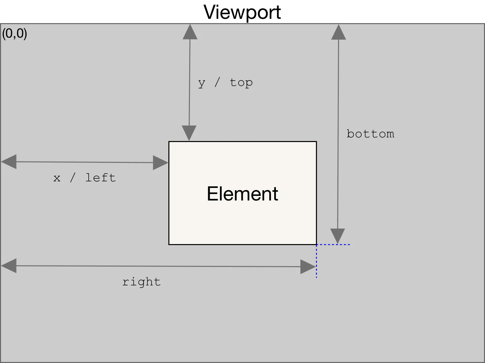
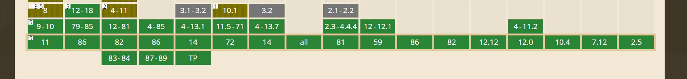

# getBoundingClientRect

## 目录

- [判断某个元素是否在视窗里](#判断某个元素是否在视窗里)

> **注意；这个元素的width 和 height 是不包括 ****`scale`****的；也就是****`transform`**** 的**

返回值是一个[DOMRect](https://developer.mozilla.org/zh-CN/docs/Web/API/DOMRect "DOMRect")对象，是包含整个元素的最小矩形（包括`padding`和`border-width`）。该对象使用`left`、`top`、`right`、`bottom`、`x`、`y`、`width`和`height`这几个以像素为单位的只读属性描述整个矩形的位置和大小。除了`width`和`height`以外的属性是相对于**视图窗口的左上角**来计算的。



该方法返回的[DOMRect](https://developer.mozilla.org/zh-CN/docs/Web/API/DOMRect "DOMRect")对象中\*\*的`width`****和****`height`****属性是包含了****`padding`****和****`border-width`****的，**而不仅仅是内容部分的宽度和高度。在标准盒子模型中，这两个属性值分别与元素的`width`/`height`+`padding`+`border-width`相等。**而如果是**[**box-sizing: border-box**](https://developer.mozilla.org/zh-CN/docs/Web/CSS/box-sizing "box-sizing: border-box")**，两个属性则直接与元素的****`width`****或****`height`\*\***相等。**

**getBoundingClientRect用于获取某个元素相对于视窗的位置集合。**



兼容性一片大好：ie5就支持

1.语法：这个方法没有参数。

```javascript 
 rectObject = object.getBoundingClientRect();
```


2.返回值类型：

注意：这个位置可要看清楚了；不是一般理解的那样

1. 应用场景咧

- 这里不放gif图了；滚动到一定位置；某一个元素fix吸顶；滚回去有放回去；这也是经典案列

`getBoundingClientRect`用于获取**某个元素相对于视窗**的位置集合。集合中有`top`, `right`, `bottom`, `left`等属性。

```typescript 
(function ($) {
function myScroll(element, option) {
    this.element = element;
    this.setting = $.extend({}, option, myScroll.defaults)
    this.init();
}
myScroll.defaults = {
    fixed: {
        "position": "fixed",
        "top": 0,
        "z-index": 1000,
    },
    none: {
        "position": "relative",
        "z-index": 0
    }
}
myScroll.prototype = {
    init: function () {
        var target = this.setting.target;
        var fixed = this.setting.fixed;
        var none = this.setting.none;
        var element = this.element;
        $(window).scroll(function () {
            var obj = document.getElementById(target.slice(1)).getBoundingClientRect();
            if (obj.top - $(this.element).height() < 0 && obj.bottom - $(this.element).height() > 0) {
                $(element).css(fixed)
                $(element).css("width",$(element).parent().width()+"px")
            } else {
                $(element).css(none)
            }
        });
    },
}
function myPlugin(option) {
    return this.each(function () {
        var that = $(this)
        var data = that.data('bs')
        var options = typeof option == 'object' && option
        that.data('bs', new myScroll(this, options))
    })
}
$.fn.myScroll = myPlugin
$.fn.myScroll.Constructor = myScroll
$(window).on('load', function () {
    $('[data-type="top"]').each(function () {
        var type = $(this)
        myPlugin.call(type, type.data())
    })
})
 })(jQuery)
 
```


这个例子真漂亮；第二个参数是判断是否完全在视窗里

# 判断某个元素是否在视窗里

```typescript 
export const elementIsVisibleInViewport = (el, partiallyVisible = false) => {
        const {
            top,
            left,
            bottom,
            right
        } = el.getBoundingClientRect();
        const {
            innerHeight,
            innerWidth
        } = window;
        return partiallyVisible ? ((top > 0 && top < innerHeight) || (bottom > 0 && bottom < innerHeight)) && ((
                left > 0 && left < innerWidth) || (right > 0 && right < innerWidth)) : top >= 0 && left >= 0 &&
            bottom <= innerHeight && right <= innerWidth;
    }
```
