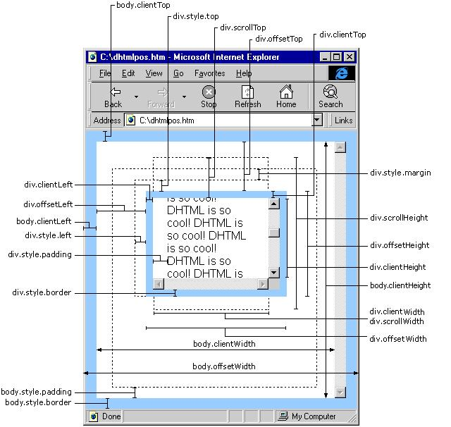

# 位置距离

[案例](./案例/index.md "案例")

[scroll](./scroll/index.md "scroll")

[文档](./文档/index.md "文档")

[获取元素的宽高](./获取元素的宽高/index.md "获取元素的宽高")

[getBoundingClientRect](./getBoundingClientRect/index.md "getBoundingClientRect")

[鼠标位置相关](./鼠标位置相关/index.md "鼠标位置相关")

[offset和client对比](./offset和client对比/index.md "offset和client对比")
