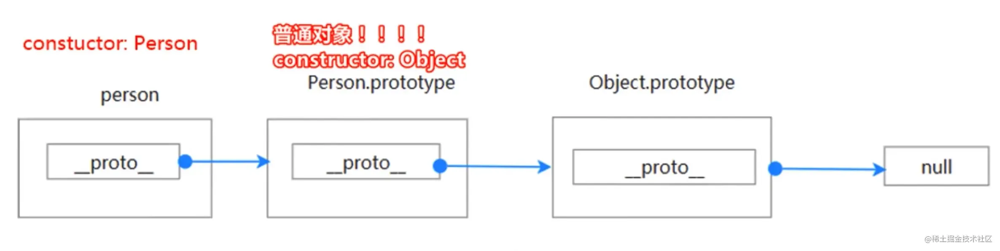

# 原型

## 目录

- [prototype](#prototype)
- [constructor](#constructor)
- [proto](#proto)
- [总结](#总结)

* 原型不是 JavaScript 首创
* 借鉴 Self 语言，基于原型（prototype）的实现继承机制

解决的问题

- 共享数据，减少空间占用，节省内存
- 实现继承

```typescript 
function Person(name, age) {
  this.name = name;
  this.age = age;
  this.getName = function () {
    return this.name;
  };
  this.getAge = function () {
    return this.age;
  };
}

const person1 = new Person();
const person2 = new Person();

 console.log(person1.getName === person2.getName); // false
```


通过原型可以共享getName及getAge方法

```typescript 
Person.prototype.getName = function () {
  return this.name;
};
Person.prototype.getAge = function () {
  return this.age;
};
```


### prototype

- **函数和class的共享属性，本质就是一个对象**

```typescript 
const obj = {};

console.log(obj.toString());

// toString 方法是不是来自原型
 console.log(obj.toString === Object.prototype.toString); // true
 
console.log(obj instanceof Object); // true
```


### constructor

- 实例的构造函数
- 可被更改
- 如果是普通对象，则该属性在其原型上

```typescript 
const obj = {};

 console.log(obj.constructor === Object); // true
```


### *proto*

- `_proto_`：\*\*`_proto_`\*\***属性是一个访问器属性（一个getter函数和一个setter函数**），暴露了通过它访问的对象的内部\[\[Prototype]]（一个对象或 null）
- 等于构造函数的原型prototype
- 推荐使用：**`Object.getPrototypeof`获取**
- 注意：**`Object.prototype.__proto__ === null`**

```typescript 
const des = Object.getOwnPropertyDescriptor(Object.prototype, "__proto__");

console.log(des);

// __proto__ 构造函数的原型
const obj = {};
 console.log(obj.__proto__ === obj.constructor.prototype); // true
 
// Object.getPrototypeOf 替代 __proto__
 console.log(Object.getPrototypeOf(obj) === obj.__proto__); // true
```




### 总结

- 函数最终的本质上是对象
- 普通对象都有`constructor`，指向自己的构造函数，可以被改变，不一样安全
- **函数和**\*\*`class`****的****`prototype.constructor`\*\***指向函数自身**
- `Function`、`Object`、`Regexp`、 `Error`等本质是函数，`Function.constructor = Function`
- 普通对象都有`_proto`\_，其等于构造函数的原型，推荐使用`Object.getPrototypeof`
- 所有普通函数的构造函数都是`Function`，ES6另外出现的函数种类 `AsyncFunction`，`GeneratorFunction`
- **原型链的尽头是null：`Object.prototype._proto_= null`**
- `Function._proto_`指向 `Function.prototype`
