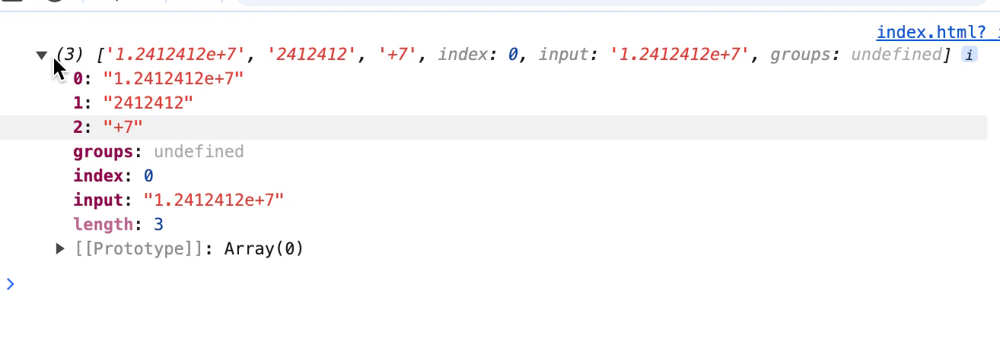

# 科学计数发

```javascript 
const _m = Number(a)
    .toExponential()
    .match(/\d(?:\.(\d*))?e([+-]\d+)/);
    
    
const _m = Number(12412412).toExponential() .match(/\d(?:\.(\d*))?e([+-]\d+)/);
console.log(_m)
```



