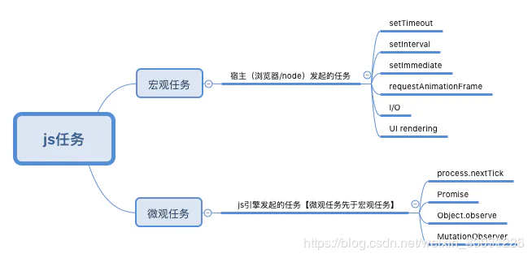
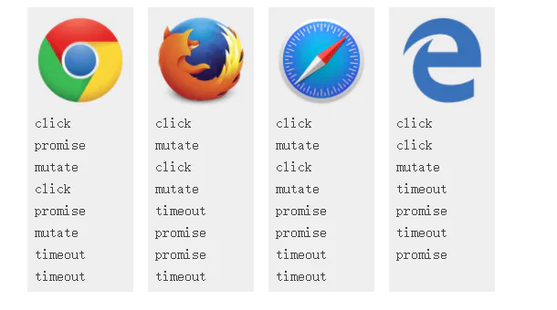
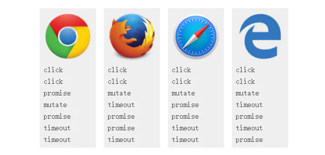

# Event Loop ---任务队列---事件循环

## 目录

- [前言](#前言)
- [Event Loop](#Event-Loop)
- [异步任务分类](#异步任务分类)
  - [「宏任务」macrotasks：](#宏任务macrotasks)
  - [「微任务」microtasks：](#微任务microtasks)
- [ 理解事件循环    ](#-理解事件循环--)
- [为什么会出现这样打印顺序呢？](#为什么会出现这样打印顺序呢)
  - [执行机制](#执行机制)
  - [宏任务（task）(渲染时机)](#宏任务task渲染时机)
  - [微任务（Microtasks ）](#微任务Microtasks-)
- [那为什么那些浏览器打印顺序不一样咧？](#那为什么那些浏览器打印顺序不一样咧)
  - [如何分辨宏任务和微任务？](#如何分辨宏任务和微任务)
  - [一级boss战](#一级boss战)
    - [哪个是对的？](#哪个是对的)
    - [浏览器哪里出错了？](#浏览器哪里出错了)
  - [一级boss愤怒的大哥来了（这个地方理解很复杂；无须深入研究）](#一级boss愤怒的大哥来了这个地方理解很复杂无须深入研究)
    - [为什么不一样呢？](#为什么不一样呢)
    - [这能影响到什么？](#这能影响到什么)
    - [干得不错！](#干得不错)

> 初步理解

# 前言

         前端仔每天都跟浏览器打交道，那么浏览器到底是怎样渲染的呢？

         我们都知道，JS是单线程的，也就

**是只有前一个任务执行完成，才会执行下一个任务**

。如果

**前一个任务耗时很长，那么下一个任务就只能干等着。显然，这样是非常浪费资源的。那么就要解决这个问题啦**

，先来了解一下

**「Event Loop」**

事件循环。

# Event Loop

         我们先来看一下HTML标准的解释：为了**协调事件**event，用户交互user interaction，脚本script，渲染rendering，网络networking等，用户代理

user agent必须使用事件循环\*\*「Event Loop」\*\*。

\*\*          「event-loop」是解决JS单线程运行阻塞的一种机制\*\*，**在JS的异步运行机制中**，我们需要知道：

- 所有的\*\*「同步任务」\*\*都在主线程进行
- **「异步任务」**进入任务队列，任务队列会通知主线程，哪个异步任务可以执行，这个异步任务就会进入主线程。异步任务**必须指定回调函数**，当主线程开始执行异步任务，其实就是在执行对应的回调函数。
- 如果主线程的所有同步任务都执行完，系统就会去读取\*\*「任务队列」\*\*上的异步任务，如果有可以执行的，就会结束等待状态，进入主线程，开始执行。
- **主线程不断的执行第3步**

这就是JS的运行机制，也称为\*\*「Event Loop」\*\*事件循环。

# 异步任务分类

## \*\*「宏任务」\*\*macrotasks：

script（整体代码）、setTimeout、setInterval、setImmediate、I/O、UI rendering

## \*\*「微任务」\*\*microtasks：

process.nextTick（NodeJS）、Promise、Object.observe、MutationObserver

# &#x20;理解事件循环   &#x20;

```javascript 
console.log('script start')

setTimeout(() => {

  console.log('setTimeout')

}, 0)

Promise.resolve().then(() => {

  console.log('Promise 1')

}).then(() => {

  console.log('Promise 2')

})

console.log('script end')

//运行结果

//script start

//script end

//Promise 1

//Promise 2

//setTimeout           
```


但是在不同浏览器上的结果却是让人懵逼的。

Microsoft Edge, Firefox 40, iOS Safari 和 desktop Safari 8.0.8在promise1，promise2之前打印了setTimeout，--虽然看起来像竞态条件。

但让人懵逼的是Firefox 39 ， Safari 8.0.7会打印出正确顺序。

译者注：译者的Microsoft Edge 38.14393.2068.0，Firefox 59.0.2 版本会打印出正确顺序，应该已经支持了吧，其他浏览器未验证。 &#x20;

再看加入es

```javascript 
console.log('script start')

    setTimeout(() => {

        console.log('setTimeout')

    }, 0)

    Promise.resolve().then(() => {

        console.log('Promise 1')

    }).then(() => {

        console.log('Promise 2')

    })

    async function test(){

        console.log('await 1')

        let data =await Promise.resolve().then(() => {

            console.log('Promise 3')

        }).then(() => {

            console.log('Promise 4')

        })

        console.log('await 2')

    }

    test()

    console.log('script end')

    /**

     * script start

     * await 1

     * script end

**  * Promise 1**

**     * Promise 3**

**     * Promise 2**

**     * Promise 4**

     * await 2

     * setTimeout

    */
```


> 加深理解

[补充材料【瑞客论坛 www.ruike1.com】.pdf](<./assets/file/补充材料【瑞客论坛 www.ruike1.com】_8gOEyx3RKD.pdf> "补充材料【瑞客论坛 www.ruike1.com】.pdf")



**宏观任务**

：宿主发起的任务为宏观任务，如setTimeout、setInterval、setImmediate，I/O

**微观任务**

：JavaScript引擎发起的任务为微观任务,如Promise

JavaScript引擎等待宿主环境分配

**宏观**

任务，宏观任务的队列可以理解为一个事件循环：

两个优秀的文档帮助理解：

[https://jakearchibald.com/2015/tasks-microtasks-queues-and-schedules/?utm\_source=html5weekly](https://jakearchibald.com/2015/tasks-microtasks-queues-and-schedules/?utm_source=html5weekly "https://jakearchibald.com/2015/tasks-microtasks-queues-and-schedules/?utm_source=html5weekly")

[https://segmentfault.com/a/1190000014940904?utm\_source=tag-newest](https://segmentfault.com/a/1190000014940904?utm_source=tag-newest "https://segmentfault.com/a/1190000014940904?utm_source=tag-newest")

# **为什么会出现这样打印顺序呢？**

要理解这些你首先需要对事件循环机制处理宏任务和微任务的方式有了解。

如果是第一次接触信息量会有点大。深呼吸……

## **执行机制**

\*\*         每个\*\*​

**线程**

**都会有它自己的event loop(事件循环)**

，所以都能独立运行。然而

**所有**

**同源窗口**

**会**

**共享**

**一个event loop以同步通信**

。event loop会一直运行，来执行进入队列的宏任务。

**一个event loop有多种的宏任务源（译者注：event等等）**

，这些宏任务源保证了在本任务源内的顺序。但是浏

**览器每次都会选择一个源中的一个宏任务去执行**

。这保证了浏览器给与一些宏任务（如用户输入）以更高的优先级。好的，跟着我继续……

## **宏任务（task）(渲染时机)**

        浏览器为了能够使得JS内部task与DOM任务能够有序的执行

，

**会在一个task执行结束后，在下一个 task 执行开始前，对页面进行重新渲染 （task->渲染->task->...）**

**（这句话非常重要：详细原理见vue 的渲染机制；最大程度的利用微观任务后渲染页面而不是宏观任务的原因所在）**

**鼠标点击会触发一个事件回调，需要执行一个宏任务，然后解析HTMl**

。还有下面这个例子，setTimeout

setTimeout的作用是等待给定的时间后为它的回调产生一个新的宏任务。这就是为什么打印‘setTimeout’在‘script end’之后。因为打印‘script end’是第一个宏任务里面的事情，而‘setTimeout’是另一个独立的任务里面打印的。

## **微任务（Microtasks ）**

  微任务通常来说就是需要

**在当前 task 执行结束后立即执行的任务**

，比如对一系列动作做出反馈，或者是需要异步的执行任务而又不需要分配一个新的 task，这样便可以减小一点性能的开销。

**只要执行栈中没有其他的js代码正在执行且每个宏任务执行完，微任务队列会立即执行。如果在微任务执行期间微任务队列加入了新的微任务，会将新的微任务加入队列尾部，之后也会被执行**

。微任务包括了mutation observe的回调还有接下来的例子promise的回调。

\*\*         一旦一个pormise有了结果\*\*​

，或者早已有了结果（有了结果是指这个promise到了fulfilled或rejected状态），

**他就会为它的回调产生一个微任务**

，这就保证了回调异步的执行

**即使这个promise早已有了结**

果。所以对一个已经有了结果的promise调用.then(yey, nay)会立即产生一个微任务。这就是为什么‘promise1’,'promise2'会打印在‘script end’之后，因为所

**有微任务执行的时候，当前执行栈的代码必须已经执行完毕**

。‘promise1’,'promise2'会打印在‘setTimeout’之前是因为所有微任务总会在下一个宏任务之前全部执行完毕。

# **那为什么那些浏览器打印顺序不一样咧？**

有些浏览会会打印出：

    script start, script end, setTimeout, promise1, promise2。

他们会在setTimeout之后执行promise的回调，就好像这些浏览器会把promise的回调视作一个新的宏任务而不是微任务。

    其实无可厚非，因为promises 来自于ECMAScript 的标准而不是HTML标准。

ECMAScript 有个关于jobs的概念和微任务挺类似的，但是否明确具有关联关系却尚未定论（相关讨论）。然而，

**普遍的观点是promise应该属于微任务。**

    如果说把 promise 当做一个新的 task 来执行的话，这将会造成一些性能上的问题，因为 promise 的回调函数可能会被延迟执行，

**因为在每一个 task 执行结束后浏览器可能会进行一些渲染工作**

**。**

由于作为一个 task 将会和其他任务来源（task source）相互影响，这也会造成一些不确定性，同时这也将打破一些与其他 API 的交互，这样一来便会造成一系列的问题。

    这里有一个关于让Edge把promise加入微任务的提议，其实WebKit 早已悄悄正确实现。所以我猜Safari最终会修复，Firefox 43好像已修复。

## **如何分辨宏任务和微任务？**

实际测试是一种方法，观察日志打印顺序与promise和setTimeout的关系，但是首先浏览器对这两者的实现要正确。

还有一个稳妥方法就是看文档，比如

[setTimeout](https://html.spec.whatwg.org/multipage/webappapis.html#timer-initialisation-steps "setTimeout")

是宏任务，

[mutation](https://dom.spec.whatwg.org/#queue-a-mutation-record "mutation")

是微任务。

正如上文提到的，ECMAScript 中把微任务叫做jobs，

[EnqueueJob](http://www.ecma-international.org/ecma-262/6.0/#sec-performpromisethen "EnqueueJob")

是微任务。

接下来，让我们看一些复杂的例子吧

## **一级boss战**

写这篇文章前我就犯了这个错。来看代码

\<div class="outer">

  \<div class="inner">\</div>

\</div>

在看接下来的js代码，如果我点击div.inner会打印什么？

// Let's get hold of those elements

var outer = document.querySelector('.outer');

var inner = document.querySelector('.inner');

// Let's listen for attribute changes on the

// outer element

//监听element属性变化

new MutationObserver(function() {

  console.log('mutate');

}).observe(outer, {

  attributes: true

});

// Here's a click listener…

function onClick() {

  console.log('click');

  setTimeout(function() {

    console.log('timeout');

  }, 0);

  Promise.resolve().then(function() {

    console.log('promise');

  });

  outer.setAttribute('data-random', Math.random());

}

// …which we'll attach to both elements

inner.addEventListener('click', onClick);

outer.addEventListener('click', onClick);

偷看答案前先试一试啊，tips:日志可能出现多次哦。

结果如下：

click

promise

mutate

click

promise

mutate

timeout

timeout

你猜对了吗。你可能猜对了，但是许多浏览器却不这样觉得。



*译者注：译者本机测试*

Chrome( 64.0.3282.167（正式版本） （64 位）)相同，

Edge(Edge 38.14393.2068.0)不同（与Chrome顺序相同）

Firefox 32位 59.0.2

- click
- mutate
- click
- mutate
- promise
- promise
- timeout
- timeout

### **哪个是对的？**

**分发click event是一个宏任务，Mutation observer和promise都会进入微任务队列，setTimeout回调是一个宏任务，所以来看demo**

*作者演示demo，建议原文观看*

[demo](https://jakearchibald.com/2015/tasks-microtasks-queues-and-schedules/?utm_source=html5weekly "demo")

所以chrome是对的，我之前也不知道

**只要执行栈中没有js代码在执行，微任务会在回调后立即执行，我之前认为它只会在宏任务结束后执行（**

Although we are mid-task,microtasks are processed after callbacks if the stack is empty）.这个规则来自于HTML标准中关于回调调用的部分

If the stack of script settings objects is now empty, perform a microtask checkpoint

— HTML: Cleaning up after a callback step 3

如果

[js执行栈](https://html.spec.whatwg.org/multipage/webappapis.html#stack-of-script-settings-objects "js执行栈")

空了,立即执行

[microtask checkpoint](https://html.spec.whatwg.org/multipage/webappapis.html#perform-a-microtask-checkpoint "microtask checkpoint")

—— 

[HTML: Cleaning up after a callback](https://html.spec.whatwg.org/multipage/webappapis.html#clean-up-after-running-a-callback "HTML: Cleaning up after a callback")

microtask checkpoint 会检查整个微任务队列，除非正在执行这个检查动作。ECMAScript 标准中说到

Execution of a Job can be initiated only when there is no running execution context and the execution context stack is empty…

— ECMAScript: Jobs and Job Queues

HTML环境下，必须执行。

### **浏览器哪里出错了？**

         Firefox和Safari在click监听器回调之间正确执行了mutation 回调的微任务，但promise打印结果却出现在了错误的位置。

        无可厚非的是jobs和微任务的关系太含糊不清，不过我仍认为应该在click监听器回调之间执行。

        Edge我们早就知道会把promise回调放进错误的队列，但他也也没在click监听器回调之间执行微任务队列，而是在所有监听器回调后执行，这打印click之后只打印了一次muteta，为此我给它提了个bug。

## **一级boss愤怒的大哥来了（****这个地方理解很复杂；无须深入研究****）**

用刚才的代码，如果我们这样执行会发生什么。

inner.click();这依旧会开始分发事件，**但这次是使用脚本而不是交互点击**。

click

click

promise

mutate

promise

timeout

timeout



**我发誓我从chrome得到的答案一直不一样- -。**

我已经更新了这个表许许多次了。我觉得我是错误地测试了Canary。假如你在 Chrome 中得到了不同的结果，请在评论中告诉我是哪个版本。

### **为什么不一样呢？**

[来看demo发生了什么,原作者的演示demo](https://jakearchibald.com/2015/tasks-microtasks-queues-and-schedules/?utm_source=html5weekly "来看demo发生了什么,原作者的演示demo")

所以正确的顺序是click, click, promise, mutate, promise, timeout, timeout,看来chrome是对的。

在每个监听器回调调用之后

If the stack of script settings objects is now empty, perform a microtask checkpoint

— HTML: Cleaning up after a callback step 3

之前的例子，微任务会在监听器回调之间执行。但这里的例子，

**click()会导致事件同步分发**

，

**所以在监听器回调之间Js执行栈不为空**

，而上述的这个规则保证了

**微任务不会打断正在执行的js**

.这意味着我们不

**能在监听器回调之间执行微任务，微任务会在监听器之后执行**

。

### **这能影响到什么？**

*译者注：对IndexedDB 理解不深入，这段就不翻译了- -*

Yeah, it'll bite you in obscure places (ouch). I encountered this while trying to create a simple wrapper library for IndexedDB that uses promises rather than weird IDBRequest objects. It almost makes IDB fun to use.

When IDB fires a success event, the related transaction object becomes inactive after dispatching (step 4). If I create a promise that resolves when this event fires, the callbacks should run before step 4 while the transaction is still active, but that doesn't happen in browsers other than Chrome, rendering the library kinda useless.

You can actually work around this problem in Firefox, because promise polyfills such as es6-promise use mutation observers for callbacks, which correctly use microtasks. Safari seems to suffer from race conditions with that fix, but that could just be their broken implementation of IDB. Unfortunately, things consistently fail in IE/Edge, as mutation events aren't handled after callbacks.

Hopefully we'll start to see some interoperability here soon.

### **干得不错！**

总结一下：

- **宏任务按顺序执行，且浏览器在每个宏任务之间渲染页面**
- **所有微任务也按顺序执行，且在以下场景会立即执行所有微任务**
  - **每个回调之后且js执行栈中为空。**
  - **每个宏任务结束后**。

希望你已经熟悉了eventloop.
