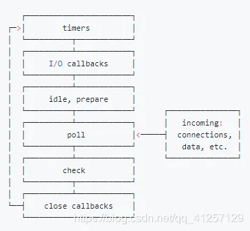

# setImmediate和setTimeout的区别

## 目录

- [setTimeout与setImmediate区别](#setTimeout与setImmediate区别)

首先两者都是定时器，在[node](https://so.csdn.net/so/search?q=node\&spm=1001.2101.3001.7020 "node")中有4种定时器：

- setTimeout
- setInterval
- setImmediate
- process.nextTick

在node中，I/O处理方面有自己的libuv引擎，libuv引擎中事件循环分为6个阶段：



- timers阶段： 执行timer（setTimeout 、setInterval）的回调
- poll阶段： 获取新的I/O事件，适当的条件下node将阻塞在这里。
- check阶段: 执行setImmediate（）的回调。
- setTimeout是在timer阶段，而setImmediate是在check阶段。

ps:
在poll阶段主要执行两件事：执行I/O回调、处理队列中的事件。

当事件循环在poll阶段时：
1、如果poll队列不为空，则执行队列中的回调；
2、 如果队列中为空，且有setImmediate回调要执行，就会立即停止poll阶段，进入check阶段执行setImmediate的回调；
3、 如果队列为空，并且没有setImmediate回调要执行，poll阶段将等待新的callback被加入。
4、如果有timer的话并且poll队列为空，则会检查是否有timer超时，如果有的话就回到timer阶段，执行相应的回调。

###### **setTimeout与setImmediate区别**

- 如果二者都从主模块内调用，则计时器将受进程性能的约束。举个例子，有如下代码：

```typescript 
setTimeout(() => console.log(1));
setImmediate(() => console.log(2));

```


**如果二者都从主模块内调用，则计时器将受进程性能的约束。 输出结果不一定，有可能先是1，也有可能先是2。**

因为setTimeout的第二个参数默认为0，但实际上，Node做不到0秒，*最少也要1毫秒。那么进入事件循环后，如果没到1毫秒，那么timers阶段就会跳过，进入check阶段。*

- **如果两者在I/O周期内调用，始终先执行setImmediate回调。**

```typescript 
const fs = require('fs');

fs.readFile(__filename, () => {
  setTimeout(() => {
    console.log('timeout');
  }, 0);
  setImmediate(() => {
    console.log('immediate');
  });
});

```


因为I/O回调是在poll阶段执行，当回调执行完毕之后队列为空，发现存在setImmediate的回调就会进入check阶段，执行完毕后，再进入timer阶段。
