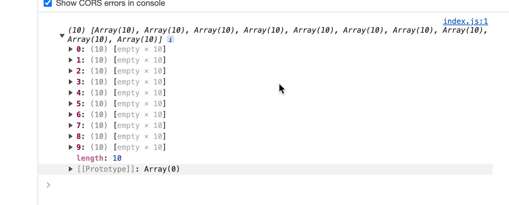
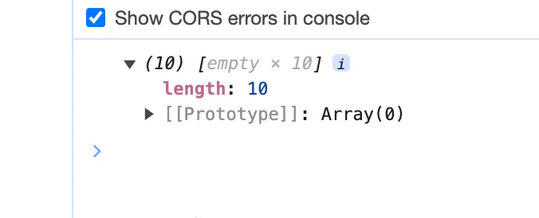

# 创建数组

## 目录

- [构造数组](#构造数组)
  - [apply ](#apply-)
  - [Array](#Array)
  - [Array.from](#Arrayfrom)
  - [new Array()](#new-Array)
  - [二维数组](#二维数组)

# **构造数组**

## apply&#x20;

```typescript 
 Array.apply(null, { length: 10 })     
 Array.apply(null,[1,2,3,4])  
```


- 值为 `undefined`
- `map(()=>100)`  填充

## Array

```typescript 
Array(10)
```


- `empty * 10` 站位
- 不能被`map` 填充 可以 用 `fill`
- `Array(10).fill({})`

## Array.from

```typescript 
Array.from({length:100}, (v,k) => k);
```


推荐这个：**生成数组 ，第二个参数函数 进行遍历**    

## new Array()

```javascript 
var a = new Array(10, 20);
a[0] // 返回 10
a.length // 返回 2
console.log(a)   // (2)[10, 20]

var a = new Array(10);
a[0] // 返回 undefined
a.length // 返回 10
console.log(a)  // (10)[empty × 10]

const createArr = (n) => new Array(n).fill(0).map((v, i) => i)
createArr(100) // 0 - 99数组

```


## 二维数组

这个地方` Array(10)` 是两个不同的用途

```javascript 
console.log(Array.from(Array(10), () => Array(10)))
```





