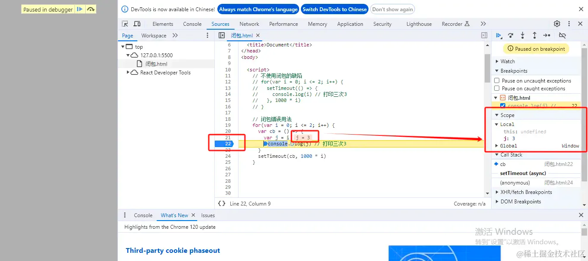
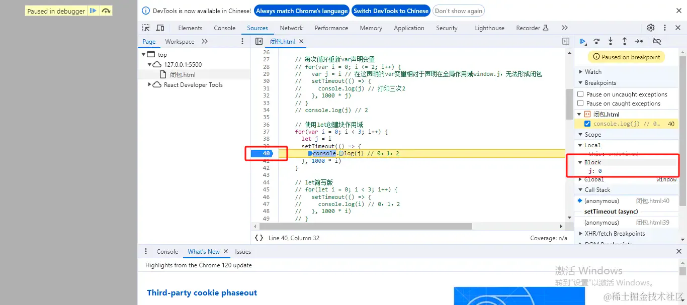
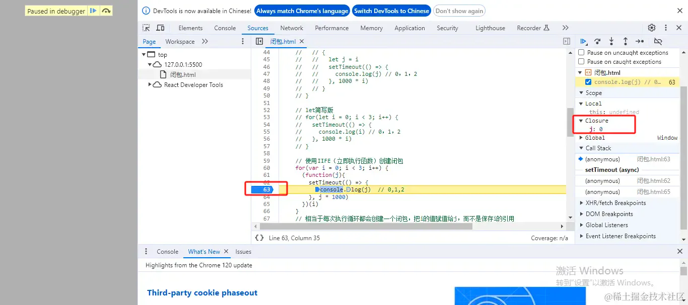

# for循环

## 目录

- [For 循环](#For-循环)
- [for循环探索](#for循环探索)
  - [for循环使用var声明变量的缺陷](#for循环使用var声明变量的缺陷)
  - [创建局部变量探索](#创建局部变量探索)
  - [每次循环重新var声明变量](#每次循环重新var声明变量)
  - [使用let创建块作用域](#使用let创建块作用域)
  - [使用let创建块作用域（简写版）](#使用let创建块作用域简写版)
  - [使用IIFE（立即执行函数）创建闭包](#使用IIFE立即执行函数创建闭包)

# For 循环

最大的特点：他可以打断

- break    此语句导致程序终止包含它的循环，并进行程序的下一阶段（整个循环后面的语句）；退出循环
- continue    不在执行循环体里continue后面的语句而是跳到下一个循环入口处执行下一个循环。
- return  表示从被调函数返回到主调函数继续执行，返回时可附带一个返回值，由return后面的参数指定。return后函数就结束了，后面的语句不再执行  打破的部署循环 而是执行循环的函数

```javascript 
for (i = 0; i < cars.length; i++) { 
    text += cars[i] + "<br>";
}
```


大家好，`for`循环应该是老生常谈的问题了，但我今天还是想再回顾一下，探索其中原理的同时，也能学到一些有用的知识。下文将通过`局部变量、块级作用域、闭包`三种方式来展示哪种方法可以解决`for`循环存在的缺陷，并且说明**为什么**不能解决以及**为什么**能解决，并且会演示在`浏览器`中如何进行打`断点`及如何`查看`代码运行生成的`局部变量、块级作用域以及闭包`。

**关键词：** for循环、局部变量、块级作用域、闭包

# for循环探索

## for循环使用var声明变量的缺陷

```javascript 
for(var i = 0; i <= 2; i++) {
  setTimeout(() => {
     console.log(i) // 打印三次3
   }, 1000 * i)
}
```


执行后，会每秒打印一个`3`，这是因为在延时器回调函数执行前，`for`循环已经结束，这时`i=3`。

而延时器的回调函数在没有执行前，并不知道`i`的具体值是什么，始终保留的是对`i`的引用。

当回调函数执行时，去读取`i`的值，这是发现`i`已经是`3`了，所以打印结果为三次`3`。

## 创建局部变量探索

```javascript 
for(var i = 0; i <= 2; i++) {
  var cb = () => {
    const j = i  // 每次循环保存i的值
     console.log(j) // 打印三次3
   }
  setTimeout(cb, 1000 * i)
}


```


我们在浏览器的`sources`标签下打开运行的代码文件，在`22`行处打了个断点，运行后可以看到右边`Scope`的`Local`下可看到局部变量`j`始终是`3`，*由于没有形成*\*`Closure（闭包）`**，所以回调函数里给**`j`**赋值的**`i`**始终是引用回调函数执行时**`i`\*\*的具体值，\*也就是循环结束后`i`的值，所以并没有真正解决问题。



## 每次循环重新var声明变量

```javascript 
for(var i = 0; i <= 2; i++) {
  var j = i
  setTimeout(() => {
    console.log(j) // 打印三次2
  }, 1000 * j)
}
console.log(j) // 2

```


`for`循环处声明的`var`变量**相对于声明在全局作用域**`window.j`（确切来说是在`for`循环外的作用域），每次循环只是简单的赋值，并不用解决问题。

## 使用let创建块作用域

```javascript 
for(var i = 0; i < 3; i++) {
  // let隐式声明块级作用域
  let j = i
  setTimeout(() => {
    console.log(j) // 0，1，2
  }, 1000 * i)
  // 等价于let显示声明块级作用域
  // {
  //   let j = i
  //   setTimeout(() => {
  //     console.log(j) // 0，1，2
  //   }, 1000 * i)
  // }
}

```


在`Scope`下可以看到形成**了一个块级作用域**，下面保存着`j`变量。每次执行会分别打印`0，1，2，`所以通过块级作用域可以解决`for`循环的缺陷。



## 使用let创建块作用域（简写版）

```javascript 
for(let i = 0; i < 3; i++) {
  setTimeout(() => {
    console.log(i) // 0，1，2
  }, 1000 * i)
}

```


## 使用IIFE（立即执行函数）创建闭包

```javascript 
for(var i = 0; i < 3; i++) {
  (function(j){
    console.log(i)  // 0,1,2
  })(i)
}

```


相当于每次执行循环都会创建一个**闭包**，`j`保留着对当次循环的`i`的具体值的引用。

在`Scope（作用域）`下的`Closure（闭包）`处可看到j形成了闭包。

所以通过闭包也能解决问题。



[for of](<./for of/index.md> "for of")

[for in](<./for in/index.md> "for in")
