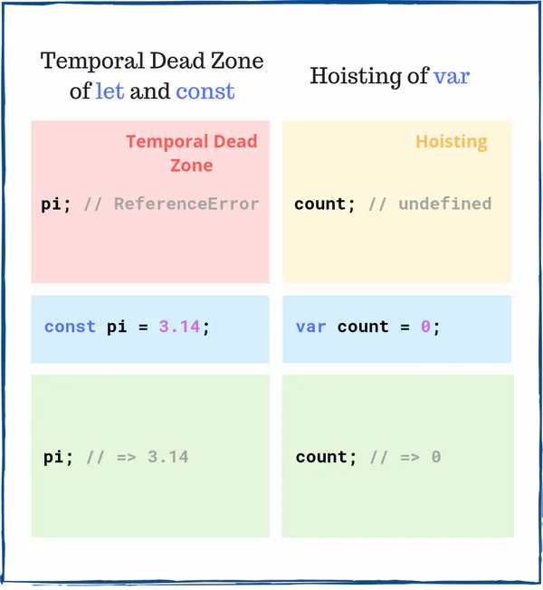

# 数字

## 目录

- [浮点数计算](#浮点数计算)

# 浮点数计算

```vue 
 0.1 + 0.2 === 0.3 // => ???
0.1 + 0.2; // => 0.30000000000000004
```


0.1 和 0.2 的总和不完全是 0.3，而是略高于 0.3。

由于以二进制方式对浮点数进行编码，因此像浮点数相加之类的操作会产生舍入误差。

**简而言之，直接比较浮点数并不精确。因此 ****0.1 + 0.2 === 0.3****的结果是 false。**



```typescript 
0.3 - 0.2 !== 0.1  // true

浮点操作不精确，老生常谈了，不过可以接受误差

 0.3 - 0.2 - 0.1 <= Number.EPSILON // true
```
