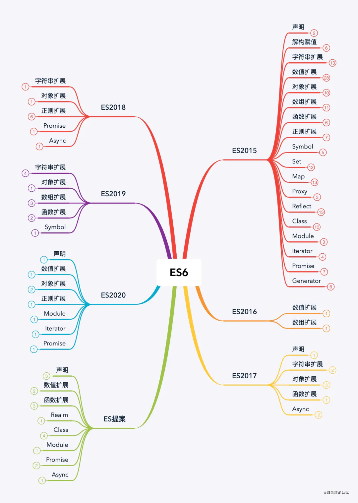
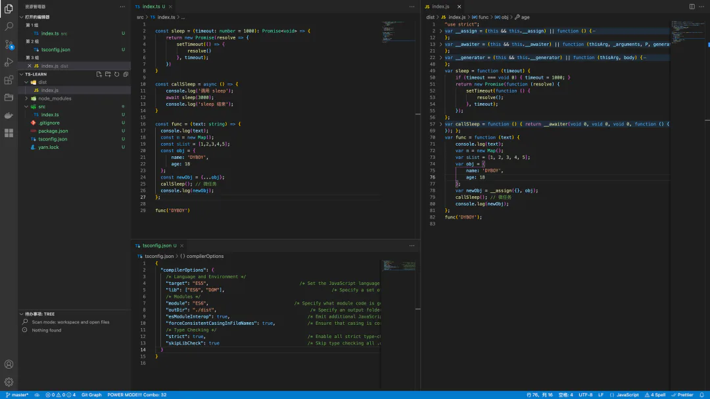
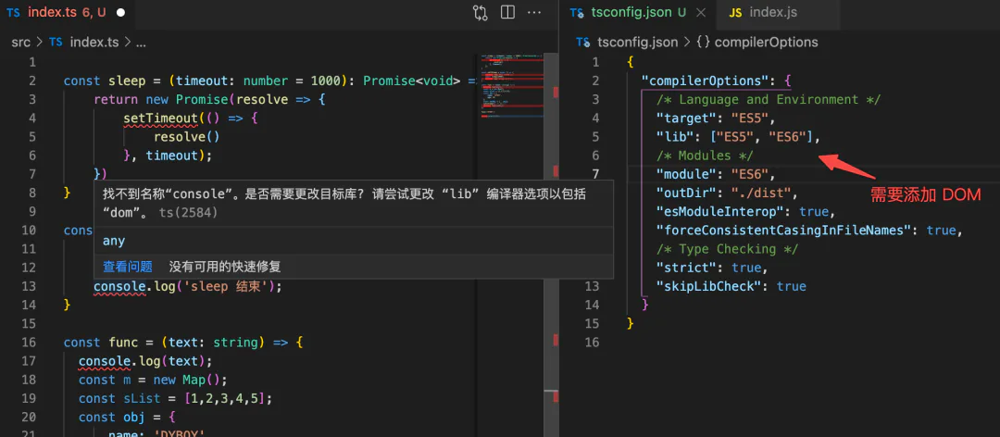
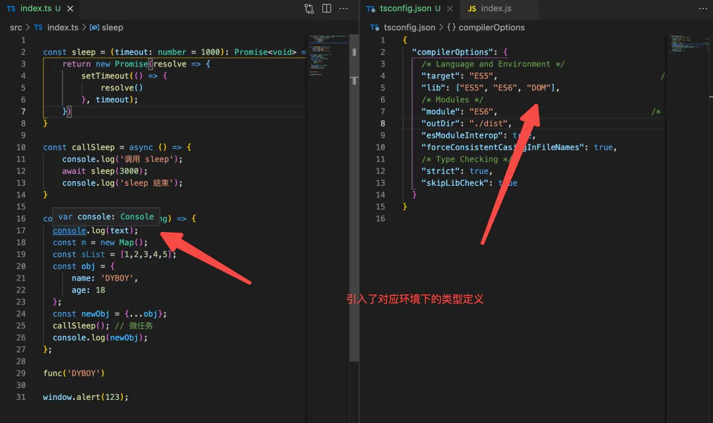

# compilerOptions

## 目录

- [2.6 compilerOptions](#26-compilerOptions)
  - [(1). target](#1-target)
  - [(2). lib](#2-lib)
  - [(5). moduleResolution](#5-moduleResolution)
  - [(6). baseUrl & paths](#6-baseUrl--paths)
  - [(7). rootDir & outDir](#7-rootDir--outDir)
  - [(8). jsx](#8-jsx)
  - [(9). importHelpers](#9-importHelpers)
  - [(10).experimentalDecorators](#10experimentalDecorators)
  - [(11). noEmit](#11-noEmit)

## 2.6 compilerOptions

`compilerOptions` 是一个描述 TypeScript 编译器功能的“大”字段，其值类型是“对象”，因此包含了很多用于描述编译器功能的**子字段**，其子字段的功能如下：

### (1). target

`target` 字段指明经过 TSC 编译后的 ECMAScript 代码语法版本，根据 ECMAScript 语法标准，默认值为 `ES3`。

TypeScript 是 JavaScript 的超集，是对 JavaScript 语法和类型上的扩展，因此我们可以使用 ES5、ES6，甚至是最新的 ESNext\[4] 语法来编写 TS。例如当我们使用 ES2021 语法来编码 TS 文件，同时配置如下：

```typescript 
{
  "compilerOptions": {
    "target": "ES5",
  }
}
```


则会将对应使用了最新 ECMAScript 语法的 TS 文件编译为符合 ES5 语法规范的 `*.js` 文件。

延伸一下知识点，思考一下 tsc 是如何将高版本（ECMAScript 规范）代码向低版本代码转换的？这个转换的结果靠谱吗？与 Babel 有何差异？



通过一个实验，在 `src/index.ts` 文件中使用了 Map、Async/Await、Promise、扩展运算符，并在 `tsconfig.jon` -> `target` 设置为 `ES5`：



然后发现在右侧的 `dist/index.js` 文件中，依然存在 `new Map()` 、Promise 语法，因此可以得出结论：**tsc 的代码降级编译并不能完全处理兼容性**。

通过官方文档了解到：


这里提到了 `lib` 字段，意思是 `target` 不同的值会有对应默认的 `lib` 字段值，当然也支持开发者显示指明 `lib` 字段的值，那么接下来看看 `lib` 是干嘛的吧！

### (2). lib

`lib` 字段是用于为了在我们的代码中**显示的指明**需要支持的 **ECMAScript 语法或环境对应的类型声明文件**。

例如我们的代码会使用到**浏览器中的一些对象** `window`、`document`，这些全局对象 API 对于 **TypeScript Complier** 来说是不能识别的：



因而需要在 `lib` 字段中如下配置：

```typescript 
{
  "compilerOptions": {
    "target": "ES5",
    "lib": ["ES5", "ES6", "DOM"],
  }
}
```


来显式引入在 **DOM** 即浏览器环境下的一些默认类型定义，即可在代码中使用，`window`、`document` 等浏览器环境中的对象，TS 在运行时以及编译时就不会报类型错误。



综合 `target` 和 `lib` 字段的实际功能表现，我们可以得出**结论**：

TSC 的编译结果只有**部分特性做了 pollyfill 处理**，ES6\[6] 的一些特性仍然被保留，想要支持完全的降级到 ES5 还是**需要额外引入 pollyfill**（也就是我们在项目的入口文件处 `import 'core-js'`），但建议是将 `target` 字段值设置为 `ES6`，提升 TSC 的速度。

因此，笔者对于使用 TSC 编译的观点是：

**不应该将 ****`TSC`**** 作为编译项目的工具，应该将 ****`TSC`**** 作为类型检查工具，代码编译的工作尽量交给 ****`Rollup`****、****`Webpack`**** 或 ****`Babel`**** 等打包工具!**

### (5). moduleResolution

`moduleResolution` 声明如何处理模块，枚举值：`classic`、`node`，会根据 `module` 字段决定默认值。

推荐手动设置为 `node`，更符合现在大家的编码认识一些，而**且大部分的构建打包工具都是基于 Node。**

举个🌰，遇到 `import {a} from 'a-lib';` 这样的模块引入代码应该如何去（解析）查找到对应的模块文件。

### (6). baseUrl & paths

`baseUrl`：设置**基本目录以解析非绝对模块名称**（定义一个根目录，以此进行绝对文件路径解析）

`paths`：用于设置模块名或路径映射列表，这样就可以简写项目中自定义模块的文件路径。通常配置项目中的alias

举一个 🌰：

```typescript 
{
  "compilerOptions": {
    // 注意：baseUrl 必选，与 paths 成对出现，以 tsconfig.json 文件所在目录开始
    "baseUrl": ".", 
    "paths": {
      // 映射列表
      "@/*": [
        "src/*"
      ],
      "moduleA": [
        "src/libs/moduleA"
      ]
    }
  }
}

// 代码里这么写
import Toast from '@/components/Toast.ts' // 模块实际位置: src/components/Toast.ts
import TestModule from 'moduleA/index.js' // 模块实际位置: src/libs/moduleA/index.js
```


**⚠️ 注意：** 如果需要自动生成（导出）类型定义文件，TSC 不会处理路径别名，需要引入 typescript-transform-paths\[8] 插件，以及 TTypescript\[9] 来转换路径别名为相对路径。

由于当前的 TypeScript 不支持 tsconfig.json 中的自定义转换器，且无法使用 tsc 命令使用自定义转换器编译文件，所以引入了 TTypescript 作为包装器

```typescript 
// tsconfig.json
{
  "compilerOptions": {
    "baseUrl": "./",
    // 配置路径别名映射
    "paths": {
      "@/*": ["src/*"]
    },
    "plugins": [
      // 转换输出 js 文件中的路径
      { "transform": "typescript-transform-paths" },

      // 转换输出 .d.ts 文件中的路径
      { "transform": "typescript-transform-paths", "afterDeclarations": true }
    ]
  }
}
```


plugins\[10] 是用于扩展 TSC 编译器功能的字段。

例如在 Rollup 打包环境下，可以如下配置：

```typescript 

import typescript from '@rollup/plugin-typescript';
import ttypescript from 'ttypescript';

export default [
  {
    input: './src/index.ts',
    output: {
      dir: 'dist',
      format: 'cjs',
      entryFileNames: 'index.js',
    },
    plugins: [
      typescript({
        typescript: ttypescript,
      }),
    ],
  },
];
```


如果是有自动导出类型定义文件的需求，才需要搞这一套插件～

### (7). rootDir & outDir

`rootDir`：**指定 TypeScript 识别读取的根目录，** 用于所有非声明输入文件的最长公共路径

> 例如：`'"rootDir": "./src"`，**则 src 目录下的 TS 文件不能引用 src 目录以外的 ts 文件**，一般我们会设置为 `./src` 或 `./`（即 tsconfig.json 所在目录）

`outDir`：输出目录，**即 tsc 编译后的文件输出的文件夹路径**（基于 tsconfig.json 文件的相对路径）

> 例如：`"outDir": "./dist"`，及将 TSC 编译输出的 JS 文件，统一输出的 `./dist` 目录下。

### (8). jsx

如果是有 jsx 语法需要支持的项目，可以设置值 `preserve`、`react` 等

```typescript 
{
  "compilerOptions": {
    "jsx": "preserve", // 一般 preserve 即可
  },
}

```


### (9). importHelpers

`importHelpers` 决定是否启用从 `tslib` 库**引入语法降级辅助函数**，以避免重复冗余的辅助函数声明。

个人建议是设置为 `true` 来启用。

### (10).experimentalDecorators

`experimentalDecorators` 用于**声明是否启实验性用装饰器模式**。

TypeScript 和 ES6 中引入了 Class 的概念，同时在 Decorators\[11] 提出了装饰器模式，通过引入装饰器模式，能极大简化书写代码。

当前对于 Decorator 的支持性不太好，如果是一些涉及到使用了装饰器的需要，就需要开启这个属性。

### (11). noEmit

`noEmit` 设置**是否输出 js 文件，一般是设置为`false`**，将打包等工作交给 Webpack 等工具。

[strictPropertyInitialization](./strictPropertyInitialization/index.md "strictPropertyInitialization")

[module](./module/index.md "module")

[path 别名](<./path 别名/index.md> "path 别名")

[erasableSyntaxOnly ](./erasableSyntaxOnly-/index.md "erasableSyntaxOnly ")

[@types ， typeRoots 和 types](<./类型声明配置/index.md> "@types ， typeRoots 和 types")
