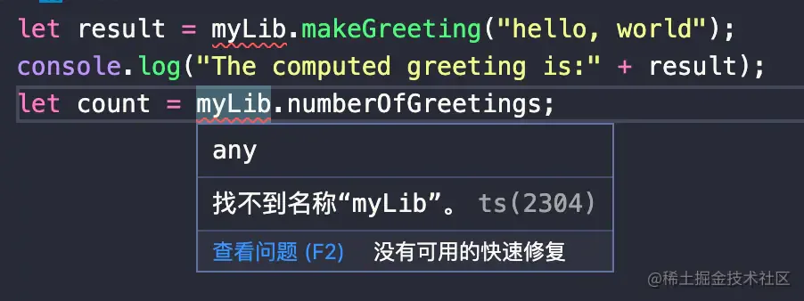
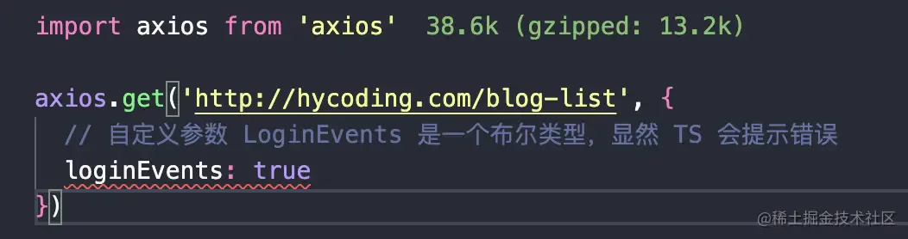
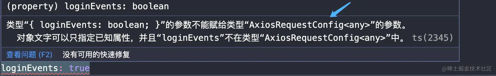
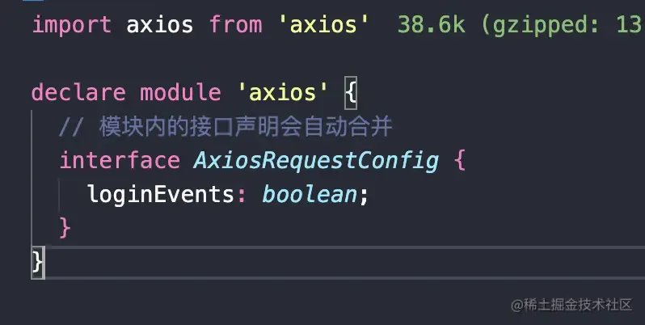

# 声明文件 declare

## 目录

- [全局变量](#全局变量)
- [声明合并](#声明合并)
  - [接口自动合并](#接口自动合并)
  - [declare 合并](#declare-合并)
- [Npm 包类型声明](#Npm-包类型声明)
  - [export 关键字](#export-关键字)
  - [混用 declare 和 export](#混用declare和export)
  - [export namespace](#export-namespace)
  - [export default](#export-default)
  - [export =](#export-)
- [扩展全局变量](#扩展全局变量)
- [在 Npm 包、UMD 中扩展全局变量](#在-Npm-包UMD-中扩展全局变量)
- [扩展 Npm 包类型](#扩展-Npm-包类型)

## 全局变量

- [declare var](https://link.juejin.cn?target=https://ts.xcatliu.com/basics/declaration-files.html#declare-var "declare var") 声明全局变量
- [declare function](https://link.juejin.cn?target=https://ts.xcatliu.com/basics/declaration-files.html#declare-function "declare function") 声明全局方法
- [declare class](https://link.juejin.cn?target=https://ts.xcatliu.com/basics/declaration-files.html#declare-class "declare class") 声明全局类
- [declare enum](https://link.juejin.cn?target=https://ts.xcatliu.com/basics/declaration-files.html#declare-enum "declare enum") 声明全局枚举类型
- [declare namespace](https://link.juejin.cn?target=https://ts.xcatliu.com/basics/declaration-files.html#declare-namespace "declare namespace") 声明（含有子属性的）全局对象
- [interface](https://link.juejin.cn?target=https://ts.xcatliu.com/basics/declaration-files.html#interface-he-type "interface")[ 和 ](https://link.juejin.cn?target=https://ts.xcatliu.com/basics/declaration-files.html#interface-he-type " 和 ")[type](https://link.juejin.cn?target=https://ts.xcatliu.com/basics/declaration-files.html#interface-he-type "type") 声明全局类型

上述罗列了 6 中全局声明的语句，我们可以通过 **`declare`**\*\* 关键字结合对应的类型，从而在任意 ****`.d.ts`**** 中进行全局类型的声明。\*\*

比如我们以 `namespace `举例：

假设我们的业务代码中存在一个全局的模块对象 `MyLib`，它拥有一个名为 `makeGreeting `的**方法**以及一个 `numberOfGreetings `**数字类型属性**。

当我们想在 TS 文件中使用该 global 对象时：

假设我们的业务代码中存在一个全局的模块对象 MyLib，它拥有一个名为 makeGreeting 的方法以及一个 numberOfGreetings 数字类型属性。

当我们想在 TS 文件中使用该 global 对象时：



> TS 会告诉我们找不到 `myLib`。

原因其实非常简单，`typescript `文件中本质上是对于我们的代码进行**静态类型检查**。当我们使用一个**没有类型定义的全局变量**时，TS 会明确告知找不到该模块。

当然，我们可以选择在该文件内部对于该模块进行定义并且进行导出，Like this:

```typescript 
export namespace myLib {
  export let makeGreeting: (string: string) => void
  export let numberOfGreetings: number
}

let result = myLib.makeGreeting("hello, world");
console.log("The computed greeting is:" + result);
let count = myLib.numberOfGreetings;

```


上述的代码的确在模块文件内部定义了一个 `myLib `的命名空间，在该文件中我们的确可以正常的使用 `myLib`。

可是，在别的模块文件中我们如果仍要使用 `myLib `的话，也就意味着我们需要手动再次 import 该 `namespace`。

这显然是不合理的，所以 TS 为我们提供了**全局的文件声明** `.d.ts` 来解决这个问题。

**我们可以通过在 ts 的****编译范围内****声明 ****`[name].d.ts`**** 来定义全局的对象的命名空间。** 比如：


可以看到上图的右边，此时当我们使用 `myLib` 时， TS 可以正确的识别到他是 myLib 的命名空间 。

> 如果你的 `[name].d.ts` 不生效，那么仔细检查你的 `tsconfig.json -> include` 设置～～

虽然说随着 ES6 的普及，ts 文件中的 namespcae 已经逐渐被淘汰掉了。

但是在类型声明文件中使用 `declare namespace xxx` 声明类似全局对象仍然是非常实用的方法。

## 声明合并

上边我们讲述了如何在类型声明文件中进行全局变量的声明，接下来其他部分之前我们先来聊聊 TS 中的声明合并。

### 接口自动合并

```typescript 
interface Props {
  name: string;
}

interface Props {
  age: 18;
}

const me: Props = {
  name: 'wang.haoyu',
  age: 18
}

```


上述的代码一目了然，在多个相同名称的 interface 中**同名的 interface 声明会被自动合并**。

但是需要注意的是，无论哪种声明合并必须遵循**合并的属性的类型必须是唯一的**，比如：

```typescript 
interface Props {
  name: string;
}
// 后续属性声明必须属于同一类型。属性“name”的类型必须为“string”，但此处却为类型“18”
interface Props {
  name: 18;
}

```


### declare 合并


这里可以看到在右边的声明文件中进行了名为 axios 全局命名空间声明，同时在左边的文件中我们使用了 `axios.Props` 类型。

**其实本质上就是相同命名空间内的接口合并，** ​**当然我们可以利用 declare 声明合并达到更多的效果。后续我们会详细提到。**

## Npm 包类型声明

接下来我们来看看关于 **Npm 包类型**的声明文件如何编写。

上述我们提到过 TS 是如何加载对应 npm 包的声明文件的。

现在我们假设一种场景下，我们目前使用了 axios 这个库。假设目前这个库并没有对应的类型声明文件，显然当我们在代码中引入这个库时候一定是会报错的。

此时，关于 Npm 包类型的声明会很好的帮助我们来解决这个问题：

首先我们在上述说到的，当我们在代码中执行

```typescript 
import axios from 'axios'

```


它会按照路径依次去查找，**正常来说它会去 node\_modules 下的各个路径区查找对应的模块**。那么我们需要将自定义的声明文件书写在 node\_modules 中去吗？

这显然是不合理的，因为 node\_modules 中的目录是非常不稳定的。

此时，我们可以**首先在 tsconfig.json 中配置对应的 alias 别名配置**，达到引入 axios 时自动帮我们找到对应的 `.d.ts` 文件声明文件：

```typescript 
{
  "compilerOptions": {
    "baseUrl": "./",
    "paths": {
      "axios": [
        "types/axios.d.ts"
      ]
    }
  }
}

```


> 这里我们配置了寻找的别名。

之后，我们在项目的根目录（`tsconfig.json`）平级新建一个 `types/axios.d.ts`。

```typescript 
// axios.d.ts
// 利用 export 关键字导出 name 变量
export const name: string;

```


此时在项目中的任意文件，我们就可以**使用导出的 name 变量**：

```typescript 
import { name } from 'axios'
console.log(name) // string 类型的 name 变量

```


> 当然你可以为模块内添加对应各种各样的类型声明。

上述我们就实现了一个简单的模块定义文件，关于 npm 包类型的声明有以下几种语法需要和大家强调下：

- [export](https://link.juejin.cn?target=https://ts.xcatliu.com/basics/declaration-files.html#export "export") 导出变量
- [export namespace](https://link.juejin.cn?target=https://ts.xcatliu.com/basics/declaration-files.html#export-namespace "export namespace") 导出（含有子属性的）对象
- [export default](https://link.juejin.cn?target=https://ts.xcatliu.com/basics/declaration-files.html#export-default "export default") ES6 默认导出
- [export =](https://link.juejin.cn?target=https://ts.xcatliu.com/basics/declaration-files.html#export-1 "export =") commonjs 导出模块

### export 关键字

需要额外留意的是`npm `包的**声明文件与全局变量的声明文件**有很大区别。

\*\*在 npm 包的声明文件中，使用 ****`declare`**** 不再会声明一个全局变量，而只会在****当前文件中声明一个局部变量****。只有在声明文件中使用 ****`export`**** 导出，然后在使用方 ****`import`**** 导入后，\*\***才会应用到这些类型声明。**

`export` 的语法与普通的 ts 中的语法类似，需要注意的是`d.ts`的声明文件中禁止定义具体的实现。

比如：

```typescript 
// types/axios/index.d.ts

// 导入变量
export const name: string;
// 导出函数
export function createInstance(): AxiosInstance;
// 导出接口 接口导出省略 export
interface AxiosInstance {
  // ...
  data: any;
}
// 导出 Class
export class Axios {
  constructor(baseURL: string);
}
// 导出枚举
export enum Directions {
  Up,
  Down,
  Left,
  Right
}

```


此时我们在 TS 文件中就可以自由的使用这些导出的变量和类型了：

```typescript 
import { name, createInstance, AxiosInstance, Axios, Directions } from 'axios'

console.log(name) // string
// 通过 createInstance 返回 AxiosInstance 实例
const instance: AxiosInstance = createInstance()

new Axios('/')

const a = Directions.Up

```


### 混用 `declare` 和 `export`

上边我们提到过，**在 ****npm 包的声明文件中，使用 ****`declare`**** 不再会声明一个全局变量，而只会在当前文件中声明一个局部变量****。**

同样上边的声明我们可以改成通过 declare + export 声明：

```typescript 
// types/axios/index.d.ts

// 变量
declare const name: string;
// 函数
declare function createInstance(): AxiosInstance;
// 接口 接口可以省略 export
interface AxiosInstance {
  // ...
  data: any;
}
// Class
declare class Axios {
  constructor(baseURL: string);
}
// 枚举
enum Directions {
  Up,
  Down,
  Left,
  Right
}

export {
  name, createInstance, AxiosInstance, Axios, Directions
}

```


### `export namespace`

与 `declare namespace` 类似，`export namespace` 用来导出一个拥有子属性的对象：

```typescript 
// types/foo/index.d.ts

// 导出一个 Axios 的命名空间
export namespace Axios {
  const name: string;
  namespace AxiosInstance {
    function getUrl(): string;
  }
}

// xx.ts
import { Axios } from 'axios'

Axios.AxiosInstance.getUrl()

```


### `export default`

> 在 ES6 模块系统中，使用 `export default` 可以导出一个默认值，使用方可以用 `import foo from 'foo'` 而不是 `import { foo } from 'foo'` 来导入这个默认值。

同样，在类型声明文件中，我们可以通过 `export default` 用来导出默认值的类型。比如：


> 需要额外注意的是只有 `function`、`class` 和 `interface` **可以直接默认导出，其他的变量需要先定义出**来，再默认导出。

### `export =`

当然，我们上述提到的都是关于 ESM 相关的类型声明文件。

TS 中的类型声明文件同样为我们提供了使用 `export =` 的 CJS 模块相关语法：

```typescript 
// types/axios.d.ts
export = axios
declare function axios(): void

```


```typescript 
import axios = require('axios')

```


可以看到上述的代码，我们通过 `export = axios` 定义了一个**相关的 CJS 模块语法**。

**需要额外注意的是在 ts 中若要导入一个使用了**\*\*`export =`****的模块时，必须使用TypeScript提供的特定语法****`import module = require("module")`。\*\*​

在日常业务中，不可避免我们会碰到一些相关 commonjs 规范语法的模块，那么当我们需要扩充对应的模块或者为该模块声明定义文件时，就需要使用到上述的 `export =` 这种语法了。

当然，`export =` 这种语法不**仅仅可以支持 cjs 模块。它也同样是 ts 为了 ADM 提出的模块**兼容声明。有兴趣的朋友可以详细查阅[官方文档](https://link.juejin.cn?target=https://www.typescriptlang.org/docs/handbook/modules.html#export--and-import--require "官方文档")。

## 扩展全局变量

在类型声明文件中对于**全局变量的扩展**非常简单，我们仅仅需要利用**声明合并的方式即可对于全局变量进行扩展**。

举个例子，假设我们想为 string 类型的变量扩展一个 hello 的方法。正常扩展后全局调用该方法 TS 是会提示错误的。

此时就需要我们通过类型定义文件来进行全局变量的扩展：

```typescript 
// types/index.d.ts 利用接口合并，扩展全局的 String 类型
// 为它添加一个名为 hello 的方法定义
interface String {
  hello: () => void;
}

```


此后，我们就可以直接在全局中自由的调用该 hello 方法了：

```typescript 
'a'.hello()

```


## 在 Npm 包、UMD 中扩展全局变量

在声明文件中扩展全局变量利**用合并声明的方式**可以非常容易的进行扩展。

而在 Npm 包、UMD 的声明文件中如果我们想扩展全局变量那应该如何做呢。

上边我们说到过，***任何声明文件中只要存在 ******`export/import`****** 关键字的话，该声明文件中的 declare 都会变成模块内的声明而非全局声明。***

比如，我们在自己定义的 axios.d.ts 中：

```typescript 
// types/axios.d.ts

declare function axios(): string;

// 此时声明的 interface 为模块内部的String声明
declare interface String {
  hello: () => void;
}

export default axios;

// index.ts
'a'.hello() // 类型“"a"”上不存在属性“hello”

```


此时内部声明的 String 接口扩展**被认为是模块内部的接口拓展**，我们在全局中使用是会提示错误的。

针对于 Npm 包中需要进行**全局声明**的话，TS 同样为我们提供了 `declare global` 来解决这个问题：

```typescript 
// types/axios.d.ts

declare function axios(): string;

// 模块内部通过 declare global 进行全局声明
// declare global 内部的声明语句相当于在全局进行声明
 declare global { 
  interface String {
    hello: () => void;
  }
}

export default axios;

// index.ts
'a'.hello() // correct
```


## 扩展 Npm 包类型

大多数时候我们使用一些现成的第三方库时都已经有对应的类型声明文件了，但有些情况下我们需要对于第三方库中某些属性进行额外的扩展或者修改。

直接去修改 node\_modules 中的**第三方** TS 类型声明文件显然是不合理的，那么此时就需要我们通过**类型声明文件扩展第三方库的声明。**

同样 TypeScript 提供给了我们一种 `declare module` 的语法来进行模块的声明。

通常在我们可以利用 `declare module` 语法在进行新模块的声明的同时，也可以使用它来对于已有第三方库进行类型定义文件的扩展。

在进行模块扩展时，需要额外注意**如果是需要扩展原有模块的话，需要在类型声明文件中先引用原有模块，再使用 ****`declare module`**** 扩展原有模块**。

比如，通常我们在项目中使用 `axios` 库时，希望在请求的 config 中支持传递一些自定义的参数，从而在全局拦截器中进行拿到我们的自定义参数。

如果直接在 TS 文件下进行属性赋值和取值的话，TS 会抛出异常的：



同样，我们可以利用 `declare module` 来进行第三方 NPM 包的扩展，我们可以看到 axios 请求中第二个参数的类型为 `AxiosRequestConfig` 类型。



那么我们仅仅需要对于这个类型进行扩展就 OK 了：



此时，我们在回到刚才的代码中可以发现无论我们是取值还是赋值，TS 都可以很好的帮我们进行出类型推断。

> 当然，这只是一个非常简单的例子。但是这个场景我相信对于大家来说都非常常见，不过模块的扩展本质上大同小异～

```typescript 
export * as rxjs from 'rxjs/dist/types/index'
```
