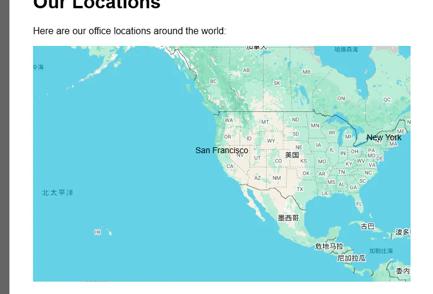

# 地图集成组件

第三方插件集成

**场景**：**集成地图、支付等第三方服务，保持样式和行为隔离。**

**适合场景**：

- 集成**第三方服务，如地图、支付、聊天**等
- 需要**保持第三方代码与主应用隔离**
- 需要**自定义第三方组件的外观和行为**



```html 
<!DOCTYPE html>
<html>
<head>
    <title>Map Component</title>
    <style>
        body { font-family: Arial; margin: 20px; }
        .page-content { max-width: 800px; margin: 0 auto; }
    </style>
</head>
<body>
    <div class="page-content">
        <h1>Our Locations</h1>
        <p>Here are our office locations around the world:</p>
        
        <!-- 地图组件 -->
        <google-map api-key="YOUR_API_KEY" zoom="3" center="37.7749,-122.4194">
            <map-marker position="37.7749,-122.4194" label="San Francisco"></map-marker>
            <map-marker position="40.7128,-74.0060" label="New York"></map-marker>
            <map-marker position="51.5074,-0.1278" label="London"></map-marker>
        </google-map>
    </div>

    <script>
        class GoogleMap extends HTMLElement {
            static get observedAttributes() { return ['api-key', 'zoom', 'center']; }
            
            constructor() {
                super();
                this.attachShadow({ mode: 'open' });
                this.map = null;
            }
            
            connectedCallback() {
                this.initMap();
            }
            
            attributeChangedCallback() {
                if (this.map) {
                    this.updateMap();
                }
            }
            
            initMap() {
                const apiKey = this.getAttribute('api-key');
                if (!apiKey) return;
                
                const script = document.createElement('script');
                script.src = `https://maps.googleapis.com/maps/api/js?key=${apiKey}&callback=initMap`;
                script.async = true;
                document.head.appendChild(script);
                
                window.initMap = () => {
                    const center = this.parseLatLng(this.getAttribute('center'));
                    const zoom = parseInt(this.getAttribute('zoom')) || 8;
                    
                    const mapDiv = document.createElement('div');
                    mapDiv.style.height = '400px';
                    mapDiv.style.width = '100%';
                    this.shadowRoot.appendChild(mapDiv);
                    
                    this.map = new google.maps.Map(mapDiv, {
                        center: center,
                        zoom: zoom
                    });
                    
                    // 处理子元素（标记点）
                    this.addMarkers();
                };
            }
            
            addMarkers() {
                this.querySelectorAll('map-marker').forEach(markerEl => {
                    const position = this.parseLatLng(markerEl.getAttribute('position'));
                    const label = markerEl.getAttribute('label') || '';
                    
                    new google.maps.Marker({
                        position: position,
                        map: this.map,
                        label: label
                    });
                });
            }
            
            parseLatLng(str) {
                const [lat, lng] = str.split(',').map(Number);
                return { lat, lng };
            }
        }
        
        customElements.define('google-map', GoogleMap);
    </script>
</body>
</html>
```
