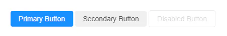

# 自定义按钮组件

**适合场景**：

- 需要开发**跨框架使用**的 UI 组件库
- 长期维护的项目，**避免因框架升级导致的组件重写**
- 多团队协作，统一设计规范



```html 
<!DOCTYPE html>
<html>
<head>
    <title>Button Component</title>
</head>
<body>
    <custom-button type="primary">Primary Button</custom-button>
    <custom-button type="secondary">Secondary Button</custom-button>
    <custom-button disabled>Disabled Button</custom-button>

    <script>
        class CustomButton extends HTMLElement {
            static get observedAttributes() { return ['type', 'disabled']; }
            
            constructor() {
                super();
                this.attachShadow({ mode: 'open' });
                this.render();
            }
            
            attributeChangedCallback() {
                this.render();
            }
            
            render() {
                const type = this.getAttribute('type') || 'default';
                const disabled = this.hasAttribute('disabled');
                
                this.shadowRoot.innerHTML = `
                    <style>
                        .btn {
                            padding: 8px 16px;
                            border: none;
                            border-radius: 4px;
                            cursor: pointer;
                            font-size: 14px;
                            transition: all 0.3s;
                        }
                        .btn-primary {
                            background: #1890ff;
                            color: white;
                        }
                        .btn-secondary {
                            background: #f0f0f0;
                            color: rgba(0, 0, 0, 0.65);
                        }
                        .btn-default {
                            background: white;
                            border: 1px solid #d9d9d9;
                        }
                        .btn:disabled {
                            opacity: 0.5;
                            cursor: not-allowed;
                        }
                    </style>
                    <button class="btn btn-${type}" ${disabled ? 'disabled' : ''}>
                        <slot></slot>
                    </button>
                `;
            }
        }
        
        customElements.define('custom-button', CustomButton);
    </script>
</body>
</html>
```
