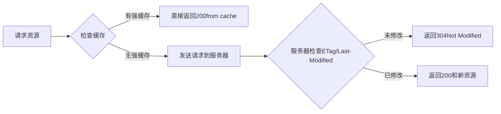
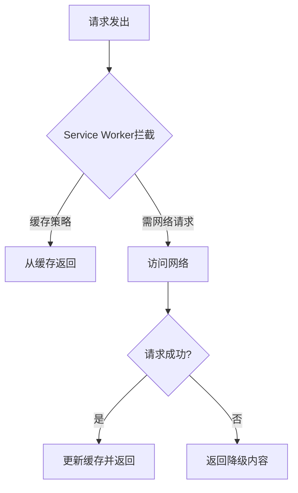

# serviceworker 和 http缓存

## 目录

- [一、核心区别对比](#一核心区别对比)
- [二、HTTP 缓存详解](#二HTTP-缓存详解)
  - [1. 工作流程](#1-工作流程)
  - [2. 缓存类型](#2-缓存类型)
  - [3. 优点](#3-优点)
  - [4. 缺点](#4-缺点)
  - [5. 典型配置](#5-典型配置)
- [三、Service Worker 缓存详解](#三Service-Worker-缓存详解)
  - [1. 工作流程](#1-工作流程)
  - [2. 缓存策略示例](#2-缓存策略示例)
  - [3. 优点](#3-优点)
  - [4. 缺点](#4-缺点)
  - [5. 典型场景](#5-典型场景)
- [四、如何选择与配合使用](#四如何选择与配合使用)
  - [1. 推荐组合方案](#1-推荐组合方案)
  - [2. 配合示例](#2-配合示例)
  - [3. 更新机制对比](#3-更新机制对比)
- [五、关键决策因素](#五关键决策因素)
- [六、总结](#六总结)

* 在请求速度方面：


- 在缓存文件更新方面
  - 如果是http缓存，一刷新页面就可以拿到最新的资源
  - 如果是sw缓存， 一刷新页面，会返回当前缓存中的资源（不是最新），**然后请求sw\.js文件发现更新后重新进入sw生命周期，重新去更新缓存，当你再次刷新时才能拿到最新资源。所以在缓存资源更新时，sw会延迟一次刷新才能获取最新资源**
- 在缓存控制方面：

  http一般是由服务器端控制的，而**sw则是可以前端自己控制**，可以更好地控制缓存。

  协商缓存返回状态码304， 强缓存返回的是200， 在**这点上server worker和强缓存比较类似的返回也是200， 会对请求进行拦截，不会真是的发出请求。**

### **一、核心区别对比**

| **特性**​   | **Service Worker 缓存**​  | **HTTP 缓存**​       |
| --------- | ----------------------- | ------------------ |
| **控制层级**​ | 客户端脚本控制（JavaScript）     | 服务器/浏览器协议控制（HTTP头） |
| **缓存粒度**​ | 精确到单个请求的完全控制            | 依赖 URL 和 HTTP 头规则  |
| **离线能力**​ | ✅ 完全支持离线访问              | ❌ 仅能加速在线访问         |
| **动态拦截**​ | 可编程拦截和修改请求/响应           | ❌ 只能按预定义规则缓存       |
| **缓存策略**​ | 支持复杂策略（网络优先/缓存优先/后台更新等） | 仅支持简单策略（强缓存/协商缓存）  |
| **更新机制**​ | 版本化控制，可主动清理旧缓存          | 依赖\`max-age\`或手动清除 |
| **跨域限制**​ | 可缓存跨域资源（需处理 opaque 响应）  | 受同源策略限制            |
| **适用场景**​ | PWA、离线应用、复杂缓存策略         | 静态资源加速、CDN 优化      |

### **二、HTTP 缓存详解**

#### **1. 工作流程**




#### **2. 缓存类型**

- **强缓存**（`Cache-Control: max-age=3600`）
  - 直接使用本地缓存，不请求服务器
- **协商缓存**（`ETag`/`Last-Modified`）
  - 需向服务器验证缓存有效性

#### **3. 优点**

- **浏览器内置**：无需额外代码
- **性能极高**：强缓存零网络请求
- **CDN友好**：完美配合 CDN 边缘缓存

#### **4. 缺点**

- **更新不灵活**：依赖 HTTP 头过期时间
- **无法离线**：必须联网才能验证缓存
- **策略单一**：无法实现"先缓存后更新"等高级策略

#### **5. 典型配置**

```javascript 
# Nginx 配置示例
location /static/ {
  expires 1y;
  add_header Cache-Control "public, immutable";
}
```


### **三、Service Worker 缓存详解**

#### **1. 工作流程**




#### **2. 缓存策略示例**

```javascript 
// 网络优先策略
self.addEventListener('fetch', (event) => {
  event.respondWith(
    fetch(event.request)
      .then(networkResponse => {
        const clonedResponse = networkResponse.clone();
        caches.open('v1').then(cache => cache.put(event.request, clonedResponse));
        return networkResponse;
      })
      .catch(() => caches.match(event.request))
  );
});
```


#### **3. 优点**

- **完全离线**：无网络时仍可访问
- **精细控制**：可针对每个请求定制策略
- **主动更新**：后台静默更新缓存
- **混合策略**：如"先返回缓存，后更新"

#### **4. 缺点**

- **实现复杂**：需编写 JavaScript 逻辑
- **存储限制**：受浏览器配额限制（通常 50% 磁盘空间）
- **学习成本**：需理解生命周期和缓存策略

#### **5. 典型场景**

- 离线访问 PWA
- 关键资源预加载
- 不稳定网络下的降级方案

### **四、如何选择与配合使用**

#### **1. 推荐组合方案**

| **资源类型**​ | **HTTP 缓存策略**​                      | **Service Worker 策略**​    |
| --------- | ----------------------------------- | ------------------------- |
| 长期静态资源    | \`Cache-Control: max-age=31536000\` | 预缓存（\`precacheAndRoute\`） |
| 频繁更新的静态资源 | \`Cache-Control: no-cache\`         | 网络优先（\`NetworkFirst\`）    |
| API 数据    | \`Cache-Control: no-store\`         | 自定义策略（如先缓存后更新）            |
| 用户生成内容    | 不缓存                                 | 后台同步（\`Background Sync\`） |

#### **2. 配合示例**

```javascript 
// Service Worker 中优先使用 HTTP 缓存
registerRoute(
  /\.(js|css)$/,
  new CacheFirst({
    cacheName: 'static-cache',
    plugins: [
      new CacheableResponsePlugin({
        statuses: [200],
        headers: { 'X-Is-Cached': 'true' } // 尊重服务端缓存头
      })
    ]
  })
);
```


#### **3. 更新机制对比**

| **机制**​   | **HTTP 缓存**​         | **Service Worker**​ |
| --------- | -------------------- | ------------------- |
| **更新触发**​ | URL 变化或\`max-age\`过期 | \`install\`事件或手动更新  |
| **更新粒度**​ | 整个文件                 | 单个资源或版本化缓存组         |
| **用户影响**​ | 可能看到过时内容             | 可展示更新提示             |
| **控制权**​  | 服务端控制                | 客户端控制               |

### **五、关键决策因素**

1. **是否需要离线功能**
   - 是 → 必须使用 Service Worker
   - 否 → HTTP 缓存可能足够
2. **资源更新频率**
   - 高频更新 → Service Worker +`NetworkFirst`
   - 低频更新 → HTTP 强缓存
3. **技术能力**
   - 团队熟悉 JavaScript → Service Worker
   - 纯静态站点 → HTTP 缓存 + CDN
4. **用户体验需求**
   - 要求无缝更新 → Service Worker 主动控制
   - 可接受缓存延迟 → HTTP 缓存

***

### **六、总结**

- **HTTP 缓存**是基础，适合简单、静态的内容加速 &#x20;

  **✓ 优势**：零配置、高性能 &#x20;

  **✗ 局限**：无法离线、更新不灵活
- **Service Worker 缓存**是进阶，适合动态、离线的 Web 应用 &#x20;

  **✓ 优势**：完全控制、离线支持 &#x20;

  **✗ 局限**：实现复杂、需维护

**最佳实践**：
**两者结合使用**，用 HTTP 缓存处理静态资源，用 Service Worker 处理动态内容和离线场景。
