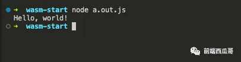

# Hello World

接下来我们要选择一门高级语言。

**语言不能有 GC（自动垃圾回收机制）特性，比如 Java、Python。**

（不过可以通过一些非官方的工具转成 wasm，就是问题比较多）

**写 wasm，最流行的是 Rust 和 C/C++。**

C/C++ 的轮子比较丰富，比如 Skia（Canvas 底层调用的库）就是 C++ 写的。可惜的是 C/C++ 没有包管理工具。

而当下最炙手可热的当**属 Rust，我不得不说它真的很酷，有包管理工具，工具链也很完善。就是学习曲线过于陡峭，太难上手。**

本文选择使用 C/C++ 语言。

先创建一个`hello.c`文件：

```c 
#include <stdio.h>

int main() {
  printf("Hello, world!\n");
  return 0;
}

```


运行下面命令编译成 wasm。

```c 
emcc hello.c

```


然后看到多了两个文件：`a.out.js`和`a.out.wasm`。


**其中 js 文件是胶水代码，用来加载和执行 wasm 的，wasm 不能直接作为入口文件使用。**

我们用 nodejs 运行一下`a.out.js`，可以看到成功输出了 "Hello, world!"。



当然我们也可以创建一个 html 文件，引入这个`a.out.js`文件，也可以看到控制台能够正确输出输出。


看下资源请求，**可以看到 html 引入了**\*\*`a.out.js`****，然后****`a.out.js`****再引入****`a.out.wasm`。\*\*​


