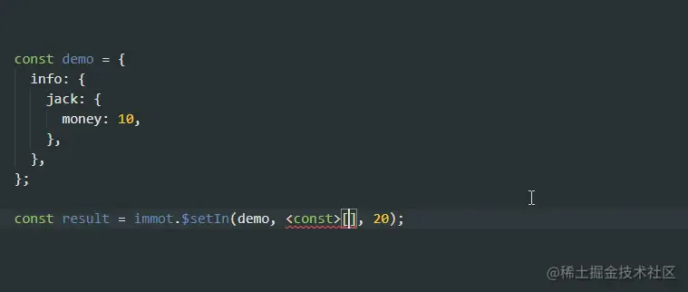

# 自己实现

## 目录

- [使用](#使用)
- [\$set](#set)
- [\$setIn](#setIn)
- [\$merge](#merge)
- [\$mergeIn](#mergeIn)
- [\$update](#update)
- [\$updateIn](#updateIn)
- [\$delete](#delete)
- [\$push](#push)
- [\$pop](#pop)
- [\$shift](#shift)
- [\$unshift](#unshift)
- [\$splice](#splice)
- [性能测试](#性能测试)

那普通的浅拷贝那么快，我为什么不用普通的对象实现这样的功能呢？说做就做！

整个元旦我都在快乐的编码实现中。其实 `js` 实现很简单，难就难在 `typescript` 类型安全上。如果做出来还像 `immutable.js` 那样类型不友好的话，那其实做不做意义也不大。快乐的编码 `ts` 类型优先。

战斗了好几天，终于出了成果：

github: [github.com/MinJieLiu/i…](https://link.juejin.cn?target=https://github.com/MinJieLiu/immot "github.com/MinJieLiu/i…")

为什么取名叫 `immot`？因为 `immer` 名字很好听，看 `npmjs` 上 `immet` 没被注册，结果不能 `publish` 说跟 `immer` 名字太像了，索性将 `e` 改成了 `o`。`immotile` 单词的部分（意思： 不动的），就这样吧。

`immot` 的 API 灵感来自于 `immutable-js`，但 `immutable-js` 有独立的结构模型，复杂度高。`immot` 的设计理念是要求简单、易用，不需要过多的心智负担。因此在设计之初就亲和原生的 `JSON` 结构，只提供辅助函数，大小 < 1KB，就做到像 `immutable-js` 一样的效果。

`immot` 做到了 `typescript` 类型安全。`$updateIn`、`$setIn`、`$mergeIn` 中的 `keyPath` 路径支持类型自动提示（目前只支持小于 7 层结构）。



### 使用

```typescript 
import * as immot from 'immot';

// 或者只导入其中某个函数
import { $updateIn } from 'immot';

```


`immot` 所有函数操作都会返回一个新的对象。

### \$set

用于设置 `对象/数组/Map` 中的属性值。`keyPath` 为字符串。

```typescript 
const result = immot.$set(demo, 'a', 1);

```


### \$setIn

用于设置 `对象/数组/Map` 中的属性值。它可以为深层对象做操作，`keyPath` 为路径数组

```typescript 
const result = immot.$setIn(demo, ['a', 'b', 1, 'c'], 'good');

```


### \$merge

用于合并 `对象/数组` 中的属性列表。

```typescript 
const result = immot.$merge(demo, { tom: 1, jack: 2 });

const result1 = immot.$merge(demo1, [5, 6]);

```


### \$mergeIn

用于合并 `对象/数组` 中的属性列表。它可以为深层对象做操作，`keyPath` 为路径数组

```typescript 
const result = immot.$mergeIn(demo, ['a', 1, 'b'], { tom: 1, jack: 2 });

```


### \$update

通过回调函数设置 `对象/数组/Map` 中的属性值。`keyPath` 为字符串。

```typescript 
const result = immot.$update(demo, 'money', (prev) => prev + 1);

```


### \$updateIn

通过回调函数设置 `对象/数组/Map` 中的属性值。它可以为深层对象做操作，`keyPath` 为路径数组

```typescript 
const result = immot.$updateIn(
  demo,
  ['todoList', 0, 'complete'],
  (complete) => !complete,
);

```


### \$delete

用于删除 `对象/数组/Map` 中的可选属性值，`keyPath` 为字符串或者数组

```typescript 
const result = immot.$delete(demo, 'a1');
const result1 = immot.$delete(demo, ['a1', 'a2']);

```


### \$push

类似 `Array.prototype.push`，但返回新数组

```typescript 
const result = immot.$push(demo, 4);

```


### \$pop

类似 `Array.prototype.pop`，但返回新数组

```typescript 
const result = immot.$pop(demo);

```


### \$shift

类似 `Array.prototype.shift`，但返回新数组

```typescript 
const result = immot.$shift(demo);

```


### \$unshift

类似 `Array.prototype.unshift`，但返回新数组

```typescript 
const result = immot.$unshift(demo, 4);

```


### \$splice

类似 `Array.prototype.splice`，但返回新数组

```typescript 
const result = immot.$splice(demo, 1, 0, 'test');

```


### 性能测试

在 `/bench` 目录中有性能测试对比的样例，可以 clone 本项目测试

```javascript 
cd bench
pnpm i
node index.mjs

```


注意：

1. 数值为每秒操作数量，越高越好
2. 样例中 `immer` 关闭了自动冻结对象的特性，否则结果会更差。
3. 数组性能测试图中隐藏了 `immutableJS` 数据，用空间换取时间的方式导致数值太高，影响对比。

在 Node v14.17.0 的测试结果：

常规数据和深层数据


50000 长度的数组


immot 简单、体积小， gzip 后不足 700 个字节，对体积要求高的项目可以重点关注，最主要是对 typescript 类型友好。用它来写 reducer 太适合了。至于为什么没有提供像 immutable.js 那样的 getIn 的方法。因为原生 JS 支持了 可选链(?.) 语法，已经不需要这样的 API。
