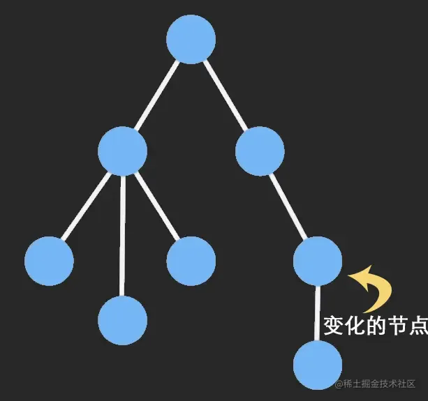

# 不可变数据

## 目录

- [什么是不可变数据](#什么是不可变数据)
- [不可变数据有哪些好处](#不可变数据有哪些好处)

### 什么是不可变数据

> `不可变数据` 就是一旦创建，就不能再被更改的数据。对**该对象的任何修改或添加删除操作都会返回一个新的对象**。要**避免深拷贝把所有数据都复制一遍带来的性能损耗**，使用 Structural Sharing（结构共享），即如果**对象树中一个节点发生变化，只修改这个节点和受它影响的父节点**，**其它节点则进行共享**。



### 不可变数据有哪些好处

1、降低了 `Mutable` 带来的复杂度

```typescript 
function demo() {
  const data = { foo: 'bar' };
  console.log(data);
  data.foo = 'tom';
}

demo();

```


打印 `{foo: 'bar'}` ，但在**控制台展开后变成**了 `{ foo: 'tom' }` 会带来额外的困扰。

2、撤销/重做/时间旅行功能实现起来很轻松

不可变数据每次返回的数据都是不同的，**每次修改后将这些数据记录在队列中，修改指针指向就能轻松实现时间旅行。**

[immer](./immer/index.md "immer")

[immutable.js](./immutable.js/index.md "immutable.js")
