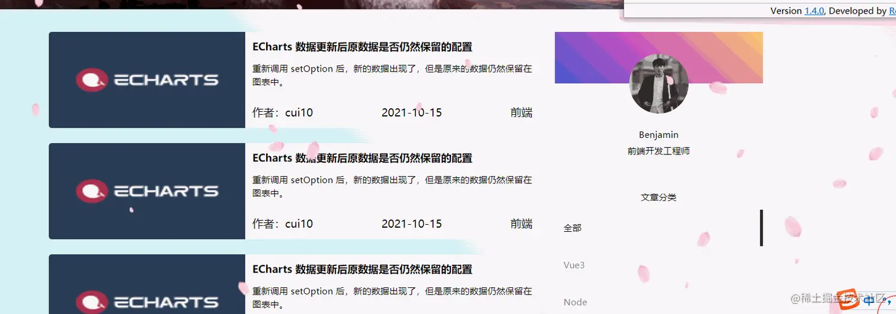
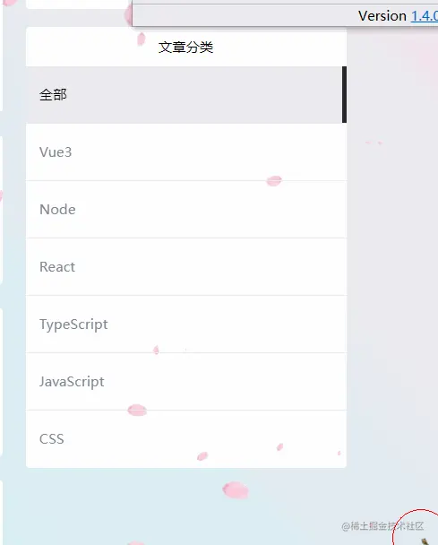

# transtion

## 目录

- [缩放、旋转动画](#缩放旋转动画)
- [跟随鼠标丝滑移动的背景块](#跟随鼠标丝滑移动的背景块)

## 缩放、旋转动画



这里用到CSS3提供的tranition过渡属性，使得元素进行形变时有自然的过渡动画，实现起来也是相当简单

```react tsx 
// 缩放动画
.card {
    transition: all .2s ease;
    &:hover{
           transform: scale(1.05);
         }
       }
       
 // 旋转动画
 .circle {
     transition: all .5s ease;     
        &:hover{
           transform: rotate(360deg);
         }
 }

```


transition是个复合属性,包含：

```react tsx 
transition-property 过渡属性名
transition-duration 过渡动画时长
transition-timing-function 动画的速度曲线
transition-delay 动画延迟多久开始执行

```


这里大家根据需要自行设置

## 跟随鼠标丝滑移动的背景块



当点击到某一项，背景块固定，再将鼠标移至其他区域，色块又紧随其后，相当丝滑。

这里其实也是用到了tranition，对背景色块的top定位进行了过渡，这里用代码展示

```react tsx 
export default function SliderBar() {
  const rightData = [
    { label: '全部', value: 1 },
    { label: 'Vue3', value: 2 },
    { label: 'Node', value: 3 },
    { label: 'React', value: 4 },
    { label: 'TypeScript', value: 5 },
    { label: 'JavaScript', value: 6 },
    { label: 'CSS', value: 7 }
  ];

  const hoverRef = useRef<HTMLDivElement | null>(null);

  const handleEnter = (e: React.MouseEvent) => {
    hoverRef.current!.style.top = (e.target as HTMLDivElement).offsetTop + 'px';
  };
  const [searchParams, setSearchParams] = useSearchParams();

  const setPosition = () => {
    const current = Number(searchParams.get('type')) || 0;
    hoverRef.current!.style.top =
      (document.querySelectorAll('.article_item')[current] as HTMLDivElement).offsetTop + 'px';
  };

  const handleClick = (idx: number) => {
    setSearchParams({
      ...searchParams,
      type: String(idx)
    });
  };

  useEffect(() => {
    setPosition();
  }, []);
  return (
    <>
      {/* 文章分类 */}
      <div className={styles.article}>
        <div className={styles.article_title}>文章分类</div>
        <div className={`${styles.article_list} relative`} onMouseLeave={setPosition}>
          <div 
          ref={hoverRef} 
          className={`${styles.hoverRef} absolute top-0 left-0 w-full cursor-pointer `}>    </div>
          {rightData.map((item, idx) => {
            return (
              <div
                className={`${styles.article_list_item} ${
                  Number(searchParams.get('type')) === idx ? '!text-black' : ''
                } article_item relative z-10`}
                onClick={() => handleClick(idx)}
                onMouseEnter={handleEnter}
                key={item.value}
              >
                {item.label}
              </div>
            );
          })}
        </div>
      </div>
    </>
  );
}

```


```css 
  .article {
    margin-top: 8px;
    background: #fff;
    border-radius: 2px;
    // padding: 2px 4px;
    &_title {
      text-align: center;
      font-size: 6px;
      padding: 4px 0;
    }
    .hoverRef{
      transition: top .1s ease;
      background: #efefef;
      border-right: 2px solid #282828;
      left: 0;
      top: 0;
      box-sizing: border-box;
      height: 25px;
    }
    .article_list_item {
      color: #808695;
      box-sizing: border-box;
      height: 25px;
      line-height: 25px;
      padding-left: 6px;
      border-bottom: 0.1px solid #efefef;
      font-size: 6px;
      cursor: pointer;
      &:hover{
        color: #000;
      }
      &:last-child {
        border: none;
      }
    }
  }

```


通过mouseEnter事件动态的为.hoverRef设置top的高度，再通过click事件固定住当前所在位置，配置设置当前页的query参数，即使刷新页面位置也不会发生变化。最后添加mouseLeave当鼠标移除整块区域，背景色块返回之前固定的区域。
