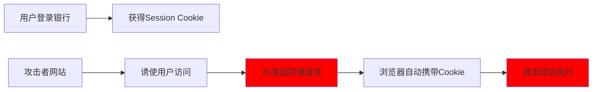

# 完整的 CSRF 防护方案

## 目录

- [1. 同源检测（最基础）](#1-同源检测最基础)
- [2. CSRF Token（最有效）](#2-CSRF-Token最有效)
- [3. SameSite Cookie（现代浏览器推荐）](#3-SameSite-Cookie现代浏览器推荐)
- [4. 双重提交验证](#4-双重提交验证)
- [针对复杂请求的特殊防护](#针对复杂请求的特殊防护)
  - [验证 Content-Type](#验证-Content-Type)
  - [限制 CORS 配置](#限制-CORS-配置)
- [关键点澄清](#关键点澄清)
  - [攻击者的同源调用](#攻击者的同源调用)
- [这种情况下 CSRF 防护完全失效的场景](#这种情况下-CSRF-防护完全失效的场景)
  - [1. 仅依赖 CORS 防护（完全无效）](#1-仅依赖-CORS-防护完全无效)
  - [2. 仅检查 Referer/Origin 头（可能被绕过）](#2-仅检查-RefererOrigin-头可能被绕过)
- [真正有效的 CSRF 防护方案](#真正有效的-CSRF-防护方案)
  - [方案1：CSRF Token（最可靠）](#方案1CSRF-Token最可靠)
  - [方案2：SameSite Cookie（现代浏览器）](#方案2SameSite-Cookie现代浏览器)
  - [方案3：双重提交验证](#方案3双重提交验证)
- [实际攻击链分析](#实际攻击链分析)
- [总结：真正有效的防护策略](#总结真正有效的防护策略)

### 1. 同源检测（最基础）

```javascript 
// 检查请求来源
app.use((req, res, next) => {
  const origin = req.get('Origin');
  const allowedOrigins = ['https://yourdomain.com'];
  
  if (origin && !allowedOrigins.includes(origin)) {
    return res.status(403).json({ error: 'Forbidden' });
  }
  next();
});
```


### 2. CSRF Token（最有效）

```html 
<!-- 前端 -->
<form action="/transfer" method="POST">
  <input type="hidden" name="_csrf" value="{{csrfToken}}">
  <input type="text" name="amount">
  <button type="submit">转账</button>
</form>

<script>
// AJAX 请求设置 CSRF Token
fetch('/api/transfer', {
  method: 'POST',
  headers: {
    'X-CSRF-Token': getCSRFToken(),
    'Content-Type': 'application/json'
  },
  body: JSON.stringify(data)
});
</script>
```


### 3. SameSite Cookie（现代浏览器推荐）

```javascript 
// 设置 Cookie
app.use(session({
  cookie: {
    secure: true,
    sameSite: 'strict',  // 或 'lax'
    httpOnly: true
  }
}));
```


### 4. 双重提交验证

```javascript 
// Cookie-to-Header 模式
app.use((req, res, next) => {
  const csrfToken = req.cookies['csrf-token'];
  const headerToken = req.headers['x-csrf-token'];
  
  if (req.method !== 'GET' && csrfToken !== headerToken) {
    return res.status(403).json({ error: 'CSRF validation failed' });
  }
  next();
});
```


## 针对复杂请求的特殊防护

### 验证 Content-Type

```javascript 
// 确保复杂请求使用正确的 Content-Type
app.use((req, res, next) => {
  if (req.method === 'POST' || req.method === 'PUT') {
    const contentType = req.get('Content-Type');
    if (!contentType || !contentType.includes('application/json')) {
      return res.status(400).json({ error: 'Invalid Content-Type' });
    }
  }
  next();
});
```


### 限制 CORS 配置

```javascript 
// 安全的 CORS 配置
app.use(cors({
  origin: ['https://yourdomain.com'],
  methods: ['GET', 'POST'],
  allowedHeaders: ['Content-Type', 'Authorization'],
  credentials: true,
  maxAge: 86400
}));
```


## 关键点澄清

**如果攻击者通过脚本在自己的恶意域名下调用，确实不会触发跨域问题**，因为：

### 攻击者的同源调用

```javascript 
<!-- 攻击者网站 https://evil.com -->
<script>
// 在自己的域名下调用目标API - 这是同源请求，无跨域限制！
fetch('https://api.victim.com/transfer', {
  method: 'POST',
  headers: {
    'Content-Type': 'application/json',
    'Authorization': 'Bearer ' + getStolenToken()  // 使用窃取的token
  },
  credentials: 'include',  // 会自动携带Cookie
  body: JSON.stringify({
    to: 'attacker',
    amount: 1000
  })
});
</script>
```


## 这种情况下 CSRF 防护完全失效的场景

### 1. 仅依赖 CORS 防护（完全无效）

```javascript 
// 服务器仅靠CORS防护 - 对同源请求无效
app.use(cors({
  origin: 'https://legitimate.com'  // 攻击者根本不会触发这个检查
}));
```


### 2. 仅检查 Referer/Origin 头（可能被绕过）

```javascript 
// 不安全的防护
app.use((req, res, next) => {
  const origin = req.get('Origin');
  if (origin && origin !== 'https://legitimate.com') {
    return res.status(403).json({ error: 'Forbidden' });
  }
  next();
});
```


**问题**：攻击者可以通过其他方式发送请求，不包含这些头部。

## 真正有效的 CSRF 防护方案

### 方案1：CSRF Token（最可靠）

```html 
<!-- 合法网站页面 -->
<form id="transferForm">
  <input type="hidden" name="_csrf" value="随机令牌">
  <input type="number" name="amount">
</form>

<script>
// 每次请求携带CSRF Token
fetch('/transfer', {
  method: 'POST',
  headers: {
    'X-CSRF-Token': '从隐藏字段或Cookie读取的令牌'
  }
});
</script>
```


**为什么有效**：攻击者无法获取或预测这个随机令牌。

### 方案2：SameSite Cookie（现代浏览器）

```html 
// 设置Cookie时
Set-Cookie: sessionId=abc123; SameSite=Strict; Secure; HttpOnly
```


**防护效果**：

- `SameSite=Strict`：完全阻止跨站请求携带Cookie
- `SameSite=Lax`：允许安全跨站请求（如导航链接）

### 方案3：双重提交验证

```javascript 
// 客户端：从Cookie读取Token并设置到Header
const csrfToken = getCookie('csrf-token');
fetch('/api/action', {
  method: 'POST',
  headers: {
    'X-CSRF-Token': csrfToken
  }
});

// 服务端：验证Cookie和Header中的Token是否匹配
app.use((req, res, next) => {
  if (req.method === 'POST' || req.method === 'PUT') {
    const cookieToken = req.cookies['csrf-token'];
    const headerToken = req.headers['x-csrf-token'];
    
    if (!cookieToken || cookieToken !== headerToken) {
      return res.status(403).json({ error: 'CSRF validation failed' });
    }
  }
  next();
});
```


## 实际攻击链分析




## 总结：真正有效的防护策略

| 防护措施                 | 防护原理            | 对脚本攻击效果   |
| -------------------- | --------------- | --------- |
| **CSRF Token**​      | 随机令牌验证          | ✅ 完全有效    |
| **SameSite Cookie**​ | 阻止跨站Cookie      | ✅ 现代浏览器有效 |
| **双重提交**​            | Cookie+Header验证 | ✅ 有效      |
| **重新认证**​            | 敏感操作密码验证        | ✅ 完全有效    |
| **仅CORS**​           | 跨域限制            | ❌ 完全无效    |
| **仅Referer检查**​      | 来源验证            | ❌ 可能被绕过   |

**核心结论**：防御CSRF攻击必须使用攻击者无法伪造的机制（如CSRF Token），而不能依赖浏览器同源策略或请求头验证。
