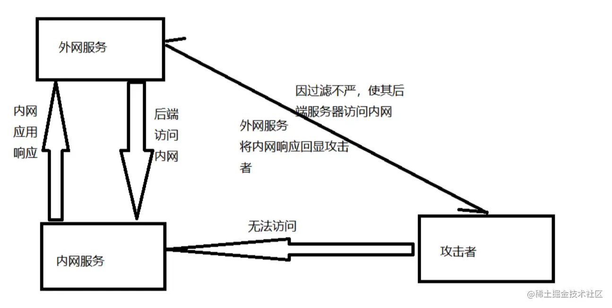
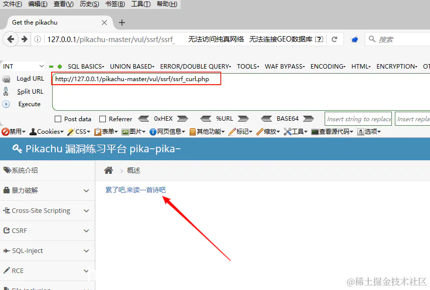
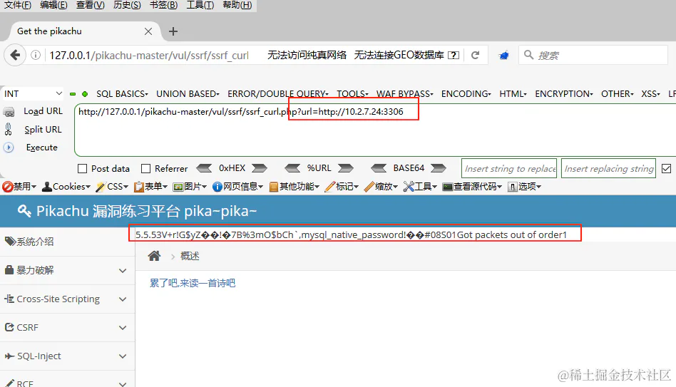

# SSRF

## 目录

- [什么是SSRF](#什么是SSRF)
  - [二、SSRF（curl）实验步骤](#二SSRFcurl实验步骤)

# 什么是SSRF

`SSRF`(**服务端请求伪造漏洞**) 由于**服务端提供了从其他服务器应用获取数据的功能**,但**又没有对目标地址做严格过滤与限制，**导致攻击者可以传入**任意的地址来让后端服务器对其发起请求,并返回对该目标地址请求的数据。**

一般情况下，`SSRF`针对的都是一些**外网无法访问的内网**，所以需要`SSRF`使**目标后端去访问内网，进而达到我们攻击内网的目的**。

通过`SSRF`，我们可以访问目标内网的`redis`服务，mysql服务，smpt服务，fastcgi服务等

造成漏洞的一些函数

## 二、SSRF（curl）实验步骤

第一步：打开目标网站，并根据提示点击。

观察URL，发现它传递了一个URL给后台 &#x20;
第二步：我们可以把 url 中的内容改成内网的其他服务器上地址和端口，探测内网的其他信息，比如端口开放情况，下面这个例子就探测出10.2.7.24这台机器开放了3306端口 &#x20;

