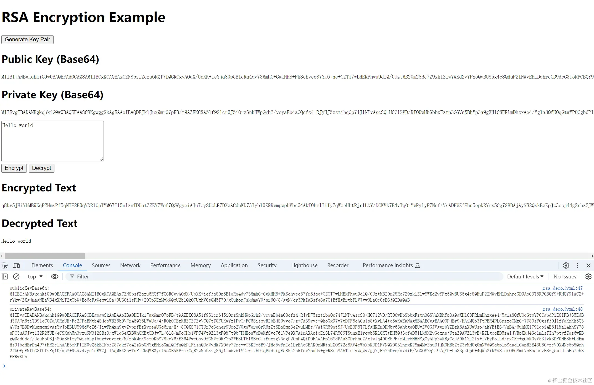

# 非对称加密和解密



```javascript 
<!DOCTYPE html>
<html lang="en">

<head>
    <meta charset="UTF-8">
    <meta name="viewport" content="width=device-width, initial-scale=1.0">
    <title>RSA Encryption Example</title>
</head>

<body>
    <div>
        <h1>RSA Encryption Example</h1>
        <button onclick="generateKeyPair()">Generate Key Pair</button>
        <h2>Public Key (Base64)</h2>
        <pre id="public-key"></pre>
        <h2>Private Key (Base64)</h2>
        <pre id="private-key"></pre>
        <textarea id="plaintext" placeholder="Enter text to encrypt"></textarea><br>
        <button onclick="encryptText()">Encrypt</button>
        <button onclick="decryptText()">Decrypt</button>
        <h2>Encrypted Text</h2>
        <pre id="encrypted-text"></pre>
        <h2>Decrypted Text</h2>
        <pre id="decrypted-text"></pre>
    </div>
    <script>
    let publicKeyBase64;
    let privateKeyBase64;

    async function generateKeyPair() {
        const keyPair = await crypto.subtle.generateKey({
            name: "RSA-OAEP",
            modulusLength: 2048,
            publicExponent: new Uint8Array([1, 0, 1]),
            hash: { name: "SHA-256" },
        }, true, ["encrypt", "decrypt"]);

        const publicKeyArrayBuffer = await crypto.subtle.exportKey('spki', keyPair.publicKey);
        const privateKeyArrayBuffer = await crypto.subtle.exportKey('pkcs8', keyPair.privateKey);

        publicKeyBase64 = arrayBufferToBase64(publicKeyArrayBuffer);
        privateKeyBase64 = arrayBufferToBase64(privateKeyArrayBuffer);

        document.getElementById('public-key').textContent = publicKeyBase64;
        document.getElementById('private-key').textContent = privateKeyBase64;

        console.log('publicKeyBase64:', publicKeyBase64);
        console.log('privateKeyBase64:', privateKeyBase64);
    }

    function arrayBufferToBase64(buffer) {
        const binary = String.fromCharCode.apply(null, new Uint8Array(buffer));
        return btoa(binary);
    }

    function base64ToArrayBuffer(base64) {
        const binary = atob(base64);
        const len = binary.length;
        const bytes = new Uint8Array(len);
        for (let i = 0; i < len; i++) {
            bytes[i] = binary.charCodeAt(i);
        }
        return bytes.buffer;
    }

    async function encryptText() {
        if (!publicKeyBase64 || !privateKeyBase64) {
            alert('Please generate the key pair first.');
            return;
        }

        const publicKeyArrayBuffer = base64ToArrayBuffer(publicKeyBase64);
        const publicKey = await crypto.subtle.importKey(
            'spki',
            publicKeyArrayBuffer, {
                name: 'RSA-OAEP',
                hash: { name: 'SHA-256' },
            },
            true,
            ['encrypt']
        );

        const text = document.getElementById('plaintext').value;
        const encodedText = new TextEncoder().encode(text);

        const encryptedData = await crypto.subtle.encrypt({
            name: "RSA-OAEP",
        }, publicKey, encodedText);

        const encryptedBase64 = btoa(String.fromCharCode.apply(null, new Uint8Array(encryptedData)));
        document.getElementById('encrypted-text').textContent = encryptedBase64;
    }

    async function decryptText() {
        if (!publicKeyBase64 || !privateKeyBase64) {
            alert('Please generate the key pair first.');
            return;
        }

        const privateKeyArrayBuffer = base64ToArrayBuffer(privateKeyBase64);
        const privateKey = await crypto.subtle.importKey(
            'pkcs8',
            privateKeyArrayBuffer, {
                name: 'RSA-OAEP',
                hash: { name: 'SHA-256' },
            },
            true,
            ['decrypt']
        );

        const encryptedBase64 = document.getElementById('encrypted-text').textContent;
        const encryptedData = Uint8Array.from(atob(encryptedBase64), c => c.charCodeAt(0));

        const decryptedData = await crypto.subtle.decrypt({
            name: "RSA-OAEP",
        }, privateKey, encryptedData);

        const decryptedText = new TextDecoder().decode(decryptedData);
        document.getElementById('decrypted-text').textContent = decryptedText;
    }
    </script>
</body>

</html>

```
