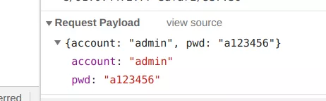
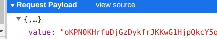
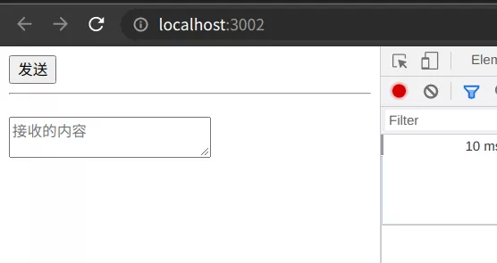
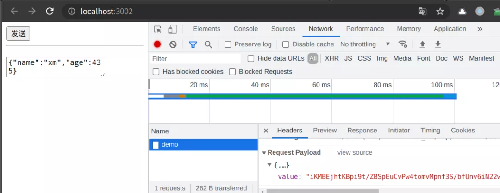
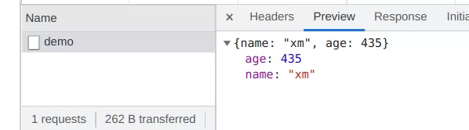

# jsencrypt

## 目录

- [使用jsencrypt配合axios实现数据传输加密 ](#使用jsencrypt配合axios实现数据传输加密-)
  - [jsencrypt](#jsencrypt)
    - [公钥加密方法 ](#公钥加密方法-)
    - [私钥解密方法 ](#私钥解密方法-)
    - [使用示例 ](#使用示例-)
  - [结合Axios实践](#结合Axios实践)
    - [Axios配置 ](#Axios配置-)
    - [服务端解密示例代码 ](#服务端解密示例代码-)
      - [http模块示例 ](#http模块示例-)
      - [Express示例 ](#Express示例-)
    - [前端代码示例 ](#前端代码示例-)
  - [运行结果](#运行结果)
- [jsencrypt加密过长 返回false](#jsencrypt加密过长-返回false)

# 使用jsencrypt配合axios实现数据传输加密&#x20;

[使用jsencrypt配合axios实现数据传输加密 背景不希望应用发送的数据能在 Devtools 中被看到，避免接口被“同行”扒下来，然后被恶意使用图片要避免 https://mp.weixin.qq.com/s/1YlpNWPvhp9-nn-CPFB6kw](https://mp.weixin.qq.com/s/1YlpNWPvhp9-nn-CPFB6kw "使用jsencrypt配合axios实现数据传输加密 背景不希望应用发送的数据能在 Devtools 中被看到，避免接口被“同行”扒下来，然后被恶意使用图片要避免 https://mp.weixin.qq.com/s/1YlpNWPvhp9-nn-CPFB6kw")

背景不希望应用发送的数据能在 Devtools 中被看到，避免接口被“同行”扒下来，然后被恶意使用&#x20;



要避免此问题，首先想到的就是对传输的数据进行一次加密，让后端自行解密然后处理 尽管js源码是被浏览器公开的，但通过构建工具混淆后，在没有source map的情况下还不不易定位目标代码 期望加密后的样子传输的内容如下&#x20;



## jsencrypt

- jsencrypt\[2]
- nodejs-jsencrypt\[3]

使用 Javascript 进行RSA加密的解决方案&#x20;

**安装依赖**

```javascript 
 # web 
npm i jsencrypt    
 # node 
npm i nodejs-jsencrypt  
```


**引入**

```javascript 
 // web 
import JSEncrypt from'jsencrypt'
 // node 
const { JSEncrypt } = require('nodejs-jsencrypt')  
```


### 公钥加密方法&#x20;

```javascript 
 // 上述自动生成 
const pubKey = '上述生成的公钥'
function publicEncrypt(str){      
  const encrypt = new JSEncrypt()      
  encrypt.setPublicKey(pubKey)      
  return encrypt.encrypt(str)  
}  
```


### 私钥解密方法&#x20;

```javascript 
 const privKey = `上述生成的私钥`
function  privDecrypt(str) {     
 const encrypt = new JSEncrypt()      
 encrypt.setPrivateKey(privKey)     
  return encrypt.decrypt(str) 
}  
```


可以看出API非常简洁&#x20;

### 使用示例&#x20;

```javascript 
 let str = publicEncrypt('hello world')  
console.log(str) 
console.log(privDecrypt(str))  
```


## 结合Axios实践

### Axios配置&#x20;

```javascript 
 npm i axios  
```


将加密逻辑放入到axios的请求拦截器中，将原内容使用 JSON.stringify处理后再进行加密，加密后的内容使用value属性传递，如下所示&#x20;

```javascript 
 import axios from "axios";

// 引入刚刚编写的加密方法
import { publicEncrypt } from "./utils/crypto";

const http = axios;
http.defaults.baseURL = '/api'
http.defaults.headers = {
  "content-Type": "application/json"
};

// 请求拦截器
http.interceptors.request.use(
  config => {
    // 发送之前操作config
    // 对传递的 data 进行加密
    config.data = {
      value:publicEncrypt(JSON.stringify(config.data))
    }
    return config;
  },
  err => {
    // 处理错误
    return Promise.reject(err);
  }
);
http.interceptors.response.use(
  response => {
    // 返回前操作
    return response.data;
  },
  err => {
    return Promise.reject(err);
  }
);

export default http;
```


### 服务端解密示例代码&#x20;

这里列举了两种，一种直接使用Node.js的http模块编写，一种使用Express编写：&#x20;

1. 解密收到的内容
2. 将解密后的内容直接返回

#### http模块示例&#x20;

使用data事件与end事件配合，接收传递的数据，然后进行解密返回&#x20;

```javascript 
 const http = require('http')

// 引入解密方法
const { privDecrypt } = require('./utils/crypto')

const server = http.createServer((req, res) => {
    res.setHeader('content-type','application/json')
    let buffer = Buffer.alloc(0)

    // 接收传递的数据
    req.on('data',(chunk)=>{
        buffer = Buffer.concat([buffer, chunk])
    })
    req.on('end',()=>{
        try {
            // 解密传递的数据
            const data = privDecrypt(JSON.parse(buffer.toString('utf-8')).value)
            res.end(data)
        } catch (error) {
            console.log(error);
            res.end('error')            
        }
    })
})

// 启动
server.listen(3000, err => {
    console.log(`listen 3000 success`);
})
```


#### Express示例&#x20;

配置一个前置的\*路由，解密传递的内容，然后将其重新绑定到req.body上,供后续其它路由使用&#x20;

```javascript 
 const express = require('express')
const { privDecrypt } = require('./utils/crypto')

const server = express()

server.use(express.urlencoded({ extended: false }))
server.use(express.json({ strict: true }))

// 首先进入的路由
server.route('*').all((req, res, next) => {
    console.log(`${req.method}--${req.url}`)
    req.body = JSON.parse(privDecrypt(req.body.value))
    next()
})

server.post('/test/demo',(req,res)=>{
    // 直接返回实际的内容
    res.json(req.body)
})

// 启动
server.listen(3000, err => {
    console.log(`listen 3000 success`);
})

```


### 前端代码示例&#x20;

使用了 **Vite**作为开发预览工具 vite.config.js配置: 只做了请求代理，解决开发跨域问题&#x20;

```javascript 
 export default {
    server: {
        proxy: {
            '/api': {
                target: 'http://localhost:3000',
                changeOrigin: true,
                rewrite: (path) => path.replace(/^\/api/, '')
            },
        }
    }
}
```


**页面**

```javascript 
 <body>
    <button id="send">发送</button>
    <hr>
    <h2></h2>
    <textarea id="receive" placeholder="接收的内容"></textarea>
    <script type="module" src="./index.js"></script>
</body>
```


逻辑&#x20;

```javascript 
   import $http from './http'
const $send = document.getElementById('send')
const $receive = document.getElementById('receive')

$send.addEventListener('click',function(){
    // 发送一个随机内容
    $http.post('/test/demo',{
        name:'xm',
        age:~~(Math.random()*1000)
    }).then((res)=>[
        updateReceive(res)
    ])
})

function updateReceive(data){
    $receive.value = data instanceof Object?JSON.stringify(data):data
}
```


## 运行结果

**页面**



**发送网络请求**



**请求响应内容**



大功告成,接入十分简单&#x20;

**完整的示例代码仓库**

# jsencrypt加密过长 返回false

[ RSA前端加密，java后端解密\_qq\_1382430的博客-CSDN博客\_前端rsa加密后端解密 官网jsencrypt ：JSEncryptencryptlong：encryptlong - npm前端1，安装1.1 安装jsencrypt，执行以下命令npm install jsencrypt --save-dev1.2 安装encryptlong，执行以下命令：npm i encryptlong -S2，创建rsa.js文件2.1 在src/util/文件夹下创建rsa.js文件2.2  https://blog.csdn.net/qq\_1382430/article/details/123692258](https://blog.csdn.net/qq_1382430/article/details/123692258 " RSA前端加密，java后端解密_qq_1382430的博客-CSDN博客_前端rsa加密后端解密 官网jsencrypt ：JSEncryptencryptlong：encryptlong - npm前端1，安装1.1 安装jsencrypt，执行以下命令npm install jsencrypt --save-dev1.2 安装encryptlong，执行以下命令：npm i encryptlong -S2，创建rsa.js文件2.1 在src/util/文件夹下创建rsa.js文件2.2  https://blog.csdn.net/qq_1382430/article/details/123692258")

npm i encryptlong -S

```javascript 
/* 产引入jsencrypt实现数据RSA加密 */
import JSEncrypt from 'jsencrypt' // 处理长文本数据时报错 jsencrypt.js Message too long for RSA
/* 产引入encryptlong实现数据RSA加密 */
import Encrypt from 'encryptlong' // encryptlong是基于jsencrypt扩展的长文本分段加解密功能。


export default {
  /* JSEncrypt加密 */
  rsaPublicData(data) {
    var jsencrypt = new JSEncrypt()
    jsencrypt.setPublicKey(publicKey)
    // 如果是对象/数组的话，需要先JSON.stringify转换成字符串
    var result = jsencrypt.encrypt(data)
    return result
  },
  /* JSEncrypt解密 */
  rsaPrivateData(data) {
    var jsencrypt = new JSEncrypt()
    jsencrypt.setPrivateKey(privateKey)
    // 如果是对象/数组的话，需要先JSON.stringify转换成字符串
    var result = jsencrypt.encrypt(data)
    return result
  },
  /* 加密 */
  encrypt(data) {
    const PUBLIC_KEY = publicKey
    var encryptor = new Encrypt()
    encryptor.setPublicKey(PUBLIC_KEY)
    // 如果是对象/数组的话，需要先JSON.stringify转换成字符串
    const result = encryptor.encryptLong(data)
    return result
  },
  /* 解密 - PRIVATE_KEY - 验证 */
  decrypt(data) {
    const PRIVATE_KEY = privateKey
    var encryptor = new Encrypt()
    encryptor.setPrivateKey(PRIVATE_KEY)
    // 如果是对象/数组的话，需要先JSON.stringify转换成字符串
    var result = encryptor.decryptLong(data)
    return result
  }
}


import Rsa from "@/utils/rsa.js"
Vue.prototype.Rsa = Rsa // 将Rsa注册为公共方法,方便其他页面调用

```
