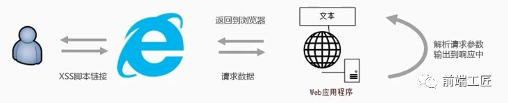
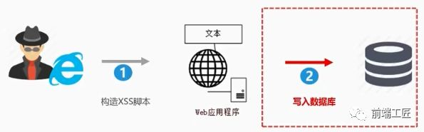
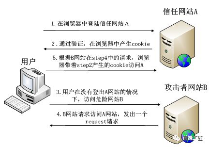
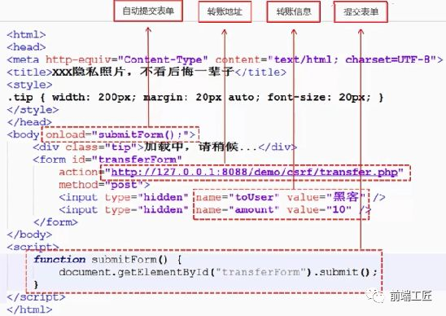
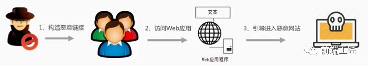
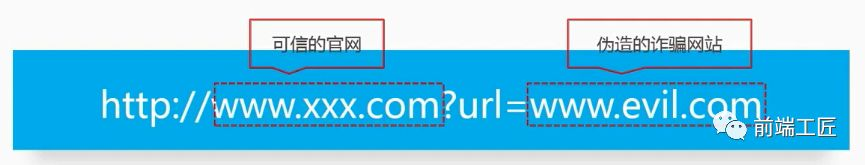
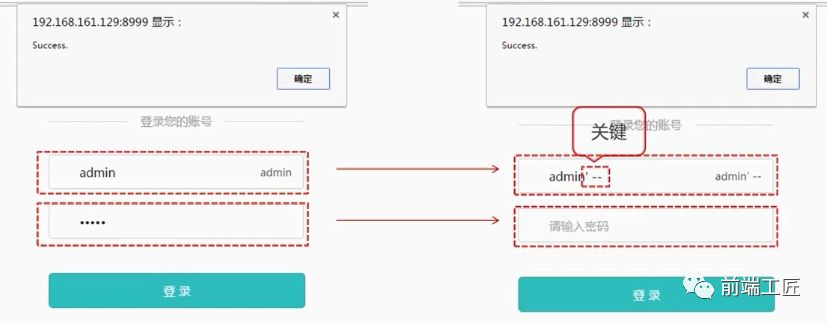
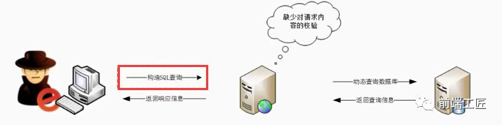
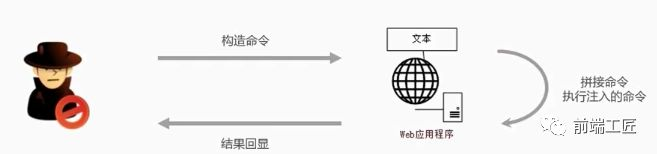

# 常见六大 Web 安全攻防解析

## 目录

- [ 常见六大 Web 安全攻防解析 ](#-常见六大-Web-安全攻防解析-)
- [前言](#前言)
- [二、CSRF](#二CSRF)
  - [1.CSRF攻击的原理](#1CSRF攻击的原理)
  - [2.如何防御](#2如何防御)
    - [1) SameSite](#1-SameSite)
    - [2) Referer Check](#2-Referer-Check)
    - [3)  Anti CSRF Token](#3-Anti-CSRF-Token)
    - [4) 验证码](#4-验证码)
- [三、点击劫持](#三点击劫持)
  - [1. 特点](#1-特点)
  - [2. 点击劫持的原理](#2-点击劫持的原理)
  - [3. 如何防御](#3-如何防御)
    - [1）X-FRAME-OPTIONS](#1X-FRAME-OPTIONS)
    - [2）JavaScript 防御](#2JavaScript-防御)
- [四、URL跳转漏洞](#四URL跳转漏洞)
  - [1.URL跳转漏洞原理](#1URL跳转漏洞原理)
  - [2.实现方式：](#2实现方式)
  - [3.如何防御](#3如何防御)
    - [1)referer的限制](#1referer的限制)
    - [2)加入有效性验证Token](#2加入有效性验证Token)
- [五、SQL注入](#五SQL注入)
  - [1.SQL注入的原理](#1SQL注入的原理)
  - [2.危害](#2危害)
  - [3.如何防御](#3如何防御)
- [六、OS命令注入攻击](#六OS命令注入攻击)
  - [1.原理](#1原理)
  - [2.如何防御](#2如何防御)

## &#x20;常见六大 Web 安全攻防解析&#x20;

## **前言**

在互联网时代，数据安全与个人隐私受到了前所未有的挑战，各种新奇的攻击技术层出不穷。

如何才能更好地保护我们的数据？

本文主要侧重于分析几种常见的攻击的类型以及防御的方法。






## **二、CSRF**

CSRF(Cross Site Request Forgery)，即跨站请求伪造，是一种常见的Web攻击，它利用用户已登录的身份，在用户毫不知情的情况下，以用户的名义完成非法操作。

### **1.CSRF攻击的原理**

下面先介绍一下CSRF攻击的原理：



完成 CSRF 攻击必须要有三个条件：

- 用户已经登录了站点 A，并在本地记录了 cookie
- 在用户没有登出站点 A 的情况下（也就是 cookie 生效的情况下），访问了恶意攻击者提供的引诱危险站点 B (B 站点要求访问站点A)。
- 站点 A 没有做任何 CSRF 防御

我们来看一个例子：

&#x20;当我们登入转账页面后，突然眼前一亮**惊现"XXX隐私照片，不看后悔一辈子"的链接**，耐不住内心躁动，立马点击了该危险的网站（页面代码如下图所示），但当这页面一加载，便会执行submitForm这个方法来提交转账请求，从而将10块转给黑客。



### **2.如何防御**

防范 CSRF 攻击可以遵循以下几种规则：

- Get 请求不对数据进行修改
- 不让第三方网站访问到用户 Cookie
- 阻止第三方网站请求接口
- 请求时附带验证信息，比如验证码或者 Token

#### **1) SameSite**

可以对 Cookie 设置 SameSite 属性。

该属性表示 Cookie 不随着跨域请求发送，可以很大程度减少 CSRF 的攻击，但是该属性目前并不是所有浏览器都兼容。

#### **2) Referer Check**

HTTP Referer是header的一部分，当浏览器向web服务器发送请求时，一般会带上Referer信息告诉服务器是从哪个页面链接过来的，服务器籍此可以获得一些信息用于处理。

可以通过检查请求的来源来防御CSRF攻击。

正常请求的referer具有一定规律，如在提交表单的referer必定是在该页面发起的请求。

所以**通过检查http包头referer的值是不是这个页面，来判断是不是CSRF攻击**。

但在某些情况下如从https跳转到http，浏览器处于安全考虑，不会发送referer，服务器就无法进行check了。

若与该网站同域的其他网站有XSS漏洞，那么攻击者可以在其他网站注入恶意脚本，受害者进入了此类同域的网址，也会遭受攻击。

出于以上原因，无法完全依赖Referer Check作为防御CSRF的主要手段。

但是可以通过Referer Check来监控CSRF攻击的发生。

#### **3)  Anti CSRF Token**

目前比较完善的解决方案是加入Anti-CSRF-Token。

即发送请求时在HTTP 请求中以参数的形式加入一个随机产生的token，并在服务器建立一个拦截器来验证这个token。

服务器读取浏览器当前域cookie中这个token值，会进行校验该请求当中的token和cookie当中的token值是否都存在且相等，才认为这是合法的请求。

否则认为这次请求是违法的，拒绝该次服务。

**这种方法相比Referer检查要安全很多**，token可以在用户登陆后产生并放于session或cookie中，然后在每次请求时服务器把token从session或cookie中拿出，与本次请求中的token 进行比对。

由于token的存在，攻击者无法再构造出一个完整的URL实施CSRF攻击。

但在处理多个页面共存问题时，当某个页面消耗掉token后，其他页面的表单保存的还是被消耗掉的那个token，其他页面的表单提交时会出现token错误。

#### **4) 验证码**

应用程序和用户进行交互过程中，特别是账户交易这种核心步骤，强制用户输入验证码，才能完成最终请求。

在通常情况下，验证码够很好地遏制CSRF攻击。

**但增加验证码降低了用户的体验，网站不能给所有的操作都加上验证码**。

所以只能将验证码作为一种辅助手段，在关键业务点设置验证码。

## **三、点击劫持**

点击劫持是一种视觉欺骗的攻击手段。

攻击者将需要攻击的网站通过 iframe 嵌套的方式嵌入自己的网页中，并将 iframe 设置为透明，在页面中透出一个按钮诱导用户点击。

### **1. 特点**

- 隐蔽性较高，骗取用户操作
- "UI-覆盖攻击"
- 利用iframe或者其它标签的属性

### **2. 点击劫持的原理**

用户在登陆 A 网站的系统后，被攻击者诱惑打开第三方网站，而第三方网站通过 iframe 引入了 A 网站的页面内容，用户在第三方网站中点击某个按钮（被装饰的按钮），实际上是点击了 A 网站的按钮。

接下来我们举个例子：

我在优酷发布了很多视频，想让更多的人关注它，就可以通过点击劫持来实现

```纯文本 
  1 iframe {  2 width: 1440px;  3 height: 900px;  4 position: absolute;  5 top: -0px;  6 left: -0px;  7 z-index: 2;  8 -moz-opacity: 0;  9 opacity: 0; 10 filter: alpha(opacity=0); 11 } 12 button { 13 position: absolute; 14 top: 270px; 15 left: 1150px; 16 z-index: 1; 17 width: 90px; 18 height:40px; 19 } 20 </style> 21 ...... 22 <button>点击脱衣</button> 23  24 <iframe src= "http://i.youku.com/u/UMjA0NTg4Njcy"  scrolling= "no" ></iframe>
```


从上图可知，攻击者通过图片作为页面背景，隐藏了用户操作的真实界面，当你按耐不住好奇点击按钮以后，真正的点击的其实是隐藏的那个页面的订阅按钮，然后就会在你不知情的情况下订阅了。


### **3. 如何防御**

#### **1）X-FRAME-OPTIONS**

X-FRAME-OPTIONS

是一个 HTTP 响应头，在现代浏览器有一个很好的支持。

这个 HTTP 响应头 就是为了防御用 iframe 嵌套的点击劫持攻击。

该响应头有三个值可选，分别是

- DENY，表示页面不允许通过 iframe 的方式展示
- SAMEORIGIN，表示页面可以在相同域名下通过 iframe 的方式展示
- ALLOW-FROM，表示页面可以在指定来源的 iframe 中展示

#### **2）JavaScript 防御**

对于某些远古浏览器来说，并不能支持上面的这种方式，那我们只有通过 JS 的方式来防御点击劫持了。

```纯文本 
  1 < head >  2    < style   id = "click-jack" >  3      html  {  4        display : none  !important ;  5     }  6   </ style >  7 </ head >  8 < body >  9    < script > 10      if  (self == top) { 11        var  style =  document .getElementById( 'click-jack' ) 12        document .body.removeChild(style) 13     }  else  { 14       top.location = self.location 15     } 16   </ script > 17 </ body >
```


以上代码的作用就是当通过 iframe 的方式加载页面时，攻击者的网页直接不显示所有内容了。

## **四、URL跳转漏洞**

定义：

借助未验证的URL跳转，将应用程序引导到不安全的第三方区域，从而导致的安全问题。

### **1.URL跳转漏洞原理**

黑客利用URL跳转漏洞来诱导安全意识低的用户点击，导致用户信息泄露或者资金的流失。

其原理是黑客构建恶意链接(链接需要进行伪装,尽可能迷惑),发在QQ群或者是浏览量多的贴吧/论坛中。

安全意识低的用户点击后,经过服务器或者浏览器解析后，跳到恶意的网站中。



恶意链接需要进行伪装,经常的做法是熟悉的链接后面加上一个恶意的网址，这样才迷惑用户。



诸如伪装成像如下的网址，你是否能够识别出来是恶意网址呢？

```纯文本 
 1 http: / /gate.baidu.com/index ?act=go&url= http: / /t.cn/ RVTatrd 2 http: / /qt.qq.com/safecheck .html?flag= 1 &url= http: / /t.cn/ RVTatrd 3 http: / /tieba.baidu.com/f/user/passport ?jumpUrl= http: / /t.cn/ RVTatrd
```


### **2.实现方式：**

- Header头跳转
- Javascript跳转
- META标签跳转

这里我们举个Header头跳转实现方式：

```纯文本 
 1 <?php 2 $url=$_GET[ 'jumpto' ]; 3 header( "Location: $url" ); 4 ?>
```


```纯文本 
 1 http: // www.wooyun.org /login.php?jumpto=http:/ /www.evil.com
```


这里用户会认为www\.wooyun.org都是可信的，但是点击上述链接将导致用户最终访问www\.evil.com这个恶意网址。

### **3.如何防御**

#### **1)referer的限制**

如果确定传递URL参数进入的来源，我们可以通过该方式实现安全限制，保证该URL的有效性，避免恶意用户自己生成跳转链接

#### **2)加入有效性验证Token**

我们保证所有生成的链接都是来自于我们可信域的，通过在生成的链接里加入用户不可控的Token对生成的链接进行校验，可以避免用户生成自己的恶意链接从而被利用，但是如果功能本身要求比较开放，可能导致有一定的限制。

## **五、SQL注入**

SQL注入是一种常见的Web安全漏洞，攻击者利用这个漏洞，可以访问或修改数据，或者利用潜在的数据库漏洞进行攻击。

### **1.SQL注入的原理**

我们先举一个万能钥匙的例子来说明其原理：



```纯文本 
 1 < form   action = "/login"   method = "POST" > 2      < p > Username:  < input   type = "text"   name = "username"  /></ p > 3      < p > Password:  < input   type = "password"   name = "password"  /></ p > 4      < p >< input   type = "submit"   value = "登陆"  /></ p > 5 </ form >
```


后端的 SQL 语句可能是如下这样的：

```纯文本 
 1 let querySQL = ` 2      SELECT  * 3      FROM   user 4      WHERE  username= '${username}' 5      AND  psw= '${password}' 6 `; 7 // 接下来就是执行 sql 语句... 8
```


这是我们经常见到的登录页面，但如果有一个恶意攻击者输入的用户名是 

admin' --

，密码随意输入，就可以直接登入系统了。

why! ----这就是SQL注入

我们之前预想的SQL 语句是:

```纯文本 
 1 SELECT  *  FROM   user   WHERE  username= 'admin'   AND  psw= 'password'
```


但是恶意攻击者用奇怪用户名将你的 SQL 语句变成了如下形式：

```纯文本 
 1 SELECT  *  FROM   user   WHERE  username= 'admin'   --' AND psw='xxxx'
```


在 SQL 中,

' --

是闭合和注释的意思，-- 是注释后面的内容的意思，所以查询语句就变成了：

```纯文本 
 1 SELECT  *  FROM   user   WHERE  username= 'admin'
```


所谓的万能密码,本质上就是SQL注入的一种利用方式。

一次SQL注入的过程包括以下几个过程：

- 获取用户请求参数
- 拼接到代码当中
- SQL语句按照我们构造参数的语义执行成功

**SQL注入的必备条件：**

**1.可以控制输入的数据 2.服务器要执行的代码拼接了控制的数据**

。



我们会发现SQL注入流程中与正常请求服务器类似，只是黑客控制了数据，构造了SQL查询，而正常的请求不会SQL查询这一步，

**SQL注入的本质:数据和代码未分离，即数据当做了代码来执行。**

### **2.危害**

- 获取数据库信息
- 管理员后台用户名和密码
- 获取其他数据库敏感信息：用户名、密码、手机号码、身份证、银行卡信息……
- 整个数据库：脱裤
- 获取服务器权限
- 植入Webshell，获取服务器后门
- 读取服务器敏感文件

### **3.如何防御**

- **严格限制Web应用的数据库的操作权限**，给此用户提供仅仅能够满足其工作的最低权限，从而最大限度的减少注入攻击对数据库的危害
- **后端代码检查输入的数据是否符合预期**，严格限制变量的类型，例如使用正则表达式进行一些匹配处理。
- **对进入数据库的特殊字符（'，"，\，<，>，&， \*，; 等）进行转义处理，或编码转换**。基本上所有的后端语言都有对字符串进行转义处理的方法，比如 lodash 的 lodash.\_escapehtmlchar 库。
- **所有的查询语句建议使用数据库提供的参数化查询接口**，参数化的语句使用参数而不是将用户输入变量嵌入到 SQL 语句中，即不要直接拼接 SQL 语句。例如 Node.js 中的 mysqljs 库的 query 方法中的 ? 占位参数。

## **六、OS命令注入攻击**

OS命令注入和SQL注入差不多，只不过SQL注入是针对数据库的，而OS命令注入是针对操作系统的。

OS命令注入攻击指通过Web应用，执行非法的操作系统命令达到攻击的目的。

只要在能调用Shell函数的地方就有存在被攻击的风险。

倘若调用Shell时存在疏漏，就可以执行插入的非法命令。

命令注入攻击可以向Shell发送命令，让Windows或Linux操作系统的命令行启动程序。

也就是说，通过命令注入攻击可执行操作系统上安装着的各种程序。

### **1.原理**



黑客构造命令提交给web应用程序，web应用程序提取黑客构造的命令，拼接到被执行的命令中，因黑客注入的命令打破了原有命令结构，导致web应用执行了额外的命令，最后web应用程序将执行的结果输出到响应页面中。

我们通过一个例子来说明其原理，假如需要实现一个需求：

用户提交一些内容到服务器，然后在服务器执行一些系统命令去返回一个结果给用户

```纯文本 
 1 // 以 Node.js 为例，假如在接口中需要从 github 下载用户指定的 repo 2 const  exec =  require ( 'mz/child_process' ).exec; 3 let  params = { /* 用户输入的参数 */ }; 4 exec( `git clone  ${params.repo}  /some/path` );
```


params.repo

传入的是 

<https://github.com/admin/admin.github.io.git>

&#x20;确实能从指定的 git repo 上下载到想要的代码。

但是如果 

params.repo

 传入的是 

<https://github.com/xx/xx.git> && rm -rf /\* &&

&#x20;恰好你的服务是用 root 权限起的就糟糕了。

### **2.如何防御**

- 后端对前端提交内容进行规则限制（比如正则表达式）。
- 在调用系统命令前对所有传入参数进行命令行参数转义过滤。
- 不要直接拼接命令语句，借助一些工具做拼接、转义预处理，例如 Node.js 的 shell-escape npm包
