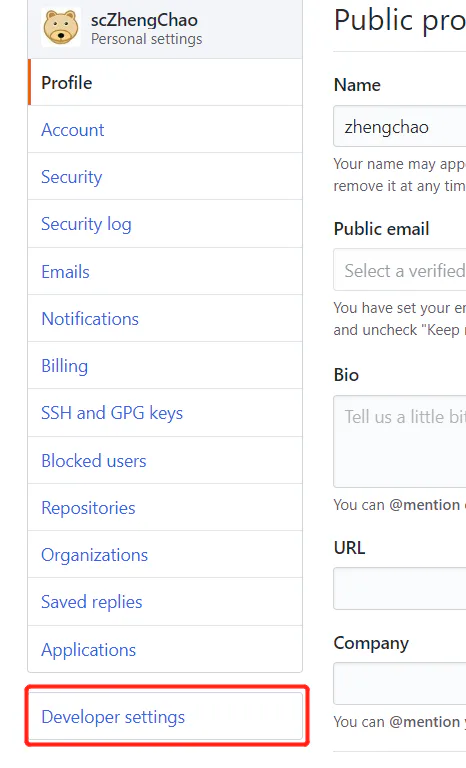
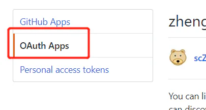
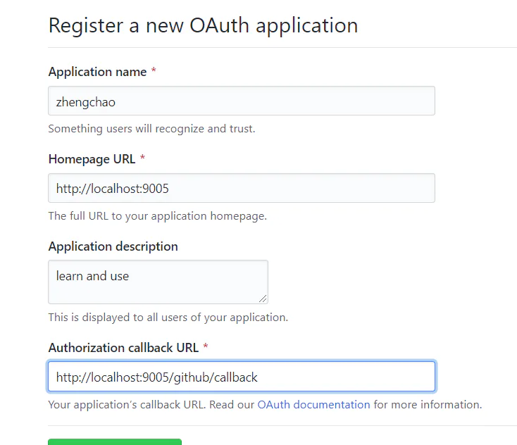
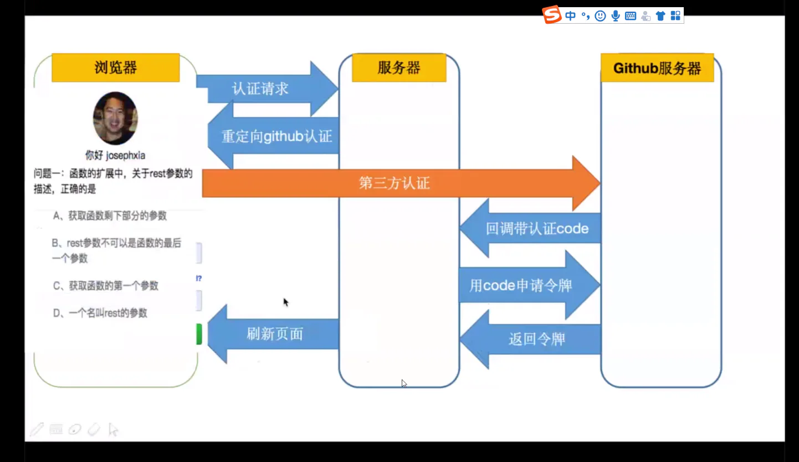
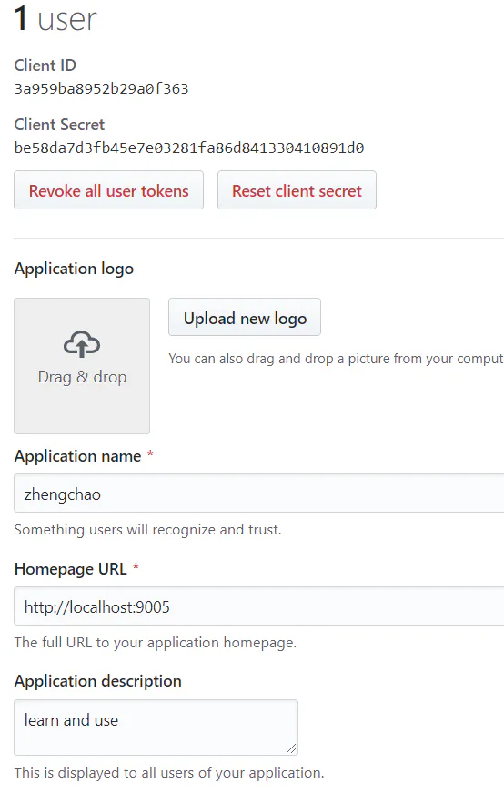
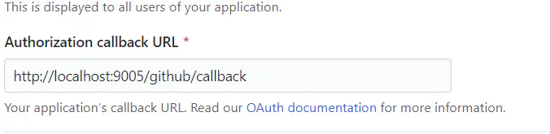

# OAuth

**3.OAuth(开放授权） 第三方鉴权**

```纯文本 
      概述：三方登入主要基于OAuth 2.0。OAuth协议为用户资源的授权提供了一个安全的、开放而又简易的标 准。与以往的授权方式不同之处是OAUTH的授权不会使第三方触及到用户的帐号信息（如用户名与密码）， 即第三方无需使用用户的用户名与密码就可以申请获得该用户资源的授权，因此OAUTH是安全的。
```


以 github 为例







基本大概过程：



```纯文本 
 代码实现： 
      const Koa = require('koa') 
 const router = require('koa-router')() 
 const static = require('koa-static') 
 const app = new Koa(); 
 const axios = require('axios') 
 const querystring = require('querystring') 
 
 app.use(static(__dirname + '/')); 
 
 // oauth 第三方认证给的 
 const config = { 
     client_id: '3a959ba8952b29a0f363', 
     client_secret: 'be58da7d3fb45e7e03281fa86d841330410891d0' 
 } 
 
 router.get('/github/login', async (ctx) => { 
     var dataStr = (new Date()).valueOf(); 
     //重定向到第三方提供的认证接口,并配置参数 
     var path = "https://github.com/login/oauth/authorize"; 
     path += '?client_id=' + config.client_id; 
 
     //转发到授权服务器 
     ctx.redirect(path); 
 }) 
 
 // 提供接口 等待 第三方鉴权完成 调用该接口 传参code (注意该code只能用一次) 
 router.get('/github/callback', async (ctx) => { 
     console.log('callback..') 
     const code = ctx.query.code;   
     const params = { 
         client_id: config.client_id, 
         client_secret: config.client_secret, 
         code: code 
     } 
     // 用第三方 返回的code 和 id secret 再去申请令牌 token 
     let res = await axios.post('https://github.com/login/oauth/access_token', params) 
     const access_token = querystring.parse(res.data).access_token 
     //拿取token 获取用户信息 
     res = await axios.get('https://api.github.com/user?access_token=' + access_token) 
     console.log('userAccess:', res.data) 
     ctx.body = ` 
         <h1>Hello ${res.data.login}</h1> 
          
     ` 
 }) 
 
 app.use(router.routes()); /*启动路由*/ 
 app.use(router.allowedMethods()); 
 app.listen(9005);
```


```纯文本 
 html： 
 <html> 
 <head>   
     <script src="https://cdn.jsdelivr.net/npm/vue/dist/vue.js"></script>   
     <script src="https://unpkg.com/axios/dist/axios.min.js"></script> 
 </head> 
 <body>  <div id="app">      <a href='/github/login'>login with github</a>  </div> 
 </body> 
 </html>
```


第三方配置界面：




