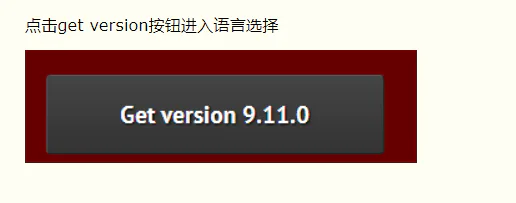
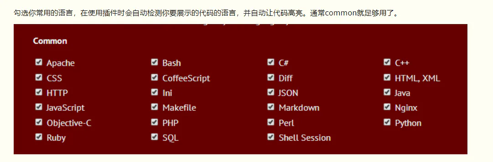

# 代码高亮

## 目录

- [highlight.js](#highlightjs)

# highlight.js

```typescript 
//首先，我们先下载一个highlight的js文件。
https://highlightjs.org/
```






```typescript 
然后点击下面的download按钮，下载，解压，里面会有js文件和css文件。
js文件决定你的代码哪些部分会变高亮，css文件决定你的代码会变成什么颜色~
在解压后的文件里找到一个highlight.pack.js文件，在使用时导入这个js文件。
<script src="js/highlight.pack.js"></script>
打开里面的styles文件，里面有很多的css文件。这些文件可以更改你的展示代码的css样式，包括高亮的颜色和背景色(主题色)。
在使用时想使用那种样式只需要导入这个样式的css文件即可。
看不懂这些英文都代表的什么样式？这个网址有各个css文件的效果展示：https://highlightjs.org/static/demo/
这里我选择了一个dark.css文件：
<link rel="stylesheet" type="text/css" href="css/dark.css"/>
导入js文件和css文件后然后就可以使用了。
在使用时，一定要将你要展示的代码包在<pre><code></code></pre>标签里！！！
```
