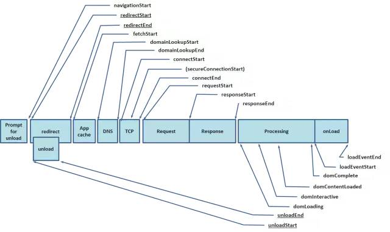
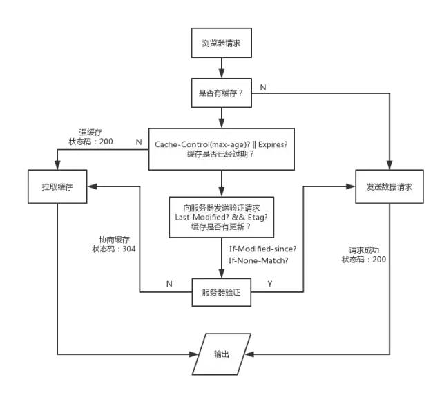
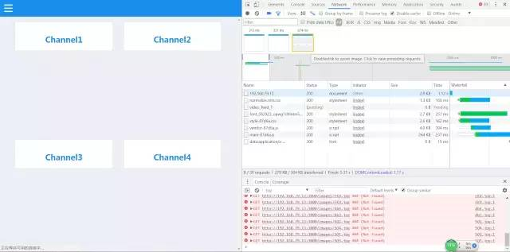
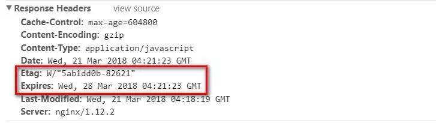

# 数据持久化

## 目录

- [http缓存](#http缓存)

# http缓存

在开始介绍网络传输性能优化这项工作之前，我们需要了解浏览器处理用户请求的过程，那么就必须奉上这幅神图了：



这是navigation timing监测指标图，从图中我们可以看出，浏览器在得到用户请求之后，经历了下面这些阶段：

**重定向→拉取缓存→DNS查询→建立TCP链接→发起请求→接收响应→处理HTML元素→元素加载完成。**

不着急，我们对其中的细节一步步展开讨论：

我们都知道，浏览器在向服务器发起请求前，会先查询本地是否有相同的文件，如果有，就会直接拉取本地缓存，这和我们在后台部属的Redis和Memcache类似，都是起到了中间缓冲的作用，我们先看看浏览器处理缓存的策略：



因为网上的图片太笼统了，而且我翻过很多讲缓存的文章，**很少有将状态码还有什么时候将缓存存放在内存（memory）中什么时候缓存在硬盘中（disk）系统地整理出来，所以我自己绘制了一张浏览器缓存机制流程图**，结合这张图再更深入地说明浏览器的缓存机制。

这里我们可以使用chrome devtools里的network面板查看网络传输的相关信息：

（这里需要特别注意，在我们进行缓存调试时，需要去除network面板顶部的Disable cache 勾选项，否则浏览器将始终不会从缓存中拉取数据）



浏览器默认的缓存是放在内存内的，但我们知道，内存里的缓存会因为进程的结束或者说浏览器的关闭而被清除，而存在硬盘里的缓存才能够被长期保留下去。很多时候，我们在network面板中各请求的size项里，会看到两种不同的状态：from memory cache 和 from disk cache，前者指缓存来自内存，后者指缓存来自硬盘。而控制缓存存放位置的，不是别人，就是我们在服务器上设置的Etag字段。在浏览器接收到服务器响应后，会检测响应头部（Header），如果有Etag字段，那么浏览器就会将本次缓存写入硬盘中。

之所以拉取缓存会出现200、304两种不同的状态码，取决于浏览器是否有向服务器发起验证请求。只有向服务器发起验证请求并确认缓存未被更新，才会返回304状态码。

这里我以nginx为例，谈谈如何配置缓存:

首先，我们先进入nginx的配置文档

```javascript 
$ vim nginxPath/conf/nginx.conf
```


在配置文档内插入如下两项：

```javascript 
etag on;   

//开启etag验证

expires 7d;

//设置缓存过期时间为7天
```


打开我们的网站，在chrome devtools的network面板中观察我们的请求资源，如果在响应头部看见Etag和Expires字段，就说明我们的缓存配置成功了。



**【！！！特别注意！！！】**

 在我们配置缓存时一定要切记，浏览器在处理用户请求时，如果命中强缓存，浏览器会直接拉取本地缓存，不会与服务器发生任何通信，也就是说，如果我们在服务器端更新了文件，并不会被浏览器得知，就无法替换失效的缓存。所以我们在构建阶段，

需要为我们的静态资源添加md5 hash后缀，避免资源更新而引起的前后端文件无法同步的问题。

[http缓存](./http缓存/index.md "http缓存")

[浏览缓存（localstorage/sessionStorage）](./Web-Storage/index.md "浏览缓存（localstorage/sessionStorage）")

[方案](./方案/index.md "方案")

[LocalForage](./LocalForage/index.md "LocalForage")
