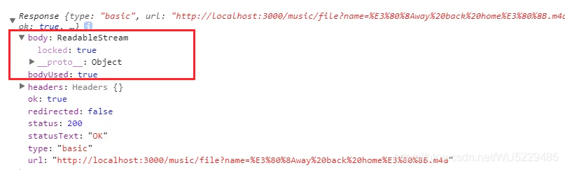
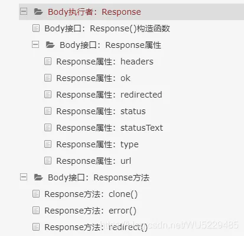
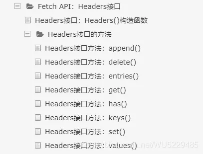

# Fetch api

## 目录

- [一、Fetch在项目中的基本使用](#一Fetch在项目中的基本使用)
  - [1. 常用基本的json格式响应](#1-常用基本的json格式响应)
  - [2. 常用参数配置写法](#2-常用参数配置写法)
  - [3. blob和arraybuffer文件流响应获取](#3-blob和arraybuffer文件流响应获取)
- [二、fetch高级使用](#二fetch高级使用)
  - [1. Fetch API：Body接口](#1-Fetch-APIBody接口)
  - [2. Body接口执行者](#2-Body接口执行者)
    - [1. Body执行者 Request](#1-Body执行者-Request)
    - [2. Request常用属性（fetch(options)中的options属性）](#2-Request常用属性fetchoptions中的options属性)
    - [3. Request方法罗列](#3-Request方法罗列)
    - [4. Body执行者 Response](#4-Body执行者-Response)
    - [5. Fetch API Headers接口](#5-Fetch-API-Headers接口)
- [三. Fetch API 官方文档参考地址](#三-Fetch-API-官方文档参考地址)
- [四.fetch 封装](#四fetch-封装)
  - [1.超时](#1超时)
  - [2.上传进度](#2上传进度)

# 一、Fetch在项目中的基本使用

        Fetch API提供了一个 JavaScript 接口用于访问和操作HTTP管道的零件，如请求和响应。它还提供了一种全局fetch()方法，可以提供一种简单，合理的方式在网络上异步获取资源。

```javascript 
数据交互：
    官方脚手架 静态数据读取时，参考根指向public  '/data' == public/data
    fetch    原生就有
    fetch(url+数据,{配置}).then(成功函数(res)).catch(error)
    res.ok -> true/false 成功/失败
    res.status - > 状态码
    res.body 数据 数据流(stream)
    res.text() 转换 文本(string)
        过程异步：    return res.text()
        同步： res.text().then((data)=>{})    data:转换后的数据
    res.json() 转  对象
    配置:
        method:'POST'
        headers:{"Content-type":"application/x-www-form-urlencoded"},
        body:'a=1&b=2'    |    {a:1,b:2}    |    URLSearchParams


jsonp:  fetch不带jsonp请求  需要依赖第三库
    npm install fetch-jsonp -D
    import xxx from 'xxx'
    用法:
        fetchJsonp(url+数据,{配置}).then(success(res)).catch(error)
        特点: 是个promise 返回promise 数据是个流
        解析：res.json()  -> 流转换数据 是异步
        配置:
            timeout: 延时  5000
            jsonpCallback: 回调函数key         callback
            jsonpCallbackFunction: null 回调函数名
            
            
import fetchJsonp from 'fetch-jsonp';
1.get
fetch(
        'http://localhost/1809-12-11/php/get.php?a=1&b=2'  参数只能写在这里
    ).then(
        res=>res.json()
    ).then(
        res => console.log(res)
    )


2.post
    let params = new URLSearchParams();
    // params.set("a", "1");
    // params.set("b","2")
    params.append("a", "1");
    params.append("b","2")
    fetch(
        'http://localhost/1809-12-11/php/post.php?',
        {
            method: 'POST',
            headers: { "Content-type": "application/x-www-form-urlencoded" },
            body:params
        }
    ).then(
        res => res.json()
    ).then(
        res=>console.log(res)
    )


  3.fetchjsonp
        fetchJsonp(
            'https://sp0.baidu.com/5a1Fazu8AA54nxGko9WTAnF6hhy/su?wd=zc',
            {
                jsonpCallback:'cb'
            }
        ).then(
            res=>res.json()
        ).then(
            res=>console.log(res)
        )

```


## 1. 常用基本的json格式响应

```javascript 
 fetch(url).then(function(response) {
      return response.json();
}).then(function(data) {
      console.log(data);
}).catch(function(e) {
     console.log("Oops, error");
});
```


## 2. 常用参数配置写法

1. GET传递参数

```javascript 
 fetch(url?key1=val1&key2=val2&...).then((response) => response.json()).then((json) => {
   //处理返回值
}).catch((error) => {
   //异常处理
})
```


1. POST传递参数

```javascript 
 fetch(url', {
  method: 'POST',
  headers: {
    'Accept': 'application/json',
    'Content-Type': 'application/json',
  },
  body: JSON.stringify({
    firstParam: 'yourValue',
    secondParam: 'secondValue',
  })
})
```


1. 复杂表单数据的传递，比如图片、文件等

```javascript 
 let formData = new FormData();  
formData.append("key",表单内容);  

  
fetch(url , {  
   method: 'POST',  
   headers: {},  
   body: formData,  
).then((response) => {  
 if (response.ok) {  
     return response.json();  
 }  
).then((json) => {  
   alert(JSON.stringify(json));  
).catch((error) => {  
   console.error(error);  
);
```


## 3. blob和arraybuffer文件流响应获取

1. 获取blob文件流

```javascript 
 // 点击音乐列表请求音乐数据
requestMusicData(item,index){
    //请求并且传递音乐名称
    fetch('/music/file?name='+item.innerText,{
        method: 'get',
        responseType: 'blob'
    }).then(res => {     
        return res.blob();
    }).then(blob => {
        let bl = new Blob([blob], {type: "audio/m4a"});
        let fileName = Date.parse(new Date())+".m4a";
        var link = document.createElement('a');
        link.href = window.URL.createObjectURL(blob);
        link.download = fileName;
        link.click();
        window.URL.revokeObjectURL(link.href);
    })
} 
```


1. 获取arraybuffer文件流

```javascript 
 requestMusicData(item,index){
    //请求并且传递音乐名称
    fetch('/music/file?name='+item.innerText,{
        method: 'get',
        responseType: 'arraybuffer'
    }).then(res => {     
        return res.arrayBuffer();
    }).then(arraybuffer => {
    //...
    })
} 
```


# 二、fetch高级使用

        Fetch API的Body mixin表示响应/请求的主体，允许你声明一下它的内容类型以及它应该如何处理。  Body是通过Request和Response来实现的。这为这些对象提供了一个关联的主体（一个流），一个使用的标志（最初未设置）和一个MIME类型（最初是空字节序列）。

## 1. Fetch API：Body接口

- 接口属性：

1. Body.body（只读） 一个简单的getter用来发现正文内容的ReadableStream。
2. Body.bodyUsed（只读） 一个Boolean表明是否已经阅读主体的内容。

控制台打印如下：



- 接口方法

基本使用案例分析：

```javascript 
 fetch(url)
.then(function(response) {
  return response.blob(); // 可以根据使用场景更换为 response.arrayBuffer()、response.text()、response.formData()、response.json()、response.text()
})
.then(function(youType) {
  // ... 
});
```


1. res.arrayBuffer()  arrayBuffer() 方法会返回一个promise，可以解决一个ArrayBuffer
2. res.blob()  blob() 方法将返回一个promise，使用一个Blob解决
3. res.formData()  formData() 方法返回一个Promise，它使用一个FormData对象来解决
4. res.json()  json() 方法返回解析正文文本为JSON的结果。这可以是任何可以由JSON表示的东西：对象、数组、字符串、数字等等
5. res.text()  text() 方法返回一个promise，使用一个USVString解决

## 2. Body接口执行者

### 1. Body执行者 Request

在Body接口中，该Request()构造函数用来创建一个新的Request对象

简单案例体验：

```javascript 
 var myImage = document.querySelector('img');

var myHeaders = new Headers();
myHeaders.append('Content-Type', 'image/jpeg');

var myInit = { method: 'GET', headers: myHeaders, mode: 'cors', cache: 'default' };
var myRequest = new Request('flowers.jpg',myInit); // 参数和fetch(attr)的attr参数保持一致

fetch(myRequest).then(function(response) {
  ... 
});
```


### 2. Request常用属性（fetch(options)中的options属性）

- **url**： url 只读属性的值为一个 USVString，它表示请求的 URL
- **method**: method 只读属性的属性值为 ByteString，表示请求的方法（ 默认 GET ）
- **headers**: 一个Headers对象，示例如下：

```javascript 
 var myHeaders = new Headers();
myHeaders.append('Content-Type', 'image/jpeg');

var myInit = { method: 'GET', headers: myHeaders, mode: 'cors', cache: 'default' };
var myRequest = new Request('flowers.jpg',myInit);
myContentType = myRequest.headers.get('Content-Type'); // returns 'image/jpeg'
```


- **mode**: Request 接口的 mode 只读属性包含请求的模式（例如，cors，no-cors，same-origin，或 navigate）这是用来确定跨域请求是否导致有效的响应，并且其响应的哪些属性是可读的，默认允许跨域cros。
- **cache**: cache只读属性包含请求的缓存模式。它控制请求将如何与浏览器的HTTP缓存进行交互。  cache属性值参考文档：[https://www.w3cschool.cn/fetch\_api/fetch\_api-hokx2khz.html](https://www.w3cschool.cn/fetch_api/fetch_api-hokx2khz.html "https://www.w3cschool.cn/fetch_api/fetch_api-hokx2khz.html")
- **credentials**: credentials只读属性指示用户代理是否应该在来源请求中发送来自其他域的cookie。这与XHR的 withCredentials标志类似，但有三个可用的值（而不是两个）：  （1）omit：从不发送cookie。  （2）same-origin：如果URL与调用脚本位于相同的源，则发送用户凭证（cookie，基本http认证等）。  （3）include：始终发送用户凭据（cookie，基本http认证等），甚至用于跨源调用。
- **referrer**: referrer 只读属性由用户代理设置为 Request 的引用者，例如 client，no-referrer，或 URL。注意：如果 referrer 只读属性的值是 no-referrer，则它将返回一个空字符串。
- 其上常用属性的浏览器兼容性请参考：[https://www.w3cschool.cn/fetch\_api/fetch\_api-6ezi2lim.html](https://www.w3cschool.cn/fetch_api/fetch_api-6ezi2lim.html "https://www.w3cschool.cn/fetch_api/fetch_api-6ezi2lim.html")

### 3. Request方法罗列

- **arrayBuffer()** 概述：arrayBuffer() 方法采用 Response 流并将其读入完成。它返回一个 ArrayBuffer 解决的 promise  代码案例：

```javascript 
 response.arrayBuffer().then(function(buffer) {
    // do something with buffer
  });
```


- **blob()** 概述：blob() 方法读取一个 Response 流，并且将它读取完成。它返回一个用 Blob 解决的 promise  代码案例：

```javascript 
 response.blob().then(function(myBlob) { // do something with myBlob });
```


- **formData()** 概述： formData() 方法采取 Response 流并读取完成。它返回一个以 FormData 对象解决的 promise  代码案例：

```javascript 
   response.formData().then(function(formdata) {
    // do something with your formdata
  });
```


- **clone()** 概述：Request 接口的 clone() 方法用于创建当前 Request 对象的副本。 如果响应 Body 已被使用，则 clone() 方法将抛出一个 TypeError。实际上，clone() 存在的主要原因是允许 Body 对象的多次使用（当它们只是一次性使用时）  代码案例：

```javascript 
   var myRequest = new Request('flowers.jpg');
  var newRequest = myRequest.clone(); // a copy of the request is now stored in newRequest
```


- text()

### 4. Body执行者 Response

Fetch API 的 Response 接口用于表示对请求的响应。  您可以使用 Response.Response() 构造函数创建一个新的 Response 对象，但您更可能遇到由于另一个 API 操作（例如一个 service worker：Fetchevent.respondWith或简单的 GlobalFetch.fetch() 操作）而返回的 Response 对象

响应相关的属性参数和方法，前面也有部分罗列，比较简单，所以就不做搬运工了，附上目录和官方文档的地址：



- **response**官方文档详细地址：[https://www.w3cschool.cn/fetch\_api/fetch\_api-phz72lrr.html](https://www.w3cschool.cn/fetch_api/fetch_api-phz72lrr.html "https://www.w3cschool.cn/fetch_api/fetch_api-phz72lrr.html")

### 5. Fetch API Headers接口

          Fetch API 的 Headers 接口允许对 HTTP 请求和响应头执行各种操作。这些操作包括检索、设置、添加和删除。一个 Headers 对象有一个关联的标题列表，它最初是空的，由零个或多个名称和值对组成。您可以使用像 append() 这样的方法添加到此处（请参阅示例）。在此 Headers 接口的所有方法中，标头名称均由不区分大小写的字节序列进行匹配。  出于安全原因，某些标头只能由用户代理控制。这些标题包括禁止的标头名称和禁止的响应标头名称。

         标头对象还有一个关联的保护，这需要 immutable，request，request-no-cors，response，或 none 的值。这会影响 set()，delete() 和 append() 方法是否会产生变异的头。

         您可以通过 Request.headers 和 Response.headers 属性检索 Headers 对象，并使用 Headers.Headers() 构造函数创建一个新 Headers 对象。

        一个 Headers 对象的实现可以直接用在一个 for…of 结构中，而不是 entries()：for (var p of myHeaders)，相当于 for (var p of myHeaders.entries())。



- **headers接口** 官方文档详细地址：[https://www.w3cschool.cn/fetch\_api/fetch\_api-ufns2m83.html](https://www.w3cschool.cn/fetch_api/fetch_api-ufns2m83.html "https://www.w3cschool.cn/fetch_api/fetch_api-ufns2m83.html")

# 三. Fetch API 官方文档参考地址

[开始学习Fetch API\_w3cschool Fetch API提供了一个获取资源的接口（包括通过网络），任何使用过XMLHttpRequest的人都会觉得很熟悉，但Fetch API 提供了一个更强大和更灵活的功能集；Fetch提供了Request和Response对象（以及涉及网络请求的其他内容）的通用的定义，这将允许他们在将来需要的地方使用，无论是service worker，Cache API和其他类似的事情。\_ 来自Fetch API <https://www.w3cschool.cn/fetch_api/fetch_api-w7mt2jzc.html>](https://www.w3cschool.cn/fetch_api/fetch_api-w7mt2jzc.html "开始学习Fetch API_w3cschool Fetch API提供了一个获取资源的接口（包括通过网络），任何使用过XMLHttpRequest的人都会觉得很熟悉，但Fetch API 提供了一个更强大和更灵活的功能集；Fetch提供了Request和Response对象（以及涉及网络请求的其他内容）的通用的定义，这将允许他们在将来需要的地方使用，无论是service worker，Cache API和其他类似的事情。_来自Fetch API https://www.w3cschool.cn/fetch_api/fetch_api-w7mt2jzc.html")

[ 使用 Fetch - Web API 接口参考 | MDN Fetch API 提供了一个 JavaScript 接口，用于访问和操纵 HTTP 管道的一些具体部分，例如请求和响应。它还提供了一个全局 fetch() 方法，该方法提供了一种简单，合理的方式来跨网络异步获取资源。 https://developer.mozilla.org/zh-CN/docs/Web/API/Fetch\_API/Using\_Fetch](https://developer.mozilla.org/zh-CN/docs/Web/API/Fetch_API/Using_Fetch " 使用 Fetch - Web API 接口参考 | MDN Fetch API 提供了一个 JavaScript 接口，用于访问和操纵 HTTP 管道的一些具体部分，例如请求和响应。它还提供了一个全局 fetch() 方法，该方法提供了一种简单，合理的方式来跨网络异步获取资源。 https://developer.mozilla.org/zh-CN/docs/Web/API/Fetch_API/Using_Fetch")

# 四.fetch 封装

## 1.超时

```vue 
 
//Http.jsexport default fetchers = {
    post:(url, body = {}) => {
        return _fetch(fetch_promise(url, body = {}), 60000);
    }}

function _fetch(fetch_promise, timeout) {
    var abort_fn = null;
    var abort_promise = new Promise((resolve, reject) => {
        abort_fn = function() {
            reject('abort promise');
        };
    });
    var abortable_promise = Promise.race([
        fetch_promise,
        abort_promise
    ]);
    setTimeout(function(){
        abort_fn();
    }, timeout);

    return abortable_promise;}

function fetch_promise(url, body = {}) {
    return new Promise((resolve, reject) => {
        fetch(url,{
            method: 'POST',
            headers: {
                'Accept': 'application/json',
                'Content-Type': 'application/json;charset=UTF-8',
            },
        }).then((response) => { 
            return response.json();     
        }).then((jsonData) => {
            resolve(jsonData);
        }).catch((err) => {
            reject(err);//这里可以使用resolve(err),将错误信息传回去
            if (err.message === 'Network request failed'){
                console.log('网络出错');
            } else if (err === 'abort promise'){
                console.log('请求超时');
            }
        })
    })}

/*
 * 此巧妙之处在于Promise.race()的使用
 */
```


## 2.上传进度

```vue 
 // fetch() returns a promise that resolves once headers have been received
fetch(url).then(response => {
      // response.body is a readable stream.
      // Calling getReader() gives us exclusive access to the stream's content
  var reader = response.body.getReader();
  var bytesReceived = 0;


  // read() returns a promise that resolves when a value has been received
  reader.read().then(function processResult(result) {
      // Result objects contain two properties:
      // done  - true if the stream has already given you all its data.
        // value - some data. Always undefined when done is true.
    if (result.done) {
        console.log("Fetch complete");
      return;
    }


      // result.value for fetch streams is a Uint8Array
    bytesReceived += result.value.length;
      console.log('Received', bytesReceived, 'bytes of data so far');


      // Read some more, and call this function again
    return reader.read().then(processResult);
  });
});
```
