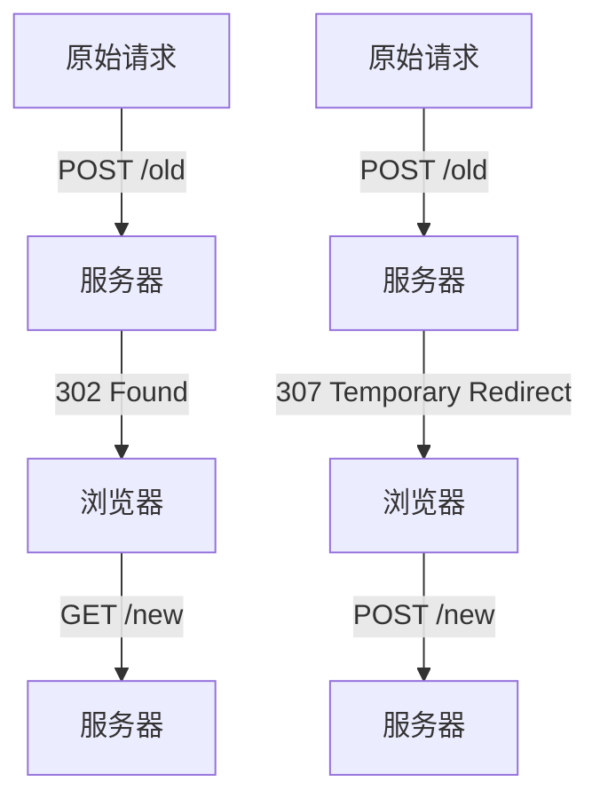

# 重定向

## 目录

- [302](#302)
- [301和302的区别](#301和302的区别)
- [HTTP 状态码 307 (Temporary Redirect)](#HTTP-状态码-307-Temporary-Redirect)
  - [基本特性](#基本特性)
  - [与相似状态码的区别](#与相似状态码的区别)
  - [前端处理示例](#前端处理示例)
    - [1. 服务器设置307响应](#1-服务器设置307响应)
    - [2. 前端处理307响应](#2-前端处理307响应)
  - [实际应用场景](#实际应用场景)
  - [与302的区别](#与302的区别)
  - [注意事项](#注意事项)

#### 302

```纯文本 
 302 
 请求转发 
     请求的资源现在临时从不同的 URI 响应请求。由于这样的重定向是临时的，客户端应当继续向原有地址发送以后的请求。只有在Cache-Control或Expires中进行了指定的情况下，这个响应才是可缓存的。 　　新的临时性的 URI 应当在响应的 Location 域中返回。除非这是一个 HEAD 请求，否则响应的实体中应当包含指向新的 URI 的超链接及简短说明。 　　如果这不是一个 GET 或者 HEAD 请求，那么浏览器禁止自动进行重定向，除非得到用户的确认，因为请求的条件可能因此发生变化。 　　注意：虽然RFC 1945和RFC 2068规范不允许客户端在重定向时改变请求的方法，但是很多现存的浏览器将302响应视作为303响应，并且使用 GET 方式访问在 Location 中规定的 URI，而无视原先请求的方法。状态码303和307被添加了进来，用以明确服务器期待客户端进行何种反应。
```


# 301和302的区别

**一、官方解释**

301 redirect: 301 代表永久性转移(Permanently Moved)

302 redirect: 302 代表暂时性转移(Temporarily Moved )

301表示旧地址A的资源已经被永久地移除了（这个资源不可访问了），**搜索引擎在抓取新内容的同时也将旧的网址交换为重定向之后的网址**；302表示旧地址A的资源还在（仍然可以访问），**这个重定向只是临时地从旧地址A跳转到地址B，搜索引擎会抓取新的内容而保存旧的网址**。

**二、使用场景**

**1、301使用场景：**

（1）域名到期不想续费（或者发现了更适合网站的域名），想换个域名。

（2）在搜索引擎的搜索结果中出现了不带www的域名，而不带www的域名却没有收录，这个时候可以用301重定向来告诉搜索引擎我们目标的域名是哪一个。

（3）空间服务器不稳定，换空间的时候。&#x20;

**2.302使用场景**

当一个网站或者网页24—48小时内临时移动到一个新的位置，这时候就要进行302跳转

**三、SEO角度**

**尽量使用301重定向**。

302状态码涉及到**网址劫持**：从网站A（网站比较烂）上做了一个302跳转到网站B（搜索排名很靠前），这时候有时搜索引擎会使用网站B的内容，但却收录了网站A的地址，这样在不知不觉间，网站B在为网站A作贡献，网站A的排名就靠前了。

# HTTP 状态码 307 (Temporary Redirect)

HTTP 状态码 **307 Temporary Redirect**（临时重定向）表示请求的资源暂时从另一个 URI 响应请求。与 302 类似，但要求客户端**必须保持原始请求方法不变**进行重定向。

## 基本特性

- **临时重定向**：资源只是暂时移动
- **方法不变**：必须使用原始请求方法（GET/POST/PUT等）访问新URI
- **浏览器行为**：会显示原始URL，不会更新书签
- **SEO影响**：搜索引擎会保留原始URL的排名

## 与相似状态码的区别

| 状态码 | 名称                 | 方法保持  | 缓存  | 典型用途       |
| --- | ------------------ | ----- | --- | ---------- |
| 301 | Moved Permanently  | 可能改变  | 可缓存 | 永久重定向      |
| 302 | Found              | 可能改变  | 不缓存 | 临时重定向（旧标准） |
| 303 | See Other          | 总是GET | 不缓存 | POST后的重定向  |
| 307 | Temporary Redirect | 必须保持  | 不缓存 | 临时重定向（新标准） |
| 308 | Permanent Redirect | 必须保持  | 可缓存 | 永久重定向      |

## 前端处理示例

### 1. 服务器设置307响应

```javascript 
// Node.js Express 示例
const express = require('express');
const app = express();

app.post('/old-url', (req, res) => {
  // 临时重定向到新位置，保持POST方法
  res.status(307).redirect('/new-url');
});

app.listen(3000);
```


### 2. 前端处理307响应

```html 
<!DOCTYPE html>
<html>
<head>
    <title>307 重定向示例</title>
</head>
<body>
    <button id="postBtn">发送POST请求</button>
    
    <script>
        document.getElementById('postBtn').addEventListener('click', async () => {
            try {
                const response = await fetch('/old-url', {
                    method: 'POST',
                    headers: {
                        'Content-Type': 'application/json'
                    },
                    body: JSON.stringify({ key: 'value' })
                });
                
                // 浏览器会自动处理307重定向
                console.log('最终响应:', await response.json());
            } catch (error) {
                console.error('请求失败:', error);
            }
        });
    </script>
</body>
</html>
```


## 实际应用场景

1. **A/B测试**：临时将部分用户重定向到不同版本
2. **维护页面**：临时重定向到维护页面
3. **负载均衡**：临时将请求分发到不同服务器
4. **认证流程**：临时重定向到认证服务

## 与302的区别




- **302**：浏览器可能将POST改为GET（违反HTTP规范但常见）
- **307**：浏览器必须保持原始请求方法

## 注意事项

1. 对于GET请求，307和302行为相同
2. 对于非GET/HEAD请求，必须询问用户是否重发请求（浏览器通常自动处理）
3. 现代API设计中，307比302更推荐使用，因为它有明确的行为定义
