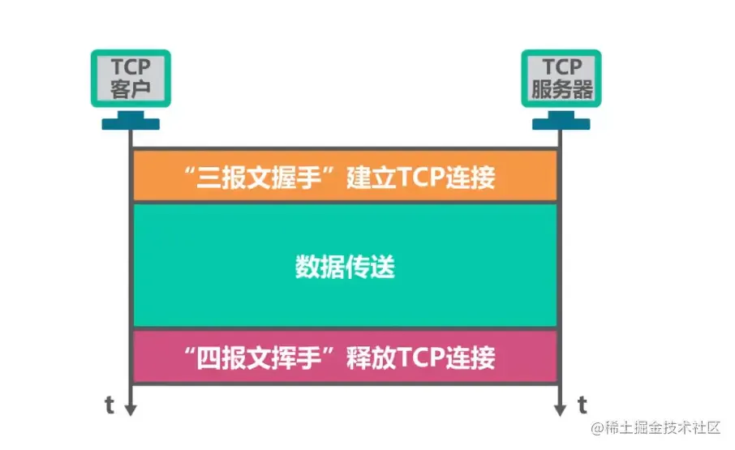
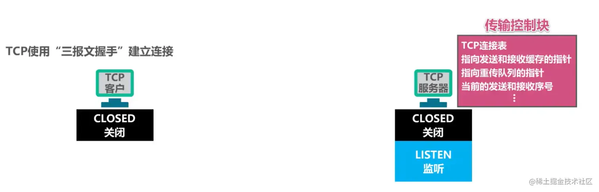
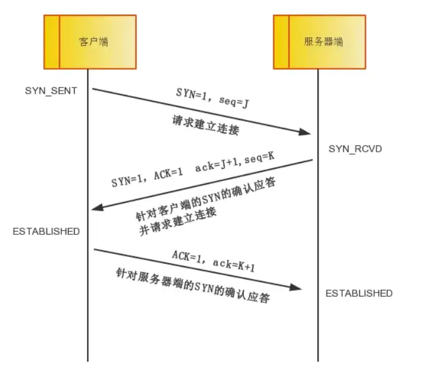
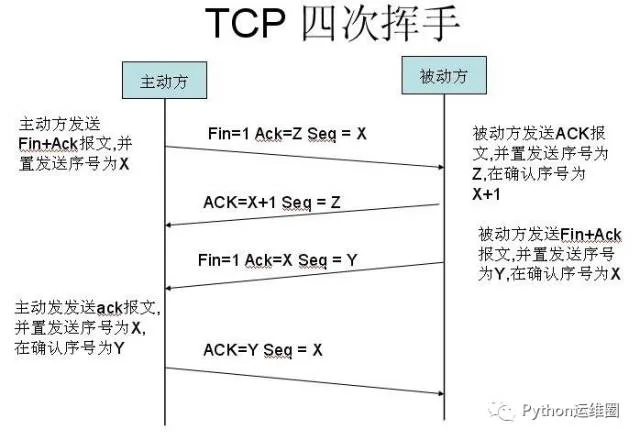

# 三次握手四次挥手

## 目录

- [1、](#1)
- [2、TCP首部格式](#2TCP首部格式)
- [3、TCP的连接建立](#3TCP的连接建立)
- [4、三次握手图文详解](#4三次握手图文详解)
- [5、三次握手文字总结](#5三次握手文字总结)
- [5、是否可以使用“两报文握手”建立连接？](#5是否可以使用两报文握手建立连接)
- [6、两次握手文字总结](#6两次握手文字总结)
- [三次握手](#三次握手)
- [关于四次挥手](#关于四次挥手)
- [为什么要4次挥手？](#为什么要4次挥手)

白话版三次握手和四次挥手

[Websocket 底层是 TCP 还是 UDP？白话版解析 TCP 和 UDP 传输过程 ](<../../websocket/高级/WebSocket传输协议/index.md> "Websocket 底层是 TCP 还是 UDP？白话版解析 TCP 和 UDP 传输过程 ")

## 1、

TCP是什么？

TCP是面向**连接的协议，它基于运输连接来传送TCP报文段**，`TCP`**运输连接的建立和释放，是每一次面向连接的通信中必不可少的过程。**

TCP运输连接有以下三个阶段：

- **建立TCP连接，也就是通过三报文握手来建立TCP连接。**
- **数据传送，也就是基于已建立的TCP连接进行可靠的数据传输。**
- **释放连接，也就是在数据传输结束后，还要通过四报文挥手来释放TCP连接。**

TCP的运输连接管理就是使运输连接的建立和释放都能正常的进行。

## 2、TCP首部格式

**源端口:**   占16比特，写入源端口号，用来 **标识发送该TCP报文段的应用进程。** **目的端口：** 占16比特，写入目的端口号，用来**标识接收该TCP报文段的应用进程。**

**序号:** 占32比特，取值范围\[0,2^32-1]，序号增加到最后一个后，下一个序号就又回到0。**指出本TCP报文段数据载荷的第一个字节的序号。**

**确认号：** 占32比特，取值范围\[0,2^32-1]，确认号增加到最后一个后，下一个确认号就又回到0。指出期望收到对方下一个TCP报文段的数据载荷的第一个字节的序号，同时也是对之前收到的所有数据的确认。若确认号=n，则表明到序号n-1为止的所有数据都已正确接收，期望接收序号为n的数据。

**确认标志位ACK：** 取值为1时确认号字段才有效；取值为0时确认号字段无效。**TCP规定，在连接建立后所有传送的TCP报文段都必须把ACK置1。**

**数据偏移:** 占4比特，并以4字节为单位。用来指出TCP报文段的数据载荷部分的起始处距离TCP报文段的起始处有多远。这个字段实际上是指出了TCP报文段的首部长度。

**窗口：** 占16比特，以字节为单位。**指出发送本报文段的一方的接收窗。**

**同步标志位SYN：** 在TCP连接建立时用来同步序号。**终止标志位FIN：** 用来释放TCP连接。**复位标志位RST：** 用来复位TCP连接。

**推送标志位PSH：** 接收方的TCP收到该标志位为1的报文段会尽快上交应用进程，而不必等到接收缓存都填满后再向上交付。

**校验和：** 占16比特，检查范围包括TCP报文段的首部和数据载荷两部分。在计算校验和时，要在TCP报文段的前面加上12字节的伪首部。

**紧急指针：** 占16比特，以字节为单位，用来指明紧急数据的长度。

**填充：** 由于选项的长度可变，因此使用填充来 **确保报文段首部能被4整除**，(因为数据偏移字段，也就是首部长度字段，是以4字节为单位的)。

## 3、TCP的连接建立

TCP 建立连接的过程叫做**握手**，握手需要在客户和服务器之间交换三个TCP 报文段，称之为**三报文握手**，采用**三报文握手**主要是**为了防止已失效的连接请求报文段突然又传送到了，因而产生错误**。

**TCP的连接建立要解决以下三个问题：**

- 1、使TCP双方能**够确知对方的存在** 。
- 2、使TCP双方**能够协商一些参数（ 最大窗口值是否使用窗口扩大选项和时间戳选项，以及服务质量等）。**
- 3、使TCP双方**能够对运输实体资源（例如缓存大小连接表中的项目等）进行分配。**

## 4、三次握手图文详解

**这是两台要基于TCP进行通信的主机：**

- 主动发起TCP连接建立称为**TCP客户**(client)。
- 被动等待TCP连接建立的应用进程称为**TCP服务器**(server)。

我们可以将TCP建立连接的过程比喻为”握手“，“握手”需要在TCP客户端和服务器之间交换三个TCP报文段。

**最初两端的TCP进程都处于关闭状态。**

**一开始，TCP服务器进程首先创建传输控制块，用来存储TCP连接中的一些重要信息。** 例如TCP连接表、指向发送和接收缓存的指针、指向重传队列的指针，当前的发送和接收序号等。之后就准备接受TCP客户进程的连接请求， 此时TCP服务器进程就要进入监听状态等待TCP客户进程的连接请求。

**TCP客户进程也是首先创建传输控制块，然后再打算建立。**  TCP服务器进程是被动等待来自TCP客户端进程的连接请求，因此称为被动打开连接。

**TCP连接时向TCP服务器进程发送TCP连接请求报文段，并进入同步已发送状态。**

- TCP 连接请求报文段首部中的同步位SYN被设置为1，,表明这是一个tcp连接请求报文段。
- 序号字段seq被设置了一个初始值x作为TCP客户进程所选择的初始序号。

**由于TCP连接建立是由TCP客户进程主动发起的，因此称为主动打开连接。** 请注意TCP规定SYN被设置为1的报文段不能携带数据但要消耗掉一个序号。

**TCP服务器进程收到TCP连接请求报文段后，如果同意建立连接，则向TCP客户进程发送TCP连接请求确认报文段，并进入同步已接收状态。**

- 该报文段首部中的同步位SYN和确认位ACK 都设置为1，表明这是一个TCP连接请求。
- 序号字段seq被设置了一个初始值y，作为TCP服务器进程所选择的初始序号。
- 确认号字段ack的值被设置成了x+1，这是对TCP客户进程所选择的初始序号seq的确认。

请注意这个报文段也不能携带数据，因为它是SYN被设置为一的报文段但同样要消耗掉一个序号。

**TCP客户进程收到TCP连接请求确认报文段后，还要向TCP服务器进程发送一个普通的TCP 确认报文段并进入连接已建立状态。**

- 该报文段首部中的确认位ACK被设置为1，表明这是一个普通的TCP确认报文段 。
- 序号字段seq 被设置为x+1，这是因为TCP客户进程发送的第一个TCP报文段的序号为x，并且不携带数据，因此第二个报文段的序号为x +1。
- 确认号字段ack被设置为y + 1，这是对TCP服务器进程所选择的初始序号的确认。

请注意TCP规定，普通的TCP确认报文段可以携带数据。但如果不携带数据则不消耗序号，在这种情况下所发送的下一个数据报文段的序号仍是x + 1。

**TCP服务器进程收到该确认报文段后也进入连接已建立状态，现在TCP双方都进入了连接已建立状态，他们可以基于已建立好的TCP连接进行可靠的数据传输了。**

## 5、三次握手文字总结

三次握手是 TCP 连接的建立过程。在握手之前，主动打开连接的客户端结束 CLOSE 阶段，被动打开的服务器也结束 CLOSE 阶段，并进入 LISTEN 阶段。随后进入三次握手阶段：

① 首先客户端向服务器发送一个 SYN 包，并等待服务器确认，其中：

- 标志位为 SYN，表示请求建立连接；
- 序号为 Seq = x（x 一般取随机数）；
- 随后客户端进入 SYN-SENT 阶段。

② 服务器接收到客户端发来的 SYN 包后，对该包进行确认后结束 LISTEN 阶段，并返回一段 TCP 报文，其中：

- 标志位为 SYN 和 ACK，表示确认客户端的报文 Seq 序号有效，服务器能正常接收客户端发送的数据，并同意创建新连接；
- 序号为 Seq = y；
- 确认号为 Ack = x + 1，表示收到客户端的序号 Seq 并将其值加 1 作为自己确认号 Ack 的值，随后服务器端进入 SYN-RECV 阶段。

③ 客户端接收到发送的 SYN + ACK 包后，明确了从客户端到服务器的数据传输是正常的，从而结束 SYN-SENT 阶段。并返回最后一段报文。其中：

- 标志位为 ACK，表示确认收到服务器端同意连接的信号；
- 序号为 Seq = x + 1，表示收到服务器端的确认号 Ack，并将其值作为自己的序号值；
- 确认号为 Ack= y + 1，表示收到服务器端序号 seq，并将其值加 1 作为自己的确认号 Ack 的值。
- 随后客户端进入 ESTABLISHED。

当服务器端收到来自客户端确认收到服务器数据的报文后，得知从服务器到客户端的数据传输是正常的，从而结束 SYN-RECV 阶段，进入 ESTABLISHED 阶段，从而完成三次握手。

## 5、是否可以使用“两报文握手”建立连接？

**为什么TCP客户进程最后还要发送一个普通的TCP确认报文段？**

考虑这样一种情况，TCP客户进程发出一个TCP连接请求报文段，但该报文段在某些网络节点长时间滞留了，这必然会造成该报文段的超时重传。

**假设重传的报文段被TCP服务器进程正常接收，TCP服务器进程给TCP客户进程发送一个TCP连接请求确认报文段，并进入连接已建立状态。**

请注意，由于我们改为两报文握手，因此TCP服务器进程发送完TCP连接请求确认报文段后，进入的是连接已建立状态，而不像三报文握手那样进入同步已接收状态，TCP服务器进程并等待TCP客户进程发来针对TCP连接请求确认报文段的普通确认报文段。TCP客户进程收到TCP连接请求确认报文段后进入TCP连接已建立状态，但不会给TCP服务器进程发送针对该报文段的普通确认报文段。

**现在，TCP双方都处于连接已建立状态，他们可以相互传输数据，之后可以通过四报文挥手来释放连接，TCP双方都进入了关闭状态。**

**一段时间后，之前滞留在网络中的那个失效的TCP连接请求报文段到达了TCP服务器进程，TCP 服务器进程会误认为这是TCP客户进程又发起了一个新的TCP连接请求，于是给TCP客户进程发送TCP连接请求确认报文段并进入连接已建立状态。**

该报文段到达TCP客户进程，由于TCP客户进程并没有发起新的TCP连接请求，并且处于关闭状态，因此不会理会该报文段。

但TCP服务器进程已进入了连接已建立状态，他认为新的TCP连接已建立好了，并一直等待TCP客户进程发来数据。**这将白白浪费TCP服务器进程所在主机的很多资源。**

**综上所述，采用三报文握手，而不是两报文握手来建立TCP连接，是为了防止已失效的连接请求报文段突然又传送到了TCP服务器进程因而导致错误。**

***

## 6、两次握手文字总结

**三次握手的主要目的是确认自己和对方的发送和接收都是正常的**，从而保证了双方能够进行可靠通信。若采用两次握手，当第二次握手后就建立连接的话，**此时客户端知道服务器能够正常接收到自己发送的数据，而服务器并不知道客户端是否能够收到自己发送的数据。**

我们知道网络往往是非理想状态的（存在丢包和延迟），当客户端发起创建连接的请求时，如果服务器直接创建了这个连接并返回包含 SYN、ACK 和 Seq 等内容的数据包给客户端，这个数据包因为网络传输的原因丢失了，丢失之后客户端就一直接收不到返回的数据包。由于客户端可能设置了一个超时时间，一段时间后就关闭了连接建立的请求，再重新发起新的请求，而服务器端是不知道的，如果没有第三次握手告诉服务器客户端能否收到服务器传输的数据的话，服务器端的端口就会一直开着，等到客户端因超时重新发出请求时，服务器就会重新开启一个端口连接。长此以往， 这样的端口越来越多，就会造成服务器开销的浪费。作

# 三次握手

TCP，名为传输控制协议，是一种可靠的传输层协议，IP协议号为6。

顺便说一句，原则上任何数据传输都**无法确保绝对可靠**，三次握手只是**确保可靠的基本需要**。

# 关于四次挥手

先由**客户端向服务器端发送一个FIN**，请求关闭数据传输。

当服务器接收到客户端的FIN时，向客户端发送一个ACK，其中ack的值等于FIN+SEQ

然后服务器向客户端发送一个FIN，告诉客户端应用程序关闭。

当客户端收到服务器端的FIN是，回复一个ACK给服务器端。其中ack的值等于FIN+SEQ

# 为什么要4次挥手？

**确保数据能够完整传输**。

当被动方收到主动方的FIN报文通知时，它仅仅表示**主动方没有数据再发送给被动方了**。

但未必**被动方所有的数据都完整的发送给了主动方**，所以**被动方不会马上关闭SOCKET**,它可能还需要发送一些数据给主动方后，

再**发送FIN报文给主动方**，告诉主动方同意关闭连接，所以这里的ACK报文和FIN报文多数情况下都是分开发送的。
