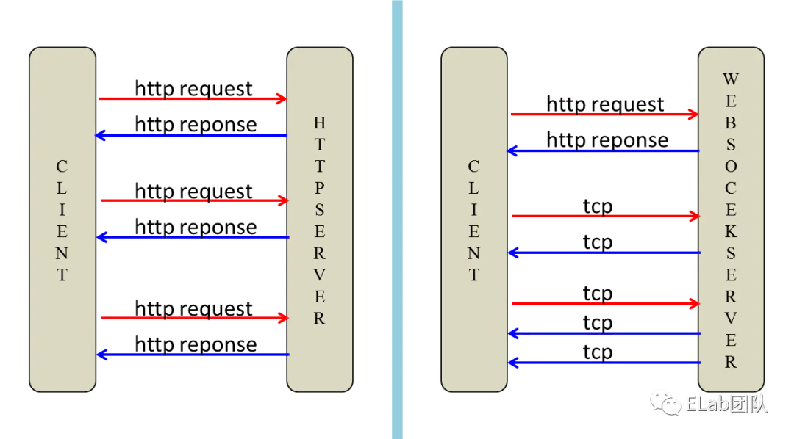

# 原理

## 目录

- [一、首先我们要了解 Websocket 握手的原理](#一首先我们要了解-Websocket-握手的原理)
  - [请求头特征](#请求头特征)
  - [响应头特征](#响应头特征)

# 一、首先我们要了解 Websocket 握手的原理

## 请求头特征

- HTTP 必须是 1.1 GET 请求
- HTTP Header 中 Connection 字段的值必须为 Upgrade
- HTTP Header 中 Upgrade 字段必须为 websocket
- Sec-WebSocket-Key 字段的值是采用 base64 编码的随机 16 字节字符串
- Sec-WebSocket-Protocol 字段的值记录使用的子协议，比如 binary base64
- Origin 表示请求来源

## 响应头特征

- 状态码是 101 表示 Switching Protocols
- Upgrade / Connection / Sec-WebSocket-Protocol 和请求头一致
- Sec-WebSocket-Accept 是通过请求头的 Sec-WebSocket-Key 生成

[短连接轮询、长连接、Websocket 横向对比](<./短连接轮询、长连接、Websocket 横向对比/index.md> "短连接轮询、长连接、Websocket 横向对比")

[一篇文章彻底搞懂websocket协议的原理与应用](./一篇文章彻底搞懂websocket协议的原理与应用/index.md "一篇文章彻底搞懂websocket协议的原理与应用")
