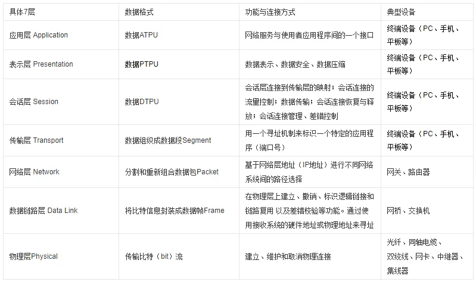
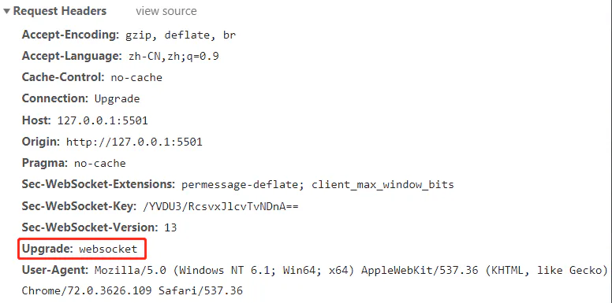

# 全面理解WebSocket与Socket、TCP、HTTP的关系及区别

## 目录

- [1.什么是WebSocket及原理](#1什么是WebSocket及原理)
- [2.理解各种协议和通信层、套接字的含义](#2理解各种协议和通信层套接字的含义)
  - [\*注:什么是单工、半双工、全工通信？](#注什么是单工半双工全工通信)
  - [TCP/UDP区别：](#TCPUDP区别)
  - [标准的七层模型，即OSI（Open System Interconnection）参考模型：](#标准的七层模型即OSIOpen-System-Interconnection参考模型)
- [3.WebSocket和Http的关系和异同点](#3WebSocket和Http的关系和异同点)
- [4.那么为什么说http协议并不是一个持久连接的协议呢？](#4那么为什么说http协议并不是一个持久连接的协议呢)
- [5.WebSocket可以穿越防火墙吗？](#5WebSocket可以穿越防火墙吗)
- [6.WebSocket和Socket](#6WebSocket和Socket)
- [7.WebSocket  HTTP和TCP/IP](#7WebSocket-HTTP和TCPIP)
- [8.Socket和TCP/IP ](#8Socket和TCPIP-)

## **1.什么是WebSocket及原理**

WebSocket是[HTML5](https://so.csdn.net/so/search?q=HTML5\&spm=1001.2101.3001.7020 "HTML5")中新协议、新API。 WebSocket从满足基于Web的日益增长的实时通信需求应运而生，解决了客户端发起多个Http请求到服务器资源浏览器必须要在经过长时间的轮询问题，实现里多路复用，是全双工、双向、单套接字连接，在WebSocket协议下服务器和客户端可以同时发送信息。

原理：

WebSocket 同 HTTP 一样也是应用层的协议，但是它是一种双向[通信协议](https://so.csdn.net/so/search?q=通信协议\&spm=1001.2101.3001.7020 "通信协议")，是建立在 TCP 之上的。

## **2.理解各种协议和通信层、套接字的含义**

IP：网络层协议；（高速公路）

TCP和UDP：传输层协议；（卡车）

HTTP：应用层协议；（货物）。HTTP(超文本传输协议)是建立在TCP协议之上的一种应用。HTTP连接最显著的特点是客户端发送的每次请求都需要服务器回送响应，在请求结束后，会主动释放连接。从建立连接到关闭连接的过程称为“一次连接”。

SOCKET \*\*：**[**套接字**](https://so.csdn.net/so/search?q=套接字\&spm=1001.2101.3001.7020 "套接字")**，TCP/IP网络的API。(港口码头/车站)Socket是应用层与TCP/IP协议族通信的中间软件抽象层，它是一组接口。socket是在应用层和传输层之间的一个抽象层，\*\***它把TCP/IP层复杂的操作抽象为几个简单的接口供应用层调用已实现进程在网络中通信。**

Websocket：**同HTTP一样也是应用层的协议，**但是它是一种双向通信协议，**是建立在TCP之上的**，解决了服务器与客户端全双工通信的问题，包含两部分:一部分是“握手”，一部分是“数据传输”。握手成功后**，数据就直接从 TCP 通道传输，与 HTTP 无关了。**

### \***注:什么是单工、半双工、全工通信？**

数据只能单向传送为单工； &#x20;
数据能双向传送但不能同时双向传送称为半双工； &#x20;
数据能够同时双向传送则称为全双工。

### **TCP/UDP区别：**

TCP（传输控制协议，Transmission Control Protocol）：(类似打电话) &#x20;
面向连接、**传输可靠（保证数据正确性）、有序（保证数据顺序）、传输大量数据（流模式**）、速度慢、对系统资源的要求多，程序结构较复杂， &#x20;
每一条TCP连接只能是点到点的， &#x20;
TCP首部开销20字节。 &#x20;

UDP(用户数据报协议，User Data Protocol)：（类似发短信） &#x20;
面向非连接 、传输不可靠（可能丢包）、无序、传输少量数据（数据报模式）、速度快，对系统资源的要求少，程序结构较简单 ， &#x20;
UDP支持一对一，一对多，多对一和多对多的交互通信， &#x20;
UDP的首部开销小，只有8个字节。

### **标准的七层模型，即OSI（Open System Interconnection）参考模型：**

简化的TCP/IP四层模型主要分为:应用层、传输层、网络层、数据链路层。

## **3.WebSocket和Http的关系和异同点**

每个WebSocket连接都始于一个HTTP请求。 **具体来说，WebSocket协议在第一次握手连接时，通过HTTP协议在传送WebSocket支持的版本号，协议的字版本号，原始地址，主机地址等等一些列字段给服务器端.**

**Upgrade首部，用来把当前的HTTP请求升级到WebSocket协议，** 这是HTTP协议本身的内容，是为了扩展支持其他的通讯协议。**如果服务器支持新的协议，则必须返回101.**

一个`WebSocket`连接是在客户端与服务器之间HTTP协议的初始握手阶段将其升级到Web Socket协议来建立的，**其底层仍是TCP/IP连接**

**相同点：**
（1）都是建立在TCP之上，通过TCP协议来传输数据。
（2）都是可靠性传输协议。
（3）都是应用层协议。

**不同点：**
（1）WebSocket支持持久连接，HTTP不支持持久连接。

（2）WebSocket是双向通信协议，HTTP是单向协议，只能由客户端发起，做不到服务器主动向客户端推送信息。

## 4 **.那么为什么说http协议并不是一个持久连接的协议呢？**

（1）Http的生命周期通过Request来界定，也就是Request一个Response，那么在Http1.0协议中，这次Http请求就结束了。在Http1.1中进行了改进，是的有一个Keep-alive，也就是说，在一个Http连接中，可以发送多个Request，接收多个Response。但是必须记住，在Http中一个Request只能对应有一个Response，而且这个Response是被动的，不能主动发起。

（2）WebSocket是基于Http协议的，或者说借用了Http协议来完成一部分握手，在握手阶段与Http是相同的。

## **5.WebSocket可以穿越防火墙吗？**

`WebSocket`使用标准**的80及443端口，** 这两个都是防火墙友好协议，**Web Sockets使用HTTP Upgrade机制升级到Web Socket协议**。HTML5 Web Sockets有着兼容HTTP的握手机制，因此HTTP服务器可以与WebSocket服务器共享默认的HTTP与HTTPS端（80和443）。

## **6.WebSocket和Socket**

**Socket 其实并不是一个协议，而是为了方便使用 TCP 或 UDP 而抽象出来的一层**，是**位于应用层和传输控制层之间的一组接口。** Socket本身并不是一个协议，**它工作在OSI模型会话层，是一个套接字，TCP/IP网络的API，是为了方便大家直接使用。**

更底层协议而存在的一个抽象层。Socket其实就是一个门面模式，它把复杂的TCP/IP协议族隐藏在Socket接口后面，对用户来说，一组简单的接口就是全部，让Socket去组织数据，以符合指定的协议。 &#x20;

而WebSocket则是一个典型的应用层协议。

## **7.WebSocket  HTTP和TCP/IP**

WebSocket和HTTP一样，都是建立在TCP之上，通过TCP来传输数据。

## **8.Socket和TCP/IP**&#x20;

Socket是对TCP/IP协议的封装，像创建Socket连接时，可以指定使用的传输层协议，Socket可以支持不同的传输层协议(TCP或UDP),当使用TCP协议进行连接时，该Socket连接就是一个TCP连接。
