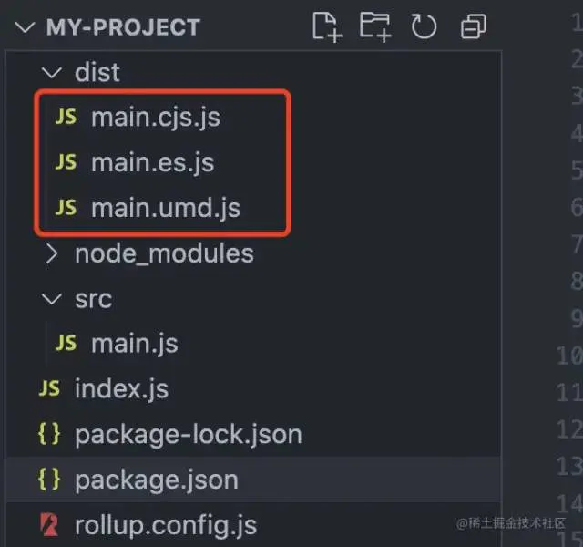

# 工程化插件

## 目录

- [工程化插件](#工程化插件)
  - [打包文件格式说明](#打包文件格式说明)
  - [补充：模块化的发展](#补充模块化的发展)

# 工程化插件

[ 简介 | rollup.js 中文文档 | rollup.js中文网 Rollup 是一个 JavaScript 模块打包器，可以将小块代码编译成大块复杂的代码，Rollup 对代码模块使用新的标准化格式，这些标准都包含在 JavaScript 的 ES6 版本中。 https://www.rollupjs.com/](https://www.rollupjs.com/ " 简介 | rollup.js 中文文档 | rollup.js中文网 Rollup 是一个 JavaScript 模块打包器，可以将小块代码编译成大块复杂的代码，Rollup 对代码模块使用新的标准化格式，这些标准都包含在 JavaScript 的 ES6 版本中。 https://www.rollupjs.com/")

前面讲的插件编写方法已经足够优雅了，但还不够逼格，假设以后会有多人同时开发的情况，仅靠一个**JS**维护大型插件肯定是独木难支，这时候就需要组件化把颗粒度打细，将插件拆分成多个文件，分别负责各自的功能，最终再打包成一个文件引用。

如今**ES**模块化已经可以轻松应对功能拆分了，所以我们只需要一个打包器，**Rollup.js** 就是不错的选择，有了它我们可以更优雅地编写插件，它会帮我们打包。许多大型框架例如 **Vue**、**React** 都是用它打包的。

> Rollup 是一个用于 JavaScript 的模块打包器，它将小段代码编译成更大更复杂的东西，例如库或应用程序。官网链接\[1]

下面我们一步步实现这个工程化的插件，没有那么复杂，先创建一个目录：

```typescript 
//根目录下创建入口文件 index.js，以及 src下的main.js：
mkdir -p my-project/src
npm install --save-dev rollup


// index.js
import main from './src/main.js';
console.log(main);

// src/main.js
export default 'hello world!';

```


根目录下创建 `rollup.config.js`

```typescript 
import babel from 'rollup-plugin-babel'
import commonjs from 'rollup-plugin-commonjs'
import resolve from 'rollup-plugin-node-resolve'

export default {
  input: 'index.js',
  output: [
    {
      file: 'dist/main.umd.js',
      format: 'umd',
      name: 'bundle-name',
    },
    {
      file: 'dist/main.es.js',
      format: 'es',
    },
    {
      file: 'dist/main.cjs.js',
      format: 'cjs',
    },
  ],
  plugins: [
    babel({
      exclude: 'node_modules/**',
    }),
    resolve({
      jsnext: true,
      main: true,
      browser: true,
    }),
    commonjs(),
  ],
}
```


> 稍微解释上面配置的插件：
>
> `babel`：将最终代码编译成 **es5**，我们的开发代码可以不用处理兼容性。
>
> `resolve`、`commonjs`：用于兼容可以依赖 **commonjs** 规范的包。

把上面的依赖安装一下：

```typescript 
npm install --save-dev @babel/core @babel/preset-env rollup-plugin-babel@latest rollup-plugin-node-resolve rollup-plugin-commonjs
```


修改 **package.json**，增加一条脚本命令：

```typescript 
.......
"scripts": {
    ......
    "dev": "rollup -c -w"
},
```


运行 `npm run dev` 看看效果吧



### 打包文件格式说明

1. **umd**

集合了 **CommonJS**、**AMD**、**CMD**、**IIFE** 为一体的打包模式，看看上面的 **hello world** 会被打包成什么：

```typescript 
(function (global, factory) {
    typeof exports === 'object' && typeof module !== 'undefined' ? module.exports = factory() :
    typeof define === 'function' && define.amd ? define(factory) :
    (global = typeof globalThis !== 'undefined' ? globalThis : global || self, global["bundle-name"] = factory());
})(this, (function () { 'use strict';

    .....代码省略.....
    
    return xxxxxxxx;
}));
```


可以看出导出的文件就是我们前面一直使用的**函数自执行**开发方式，其中加了各种兼容判断代码将在哪个环境下导入。

1. **es**

现代JS的标准，导出的文件只能使用 **ES模块化** 方式导入。

1. **cjs**

这个是指 **CommonJS** 规范导出的格式，只可在 **Node** 环境下导入。

## 补充：模块化的发展

- 早期利用**函数自执行**实现，在单独的函数作用域中执行代码（如 JQuery ）
- **AMD**：引入 `require.js` 编写模块化，引用依赖必须提前声明
- **CMD**：引入 `sea.js` 编写模块化，特点是可以动态引入依赖
- **CommonJS**：NodeJs 中的模块化，只在服务端适用，是同步加载
- **ES Modules**：ES6 中新增的模块化，是目前的主流

本文前三种插件编写方式均属于利用函数自执行（**IIFE**）实现的插件，同时在向全局注入插件时兼容了 **CommonJS** 规范，但并未兼容 AMD CMD，是因为目前基本没有项目会使用到这两种模块化。
