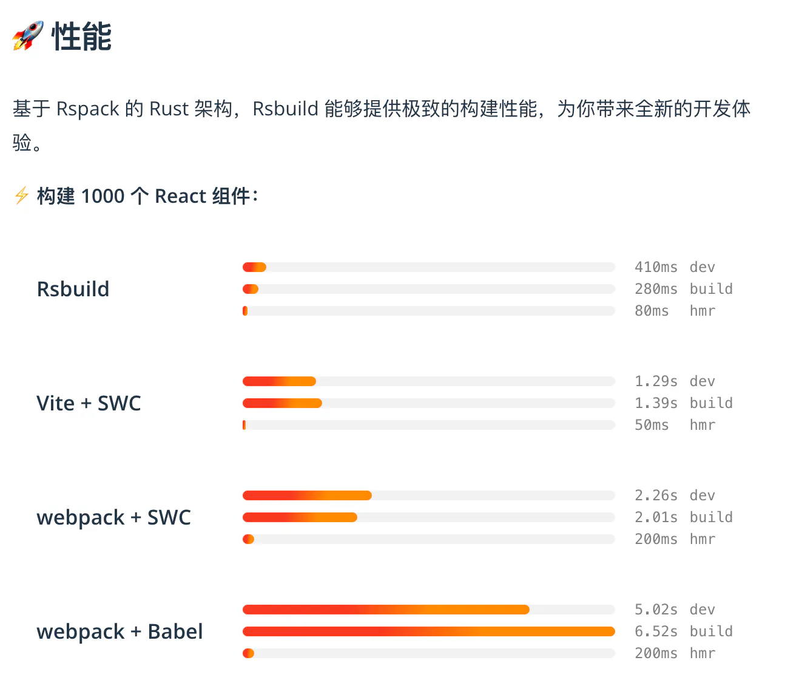

# 介绍

## 目录

- [介绍](#介绍)
  - [对比其他工具](#对比其他工具)
    - [CRA / Vue CLI](#CRA--Vue-CLI)
    - [Vite](#Vite)
  - [#🔥 特性](#-特性)
  - [Rstack](#Rstack)

# 介绍

Rsbuild 是由[**Rspack**](https://rspack.rs/zh/ "Rspack")驱动的高性能构建工具，它默认包含了一套精心设计的构建配置，提供开箱即用的开发体验，并能够充分发挥出 Rspack 的性能优势。

Rsbuild 提供[**丰富的构建功能**](https://rsbuild.rs/zh/guide/start/features "丰富的构建功能")，包括编译 TypeScript、JSX、Sass、Less、CSS Modules、Wasm，以及其他资源，也支持模块联邦、图片压缩、类型检查、PostCSS、Lightning CSS 等功能。

## 对比其他工具

Rsbuild 是与[Vite](https://vitejs.dev/ "Vite")、[Create React App](https://github.com/facebook/create-react-app "Create React App")或[Vue CLI](https://github.com/vuejs/vue-cli "Vue CLI")相似的构建工具，它们都默认包含了开发服务器、命令行工具和合理的构建配置，以此来提供开箱即用的体验。

### CRA / Vue CLI

你可以将 Rsbuild 理解为一个现代化的 Create React App 或 Vue CLI，它与这些工具的主要区别在于：

- 底层的**打包工具由 webpack 替换为 Rspack，** 提供 5 \~ 10 倍的构建性能。
- 与前端 UI 框架解耦，并**通过**[**插件**](https://rsbuild.rs/zh/plugins/list "插件")**来支持**所有 UI 框架，包括 React、Vue、Svelte、Solid 等。
- 提供更好的扩展性，你可以通过[配置](https://rsbuild.rs/zh/config "配置")、[插件 API](https://rsbuild.rs/zh/plugins/dev "插件 API")和[JavaScript API](https://rsbuild.rs/zh/api/start "JavaScript API")来灵活地扩展 Rsbuild。

### Vite

Rsbuild 与 Vite 有许多相似之处，它们皆致力于提升前端的开发体验。其主要区别在于：

- **生产一致性**：Rsbuild 在开发阶段和生产构建均使用 Rspack 进行打包，因此开发和生产构建的产物具备强一致性。而 Vite 在开发阶段使用 ESM 加载模块，这虽然提升了启动速度，但开发和生产构建的产物容易出现不一致。
- **生态兼容性**：**Rsbuild 兼容大部分的 webpack 插件和所有 Rspack 插件**，而 Vite 则是兼容 Rollup 插件。如果你目前更多地使用了 webpack 生态的插件和 loaders，那么迁移到 Rsbuild 会更容易。
- **模块联邦**：Rsbuild 团队与[Module Federation](https://rsbuild.rs/zh/guide/advanced/module-federation "Module Federation")的开发团队密切合作，并为 Module Federation 提供一流的支持，帮助你开发微前端架构的大型 Web 应用。

## [#](https://rsbuild.rs/zh/guide/start/#-特性 "#")🔥 特性

Rsbuild 具备以下特性：

- **易于配置**：Rsbuild 的目标之一，是为 Rspack 用户**提供开箱即用的构建能力，** 使开发者能够在零配置的情况下开发 web 项目。同时，Rsbuild 提供一套语义化的构建配置，以降低 Rspack 配置的学习成本。
- **性能优先**：Rsbuild 集成了社区**中基于 Rust 的高性能工具**，包括[Rspack](https://rspack.rs/ "Rspack")、[SWC](https://swc.rs/ "SWC")和[Lightning CSS](https://lightningcss.dev/ "Lightning CSS")，以提供一流的构建速度和开发体验。
- **插件生态**：Rsbuild **内置一个轻量级的插件系统，提供一系列高质量的官方插件**。此外，Rsbuild **兼容大部分的 webpack 插件**和所有的 Rspack 插件，这意味着你可以在 Rsbuild 中使用社区或公司内现有的插件，而无须重写相关代码。
- **产物稳定**：Rsbuild 设计时充分考虑了构建产物的稳定性，**它的开发和生产构建产物具备较强的一致性**，并自动完成语法降级和 polyfill 注入。Rsbuild 也提供插件来进行类型检查和产物语法检查，以避免线上代码的质量问题和兼容性问题。
- **框架无关**：Rsbuild 不与前端 UI 框架耦合，并通过插件来支持 React、Vue、Svelte、Solid、Preact 等框架，未来也计划支持社区中更多的 UI 框架。

## Rstack

Rstack 是一个**围绕 Rspack 打造的 JavaScript 统一工具链，** 具有优秀的性能和一致的架构。

Rstack 包含以下工具：

| 名称                                                                   | 描述      |
| -------------------------------------------------------------------- | ------- |
| \[Rspack]\(<https://github.com/web-infra-dev/rspack> "Rspack")       | 打包工具    |
| \[Rsbuild]\(<https://github.com/web-infra-dev/rsbuild> "Rsbuild")    | 构建工具    |
| \[Rslib]\(<https://github.com/web-infra-dev/rslib> "Rslib")          | 库开发工具   |
| \[Rspress]\(<https://github.com/web-infra-dev/rspress> "Rspress")    | 静态站点生成器 |
| \[Rsdoctor]\(<https://github.com/web-infra-dev/rsdoctor> "Rsdoctor") | 构建分析工具  |
| \[Rstest]\(<https://github.com/web-infra-dev/rstest> "Rstest")       | 测试框架    |
