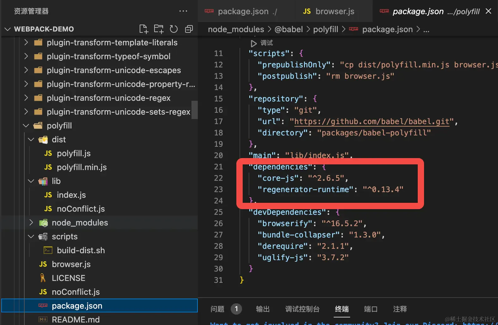
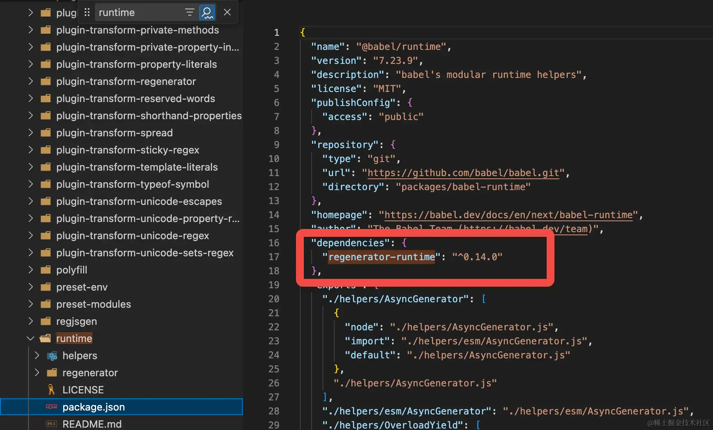

# @babel/polyfill

从 `Babel` 7.4.0 开始，这个包已经被弃用，取而代之的是直接包含 `core-js/stable`

在本地 node\_module 中，可以看到 `@babel/polyfill` 的依赖包含了 core-js 和 regenerator-runtime，可以认为 `polyfill` 本身就是 core-js + regenerator-runtime。

从 `Babel` 7.4.0 开始，我们需要用 `core-js` 替代 `babel-polyfill`,而 `regenerator-runtime` 会在安装 `@babel/runtime` 时被依赖安装，因此不用额外安装。
