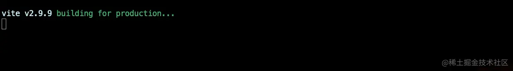
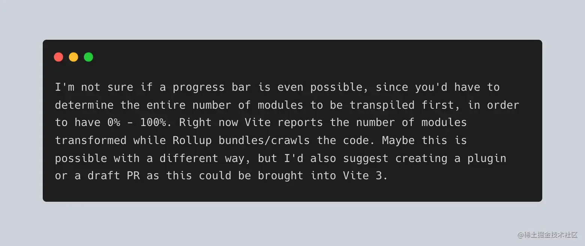
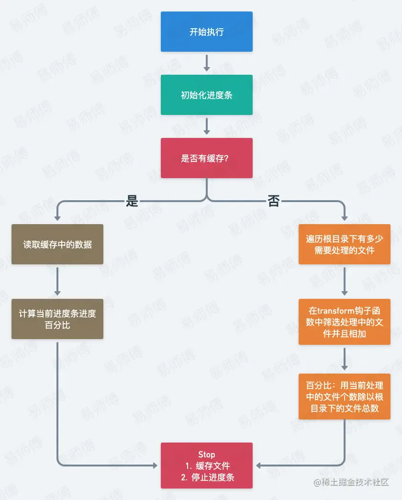

# 打包进度条

## 目录

- [介绍](#介绍)
- [用法](#用法)
- [实现思路](#实现思路)
  - [第一次打包（模拟模块总数）](#第一次打包模拟模块总数)
  - [与进度条配合](#与进度条配合)
  - [添加缓存](#添加缓存)
  - [使用缓存](#使用缓存)
  - [实现架构图](#实现架构图)
- [源码](#源码)
  - [index](#index)
  - [cache](#cache)

# 介绍

[vite-plugin-progress](https://link.juejin.cn/?target=https://github.com/jeddygong/vite-plugin-progress "vite-plugin-progress") 插件是一个在打包时展示进度条的插件，如果您觉得该插件对您的项目有帮助，欢迎 **star ⭐️ 支持一下**，感谢！



# 用法

1. **安装**

```typescript 
 # npm
 npm i vite-plugin-progress -D 

 # yarn 
 yarn add vite-plugin-progress -D

 # pnpm 
 pnpm i vite-plugin-progress -D
```


1. **使用（不带参数）**：在 `vite.config.js / vite.config.ts` 中配置

```typescript 
 import progress from 'vite-plugin-progress'

 export default {
   plugins: [
     progress()
   ]
 }
```


1. **参数 0ptions**：

- `format` ：自定义进度条的格式；
- `width` ：进度条在终端中的宽度；
- `complete` ：完成后的默认字符 `\u2588` ；
- `incomplete` ：未完成的默认字符 `\u2591` ；
- `renderThrottle` ：间隔更新时间默认16（毫秒）；
- `clear` ：完成后是否清除终端，默认 false；
- `callback` ：完成后执行的回调函数；
- `stream` 终端中的输出格式流，默认 `stderr` ；
- `head` ：进度条的头字符；

1. 参数 options 中的 `format` 中各个标记含义：

- `:bar` ：代表进度条；
- `:current` ：当前执行到哪的刻度；
- `:total` ：总刻度；
- `:elapsed` ：所用时间（秒）；
- `:percent` ：完成的百分比；
- `:eta` ：预计完成时间（秒）；
- `:rate` ：每一秒的速率；

1. **使用（带参数）**：

```typescript 
// vite.config.js / vite.config.ts
import progress from 'vite-plugin-progress'

export default {
  plugins: [
    progress({
        format: 'building [:bar] :percent',
        total: 200,
        width: 60,
        complete: '=',
        incomplete: '',
    })
  ]
}
```


1. **给自定义进度条加点颜色**：

安装 `picocolors` ：

```typescript 
 pnpm i picocolors -D
```


使用：

```typescript 
 // vite.config.js / vite.config.ts
 import progress from 'vite-plugin-progress'
 import colors from 'picocolors'

 export default {
   plugins: [
     progress({
         format:  `${colors.green(colors.bold('Bouilding'))} ${colors.cyan('[:bar]')} :percent`
     })
   ]
 }
```


如果您只想使用该插件的话，那么现在就去**安装使用**吧！

如果您对实现思路感兴趣的话，那么您可以继续向下滚动查阅哟 \~

# 实现思路

其实实现这个功能，我们最主要的考虑就是当前 vite 打包的进度到哪里了，那么我们思考两个问题：

1. 考量当前 vite 打包的进度是到哪里了？
2. 如何知道当前打包的进度？

熟悉 `webpack` 的朋友，肯定对 webpack 的打包进度条也不陌生；会发现在 webpack 中，webpack 暴露了一个 `webpack.ProgressPlugin` 的事件钩子，这样就导致在 webpack 中实现进度条会很容易，直接通过该钩子去封装即可；

但是在 vite 中由于是基于 `Rollup` 来构建打包代码，所以我们是没法知道当前 vite 打包进度的；

借用 vite 其中某位作者的原话：



`简单理解意思就是说在 vite 打包时，是没法知道进度条的 0%-100%，因为您必须先确定要构建的模块的总数`

虽然我们不知道模块总数，但是我们可以在第一次打包时模拟一个；

并且在第一次打包的时候，我们 `记录下对应的模块数量`，然后 `缓存起来`，这样我们不就可以知道对应的模块数量了吗?

说干就干 \~

## 第一次打包（模拟模块总数）

因为我们可以知道 `src 目录` 下所有的文件总数，所以就可以假设在第一次打包时用该总数来代替模块总数；

那么简单公式：**进度条百分比 = 当前转换的模块 / 模拟的模块总数**

```typescript 
import type { PluginOption } from 'vite';
import rd from 'rd';

export default function viteProgressBar(options?: PluginOptions): PluginOption {
    // 文件类型总数
    let fileCount = 0
    let transformCount = 0
    let transformed = 0 // 当前已转换的数量
    retun {
        ...  
  config(config, { command }) {      
            if (command === 'build') {
    const readDir = rd.readSync('src');
                const reg = /\.(vue|ts|js|jsx|tsx|css|scss||sass|styl|less)$/gi;
                readDir.forEach((item) => reg.test(item) && fileCount++);
            }
  },

  transform(code, id) {      
            transformCount++
            const reg = /node_modules/gi;
            if (!reg.test(id){
    percent = +(transformed / fileCount).toFixed(2)      
            }
  }
    }
}
```


## 与进度条配合

那么既然我们已经算出了基本的进度条，也知道了基本思路，那么我们就把进度条加进去

```typescript 
import type { PluginOption } from 'vite';
import progress from 'progress';
import rd from 'rd';

export default function viteProgressBar(options?: PluginOptions): PluginOption {
    let fileCount = 0  // 文件类型总数
    let transformCount = 0 // 转换的模块总数
    let transformed = 0 // 当前已转换的数量
    let lastPercent = 0； // 记录上一次进度条百分比
    const bar: progress;
    retun {
  ...      
        config(config, { command }) {    
            if (command === 'build') {    
    // 初始化进度条
    options = {
                    width: 40,
                    complete: '\u2588',
                    incomplete: '\u2591',
                    ...options
                };
                options.total = options?.total || 100;

                 const transforming = isExists ? `${colors.magenta('Transforms:')} :transformCur/:transformTotal | ` : ''
                const chunks = isExists ? `${colors.magenta('Chunks:')} :chunkCur/:chunkTotal | ` : ''
                const barText = `${colors.cyan(`[:bar]`)}`

                const barFormat =
                    options.format ||
                   `${colors.green('Bouilding')} ${barText} :percent | ${transforming}${chunks}Time: :elapseds`

                delete options.format;
                bar = new progress(barFormat, options as ProgressBar.ProgressBarOptions);         

                                    // 统计目录下的文件总数
                const readDir = rd.readSync('src');
                const reg = /\.(vue|ts|js|jsx|tsx|css|scss||sass|styl|less)$/gi;
                readDir.forEach((item) => reg.test(item) && fileCount++);
            }  
        },

  transform(code, id) {
            transformCount++
            const reg = /node_modules/gi;
            if (!reg.test(id){
                 lastPercent = percent = +(transformed / fileCount).toFixed(2)
            }
            // 更新进度条
            bar.update(lastPercent, {
                transformTotal: cacheTransformCount,
                transformCur: transformCount,
                chunkTotal: cacheChunkCount,
                chunkCur: 0,
            })  
        },
  closeBundle() {    
            // close progress
            bar.update(1)
            bar.terminate()
  }
    }
}
```


## 添加缓存

为了更准确的知道打包的进度，那么我们在第一次模拟了总数的时候，也要同时把真实的模块总数给缓存起来，这样在下一次打包时才能更加准确的计算出进度条；

新增缓存文件 `cache.ts`

```typescript 
import fs from 'fs';
import path from 'path';

const dirPath = path.join(process.cwd(), 'node_modules', '.progress');
const filePath = path.join(dirPath, 'index.json');

export interface ICacheData {
    /**
     * 转换的模块总数
     */
    cacheTransformCount: number;

    /**
     * chunk 的总数
     */
    cacheChunkCount: number
}

/**
 * 判断是否有缓存
 * @return boolean
 */
export const isExists = fs.existsSync(filePath) || false;

/**
 * 获取缓存数据
 * @returns ICacheData
 */
export const getCacheData = (): ICacheData => {
    if (!isExists) return {
        cacheTransformCount: 0,
        cacheChunkCount: 0
    };

    return JSON.parse(fs.readFileSync(filePath, 'utf8'));
};

/**
 * 设置缓存数据
 * @returns 
 */
export const setCacheData = (data: ICacheData) => {
    !isExists && fs.mkdirSync(dirPath);
    fs.writeFileSync(filePath, JSON.stringify(data));
};
```


## 使用缓存

```typescript 
// 缓存进度条计算
function runCachedData() {
    if (transformCount === 1) {
        stream.write('\n');
            
        bar.tick({
            transformTotal: cacheTransformCount,
            transformCur: transformCount,
            chunkTotal: cacheChunkCount,
            chunkCur: 0,
        })
    }

    transformed++        
    percent = lastPercent = +(transformed / (cacheTransformCount + cacheChunkCount)).toFixed(2)
}
```


## 实现架构图



# 源码

#### index

```typescript 
import type { PluginOption } from 'vite';
import colors from 'picocolors';
import progress from 'progress';
import rd from 'rd';
import { isExists, getCacheData, setCacheData } from './cache';

interface PluginOptions {
    /**
     * total number of ticks to complete
     * @default 100
     */
    total?: number;
    /**
     * The format of the progress bar
     */
    format?: string;

    /**
     * The src directory of the build files
     */
    srcDir?: string;

    /**
     * current completed index
     */
    curr?: number | undefined;

    /**
     * head character defaulting to complete character
     */
    head?: string | undefined;

    /**
     * The displayed width of the progress bar defaulting to total.
     */
    width?: number | undefined;

    /**
     * minimum time between updates in milliseconds defaulting to 16
     */
    renderThrottle?: number | undefined;

    /**
     * The output stream defaulting to stderr.
     */
    stream?: NodeJS.WritableStream | undefined;

    /**
     * Completion character defaulting to "=".
     */
    complete?: string | undefined;

    /**
     * Incomplete character defaulting to "-".
     */
    incomplete?: string | undefined;

    /**
     * Option to clear the bar on completion defaulting to false.
     */
    clear?: boolean | undefined;

    /**
     * Optional function to call when the progress bar completes.
     */
    // eslint-disable-next-line @typescript-eslint/ban-types
    callback?: Function | undefined;
}

export default function viteProgressBar(options?: PluginOptions): PluginOption {

     const { cacheTransformCount, cacheChunkCount } = getCacheData()
 
    let bar: progress;
     const stream = options?.stream || process.stderr;
     let outDir: string;
    let transformCount = 0
    let chunkCount = 0
    let transformed = 0
    let fileCount = 0
    let lastPercent = 0
    let percent = 0
    let errInfo;

    return {
        name: 'vite-plugin-progress',
        enforce: 'pre',
        apply: 'build',

        config(config, { command }) {
            if (command === 'build') {
                config.logLevel = 'silent';
                outDir = config.build?.outDir || 'dist';

                options = {
                    width: 40,
                    complete: '\u2588',
                    incomplete: '\u2591',
                    ...options
                };
                options.total = options?.total || 100;

                 const transforming = isExists ? `${colors.magenta('Transforms:')} :transformCur/:transformTotal | ` : ''
                const chunks = isExists ? `${colors.magenta('Chunks:')} :chunkCur/:chunkTotal | ` : ''
                const barText = `${colors.cyan(`[:bar]`)}`

                const barFormat =
                    options.format ||
                    `${colors.green('Building')} ${barText} :percent | ${transforming}${chunks}Time: :elapseds`

                delete options.format;
                bar = new progress(barFormat, options as ProgressBar.ProgressBarOptions);
 
                // not cache: Loop files in src directory
                if (!isExists) {
                    const readDir = rd.readSync(options.srcDir || 'src');
                    const reg = /\.(vue|ts|js|jsx|tsx|css|scss||sass|styl|less)$/gi;
                    readDir.forEach((item) => reg.test(item) && fileCount++);
                }
            }
        },

        transform(code, id) {
            transformCount++

            // not cache
            if (!isExists) {
                const reg = /node_modules/gi;

                if (!reg.test(id) && percent < 0.25) {
                    transformed++
                    percent = +(transformed / (fileCount * 2)).toFixed(2)
                    percent < 0.8 && (lastPercent = percent)
                }

                if (percent >= 0.25 && lastPercent <= 0.65) {
                    lastPercent = +(lastPercent + 0.001).toFixed(4)
                }
            }

            // go cache
            if (isExists) runCachedData()

            bar.update(lastPercent, {
                transformTotal: cacheTransformCount,
                transformCur: transformCount,
                chunkTotal: cacheChunkCount,
                chunkCur: 0,
            })

            return {
                code,
                map: null
            };
        },

        renderChunk() {
            chunkCount++

            if (lastPercent <= 0.95)
                isExists ? runCachedData() : (lastPercent = +(lastPercent + 0.005).toFixed(4))

            bar.update(lastPercent, {
                transformTotal: cacheTransformCount,
                transformCur: transformCount,
                chunkTotal: cacheChunkCount,
                chunkCur: chunkCount,
            })

            return null
        },

        // catch error info
        buildEnd(err) {
            errInfo = err;
        },

        // build completed
        closeBundle() {
            if (!errInfo) {
                // close progress
                bar.update(1)
                bar.terminate()

                // set cache data
                 setCacheData({
                    cacheTransformCount: transformCount,
                    cacheChunkCount: chunkCount,
                })
 
                // out successful message
                stream.write(
                    `${colors.cyan(colors.bold(`Build successful. Please see ${outDir} directory`))}`
                );
                stream.write('\n');
                stream.write('\n');
            } else {
                // out failed message
                 stream.write('\n');
                stream.write(
                    `${colors.red(colors.bold(`Build failed. Please check the error message`))}`
                );
                stream.write('\n');
                stream.write('\n');
             }

        }
    };

    /**
     * run cache data of progress
     */
    function runCachedData() {

        if (transformCount === 1) {
            stream.write('\n');

            bar.tick({
                transformTotal: cacheTransformCount,
                transformCur: transformCount,
                chunkTotal: cacheChunkCount,
                chunkCur: 0,
            })
        }

        transformed++
        percent = lastPercent = +(transformed / (cacheTransformCount + cacheChunkCount)).toFixed(4)
    }
}
```


#### cache

```typescript 
import fs from 'fs';
import path from 'path';

 const dirPath = path.join(process.cwd(), 'node_modules', '.progress');
const filePath = path.join(dirPath, 'index.json');
 
export interface ICacheData {
    /**
     * Transform all count
     */
    cacheTransformCount: number;

    /**
     * chunk all count
     */
    cacheChunkCount: number
}

/**
 * It has been cached
 * @return boolean
 */
export const isExists =  fs.existsSync(filePath ) || false;

/**
 * Get cached data
 * @returns ICacheData
 */
export const getCacheData = (): ICacheData => {
    if (!isExists) return {
        cacheTransformCount: 0,
        cacheChunkCount: 0
    };

    return JSON.parse(fs.readFileSync(filePath, 'utf8'));
};

/**
 * Set the data to be cached
 * @returns 
 */
export const setCacheData = (data: ICacheData) => {
    ! isExists && fs.mkdirSync(dirPath);
      fs.writeFileSync(filePath, JSON.stringify(data));
 };
```
