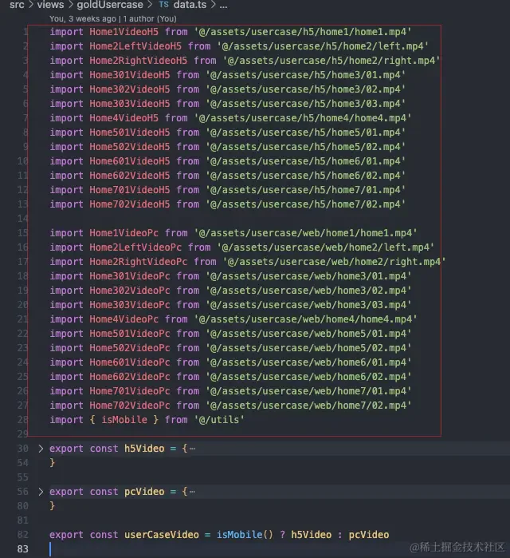
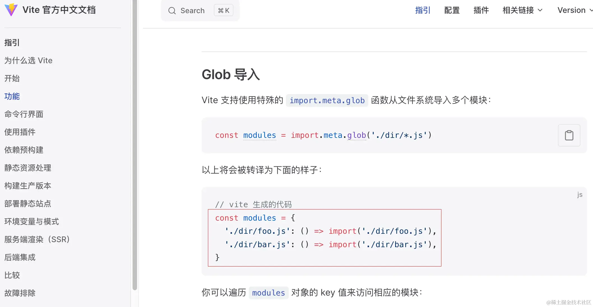
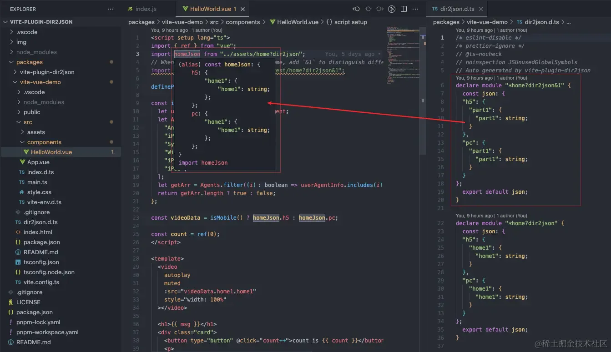
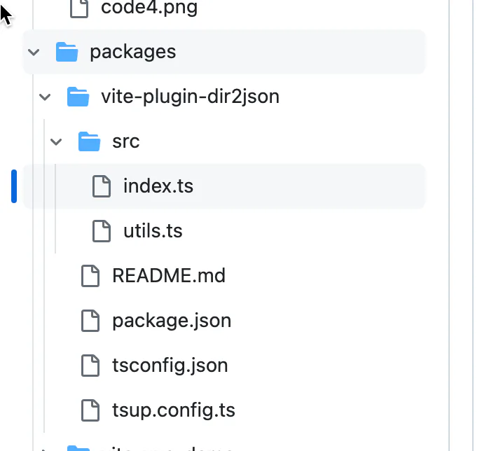

# 重复工作自动化

## 目录

- [背景](#背景)
- [实现](#实现)
  - [功能](#功能)
    - [1. 区分入口，解析路径](#1-区分入口解析路径)
    - [2. 根据路径解析出json数据，返回虚拟模块字符串](#2-根据路径解析出json数据返回虚拟模块字符串)
  - [typescript支持](#typescript支持)
- [踩坑](#踩坑)
  - [虚拟模块格式](#虚拟模块格式)
  - [组装虚拟模块字符串](#组装虚拟模块字符串)
  - [dts 文件生成](#dts-文件生成)
- [赏个star吧⭐️](#赏个star吧️)
- [参考](#参考)
- [源码](#源码)

[   https://cn.vitejs.dev/guide/api-plugin.html#universal-hooks](https://cn.vitejs.dev/guide/api-plugin.html#universal-hooks "   https://cn.vitejs.dev/guide/api-plugin.html#universal-hooks")

> 本插件已收录到vite官方仓库 [awesome-vite](https://link.juejin.cn/?target=https://github.com/vitejs/awesome-vite?tab=readme-ov-file#loaders "awesome-vite")项目中👏👏👏🥳

> 本插件也已发布npm包，并开源到github（[vite-plugin-dir2json](https://link.juejin.cn/?target=https://github.com/buddywang/vite-plugin-dir2json "vite-plugin-dir2json")），给star的都是帅哥美女，不给也是🫵

# 背景

经常做那些需要适配h5和pc端的页面的同学都知道，静态资源通常需要分两套，h5一套，pc一套

比如一个视频，pc上用的可能是1920 × 1080分辨率的，但考虑到文件大小和移动端网速一般差于pc情况，h5上可能用的是750 × 450分辨率的

那资源一多时，代码里就会有一堆 `import`，如下：



手动维护起来比较烦，凭着**重复的工作自动化**的精神，于是找下有没有简单方便的做法

- 首先看到vite提供的 [Glob 导入](https://link.juejin.cn/?target=https://cn.vitejs.dev/guide/features.html#glob-import "Glob 导入")，但看了下结果，不太适合



- 刚好不久前研究了vite，冒出了写个插件的想法，先来看看最终效果：

对于以下结构的目录

```javascript 
home
├── h5
│   └── home1
│       └── home1.mp4
└── pc
    └── home1
        └── home1.mp4

```


使用插件可以这么写:

```javascript 
// ...
import homeJson from "/path/to/home?dir2json";

console.log(homeJson);
// {
//   h5: {
//     home1: {
//       home1: "/src/assets/home/h5/home1/home1.mp4",
//     },
//   },
//   pc: {
//     home1: {
//       home1: "/src/assets/home/pc/home1/home1.mp4",
//     },
//   },
// };

export const homeVideo = isMobile() ? homeJson.h5 : homeJson.pc

```


还提供正确的ts类型提示，如下：


# 实现

## 功能

首先抛开一切，这个插件需要做的事情就是：**输入一个目录路径**，然后**读取这个目录及子目录下所有支持文件的路径信息**，并按目录结构组**装成json数据返回**。

把上面功能看作一个函数的话，用nodejs实现轻轻松松；但如果要做成vite插件的话，就要了解[vite的插件工作流程](https://link.juejin.cn?target=https://cn.vitejs.dev/guide/api-plugin.html "vite的插件工作流程")，了解上面的每一步要怎么做，实际上就是**了解哪些hook能提供我所要的信息，我能在哪些hook里实现这个功能**。

> 不太熟悉vite开发服务、插件系统的同学可以看我[上篇文章](https://juejin.cn/post/7355431482687619123#heading-6 "上篇文章")，先有个大概了解，下面摘取部分:
> vite整体工作流水线，主体大概就是
> 1.起一个 开发-服务器（就是一个简单的服务器，想一下express demo，能接收请求，**自定义**返回），然后根据浏览器的请求信息(定好的格式)开始 -> 2.（解析路径resolve、加载文件 load、代码转译transform）（完全可控） ->
> 2.返回处理结果（浏览器支持的es6模块/资源，不要被文件后缀名迷惑，浏览器是根据Content-Type响应头（可控）来处理响应的）；

具体思路步骤如下：

### 1. 区分入口，解析路径

在[resolveId hook](https://link.juejin.cn/?target=https://rollupjs.org/plugin-development/#resolveid "resolveId hook")里，通过路径查询参数（有`dir2json`的）区分入口，并解析出绝对路径，简要逻辑如下：

```javascript 
// ...
resolveId: {
  order: "post",
  async handler(source: string, importer: string | undefined) {
    if (source.includes("?dir2json")) {
      // resolve
      let absolutePath;

      absolutePath = path.join(path.dirname(importer || ""), source);

      return absolutePath;
    }
    return null; // other
  },
},
// ...

```


### 2. 根据路径解析出json数据，返回虚拟模块字符串

在[load hook](https://link.juejin.cn/?target=https://rollupjs.org/plugin-development/#load "load hook")里，根据目录路径解析得到json数据，返回一个导出json数据的[虚拟模块](https://link.juejin.cn/?target=https://cn.vitejs.dev/guide/api-plugin.html#virtual-modules-convention "虚拟模块")，简要代码如下：

```javascript 
// ...
async load(id: string) {
  if (id.includes("?dir2json")) {
    const dirPath = id.split("?").shift()!;

    // 递归遍历目录文件，解析得到json数据
    const res = {};
    let importStr = "";
    await traverseDir(dirPath, (filePath, rootDirPath) => {
      if (
        isSupportExt(/** ... */)
      ) {
        // 组装import 语句
        // ...

        // 组装json
        // ...
      }
    });

    // return code string
    const finalDataCode = toStr(res); // toStr把json对象变成js code字符串
    let code = `${importStr} 
export default ${finalDataCode}`;

    return code;
  }

  return null; // other
},
// ...

```


最终返回如下：


## typescript支持

要提供ts类型提示，就要**生成对应的全局类型声明**，因为最终的`json`对象可以在上一步计算得出，那简单点 `typeof jsonObject` 就能得到对应的ts接口类型，这是其一方法；这里我用的是根据`json`对象字符串直接生成类型接口字符串，结果如下（右边`dir2json.d.ts`文件自动生成）：



简要实现如下：

```javascript 
async load(id: string) {
    // ...
    
    // 配置了options.dts
    if (!!dts) {
      const moduleTag = id.split(path.sep).pop()!;
      // 收集要生成的类型信息，模块名
      dtsContext[moduleTag] = {
        moduleTag,
        dataCode,
      };

      // 生成 dts 文件内容字符串
      let str = dtsFileHeader;
      const dtsContent = Object.values(dtsContext);
      dtsContent.forEach((item) => {
        // ...  
        const dataInterface = item.dataCode.replaceAll(reg, "string;");
        str += `
declare module "*${item.moduleTag}" {
const json: ${dataInterface};
export default json;
}
`;
      });
      
      // ...
      // 更新 dts 文件
      writeFile(dtsFilePath, str);
    }
}

```


# 踩坑

## 虚拟模块格式

一开始我是打算直接组装返回类似以下格式的虚拟模块：

```javascript 
export default {
  h5: {
    home1: {
      home1: "/src/assets/home/h5/home1/home1.mp4",
    },
  },
  pc: {
    home1: {
      home1: "/src/assets/home/pc/home1/home1.mp4",
    },
  },
};

```


开发环境可以访问资源没问题，但构建的结果还是上面的路径，这就有问题了，因为vite构建时会追踪 import 语句中的路径，把对应的静态资源拷贝到输出目录并生成hash文件名，但上面的路径写在json数据里了，所以对应的文件不会被vite构建识别处理。

所以需要生成import语句，返回类似下面的虚拟模块：

```javascript 
import xxx from "/src/assets/home/h5/home1/home1.mp4"
import bbb from "/src/assets/home/pc/home1/home1.mp4"

export default {
  h5: {
    home1: {
      home1: xxx,
    },
  },
  pc: {
    home1: {
      home1: bbb,
    },
  },
};

```


## 组装虚拟模块字符串

这里有两个问题要处理

1. 导入变量名得唯一：这里我用文件路径名处理下作为变量名，比如`_src_assets_home_h5_home1_home1_mp4`

```javascript 
// ...
// 导入变量名
const importVarName = absolutePath
    .replaceAll(path.sep, "_")
    .replace(".", "_");
importStr += `import ${importVarName} from "${absolutePath}";`;
// ...

```


1. 组装 export default 语句时，json数据被stringify处理后，会带上引号，例如上面`home1: xxx`会变成`"home1": "xxx"`，这样其他文件拿到的json数据里的路径信息就是变量名'xxx'而不是实际的路径。这里我在组装json数据时额外添加一些标记，到最后再识别出标记，连随引号去除即可：

```javascript 
async load(id: string) {
    // ...
    
    // 增加 replaceTag， 最后code字符串去除变量的“ ”字符
    res[getFileNameNotExt(name)] = `${replaceTag}${importVarName}${replaceTag}`;
                                     ^^^^^^^^^^^^                 ^^^^^^^^^^^^
    // ...

    // 组装成json格式返回
    const dataCode = `${JSON.stringify(res, null, "  ")}`;
    const finalDataCode = dataCode
      .replaceAll(`"${replaceTag}`, "")
                   ^^^^^^^^^^^^^^^ 
      .replaceAll(`${replaceTag}"`, "");
                   ^^^^^^^^^^^^^^^ 
    let code = `${importStr} 
export default ${finalDataCode}`;

    return code;
}

```


## dts 文件生成

dts文件生成/更新时机是用户保存修改后，新增的`?dir2json`导入，会经过load hook然后被识别处理。

但正常情况下，一开始只有 `import xxxJson from 'xxx?dir2json'` 语句，`xxxJson`还没使用的情况下，保存修改时， `xxxJson` 会被tree-shaking机制去掉，这就导致浏览器实际接收的的文件内容里没有 `import xxxJson from 'xxx?dir2json'` 语句，也就不会触发 `xxx?dir2json` 模块的类型声明生成。这里想要用户在保存后触发 `xxx?dir2json` 模块的类型声明生成，就得让 `xxxJson` 被使用，防止被tree-shaking掉。

于是我在`transform hook`里识别出 `import xxxJson from 'xxx?dir2json'` 这样的导入语句，并增加`sideEffectCode`（使用`xxxJson`变量），这就避免了被tree-shaking掉，如下：

```javascript 
//...
    transform: {
      order: "pre",
      handler(code) {
        // Add sideEffectCode in files using dir2json-import to avoid tree-shaking in development mode
        // For dts files generated in development mode
        if (mode == "development" && !!dts && code.includes("?dir2json")) {
          // 正则匹配出`import xxxJson from 'xxx?dir2json'` 这样的导入语句
          const dir2jsonImportList = [
            ...code.matchAll(/import\s(.*?)\sfrom.*?dir2json.*?;/g), 
          ];

          const importNameList = dir2jsonImportList.map((item) => item[1]);
          // 生成并增加sideEffectCode，并加在最后一个import 语句后面
          const sideEffectCode = `\nwindow.dir2jsonSideEffect = [${importNameList.join(
            ","
          )}];`;
          const last = dir2jsonImportList[dir2jsonImportList.length - 1];
          code = code.replace(last[0], `${last[0]}${sideEffectCode}`);
        }
        return { code };
      },
    },
   //...

```


# 赏个star吧⭐️

全部代码可以查看[这里](https://link.juejin.cn?target=https://github.com/buddywang/vite-plugin-dir2json "这里")，另外本插件也已发布npm包，并开源到github（[vite-plugin-dir2json](https://link.juejin.cn?target=https://github.com/buddywang/vite-plugin-dir2json "vite-plugin-dir2json")），跪求各位帅哥美女 star🙏

# 参考

- [灵感来源（适配pc和移动端）](https://link.juejin.cn?target=https://sensethings.sensetime.com/goldUsercase "灵感来源（适配pc和移动端）")
- [vite插件官方文档](https://link.juejin.cn?target=https://cn.vitejs.dev/guide/api-plugin "vite插件官方文档")
- [rollup官方文档](https://link.juejin.cn?target=https://rollupjs.org/plugin-development/ "rollup官方文档")
- ts支持实现参考 [unplugin-auto-import](https://link.juejin.cn?target=https://github.com/unplugin/unplugin-auto-import "unplugin-auto-import")

# 源码



```javascript 
import { existsSync } from "node:fs";
import path from "path";
import { writeFile } from "node:fs/promises";
import type { ResolvedConfig, PluginOption } from "vite";
// todo(replace): too large bundle after 'isPackageExists' imported
import { isPackageExists } from "local-pkg";
import {
  isSupportExt,
  replaceTag,
  setObject,
  supportImageExt,
  supportMediaExt,
  traverseDir,
} from "./utils";

export interface Dir2jsonOptions {
  /**
   * Additional support for file extensions
   */
  ext?: string[];
  /**
   * Filepath to generate corresponding .d.ts file.
   * Defaults to './dir2json.d.ts' when `typescript` is installed locally.
   * Set `false` to disable.
   */
  dts?: boolean | string;
}

export function dir2json(options: Dir2jsonOptions = {}): PluginOption {
  let root: string;
  let mode: string;
  let pluginContext: any;
  const suportFileExtList = [
    ...supportImageExt,
    ...supportMediaExt,
    ...(options.ext || []),
  ];

  // dts
  const dtsContext: {
    [key: string]: {
      moduleTag: string;
      dataCode: string;
    };
  } = {};
  const { dts = isPackageExists("typescript") } = options;
  let dtsFilePath: string;
  const dtsFileHeader = `/* eslint-disable */
/* prettier-ignore */
// @ts-nocheck
// noinspection JSUnusedGlobalSymbols
// Auto generated by vite-plugin-dir2json`;
  const dtsFileFooter = `
declare module "*dir2json" {
  const json: any;
  export default json;
}`;

  return {
    name: "vite-plugin-dir2json",
    configResolved(resolvedConfig: ResolvedConfig) {
      root = resolvedConfig.root;
      mode = resolvedConfig.mode;

      // Automatically initialize dts files
      if (!!dts) {
        dtsFilePath =
          typeof dts == "string"
            ? path.join(root, dts)
            : path.join(root, "dir2json.d.ts");
        writeFile(dtsFilePath, dtsFileHeader + dtsFileFooter);
      }
    },
    resolveId: {
      order: "post",
      async handler(source: string, importer: string | undefined) {
        pluginContext = this;
        if (source.includes("?dir2json")) {
          // resolve
          let absolutePath;
          // source will resolve by import-analysis plugin when config alias, if so, just use the result
          if (source.includes(root)) {
            absolutePath = source;
          } else {
            absolutePath = path.join(path.dirname(importer || ""), source);
          }

          // Check if directory exists
          const dirPath = absolutePath.split("?").shift()!;
          if (!existsSync(dirPath)) {
            pluginContext.error(
              `the directory "${source}" from "${importer?.replace(
                root,
                ""
              )}" not exist`
            );
          }

          return absolutePath;
        }
        return null; // other
      },
    },
    async load(id: string) {
      if (id.includes("?dir2json")) {
        const dirPath = id.split("?").shift()!;

        // Recursively traverse directory and assemble json data
        const res = {};
        let importStr = "";
        await traverseDir(dirPath, (filePath, rootDirPath) => {
          if (isSupportExt(filePath, suportFileExtList)) {
            // assemble import statements
            const absolutePath = filePath.replace(root, "");
            // The name of the imported variable
            const importVarName = absolutePath
              .replaceAll(path.sep, "_")
              .replace(".", "_");

            importStr += `import ${importVarName} from "${absolutePath}";\n`;

            // assemble json data
            setObject(
              res,
              filePath.replace(rootDirPath, ""),
              `${replaceTag}${importVarName}${replaceTag}`,
              () => {
                pluginContext.error(
                  `files and directories with the same name are not allowed in the same directory：${absolutePath}`
                );
              }
            );
          }
        });

        // return code string
        const dataCode = `${JSON.stringify(res, null, "  ")}`;
        const finalDataCode = dataCode
          .replaceAll(`"${replaceTag}`, "")
          .replaceAll(`${replaceTag}"`, "");
        let code = `${importStr} 
export default ${finalDataCode}`;

        // refresh dts file
        if (!!dts) {
          // the last-level directory name and query parameter will be used as the module name
          const moduleTag = id.split(path.sep).pop()!;
          dtsContext[moduleTag] = {
            moduleTag,
            dataCode,
          };

          // generate dts file
          let str = dtsFileHeader;
          const dtsContent = Object.values(dtsContext);
          dtsContent.forEach((item) => {
            const reg = new RegExp(`"${replaceTag}.*?${replaceTag}"(,)?`, "g");
            const dataInterface = item.dataCode.replaceAll(reg, "string;");
            str += `
declare module "*${item.moduleTag}" {
  const json: ${dataInterface};
  export default json;
}
`;
          });
          str += dtsFileFooter;
          writeFile(dtsFilePath, str);
        }

        return code;
      }

      return null; // other
    },
    transform: {
      order: "pre",
      handler(code) {
        // Add sideEffectCode in files using dir2json-import to avoid tree-shaking in development mode
        // For dts files generated in development mode
        if (mode == "development" && !!dts && code.includes("?dir2json")) {
          const dir2jsonImportList = [
            ...code.matchAll(/import\s(.*?)\sfrom.*?dir2json.*?;/g),
          ];

          const importNameList = dir2jsonImportList.map((item) => item[1]);
          const sideEffectCode = `\nwindow.dir2jsonSideEffect = [${importNameList.join(
            ","
          )}];`;
          const last = dir2jsonImportList[dir2jsonImportList.length - 1];
          code = code.replace(last[0], `${last[0]}${sideEffectCode}`);
        }
        return { code };
      },
    },
  };
}

export default dir2json;
```


utils

```javascript 
import path from "path";
import { readdir } from "node:fs/promises";

// constant
export const supportImageExt = [
  ".apng",
  ".png",
  ".jpg",
  ".jpeg",
  ".jfig",
  ".pjepg",
  ".pjp",
  ".gif",
  ".svg",
  ".ico",
  ".avif",
];
export const supportMediaExt = [
  ".mp4",
  ".webm",
  ".ogg",
  ".mp3",
  ".wav",
  ".flac",
  ".aac",
  ".opus",
  ".mov",
];
export const replaceTag = "¥¥";

// helper
export const isFileName = (str: string) => str.includes(".");
export const getFileNameNotExt = (str: string) => str.split(".").shift() || "";
export const isSupportExt = (fileName: string, supportExtList: string[]) => {
  let res = false;
  supportExtList.forEach((item) => {
    if (fileName.includes(item)) {
      res = true;
    }
  });
  return res;
};

/**
 * eg: when call setObject(obj, '/h5/home/home1.png', value), it will get `obj.h5.home.home1 = value`
 * @param obj obj
 * @param keyPathInfo absolute path
 * @param value obj key's value
 */
export const setObject = (
  obj: any,
  keyPathInfo: string,
  value: string,
  onError: () => void
) => {
  const temp = keyPathInfo.split(path.sep).filter((item: string) => !!item);
  let tempObj = obj;
  while (temp.length) {
    const item = temp.shift()!;
    if (isFileName(item)) {
      // file
      const keyName = getFileNameNotExt(item);

      // check duplicate names of files and directories
      if (tempObj[keyName]) {
        onError();
      }

      tempObj[keyName] = value;
    } else {
      // dir
      if (!tempObj[item]) {
        tempObj[item] = {};
      }
      tempObj = tempObj[item];
    }
  }
};

/**
 * Recursively traverse directory, call cb to every file
 * @param dirPath directory
 * @param cb callback func
 * @param rootDirPath root directory
 */
export const traverseDir = async (
  dirPath: string,
  cb: (filePath: string, rootDirPath: string) => void,
  rootDirPath?: string
) => {
  if (!rootDirPath) {
    rootDirPath = dirPath;
  }

  let dirData = await readdir(dirPath);
  for (let j = 0; j < dirData.length; j++) {
    const name = dirData[j];

    if (isFileName(name)) {
      // file
      const filePath = path.join(dirPath, name);
      cb(filePath, rootDirPath);
    } else {
      // directory
      const subDirPath = path.join(dirPath, name);
      await traverseDir(subDirPath, cb, rootDirPath);
    }
  }
};
```
