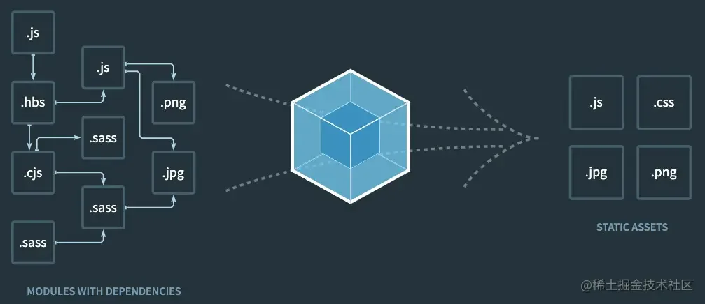

# 开发一个 Webpack 插件原来这么简单

## 目录

- [插件基本结构](#插件基本结构)
- [compiler 和 compilation](#compiler-和-compilation)
  - [compiler](#compiler)
  - [compilation](#compilation)
- [Tapable](#Tapable)
- [如何编写插件](#如何编写插件)
  - [1、初始化插件文件](#1初始化插件文件)
  - [2、选择插件触发时机](#2选择插件触发时机)
  - [3、编写插件逻辑](#3编写插件逻辑)
  - [4、使用插件](#4使用插件)
- [总结](#总结)



插件是 `webpack` 的重要组成部分，为用户提供了**一种强大方式来直接触及 webpack 的编译过程(**compilation process)。插件能够 [钩入(hook)](https://link.juejin.cn?target=https://www.webpackjs.com/api/compiler-hooks/#hooks "钩入(hook)") 到在每个编译(compilation)中**触发的所有关键事件。在编译的每一步，**插件都**具备完全访问** `compiler` 对象的能力，如果情况合适，还可以访问当前 `compilation` 对象。

### 插件基本结构

一个简单的插件结构如下：

```javascript 
class ExamplePlugin {

  constructor(options) {}

  apply(compiler) {
    compiler.hooks.emit.tapAsync("ExamplePlugin", (compilation, callback) => {
      console.log("This is an ExamplePlugin")
      callback();
    })
  }
}


```


在使用这个插件时，在 webpack 中的配置如下：

```javascript 
const ExamplePlugin = require('./ExamplePlugin.js');

module.exports = {
    plugins: [
    new ExamplePlugin(options)
  ]
}

```


从上面的插件结构中，我们可以知道，一个 `webpack` 插件一般由以下几部分组成：

- 一个`ES6 class` 类
- 在类中定义一个 `apply` 方法
- 指定一个绑定到 `webpack` 自身的事件钩子
- 处理 `webpack` 内部实例的特定数据
- 功能完成后调用 `webpack` 提供的回调

```javascript 
// 一个 class 类 （class 的本质就是一个函数）
class ExamplePlugin {

  constructor(options) {}

  // 在类中定义一个 apply 方法（本质上就是在 函数的prototype 上定义）
  apply(compiler) {
    // 指定一个挂载到 webpack 自身的事件钩子。 emit 就是 webpack 自身的事件钩子
    compiler.hooks.emit.tapAsync("ExamplePlugin", (compilation /* 处理 webpack 内部实例的特定数据 */, callback) => {
      console.log("This is an exanple plugin !!!")
      // 功能完成后调用 webpack 提供的回调
      callback();
    })
  }
}

```


`webpack` 启动后，在读取配置的过程中会先执行 `new ExamplePlugin(options)` 初始化一个 `ExamplePlugin` 实例。在初始化 `compiler` 对象后，再调用 `examplePlugin`.`apply`(`compiler`) 给插件实例传入 `compiler` 对象。插件实例在获取到 `compiler` 对象后，就可以通过 `compiler.plugin(evenName, callback)` 监听到 `webpack` **广播出的事件**，并且可以通过 `compiler` 对象去操作 `webpack`。

### compiler 和 compilation

在开发 `plugins` **时最常用**的就是 `compiler` 和 `compilation` 对象。它们是 `plugins` 和 `webpack` 之间的桥梁。

#### compiler

`compiler` 对象包含了 `webpack` **环境所有的配置信息**，包括 `options`、`loaders`、`plugins` 这些信息，这个对象在 `webpack` **启动的时候被实例化**，**它是全局唯一的**，可以**简单地把它理解为 webpack 实例。**

#### compilation

`compilation` 对象代表了**一次资源版本的构建**。它包含了**当前的模块资源**、**编译生成资源**、**变化的文件**、**以及被跟踪依赖的状态信息**等。当 `webpack` 以开发模式运行时，每当检测到一个变化，一次新的 `compilation` 将被创建。`compilation` 对象也提供了很多事件回调供插件做扩展。通过 `compilation` 也可以读取到 `compiler` 对象。

### Tapable

`tapable` 是 `webpack` 的一个核心工具，它暴露了 `tap`、`tapAsync`、`tapPromise` 方法，可以使用**这些方法来触发** `compiler` 钩子，使得**插件可以监听** `webpack` 在运行**过程中广播的事件**，然后通过 `compiler` 对象去操作 `webpack`。我们也可以使用这些方法注入自定义的构建步骤，这些步骤将在整个编译过程中的不同时机触发。

- tap：以**同步方式**触发 compiler 钩子
- tapAsync：以**异步方式**触发 compiler 钩子
- tapPromise：以**异步方式**触发 compiler 钩子，返回 Promise

### 如何编写插件

接下来，我们实现一个打包清单插件，我们给该插件取名叫 FileListWebpackPlugin 。其作用是在 webpack 生成资源到 output 目录之前创建一个 fileList.txt 文件，该文件用于统计打包后 bundle 文件的数量、文件的大小及其名称等信息。

要实现该插件，我们需要借助 emit 事件，并借助 tapable 暴露的 tapAsync 方法来触发 emit 事件。

下面，我们逐步来实现该插件。

#### 1、初始化插件文件

新建 fileList-txt-webpack-plugin.js 文件，根据插件的基本机构，初始化插件代码：

```javascript 
module.exports = class FileListTxtWebpackPlugin {
  constructor(options) {
    this.options = options;
  }

  apply(compiler) {
    compiler.hooks.emit.tapAsync('FileListTxtWebpackPlugin', (compilation, callback) => {
      console.log('This is a FileListTxtWebpackPlugin !!!');
        callback();
    })
  }
}

```


apply 方法为插件原型方法，接收 compiler 作为参数，用于帮助插件注册。

#### 2、选择插件触发时机

**选择插件触发时机**，其实就是选择插件触发的 `compiler` 钩子，即在哪个阶段触发插件。我们编写的插件，需要在 `webpack` 生成资源到 `output` **目录之前触发**，也就是要触发 `compiler` 的 `emit` 钩子。`emit` 是一个异步钩子函数，因此需要使用 `tapAsync` 方法来触发。

tapAsync 会以异步的方式触发 compiler 钩子，它接受两个参数，**插件名称和回调函数**。插件名称是我们自己定义的，我们通常将其与实现插件的类的名称保持一致。回调函数接受两个参数，`compilation` 对象 和 `callback`，在处理完 `webpack` 内部实例的特定数据后， `callback` **必须被调用**。

```javascript 
module.exports = class FileListTxtWebpackPlugin {
  constructor(options) {
    this.options = options;
  }

  apply(compiler) {
    // 使用 tapAsync 触发 emit 钩子
    // FileListTxtWebpackPlugin 是我们自定义的插件名称，我们将其与类名保持一致
    compiler.hooks.emit.tapAsync('FileListTxtWebpackPlugin', (compilation, callback) => {

      // 处理webpack 内部实例的特定是数据（从 compilation 对象中获取）

      // callback 必须被调用
        callback();
    })
  }
}

```


#### 3、编写插件逻辑

在这一步，我们开始编写插件的逻辑。

`tapAsync` 方法的第二个参数是一个回调函数，它接受两个参数，`compilation` 和 `callback` 。`compilation` 继承自 `compiler` ，它包含了当前的模块资源、编译生成资源、变化的文件等，也就是说我们需要统计的 `bundle` 文件都可以从 `compilation` 对象中获取到。

```javascript 
module.exports = class FileListTxtWebpackPlugin {
    // apply函数 帮助插件注册，接收complier类
    constructor(options) {
        console.log(options);
        // webpack 中配置的 options 对象
        this.options = options
    }

    apply(complier) {

        // 异步的钩子
        complier.hooks.emit.tapAsync("FileListTxtWebpackPlugin", (compilation, callback) => {

            const fileDependencies = [...compilation.fileDependencies]
            // 打包后 dist 目录下的文件资源都放在 assets 对象中
            const assets = compilation.assets
            // 定义返回文件的内容
            let fileContent = `文件数量：${Object.keys(assets).length}\n文件列表：`
            Object.keys(assets).forEach(item => {
                // 文件的源内容
                const source = assets[item].source();
                // 文件的大小
                let size = assets[item].size()
                size = size >= 1024 ? `${(size / 1024).toFixed(2)}/kb` : `${size}/bytes`;

                // 文件路径
                const sourcepath = fileDependencies.find(path => {
                    if (path.includes(item)) return path
                }) || ''
                fileContent = `${fileContent}\n  filename: ${item}    size: ${size}    sourcepath: ${sourcepath}`
            })

            // 添加自定义输出文件
            compilation.assets["fileList.txt"] = {
                source: function () {
                    // 定义文件的内容
                    return fileContent
                },
                size: function () {
                    // 定义文件的体积
                    return Buffer.byteLength(fileContent, 'utf8');
                },
            };
            // 注意，异步钩子中 callback 函数必须要调用
            callback();
        });

    }
}

```


#### 4、使用插件

我们的插件编写完成之后，就可以使用了，其使用方式与其它插件一致，在 webpack.config.js 中的 plugins 数组中实例化：

```javascript 
const fileListTxtWebpackPlugin = require("./myPlugins/fileList-txt-webpack-plugin");

module.exports = {

    // ... 省略其它配置

    plugins: [
    // ... 省略其它插件

    new fileListTxtWebpackPlugin()
  ]
}

```


## 总结

`webpack` 通过 `plugin` 机制让其更加灵活，以适应各种应用场景。在 `webpack` 运行的**生命周期中会广播出许多事件**，`plugin` 可以监听这些事件，在合适的时机通过 `webpack` 提供的 `API` 改变输出结果。因此，在编写一个插件的时候，**找到合适的事件点去完成功能在开发插件时是十分重要的。**
