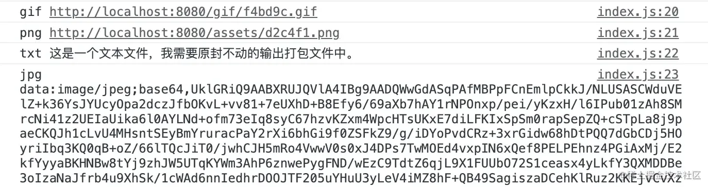
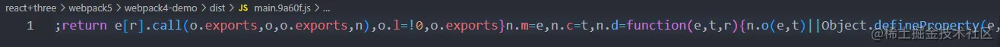
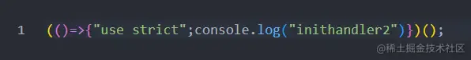
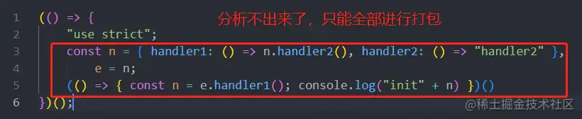
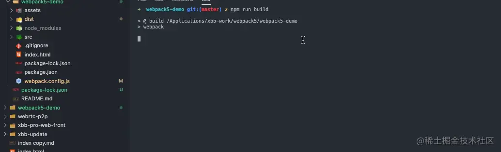

# 开箱即用

## 目录

- [内置清除输出目录](#内置清除输出目录)
- [更优雅的处理资源模块](#更优雅的处理资源模块)
- [打包体积优化](#打包体积优化)
- [打包缓存](#打包缓存)
- [top-level-await](#top-level-await)

### 内置清除输出目录

在`4.x`版本时我们经常用的一个插件就是`clean-webpack-plugin`用来每次打包的时候清空`dist`目录。在`5.x`版本中，我们只需要一个配置项即可开启此功能。在`package.json`中添加`scripts`脚本`build: webpack`，接着配置`webpack.config.js`。直接运行`npm run build`就可以看到效果了。

```javascript 
//webpack.config.js
module.exports = {
    mode: "production",
    output: {
        filename: "[name].[hash:5].js",
        clean: true,  //开启每次打包自动清除输出目录
    }
}
```


### 更优雅的处理资源模块

在`4.x`版本时我们处理资源文件通常要装很多个`loader`来处理不同的文件。在`5.x`版本中`webpack`为我们内置了处理资源的模块，我们只需要按照它的写法就可以达到跟之前一样的效果不需要额外安装任何加载器。在根目录下新建`assets`，里面存放四个文件，分别是`gif`、`png`、`jpg`、`txt`。我们想针对这四个文件做不同处理，我们只需要配置[output.assetModuleFilename](https://link.juejin.cn?target=https://webpack.js.org/configuration/module/#rule "output.assetModuleFilename")和[module.rules](https://link.juejin.cn?target=https://webpack.js.org/configuration/module/#rule "module.rules")就能达到想要的效果。

```javascript 
//index.js
import gif from "../assets/123.gif";
import png from "../assets/456.png";
import txt from "../assets/789.txt";
import jpg from "../assets/91011.jpg";

console.log("gif", gif);  //期望输出结果根据文件大小决定是否是路径还是base64
console.log("png", png);  //期望输出结果是路径
console.log("txt", txt);  //期望输出结果是原始内容
console.log("jpg", jpg);  //期望输出结果是base64
```


```javascript 
//webpack.config.js
const HtmlWebpackPlugin = require("html-webpack-plugin");

module.exports = {
    mode: "development",
    output: {
        filename: "[name].[hash:5].js",
        clean: true,
        assetModuleFilename: "assets/[hash:6][ext]",  //用来配置资源模块输出的位置以及文件名
    },
    plugins: [
        new HtmlWebpackPlugin({
            template: "./index.html"
        }),
    ],
    module: {
        rules: [
 
            {
                test: /\.png/,          //相当于4.x版本使用的file-loader
                type: "asset/resource", //将png图片使用文件的方式打包
            },
            {
                test: /\.txt/,
                type: "asset/source",   //将文件内容原封不动的放到asset中
            },
            {
                test: /\.jpg/,          //相当于4.x版本的url-loader
                type: "asset/inline",   //jpg文件都处理成base64方式存储
            },
            {
                test: /\.gif/,
                type: "asset",                  
                generator: {
                    filename: "gif/[hash:6][ext]",   //如果处理出来的是文件存放位置命名规则是什么，会覆盖上面assetModuleFilename配置项
                },
                parser: {
                    dataUrlCondition: {
                        maxSize: 4 * 1024,  //如果文件尺寸小于4kb那么使用base64的方式，大于使用文件
                    }
                }
            },
        ]
    }
}
```


安装`webpack-dev-server`，使用`webpack serve`启动开发服务器，来看一下控制台的输出是不是我们想要的。



从`开发环境`中可以看到是想要的结果，都按照预期的处理方式处理了不同的文件。**注意：`rules`****中的每一项的****`type`都要按照固定格式书写来处理不同的模块。**[**具体详细规则点击查阅**](https://link.juejin.cn?target=https://webpack.js.org/configuration/module/#modulerules "具体详细规则点击查阅") 我们再来看一下`生产环境`照样也能按照预期处理。将`mode`改为`production`然后进行打包。可以发现`png`和`gif`被单独打包成了文件。`txt`和`jpg`被处理成了`base64`打包进了main.js中。

### 打包体积优化

`5.x`版本内置的优化做的非常多，对模块的合并、`tree shaking`、作用域的提升更加智能。举个例子，现有两个不同版本项目一个`4.x`一个`5.x`。两个项目中都有两个模块：入口模块`index.js`和`handler.js`。其中`index`依赖`handler`中的某个方法。所以他们会被构建为一个`chunk`打包到一个文件中。

```javascript 
//index.js
import { handler1 } from "./handler"

const init = () => {
    const result = handler1();
    console.log("init" + result);
}

init();
```


```javascript 
//handler.js
export const handler1 = () => {
    return handler2();
}

export const handler2 = () => {
    return "handler2";
}
```


其实最终逻辑只是为了打印`init + handler2`。只是绕了好几个弯，来看一下两个版本的项目在`生产环境`下同样的代码打包出来的结果有啥不一样。

4.x版本打包结果



5.x版本打包结果



斯国一！可以看到`4.x`版本的打包结果里有非常多的代码。`5.x`版本竟然可以将优化做到如此极致。它发现我们的目的就是打印一句话，直接帮我们运算好了最终的结果。**这里有个小细节，为什么可以如此智能？如果有深入了解过**\*\*`tree shaking`****的同学应该知道，****使用****`按需导出`****和****`按需导入`****可以更好的让****`tree shaking`****发挥作用，如果我这里改用****`默认导出`****和****`默认导入`****的话就****`webpack`****就没有那么智能了，所以在书写模块时，尽量使用****`按需导出`****和****`按需导入`****。\*\*

```javascript 
//index.js
import handler from "./handler"

const init = () => {
    const result = handler.handler1();
    console.log("init" + result);
}

init();
```


```javascript 
//handler.js
const obj = {
    handler1(){
        return obj.handler2();
    },
    handler2(){
        return "handler2";
    }
}
export default obj;
```




### 打包缓存

在`4.x`版本中需要使用`cache-loader`来对打包结果进行缓存。在`5.x`版本中，无需再次安装`cache-loader`，如果没有做任何配置，默认就开启了`打包缓存`，不过是缓存到`内存(memory)`中，内存的空间多么宝贵啊，有些时候内存可能还不够用，我们就可以对[cache](https://link.juejin.cn?target=https://webpack.js.org/configuration/cache/ "cache")配置，将缓存结果缓存到`硬盘(filesystem)`中。同时也可以指定缓存文件被保存的位置。

```javascript 
// webpack.config.js
const path = require("path");

module.exports = {
    mode: "production",
    cache: {
        type: "filesystem", //缓存到内存还是硬盘中 默认为内存memory
        cacheDirectory: path.resolve(__dirname, '.temp_cache'), //缓存保存的位置
    },
}
```




## top-level-await

此配置的意思是方便你在全局中可以直接使用`await`，可以不在`async`函数中直接使用`await`关键字（只是写起来方便，在最终的打包结果中肯定还是包了一层`async`的）。我们只需要开启`experiments.topLevelAwait`配置即可。**注意：截止到目前位置，此功能仍还是一个**\*\*`实验性功能`，并没有成为正式标准，所以请慎用，当然还有一些其他的实验性功能，**[**点击查看详情**](https://link.juejin.cn?target=https://webpack.js.org/configuration/experiments/#experiments "点击查看详情")**。\*\*

```javascript 
module.export = {
    experiments: {
        topLevelAwait: true,
    },
}
```


```javascript 
//index.js
await new Promise((resolve, reject)=>{
    setTimeout(()=>{
        resolve(1);
    }, 1000)
}).then(data=>{
    console.log(data);
})
```
