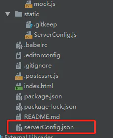
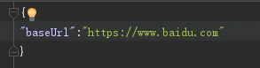
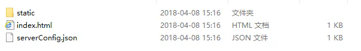
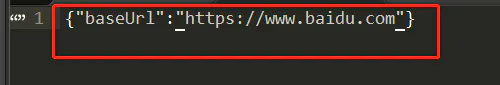

# 后生成配置文件用以外部修改公共路径

## 目录

- [1、问题初衷](#1问题初衷)
- [2、解决方案](#2解决方案)

# 1、问题初衷

&#x20;          解决问题的初衷，源于vue项目中公共路径在打包之后一旦遇到整体的路径更改就需要再次build一下。 如果公司小，项目部署的实施人员又能随时联系到开发人员。直接简单的build一下就OK了。又或者开发人员自己直接就解决一下也行。但是公司一旦大，这期间的沟通，联络等等，顺利的话还行，不顺利呢。也不能让实施人员干等着。 **要是实施人员不用等开发人员用源码重新build的话，直接有一个外部的文件，直接修改。就能解决这期间的问题的话。那将大大的提高效率。**

第一步：安装generate-asset-webpack-plugin插件

第二步：在根目录下添加serverConfig.json的配置文件(注：哪些公共的觉得有必要的都可以用json的形式写在里面）
第三步：在build/webpack.prod.conf.js文件里引入generate-asset-webpack-plugin
第四步：引入添加的serverConfig.json文件

第五步：添加打包时写入配置文件的代码第

六步：添加打包时输出配置文件的代码

第七步：在main.js中添加读取build之后的代码

第八步：项目中引用注：项目生成的结构：生成的dist文件结构其中生成的serverConfig.jsonserverConfig.json

这里面的地址就可以随意更改了，不再需要再次build

# 2、解决方案

```typescript 
npm install --save-dev generate-asset-webpack-plugin
const GeneraterAssetPlugin = require('generate-asset-webpack-plugin')
const serverConfig = require('../serverConfig.json')
const createJson = function(compilation) {
      return JSON.stringify(serverConfig);
};

new GeneraterAssetPlugin({
    filename: 'serverConfig.json',//输出到dist根目录下的serverConfig.json文件,名字可以按需改
    fn: (compilation, cb) => {
      cb(null, createJson(compilation));
    }
 })

```


```纯文本 
Vue. prototype . getConfigJson   =   function   ()   { 
 Vue. prototype . $axios . get ( 'serverConfig.json' ). then (( result ) => { 
  console . log ( result ); 
   Vue. prototype . baseUrl  = result . data . baseUrl ;   //设置成Vue的全局属性 
   new   Vue({ 
    el :   '#app' , 
    router , 
    components :   {  App  }, 
    template :   '<App/>' 
   }) 
 }). catch (( error ) => { 
  console . log ( error ) 
 })}
Vue. prototype . getConfigJson () //调用声明的全局方法123456789101112131415
```


```纯文本 
 this . baseUrl + '/123' 1
```


```纯文本 
 npm  run  build

```











