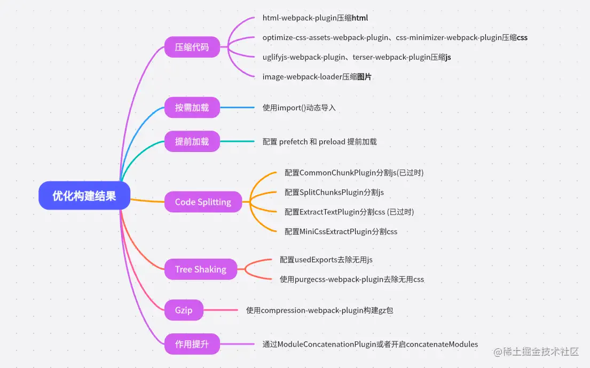
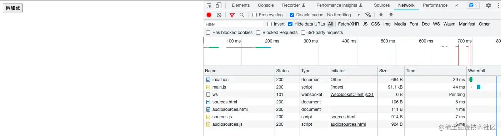
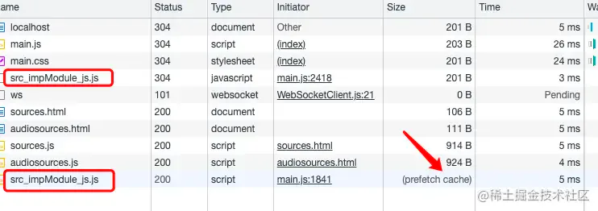
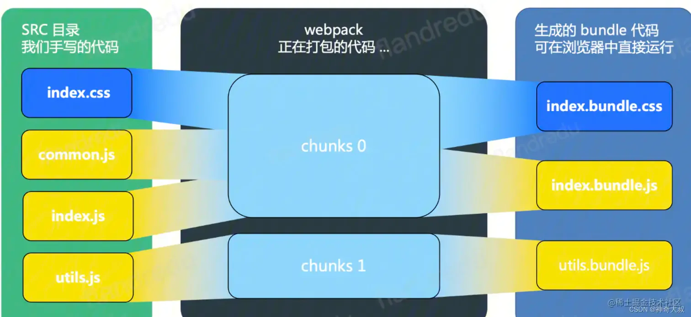
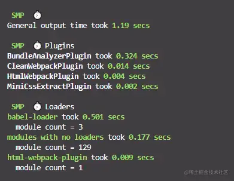
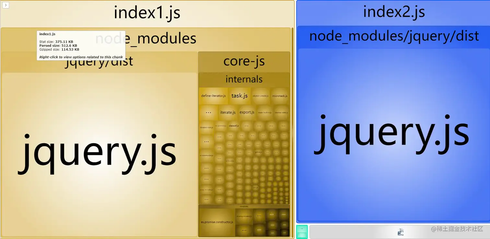

# 优化构建结果

## 目录

- [优化构建结果](#优化构建结果)
  - [压缩代码](#压缩代码)
    - [压缩 html](#压缩-html)
    - [压缩 css](#压缩-css)
      - [optimize-css-assets-webpack-plugin](#optimize-css-assets-webpack-plugin)
      - [css-minimizer-webpack-plugin](#css-minimizer-webpack-plugin)
    - [压缩 js](#压缩-js)
      - [uglifyjs-webpack-plugin](#uglifyjs-webpack-plugin)
      - [terser-webpack-plugin](#terser-webpack-plugin)
    - [压缩 image](#压缩-image)
  - [按需加载](#按需加载)
  - [提前加载（prefetch 和 preload）](#提前加载prefetch-和-preload)
    - [prefetch](#prefetch)
    - [preload](#preload)
  - [Code Splitting (代码分割)](#Code-Splitting-代码分割)
    - [CommonChunkPlugin (已过时)](#CommonChunkPlugin-已过时)
    - [SplitChunksPlugin](#SplitChunksPlugin)
    - [ExtractTextPlugin (已过时)](#ExtractTextPlugin-已过时)
    - [MiniCssExtractPlugin](#MiniCssExtractPlugin)
  - [Tree Shaking (摇钱树)](#Tree-Shaking-摇钱树)
    - [JS tree shaking](#JS-tree-shaking)
    - [CSS tree shaking](#CSS-tree-shaking)
  - [Gzip](#Gzip)
  - [作用域提升 (Scope Hoisting)](#作用域提升-Scope-Hoisting)
- [常用分析工具](#常用分析工具)
  - [时间分析工具 speed-measure-webpack-plugin](#时间分析工具-speed-measure-webpack-plugin)
  - [构建结果分析工具 webpack-bundle-analyze](#构建结果分析工具-webpack-bundle-analyze)
- [总结](#总结)

# 优化构建结果

对于 **优化构建结果** 我们可以从 `压缩代码`、`按需加载`、`提前加载`、`Code Splitting`、`Tree Shaking`、`Gzip`、`作用提升`几个方面入手。



## 压缩代码

我们都知道，在浏览器中，运行 JS 代码是需要先将代码文件从浏览器通过服务器下载下来后再进行解析执行。那么在**相同的网络环境下文件的大小会直接影响到网页加载的时长**。那么，对代码进行压缩就是最简单高效的操作。

### 压缩 html

压缩 `html` 使用的还是 `html-webpack-plugin` 插件。该插件支持配置一个 [minify](https://link.juejin.cn?target=https://github.com/kangax/html-minifier#options-quick-reference "minify") 对象，用来配置压缩 `html`。

```javascript 
module.export = {
  plugins: [
    new HtmlWebpackPlugin({
      // 动态生成 html 文件
      template: "./index.html",
      minify: {
        // 压缩HTML
        removeComments: true, // 移除HTML中的注释
        collapseWhitespace: true, // 删除空⽩符与换⾏符
        minifyCSS: true // 压缩内联css
      },
    })
  ]
}

```


如上配置后，我们的`html`代码就会移除空格和注释。可以看到，重新构建后代码变成了一行。


### 压缩 css

对于`webpack4`及以下 使用的是 [optimize-css-assets-webpack-plugin](https://link.juejin.cn?target=https://github.com/NMFR/optimize-css-assets-webpack-plugin "optimize-css-assets-webpack-plugin")插件来压缩`css`。

在`webpack5`中推荐使用的是 [css-minimizer-webpack-plugin](https://link.juejin.cn?target=https://github.com/webpack-contrib/css-minimizer-webpack-plugin "css-minimizer-webpack-plugin")。


使用`optimize-css-assets-webpack-plugin`插件的时候需要注意`webpack`版本，`webpack4`及以下的时候是配置在`plugins`里面。但是在`webpack5`中需要**统一配置在**`optimization`中。

#### `optimize-css-assets-webpack-plugin`

下面笔者先来测试下`optimize-css-assets-webpack-plugin`

首先我们在入口文件里面引入`test.css`文件

```javascript 
import "./test.css";

```


`test.css`文件内容如下

```javascript 
.box {
  background-color: aquamarine;
}

.item {
  color: black;
}

```


然后配置好处理css的`css-loader、mini-css-extract-plugin`，这里需要注意，不能使用`style-loader`来处理`css`，而是需要使用`mini-css-extract-plugin`插件将`css`单独抽离出来才能进行压缩。

```javascript 
// webpack5

const MiniCssExtractPlugin = require("mini-css-extract-plugin");

module.exports = {
  module: {
    rules: [
      {
        test: /\.jsx?$/,
        use: ["babel-loader"],
        exclude: /node_modules/, //排除 node_modules 目录
      },
      {
        test: /\.css$/,
        use: [MiniCssExtractPlugin.loader, "css-loader"],
        exclude: /node_modules/, //排除 node_modules 目录
      },
    ]
  },
  plugins: [
    new MiniCssExtractPlugin()
  ],
  optimization: {
    // 是否需要压缩
    minimize: true, // 开发环境需要开启
    // 配置压缩工具
    minimizer: [
      // 添加 css 压缩配置
      new OptimizeCssAssetsPlugin({}), // 需要安装
    ],
  },
}

```


使用如上配置进行构建，可以看到，单独生成了 `main.css` 文件，并对`css`进行了压缩。


下面我们再来看看 `css-minimizer-webpack-plugin`的使用姿势。

#### `css-minimizer-webpack-plugin`

配置方式基本相同

```javascript 
const CssMinimizerPlugin = require("css-minimizer-webpack-plugin");

optimization: {
  // 是否需要压缩
  minimize: true, // 需要开启
  // 配置压缩工具
  minimizer: [
    // 添加 css 压缩配置
    new CssMinimizerPlugin({}), // 需要安装
  ],
},

```


我们重新构建，可以看到，单独生成了 `main.css` 文件，并对`css`进行了压缩。


### 压缩 js

在 `webpack` 中，我们可以使用 [uglifyjs-webpack-plugin](https://link.juejin.cn?target= "uglifyjs-webpack-plugin") 和 [terser-webpack-plugin](https://link.juejin.cn?target= "terser-webpack-plugin") 插件来优化 JS 资源。

我们先来看看`uglifyjs-webpack-plugin`的使用姿势

#### ~~`uglifyjs-webpack-plugin`~~

我们在入口文件定义如下代码

```javascript 
const names = ["randy", "jack"];

const say = (_name) => {
  console.log(_name);
};

say(Math.random() > 0.5 ? names[1] : names[0]);

```


然后配置`UglifyJsPlugin`插件

```javascript 
const UglifyJsPlugin = require("uglifyjs-webpack-plugin"); // 需要安装

module.exports = {
  module: {
    rules: [
      {
        test: /\.jsx?$/,
        use: ["babel-loader"],
        exclude: /node_modules/, //排除 node_modules 目录
      },
    ]
  },
  optimization: {
    // 是否需要压缩
    minimize: true, // 开发环境需要开启
    // 配置压缩工具
    minimizer: [
      new UglifyJsPlugin({})
    ],
  },
}

```


构建查看构建后的产物，可以看到代码被压缩了。


不过`uglifyjs-webpack-plugin`到目前已经有四五年没更新并且仓库也已存档不维护了，所以我们简单了解即可。

#### `terser-webpack-plugin`

目前的主流还是\*`terser-webpack-plugin`\*，在`webpack5`**生产环境中**(`mode=production`)，**已默认开启**。

我们不对`optimization`做任何配置，只设置`mode=production`进行构建，构建结果如下，可以验证在生产环境下会默认启用`terser-webpack-plugin`插件。


如果你不想使用`terser-webpack-plugin`插件的默认配置，想自定义，也是支持的，我们**直接**引入`terser-webpack-plugin`进行自定义配置即可。

```javascript 
const TerserPlugin = require("terser-webpack-plugin"); // webpack5内置，不需要再单独安装

optimization: {
  // 是否需要压缩
  minimize: true,
  // 配置压缩工具
  minimizer: [
    new TerserPlugin({// 在这里自定义配置}),
  ],
},

```


这里有个细节需要注意，生产环境会默认配置`terser-webpack-plugin`，所以如果你还有**其它压缩插件**使用的话需要将`TerserPlugin`**显示配置或者使用**\*\*`.`\*\*`..`，否则`terser-webpack-plugin`**会被覆盖**。

```javascript 
const TerserPlugin = require("terser-webpack-plugin"); // webpack5内置，不需要再单独安装

optimization: {
  // 是否需要压缩
  minimize: true,
  // 配置压缩工具
  minimizer: [
    new TerserPlugin({}), // 显示配置
    // "...", // 或者使用展开符，启用默认插件
    // 其它压缩插件
    new CssMinimizerPlugin(),
  ],
},

```


### 压缩 image

一般来说在打包之后，一些图片文件的大小是远远要比 `js` 或者 `css` 文件要来的大，所以我们首先要做的就是对于图片的优化，我们可以**手动的**去通过线上的图片压缩工具，**如 **[**tiny png**](https://link.juejin.cn?target= "tiny png")** 帮我们**来压缩图片。

但是这个比较繁琐，在项目中我们希望能够更加自动化一点，自动帮我们**做好图片压缩**，这个时候我们就可以借助 [image-webpack-loader](https://link.juejin.cn?target= "image-webpack-loader") 帮助我们来实现。它是基于 [imagemin](https://link.juejin.cn?target= "imagemin") 这个 Node 库来实现图片压缩的。

使用很简单，我们只要在 `file-loader` 之后加入 `image-webpack-loader` 即可：

```javascript 
module.exports = {
  module: {
    rules: [
      {
        test: /\.(png|jpg|gif|jpeg|webp|svg)$/,
        use: [
          "file-loader",
          {
            loader: "image-webpack-loader",
            options: {
              mozjpeg: {
                progressive: true,
              },
              // optipng.enabled: false will disable optipng
              optipng: {
                enabled: false,
              },
              pngquant: {
                quality: [0.65, 0.9],
                speed: 4,
              },
              gifsicle: {
                interlaced: false,
              },
            },
          },
        ],
        exclude: /node_modules/, //排除 node_modules 目录
      },
    ]
  },
}

```


我们在件引入事先准备好的图片

```javascript 
import logo from "./logo.png";
console.log(logo);

```


配置好 `image-webpack-loader` ，再次构建可以看到图片变成了3kb，压缩效果还是很明显的。


## 按需加载

很多时候我们不需要一次性加载所有的`JS`文件，而应该在**不同阶段去加载所需要**的代码。`webpack`内置了强大的**分割代码的功能**可以实现按需加载。

比如，我们在点击了某个按钮之后，才需要使用使用对应的`JS`文件中的代码，我们可以使用 `import()` 语法按需引入

```javascript 
// index.js

document.getElementById('btn1').onclick = function() {
  import('./impModule.js').then(fn => fn.default());
}

```


impModule.js

```javascript 
export default () => {
  console.log("我是懒加载模块");
};

```


我们打包之后，动态加载的模块会单独生成一个`js`文件。


页面首次加载的时候并不会加载该`js`文件，而是当我们需要使用到的时候才会进行加载。我们在页面上看看效果。

页面首次加载



点击动态加载按钮


可以看到，按钮点击完后才会去单独加载需要的文件。

在**默认情况下**打包出来的文件名是**路径的组合**，比如上面的`src_impModule.js`，如果你不想使用这个名字，想通俗易懂可以在`import`里面配置 `webpackChunkName`。

比如上面的例子，我们配置`webpackChunkName: "btnChunk"`

```javascript 
// index.js

document.getElementById('btn1').onclick = function() {
  import(/* webpackChunkName: "btnChunk" */ './impModule.js').then(fn => fn.default());
}

```


再次构建可以看到，构建出来的文件名就是我们事先定义好的名称


写过`vue`的同学可能非常清楚，在`vue-router`里面，**实现路由懒加载使用**的最多的就是`import()`。

**懒加载实际上**就是 `import` 的语法，他不是 `webpack` 的功能，**而是 ****`ECMAScript`**** 的语法，****`webpack`**** 做的只是识别这种语法并应用。**

## 提前加载（prefetch 和 preload）

上面说的代码懒加载在使用的时候才去加载是会提升页面性能，但是如果**懒加载的模块比较大**，当我们点击的时候再去加载的话**无疑会让用户等待时间加长。**

如果可以利用浏览器**空闲时候去加载**这些切分出来的模块那就好了？

诶，还真有，那就是`prefetch 和 preload`

**prefetch和preload的概念**

`prefetch`（预取）：**将来**可能需要一些模块资源，在核心代码加载**完成之后带宽空闲的**时候再去加载需要用到的模块代码。

`preload`（预加载）：**当前**核心代码加载期间可能需要模块资源，其是和**核心代码文件一起去加载**的。

### prefetch

我们将上面的例子稍微改下，加个注释`/* webpackPrefetch: true */`

```javascript 
// index.js

document.getElementById("btn1").onclick = async () => {
  const imp = await import(/* webpackPrefetch: true */ "./impModule.js");
  imp.default();
};

```


上面的代码的意思是当我们主要的核心代码加载完成，**浏览器有空闲的时候，浏览器就会帮我们自动的去下载**`impModule.js`

我们到页面看效果


可以看到，在`head`里面，我们的**懒加载模块被直接引入了**，并且加上了`rel='prefetch'`。

这样，页面首次加载的时候，**浏览器空闲的会后会提前加载**`impModule.js`。当我们点击按钮的时候，会直接从缓存中读取该文件，因此速度非常快。



### preload

`/* webpackPreload: true */`使用方式类似。

**prefetch 与 preload 的区别**

1. `preload chunk` 会在父 `chunk` 加载时，**以并行方式开始加载**。`prefetch chunk` 会在父 `chunk` 加载**结束后开始加载。**
2. `preload chunk` 具有**中等优先级，并立即下载**。`prefetch chunk` 在浏览器**闲置时下载**。
3. `preload chunk` 会在父 `chunk` 中立即请求，**用于当下时刻**。`prefetch chunk` 会用于**未来的某个时刻**。
4. 浏览器支持程度不同，需要注意。

最后官网还告诉我们，**错误地使用webpackPreload实际上会损害性能，因此在使用时要小心。**

## Code Splitting (代码分割)

在项目中，一般是使用同一套技术栈和公共资源。那么如果每个页面的代码中都有这些公开资源，是不是就会导致资源的浪费呢？在每一个页面下都会加载重复的公共资源，**一是会浪费用户的流量，二是不利于项目的性能**，造成页面加载缓慢，影响用户体验。

基本思路就是我们先要确定哪些是我们项目中使用内容长期不会更改的三方库（`react`、`react-dom` 等）和我们团队内部自己封装的公共 JS（`util.js` 等）。然后将其**提取出**放入到一个公共文件 `common.js` 中。这样，只要不升级基础库的版本，那么 `common.js` 文件的内容就不会变化，在访问页面的时候，就可以一直使用浏览器缓存中的资源。

在正式讲代码分割前，先要理解webpack的提出的几个概念，module、chunk和bundle。

**module：每个import引入的文件就是一个模块 bundle：当module源文件传到webpack进行打包时，webpack会根据文件引用关系生成chunk bundle：是对chunk进行压缩、分割等处理后的产物**



### ~~CommonChunkPlugin (已过时)~~

[CommonChunkPlugin](https://link.juejin.cn/?target=https://webpack.docschina.org/plugins/commons-chunk-plugin/ "CommonChunkPlugin") 主要应用在`webpack3` 中，在 `webpack4` 的时候已经被移除了。所以 `webpack5` 也不支持了，这里笔者就不再演示了，了解即可。


### SplitChunksPlugin

下面笔者来看看取代 `CommonChunkPlugin` 的 [SplitChunksPlugin](https://link.juejin.cn/?target=https://webpack.docschina.org/plugins/split-chunks-plugin/ "SplitChunksPlugin")

默认配置如下：

```javascript 
module.exports = {
  //...
  optimization: {
    splitChunks: {
      chunks: 'async', // 值有 `all`，`async` 和 `initial`
      minSize: 20000, // 生成 chunk 的最小体积（以 bytes 为单位）。
      minRemainingSize: 0,
      minChunks: 1, // 拆分前必须共享模块的最小 chunks 数。
      maxAsyncRequests: 30, // 按需加载时的最大并行请求数。
      maxInitialRequests: 30, // 入口点的最大并行请求数。
      enforceSizeThreshold: 50000,
      cacheGroups: {
        defaultVendors: {
          test: /[\/]node_modules[\/]/,
          priority: -10,  // 优先级
          reuseExistingChunk: true,
        },
        default: {
          minChunks: 2,
          priority: -20,
          reuseExistingChunk: true,
        },
      },
    },
  },
};

```


默认情况下，它只会影响到按需加载的 chunks。

既然`js`支持代码分割，那`css`是不是也支持呢？

### ~~ExtractTextPlugin (已过时)~~

[extract-text-webpack-plugin](https://link.juejin.cn?target=https://github.com/webpack-contrib/extract-text-webpack-plugin "extract-text-webpack-plugin") 在`webpack3`之前使用的很广泛，但是在`webapck4+`中已经不再使用了，仓库也在2019年存档了，不再更新了。

所以这个插件我们了解即可，就不再演示了。

`webapck4+` 推荐使用的是`mini-css-extract-plugin`插件。

### MiniCssExtractPlugin

我们知道，`style-loader`会把`css`打包进`js`文件里面，这样`js`在运行的时候才会在`html`文件动态生成`style`标签将样式插入，这无疑\*\*加大了我们`js`\*\***文件的体积。其次还不利于css代码的复用**。

我们可以利用\*\* **[**mini-css-extract-plugin**](https://link.juejin.cn/?target=https://github.com/webpack-contrib/mini-css-extract-plugin "mini-css-extract-plugin")** **插件，将我们的`css`代码**分离出来 \*\*。

接下来我们实操下。

创建样式文件

```javascript 
// index.less
.a {
  background-color: aqua;
}

.b {
  font-size: 18px;
}

```


配置`mini-css-extract-plugin`插件

```javascript 
//webpack.config.js
const MiniCssExtractPlugin = require("mini-css-extract-plugin");

// ...
{
  test: /\.less?$/,
  use: [MiniCssExtractPlugin.loader, "css-loader", "less-loader"],
  exclude: /node_modules/, //排除 node_modules 目录
},

plugins: [
  // ...
  new MiniCssExtractPlugin(),
  }),
],

```


我们再次构建，可以发现，生成了单独的`main.css`文件。


达到了样式分离的效果。

`css`代码的分离优化原理其实和`js`是一样的。第一就是拆出来利用浏览器**并发请求特性进行快速加载**，其次就是多页面如果用到了相同样式**能进行复用**。

注意，**此插件为每个包含 ****`css`**** 的 ****`js`**** 文件创建一个单独的 ****`css`**** 文件**。

这句话的意思就是，`css`代码的分割不是以引入了多少个`css`文件构建后就有多少个`css`文件，而是根据你的`js`包来的，如果构建后你的`js`包只有一个那么`css`包也只会有一个，而不管你源代码里引入了多少个`css`文件。

## Tree Shaking (摇钱树)

`Tree Shaking`又称为摇钱树，主要用来清除没有使用到的`js`代码。

### JS tree shaking

下面笔者举个例子

我们先定义一个模块，导出加、减两个方法

```javascript 
// treeshak.js
export const increase = (a, b) => {
  return a + b;
};

export const decrease = (a, b) => {
  return a - b;
};

```


在入口文件引入，但是我们只使用其中一个方法。

```javascript 
// index.js

import { increase } from "./treeshak";

console.log(increase(1, 2));

```


我们以开发模式`mode: "development"`构建一下，可以发现我们没有使用的`decrease`方法也被打包进来了。


这肯定不是我们想要的，我们需要的是没有使用的代码踢除掉，我们配置下。

```javascript 
// webpack.config.js

optimization: {
  usedExports: true
},

```


并在`package.json`里面配置`sideEffects`，表示对所有的文件都启用 `tree shaking`。

```javascript 
// package.json

"sideEffects": false

```


我们再次构建，发现`decrease`方法还是在里面，但是多了一句注释


他是`unused`的导出，意思就是这个方法是没被使用的。

在**开发模式下并不会直接删除未使用的代码**，而是会加上一个`unused`注释，如果直接删除的话，可能会影响我们开发时定位错误。

其实`tree shaking`在**生产模式下已经默认开启了**。我们使用`mode: "production"`重新构建下


可以发现，`decrease`被移除了。

**上面我们配置**\*\*`sideEffects`****直接配置的是****`false`，**其实是不严谨的，因为有**些导入我们是不需要\*\* `tree shaking`。

比如我们导入样式，导入`polyfill`。

```javascript 
import './index.less'
import '@babel/polly-fill'

```


这种只导入未使用的代码也会被`tree shaking`，这样就是导致样式和`polyfill`都会丢失，这肯定不是我们想要的。**所以我们需要进一步配置**\*\*`sideEffects`。\*\*​

```javascript 
"sideEffects": [
  "*.less",
  "@babel/polly-fill",
]

```


这里面的意思就是，我们碰到上面的几个模块，我们就不去进行 `tree shaking`。如果还有其它类似需求，在这里配置即可。

**局限性**

1. 只对`ESM`生效，对其他`模块规范` 无效。 （比如lodash）
2. 只能是静态声明和引用的 `ES6` 模块，**不能是动态引入和声明**的。
3. 只能**处理模块级别**，不能**处理函数级别的冗余**。
4. 只能**处理 ****`JS`**** 相关**冗余代码，不能处理 `CSS` 冗余代码。

### CSS tree shaking

既然`js`能进行`tree shaking`，那`css`可以吗？

当然也是可以的，但是需要借助`purgecss-webpack-plugin`插件。

我们在`index.html`使用我们上面创建的`index.less`里面的`.a`**但是**\*\*`.b`\*\***我们并没有使用。**

```javascript 
<div id="root">
  <button id="btn1">懒加载</button>
  <div class="a">有使用样式</div>
  <div>没有使用样式</div>
</div>

```


我们直接构建，可以发现，`.b`我们没有使用到但是他还是被打包进来了


接下来我们配置下`purgecss-webpack-plugin`插件。

```javascript 
const path = require("path");
const PurgecssPlugin = require("purgecss-webpack-plugin");
const glob = require("glob"); // 文件匹配模式

plugins: [
  // ...
  new PurgecssPlugin({
    // 这里我的样式在根目录下的index.html里面使用，所以配置这个路径
    paths: glob.sync(`${path.join(__dirname)}/index.html`, { nodir: true }),
  }),
]

```


我们再次构建，可以看到`.b`样式没有被打包进来。


达到了跟`js tree shaking`一样的效果。

## Gzip

前端除了在打包的时候将无用的代码或者 `console`、注释剔除之外。我们还可以使用 `Gzip` 对**资源进行进一步压缩**。`Gzip` 原本是 **`UNIX`**\*\* 系统的文件压缩\*\*，后来逐步成为 `web` 领域**主流的压缩工具。** 那么浏览器和服务端是如何通信来支持 `Gzip` 呢？

1. 当用户访问 web 站点的时候，会在 `request header` 中设置 `accept-encoding:gzip`，表明**浏览器是否支持 ****`Gzip`****。**
2. 服务器在收到请求后，判断如果需要返回 `Gzip` 压缩后的文件那么**服务器**就会先将我们的 `JS\CSS` 等其他\*\*资源文件进行 ****`Gzip`**** 压缩后再传输到客户端，\*\*同时将 `response headers` 设置 `content-encoding:gzip`。反之，则返回源文件。
3. 浏览器在接收到服务器返回的文件后，**判断**服务端返回的内容**是否为压缩过的内容**，是的话则进行解压操作。

一般情况下我们**并不会让服务器实时** `Gzip` 压缩，而是利用`webpack`**提前将静态资源**进行`Gzip` 压缩，然后将`Gzip` 资源放到服务器，当请求需要的时候直接将`Gzip` 资源发送给客户端。

我们只需要安装 `compression-webpack-plugin` 并在`plugins`配置就可以了

```javascript 
const CompressionWebpackPlugin = require("compression-webpack-plugin"); // 需要安装

module.exports = {
  plugins: [
    new CompressionWebpackPlugin()
  ]
}

```


配置好我们再来构建，可以发现生成了资源的`.gz`文件


## 作用域提升 (Scope Hoisting)

`Scope Hoisting` 是 `webpack3` 的功能，翻译过来的意思是“**作用域提升**”。在 `JavaScript` 中，也有类似的概念，“变量提升”、“函数提升”，`JavaScript` 会把函数和变量声明提升到当前作用域的顶部，`Scope Hoisting` 也是类似。`webpack` **会把引入的 js 文件“提升”顶部。**

在没有使用 `Scope Hoisting` 的时候，`webpack` 的打包文件会将**各个模块分开使用** `__webpack_require__` 导入，在使用了 `Scope Hoisting` 之后，就会把需要**导入的文件直接移入使用模块的顶部**。这样做的好处有

- 代码中**函数声明和引用语句**减少，减少代码体积
- 不用多次使用 `__webpack_require__` 调用模块 **，运行速度**会的得以提升。

所以，`Scope Hoisting` 可以让 `webpack` 打包出来的代码**文件体积更小，运行更快**。`Scope Hoisting` 的原理也很简单，主要是其会**分析模块之间的依赖关系**，将那些**只被引用一次的模块进行合并**，**减少引用的次数。**

因为 `Scope Hoisting` **需要分析模块之间的依赖关系**，所以源码**必须采用 ES6 模块化语法**。也就是说如果你使用非 `ES6` 模块或者使用 `import()` **动态导入**的话，则不会有 `Scope Hoisting`。

`Scope Hoisting` 是 `webpack` 内置功能，只需要在`plugins`里面使用即可

```javascript 
module.exports = {
  plugins: [
    // 开启 Scope Hoisting 功能
    new webpack.optimize.ModuleConcatenationPlugin()
  ]
}

```


当然，在 `webpack4+` 中还可以在`optimization`中通过参数`concatenateModules`直接配置

```javascript 
module.exports = {
  optimization: {
    concatenateModules: true // 开启 Scope Hoisting 功能
  },
}

```


不过生产环境下 Scope Hoisting 功能是默认开启的。我们不用再额外处理。

# 常用分析工具

前面介绍了很多优化打包的方式，但是怎么能够定位我们项目的问题在哪？又怎么去检验我们的优化成果呢？

最直接的分析方式当然是查看我们每次打包后在控制台输出的结果，例如


但是这样的输出结果的可读性非常差并且不直观。我们可以使用可视化分析工具更简单、直观的查看打包结果，方便分析和排查问题。

下面笔者介绍两款比较好用的分析工具

第一个是时间分析工具是 [speed-measure-webpack-plugin](https://link.juejin.cn?target= "speed-measure-webpack-plugin")

第二个是构建结果产物分析工具 [webpack-bundle-analyzer](https://link.juejin.cn?target= "webpack-bundle-analyzer") 

## **时间分析工具** speed-measure-webpack-plugin

[speed-measure-webpack-plugin](https://link.juejin.cn/?target= "speed-measure-webpack-plugin") 这个插件帮助我们分析整个打包的总耗时，以及每一个loader 和每一个 plugins 构建所耗费的时间，从而帮助我们快速定位到可以优化 Webpack 的配置。



使用姿势如下

```javascript 
const SpeedMeasurePlugin = require("speed-measure-webpack-plugin"); // 需要安装
const smp = new SpeedMeasurePlugin();

module.exports = () => smp.wrap(config); // 使用smp包裹webpack的配置

```


## **构建结果分析**工具 webpack-bundle-analyze

[webpack-bundle-analyzer](https://link.juejin.cn?target= "webpack-bundle-analyzer") 插件应该是迄今为止使用最多的 webpack 可视化分析工具。

`webpack-bundle-analyzer` 能可视化的反映

1. 打包出的文件中都包含了什么；
2. 每个文件的尺寸在总体中的占比，哪些文件尺寸大，思考一下，为什么那么大，是否有替换方案，是否使用了它包含的所有代码；
3. 模块之间的包含关系；
4. 是否有重复的依赖项，是否存在一个库在多个文件中重复？ 或者捆绑包中是否具有同一库的多个版本？
5. 是否有相似的依赖库， 尝试使用一种依赖库实现相似的功能。
6. 每个文件的压缩后的大小。

使用姿势如下：

```javascript 
const BundleAnalyzerPlugin = require('webpack-bundle-analyzer').BundleAnalyzerPlugin; // 需要安装

module.exports = {
  plugins: [
    new BundleAnalyzerPlugin()
  ]
}

```


在重新执行 `build` 命令就会发现浏览器自动打开了个窗口 `http://127.0.0.1:8888/`，展示本项目本次 `build` 的结果的可视化分析：



# 总结


