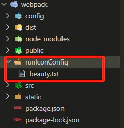
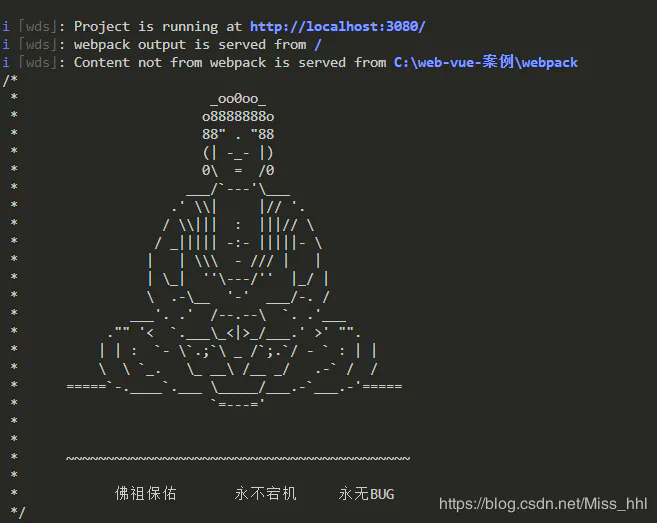

# webpack 实战篇一

## 目录

- [运行成功的logo](#运行成功的logo)
  - [使用之后的结果展示](#使用之后的结果展示)
- [svg  图标配置使用](#svg-图标配置使用)
- [optimization.splitChunks](#optimizationsplitChunks)
- [加载cdn](#加载cdn)
- [sprites 雪碧图的使用](#sprites雪碧图的使用)
- [prod去除console.log](#prod去除consolelog)
- [Scope Hoisting作用域提升](#Scope-Hoisting作用域提升)
- [提高编译速度；打包速度 DllPlugin](#提高编译速度打包速度DllPlugin)
- [add-asset-html-webpack-plugin](#add-asset-html-webpack-plugin)
  - [useBuiltIns](#useBuiltIns)
    - [false](#false)
    - [entry](#entry)
    - [usage](#usage)

# **运行成功的logo**

```bash 
npm i run-success-icon friendly-errors-webpack-plugin

```


配置：
friend-error-webpack-plugin主要提供：handlerRunConfig和initRunIcon两个方法；

- handlerRunConfig主要是解决**用户自行配置文件夹传入图案**，
- initRunIcon主要是用来**通过参数生成图案。**

```javascript 
const {handlerRunConfig,initRunIcon}=require('run-success-icon')
plugins:[
     new FriendlyErrorsWebpackPlugin({
       // 运行成功
        compilationSuccessInfo:{
            //messages:[initRunIcon()],
            messages:[handlerRunConfig()],
            // notes:['有些附加说明要在成功编辑时显示']
        },
     })
    ],
 

 

```


**提示信息**：

比如   “your application is runnig here:http\://localhost:9006/app1/“

```javascript 
for(let item in entry){
    conlg.push(
        chalk.cyan.bold('your application is runnig here:')+
        chalk.greenBright.bold(`http://${config.config.devServer}:${config.config.port}/${item}/`)                                  
    );
}
new FriendlyErrorsPlugin({
   compilationSuccessInfo:{
        messages:conlg
   }
}),
```




## **使用之后的结果展示**

执行handlerRunConfig方法的结果：


执行**initRunIcon方法的结果， 默认不传参数的结果，** 其他传参结果自行玩呀\~\~



# **svg  图标配置使用**

```javascript 
  npm install svg-sprite-loader --save-dev  其他的见vue 使用   
  chainWebpack:config=>{ 
         config.module.rules.delete("svg") 
         config.module.rule('svg-sprite-loader') 
         .test(/\.svg$/).include.add(resolve('src/assets/icons')) //处理svg目录 
         .end().use('svg-sprite-loader').loader('svg-sprite-loader') 
         .options({ 
             symbolId: 'icon-[name]' 
         }) 
         const fileRule = config.module.rule('file') 
         fileRule.uses.clear() 
         fileRule 
         .test(/\.svg$/) 
         .exclude.add(resolve('/src/assets/icons')) 
         .end() 
         .use('file-loader') 
         .loader('file-loader') 
     },
```


# **optimization.splitChunks**

[https://blog.csdn.net/weixin\_34294049/article/details/97278751](https://blog.csdn.net/weixin_34294049/article/details/97278751 "https://blog.csdn.net/weixin_34294049/article/details/97278751")

```javascript 
 /** 
    * webpack中实现代码分割的两种方式： 
    * 1.同步代码：只需要在webpack配置文件总做optimization的配置即可 
    * 2.异步代码(import)：异步代码，无需做任何配置，会自动进行代码分割，放置到新的文件中 
    */ 
   optimization: { 
     splitChunks: { 
       chunks: "all",          //async异步代码分割 initial同步代码分割 all同步异步分割都开启 
       minSize: 30000,         //字节 引入的文件大于30kb才进行分割 
       //maxSize: 50000,         //50kb，尝试将大于50kb的文件拆分成n个50kb的文件 
       minChunks: 1,           //模块至少使用次数 
       maxAsyncRequests: 5,    //同时加载的模块数量最多是5个，只分割出同时引入的前5个文件 
       maxInitialRequests: 3,  //首页加载的时候引入的文件最多3个 
       automaticNameDelimiter: '~', //缓存组和生成文件名称之间的连接符 
       name: true,                  //缓存组里面的filename生效，覆盖默认命名 
       cacheGroups: { //缓存组，将所有加载模块放在缓存里面一起分割打包 
         vendors: {  //自定义打包模块 
           test: /[\\/]node_modules[\\/]/, 
           priority: -10, //优先级，先打包到哪个组里面，值越大，优先级越高 
           filename: 'vendors.js', 
         }, 
         default: { //默认打包模块 
           priority: -20, 
           reuseExistingChunk: true, //模块嵌套引入时，判断是否复用已经被打包的模块 
           filename: 'common.js' 
         } 
       } 
     } 
   } 
 
         cacheGroups: { 
               commons: { 
                 name: 'chunk-commons', 
                 test: resolve('src/components'), 
                 minChunks: 2, 
                 priority: 5, 
                 reuseExistingChunk: true 
               }, 
               node_vendors: { 
                 name: 'chunk-libs', 
                 chunks: 'initial', // 只打包初始时依赖的第三方 
                 test: /[\\/]node_modules[\\/]/, 
                 priority: 10 
               }, 
               vantUI: { 
                 name: 'chunk-vantUI', 
                 priority: 20, 
                 test: /[\\/]node_modules[\\/]_?vant(.*)/ 
               }, 
               default: { 
                 minChunks: 2, 
                 priority: -20, 
                 reuseExistingChunk: true 
               } 
         }
```


# **加载cdn**

```javascript 
https://www.cnblogs.com/ysla/p/11746356.html 
 https://blog.csdn.net/w13707470416/article/details/85100228 

 //index.html 
  <body>
    <noscript>
      <strong>We're sorry but <%= htmlWebpackPlugin.options.title %> doesn't work properly without JavaScript enabled. Please enable it to continue.</strong>
    </noscript>
    <div id="app"></div>
    <script crossorigin="anonymous" integrity="sha384-OZmxTjkv7EQo5XDMPAmIkkvywVeXw59YyYh6zq8UKfkbor13jS+5p8qMTBSA1q+F" src="https://lib.baomitu.com/vue/2.6.11/vue.min.js"></script>
    <script crossorigin="anonymous" integrity="sha384-LiIJNOpyvdXELIx0yBiazgrvDGSE2p8aHU27i55lTzWC42cNiFqDNWIlU8ocTyWI" src="https://lib.baomitu.com/vuex/3.5.1/vuex.min.js"></script>
    <script crossorigin="anonymous" integrity="sha384-CFKP4mu2aEZDylNmi3T4nvSVvMIjfqDkz2rfskdOAkPkAIocK+cqVh+rLVAnonK5" src="https://lib.baomitu.com/vue-router/3.1.3/vue-router.min.js"></script>
    <script crossorigin="anonymous" integrity="sha384-zn1vPVAulmXb7m7zo/eHPJOkmryKZUNog1TsyNLdDjCccxcOOGAUyC62x3QNN99x" src="https://lib.baomitu.com/axios/0.20.0-0/axios.min.js"></script>
    <script crossorigin="anonymous" integrity="sha384-lp4k1VRKPU9eBnPePjnJ9M2RF3i7PC30gXs70+elCVfgwLwx1tv5+ctxdtwxqZa7" src="https://lib.baomitu.com/crypto-js/3.1.9/crypto-js.min.js"></script>
    <!-- built files will be auto injected -->
  </body>


//vue.config
configureWebpack: {
        plugins: [
            ...configPlugin,
            new FriendlyErrorsWebpackPlugin({
                 compilationSuccessInfo:{
                     messages:[initRunIcon()],
                 },
              })
            
        ],
        externals: {
            'vue': 'Vue',
            "vue-router": "VueRouter",
            'vuex': "Vuex",
            'axios': 'axios',
            'crypto-js':'CryptoJS'
        }
    }


// externals中的 key是后面需要require/import的名字 ， value是第三方库暴露出来的方法名（value 是 cmd 方式引入是暴露的名字；一定要准确）
```


# **sprites 雪碧图的使用**

```javascript 
 // var templateFunction = function (data) { 
 //     var shared = '.icon { background-image: url(I);background-size: Wpx Hpx;}' 
 //         .replace('I', data.sprites[0].image) 
 //         .replace('W', data.spritesheet.width) 
 //         .replace('H', data.spritesheet.height) 
    
 //     var perSprite = data.sprites.map(function (sprite) { 
 //       return '.icon-N { width: Wpx; height: Hpx; background-position: Xpx Ypx; }' 
 //         .replace('N', sprite.name) 
 //         .replace('W', sprite.width) 
 //         .replace('H', sprite.height) 
 //         .replace('X', sprite.offset_x) 
 //         .replace('Y', sprite.offset_y); 
 //     }).join('\n'); 
    
 //     return shared + '\n' + perSprite; 
 //   }; 
 
 
 const spritePlugin = new SpritesmithPlugin({ 
     //设置源icons,即icon的路径，必选项 
     /* 
         目标小图标，这里就是你需要整合的小图片的老巢。 
         现在是一个个的散兵，把他们位置找到，合成一个 
     */ 
     src: { 
         cwd: resolve( './src/assets/img/sprites'), 
         glob: '*.png' 
     }, 
    
     // 输出雪碧图文件及样式文件，这个是打包后，自动生成的雪碧图和样式，自己配置想生成 
     target: { 
         image: resolve( './src/assets/sprite/sprite.png'), 
         css: resolve('./src/assets/sprite/sprite.css') //也可以为css, sass文件，需要先安装相关loader 
     }, 
     // 自定义模板入口，我们需要基本的修改webapck生成的样式，上面的大函数就是我们修改的模板 
     customTemplates: { 
         // 'function_based_template': templateFunction, 
     }, 
     //设置sprite.png的引用格式 
     apiOptions: { 
         cssImageRef: './sprite.png' //cssImageRef为必选项 
     }, 
     //配置spritesmith选项，非必选 
     spritesmithOptions: { 
         algorithm: 'top-down',//设置图标的排列方式 
     } 
   }); 
 configPlugin.push(spritePlugin)
```


# **prod去除console.log**

```javascript 
 const TerserPlugin = require('terser-webpack-plugin') 
    configureWebpack: { 
         optimization: { 
             minimizer: [ 
                 new TerserPlugin({ 
                     sourceMap: false, 
                     terserOptions: { 
                     compress: { 
                         drop_console: true 
                       } 
                     } 
                 }) 
             ] 
         } 
     }
```


# **Scope** **Hoisting作用域提升**

```javascript 
https://www.cnblogs.com/tugenhua0707/p/9735894.html 

要使用 Scope Hoisting 功能，首先我们需要 的是我们JS文件都使用ES6的语法来编写的，否则它是不会生效的。还是上面的代码不变。
如上代码可以看到，开启 Scope Hoisting后，函数声明由两个变成了一个，app/index/js/index.js 代码直接被注入到 app.js里面去了，如上代码 var js = ('xxx');

因此 启用 Scope Hoisting的优点如下：
1.  代码体积会变小，因为函数声明语句会产生大量代码，但是第二个没有函数声明。
 2. 代码在运行时因为 创建的函数作用域减少了，所以内存开销就变小了

 但是对于有很多第三方库并没有使用ES6模块语法的代码，webpack它会降级处理这些非ES6编写的代码，不使用 Scope Hoisting 优化。
因此在webpack中还需要加上如下代码配置：

//webpcak.config.js
const webpack = require('webpack')
module.exports = {
    plugins: [
      // 开启 Scope Hoisting 功能
      new webpack.optimize.ModuleConcatenationPlugin()
    ],
    resolve: {
        // 针对 Npm 中的第三方模块优先采用 jsnext:main 中指向的 ES6 模块化语法的文件
        mainFields: ['jsnext:main', 'browser', 'main']
    },
  }
```


# \*\*提高编译速度；打****包速度**** \*\***DllPlugin**

```javascript 
https://www.cnblogs.com/tugenhua0707/p/9520780.html    这个人的博客 很牛 
DllPlugin 和 DllReferencePlugin 提供了以大幅度提高构建时间性能的方式拆分软件包的方法。  这个东西只是在开发是使用；提升构建速度；生产环境并没有用
其中原理是，将 特定的第三方NPM包模块提前构建，然后通过页面引入 。这不仅 能够使得 vendor 文件可以大幅度减小，同时，也极大的提高了构件速度；
 
DLLPlugin 这个插件是在一个额外独立的webpack设置中创建一个只有dll的bundle，也就是说我们在项目根目录下除了有webpack.config.js，还会新建一个webpack.dll.config.js文件。webpack.dll.config.js作用是把所有的第三方库依赖打包到一个bundle的dll文件里面，还会生成一个名为 manifest.json文件。
该manifest.json的作用是用来让 DllReferencePlugin 映射到相关的依赖上去的。

cli4 ddl 构建优化： https://blog.csdn.net/DongFuPanda/article/details/104866788?utm_medium=distribute.pc_relevant.none-task-blog-BlogCommendFromMachineLearnPai2-2.nonecase&depth_1-utm_source=distribute.pc_relevant.none-task-blog-BlogCommendFromMachineLearnPai2-2.nonecase 
近期发现 dll 已经落后了，随着 webpack 4 的优化，dll 带来的提升已经不太明显。所以据说 vue-cli 和 create-react-app 曾经采用过的 dll 优化，现在也已经不再使用。现在有一个更好的方式，就是在开发模式下采用 hard-source-webpack-plugin。不用额外的 dll 配置，不用生成多余文件，也不用考虑注入问题。开发模式下二次构建的速度会有所提升，production 模式则根据实际业务和文件大小来调整配置了。
const HardSourceWebpackPlugin = require('hard-source-webpack-plugin')
const IS_DEV = process.env.NODE_ENV === 'development'
module.exports = {
    configureWebpack() {
        const devPlugins = [
            /**
             * 缓存加速二次构建速度
             */
            new HardSourceWebpackPlugin(),
            new HardSourceWebpackPlugin.ExcludeModulePlugin([
              {
                test: /mini-css-extract-plugin[\\/]dist[\\/]loader/
              }
            ])
        ]
        if(IS_DEV) {
            return {
                plugins: devPlugins
            }
        }
    }
}
DLLPlugin 和 DLLReferencePlugin 用某种方法实现了拆分 bundles，同时还大大提升了构建的速度。一般用来将常用的库，例如 vue，vuex 抽离出来，后续构建过程跳过这些库。既能加快打包速度，又能充分利用缓存。
首先安装如下三个包，缺一不可。
yarn add webpack-cli add-asset-html-webpack-plugin clean-webpack-plugin -D
项目根目录创建 webpack.dll.config.js，写入如下代码：
const path = require('path')
const webpack = require('webpack')
const { CleanWebpackPlugin } = require('clean-webpack-plugin')


// dll文件存放的目录
const dllPath = 'public/vendor'


module.exports = {
  entry: {
    // 需要提取的库文件
    vendor: ['vue', 'vue-router', 'vuex', 'axios']
  },
  output: {
    path: path.join(__dirname, dllPath),
    filename: '[name].dll.js',
    // vendor.dll.js中暴露出的全局变量名
    // 保持与 webpack.DllPlugin 中名称一致
    library: '[name]_[hash]'
  },
  plugins: [
    // 清除之前的dll文件
    new CleanWebpackPlugin(),
    // 设置环境变量
    new webpack.DefinePlugin({
      'process.env': {
        NODE_ENV: JSON.stringify('production')
      }
    }),
    // manifest.json 描述动态链接库包含了哪些内容
    new webpack.DllPlugin({
      path: path.join(__dirname, dllPath, '[name]-manifest.json'),
      // 保持与 output.library 中名称一致
      name: '[name]_[hash]',
      context: process.cwd()
    })
  ]
}
package.json 里的 scripts 添加如下代码：
     "dll": "webpack -p --progress --config ./webpack.dll.config.js", 
 运行 npm run dll 可以看到在 public 目录下生成了一个 vendor 目录，里面有两个文件：（先run dll 生产dll 在public 然后在build 复制到dist 引入html） 
vendor.dll.js 动态链接库文件包含了大量模块的代码，通过 vendor_f1555695fd34524aee6f 变量把自己暴露在了全局中，也就是可以通过 window.vendor_f1555695fd34524aee6f 可以访问到它里面包含的模块
    var vendor_f1555695fd34524aee6f=...
 vendor-manifest.json 清楚地描述了与其对应的 dll.js 文件中包含了哪些模块，以及每个模块的路径和 ID 
    {"name":"vendor_f1555695fd34524aee6f","content": {...}}
这里生成了 vendor.dll.js，可以直接手动在 index.html 引入，但是也可以通过 webpack 插件自动注入 index.html。代码如下：

 vue.config.js 
const webpack = require('webpack')
const CompressionPlugin = require('compression-webpack-plugin')
const AddAssetHtmlPlugin = require('add-asset-html-webpack-plugin')
const path = require('path')
const resolve = url => path.resolve(__dirname, url)
const IS_PROD = process.env.NODE_ENV === 'production'
module.exports = {
  configureWebpack(config) {
    const plugins = [
      ...
    ]
     if (IS_PROD) { 
       // 有几个 dll.js，这里就响应 new 几个 webpack.DllReferencePlugin 
       plugins = plugins.concat([ 
         new webpack.DllReferencePlugin({ 
           context: process.cwd(), 
           manifest: require('./public/vendor/vendor-manifest.json') 
         }), 
         // 将 dll 注入到 生成的 html 模板中 
         new AddAssetHtmlPlugin({ 
           // dll文件位置 
           filepath: resolve('./public/vendor/*.js'), 
           // dll 引用路径 
           publicPath: './vendor', 
           // dll最终输出的目录 
           outputPath: './vendor' 
         }) 
       ]) 
    }
    return {
      plugins
    }
  },
}
```


# **add-asset-html-webpack-plugin**

```javascript 
 这个插件调用的npm包名是  add-asset-html-webpack-plugin ,经常和 html-webpack-tags-plugin 做对比。 
 作用其实二者相同，当我们想在跟页面打包后，插入我们特定script的引用， 来达到全局变量的效果（暴露在Window下，这是全局变量） 。 
   // 将 dll 注入到 生成的 html 模板中 
     configPlugin.push(new AddAssetHtmlPlugin({ 
         // dll文件位置 
         filepath: resolve('./public/vendor/*.js'), 
         // dll 引用路径 
         publicPath: './vendor', 
         // dll最终输出的目录 
         outputPath: './vendor' 
     })) 
 区别是 
 html-webpack-tags-plugin不会复制文件 ，而 add-asset-html-webpack-plugin会将文件先复制到dist目录下 （当然，可以配置到dist的那个目录），再添加一个标签。 
 
 
 也就是说add-asset-html-webpack-plugin相当于 html-webpack-tags-plugin再加上一个copy-webpack-plugin： 
 plugins: [ 
   new CopyWebpackPlugin([ 
     { from: 'node_modules/bootstrap/dist/css', to: 'css/'}, 
     { from: 'node_modules/bootstrap/dist/fonts', to: 'fonts/'} 
   ]), 
   new HtmlWebpackTagsPlugin({ 
     links: ['css/bootstrap.min.css', 'css/bootstrap-theme.min.css'] 
   }) 
 ] 
 webpack.ProvidePlugin 
 上述方式有一个问题。上述插件只是在script标签中插入脚本。本质上是挂载在window对象下。当我们想要暴露的全局变量不想在window对象下被找到（安全问题）时，应该如何去做？这里我们就用到了webpack.ProvidePlugin。 
 
   // 内置模块提供全局变量 
    new webpack.ProvidePlugin({ 
         csm:path.resolve(__dirname, '../src/app.bundle.js') 
     }), 
 这样暴露的变量可以在项目中不通过import或者require就可以直接使用。并且该对象没有暴露在window下，达到隐藏数据对象的效果。
```


**10.chalk**

```纯文本 
 1/含义 
 
     修改控制台中字符串的样式（字体样式加粗等／字体颜色／背景颜色） 
 
 2/使用 
 
     加粗+红色字+背景白色 
     const chalk = require('chalk'); 
     console.log(chalk.red.bold.bgWhite('Hello World')); 
     const chalk = require('chalk'); 
     console.log(chalk`{red.bold.bgWhite Hello World}`); 

```


**11.glob**

```纯文本 
 https://www.cnblogs.com/waitforyou/p/7044171.html 
 glob 在webpack中对文件的路径处理非常之方便，比如当搭建多页面应用时就可以使用glob对页面需要打包文件的路径进行很好的处理。 
 
 let glob = require('glob') 
 // glob('./src/**/*',(err,files)=>{ 
 // glob('./src/**/*.js',(err,files)=>{ 
 // glob('./src/**/*.abc',(err,files)=>{ 
 // glob('./src/**/*.js',{nonull:true},(err,files)=>{//nonull 匹配不到时，让files返回的是模型本身 
 //   console.log('err',err)//匹配错误时信息 
 //   console.log('files',files)//数组 
 // }) 
 
 
 // let file = glob.sync(pattern,[options]) 同步返回 数组或者规则本身 
 let files = glob.sync('./src/js/*.js') 
 var entry = {}; 
 files.forEach((name, index) => { 
   // console.log('item',item,index) 
   var start = name.indexOf('src/') + 4; 
   var end = name.length - 3; 
   var eArr = []; 
   var n = name.slice(start, end); 
   // console.log('n',n) 
   n = n.split('/')[1]; 
   console.log('n',n) 
   eArr.push(name); 
   eArr.push('babel-polyfill');//引入这个，是为了用async await，一些IE不支持的属性能够受支持，兼容IE浏览器用的 
   entry[n] = eArr; 
 }) 
 
 
 console.log('entry',entry) 
 /* 
 entry:{ 
   key:['xx/xx.js','babel-polyfill'], 
   key:['xx/xx.js','babel-polyfill'], 
   key:['xx/xx.js','babel-polyfill'], 
 } */
```


**12.webpack-dev-server**

[https://segmentfault.com/a/1190000006670084](https://segmentfault.com/a/1190000006670084 "https://segmentfault.com/a/1190000006670084")  这篇文章写的很细； 可以好好看看

[https://segmentfault.com/a/1190000006964335?utm\_source=sf-related](https://segmentfault.com/a/1190000006964335?utm_source=sf-related "https://segmentfault.com/a/1190000006964335?utm_source=sf-related")  

[https://www.webpackjs.com/configuration/dev-server/](https://www.webpackjs.com/configuration/dev-server/ "https://www.webpackjs.com/configuration/dev-server/")  官网 （最为正确和官方的；推荐）

[http://www.itkeyword.com/doc/4600299159731033x360/webpack-webpack-dev-server](http://www.itkeyword.com/doc/4600299159731033x360/webpack-webpack-dev-server "http://www.itkeyword.com/doc/4600299159731033x360/webpack-webpack-dev-server")   node api 方式可以参考这个 和官网 demo

```纯文本 
 如果你通过 Node.js API 来使用 dev-server，  devServer 中的选项将被忽略 。将选项作为第二个参数传入： new WebpackDevServer(compiler, {...})。关于如何通过 Node.js API 使用 webpack-dev-server 的示例，请查看此处。
```


首先，我们来看看基本的webpack.config.js的写法

```纯文本 
   module.exports = { 
         entry: './src/js/index.js', 
         output: { 
             path: './dist/js', 
             filename: 'bundle.js' 
         } 
     }
```


虽然**webpack**提供了**webpack --watch**的命令来动态监听文件的改变并实时打包，输出新bundle.js文件，这样文件多了之后打包速度会很慢，此外这样的打包的方式不能做到**hot replace**，即每次webpack编译之后，你还需要手动刷新浏览器。

**webpack-dev-server**其中部分功能就能克服上面的2个问题。webpack-dev-server主要是启动了一个使用**express**的**Http**服务器。它的**作用主要是用来服务资源文件**。此外这个**Http服务器和client使用了websocket通讯协议**，原始文件作出改动后，**webpack-dev-server会实时的编**译，但是最后的编译的文件并没有输出到目标文件夹，即上面配置的:

```纯文本 
   output: { 
         path: './dist/js', 
         filename: 'bundle.js' 
     } 

```


**注意：你启动webpack-dev-server后，你在目标文件夹中是看不到编译后的文件的,实时编译后的文件都保存到了内存当中。因此很多同学使用webpack-dev-server进行开发的时候都看不到编译后的文件**

**启动webpack-dev-server有2种方式：**

    1. 通过cmd line

    2. 通过Node.js API

**配置**

    cmd line比较简单；

    但实际项目大多采用node api方式进行

**cmd line：**

        这个候还要注意的一点就是在webpack.config.js文件里面，如果配置了output的publicPath这个字段的值的话，在index.html文件里面也应该做出调整。**因为****webpack-dev-server****伺服的文件是相对****publicPath****这个路径的**。因此，如果你的webpack.config.js配置成这样的：

```纯文本 
   module.exports = { 
         entry: './src/js/index.js', 
         output: { 
             path: './dist/js', 
             filename: 'bundle.js'， 
             publicPath: '/assets/' //99%的情况 是 ‘/’ ;注意：不是 ‘./’ 
              
         } 
     }
```


那么，在index.html文件当中引入的路径也发生相应的变化:

```纯文本 
 <!DOCTYPE html> 
     <html lang="en"> 
     <head> 
         <meta charset="UTF-8"> 
         <title>Demo</title> 
     </head> 
     <body> 
         <script src="assets/bundle.js"></script> 
     </body> 
     </html>
```


```纯文本 
 "start":"webpack-dev-server --inline --host localhost --port 9093 --config webpack.config.dev.js"
```


**node api 模式：**

此方式需要手动将webpack-dev-server客户端配置到webpack打包的**入口文件**中

- 修改文件webpack.config.dev.js：

```纯文本 
 Object.getOwnPropertyNames((webpackBase.entry || {})).map(function (name) {  
     cfg.entry[name] = [] //添加webpack-dev-server客户端  
     .concat("webpack-dev-server/client?http://localhost:9091")  
     .concat(webpackBase.entry[name])  
 });
```


```纯文本 
 我自己写的一个多页面 还算是比较复杂劝的一个demo 
 
 const webpack = require('webpack'); 
 const config = require('./webpack.dev.config.js'); 
 const webpackDevServer = require('webpack-dev-server'); 
 const webCfg = require('./webpack.config.js') 
 const chalk = require('chalk'); 
 
 if(Object.keys(webCfg.getEntry()).length == 0){ 
     console.log(chalk.greenBright.bold("你输入的模块文件名不存在，请重新输入！\n")) 
     return 
 } 
 var hotConfig = [ 
     `webpack-dev-server/client?http://${webCfg.config.devServer}:${webCfg.config.port}`, 
     'webpack/hot/dev-server' 
 ] 
 
 // 主要是为了多入口 增加webpack-dev-server 打包到bundle.js 里 以inline的模式热更新 
 for(let item in config.entry){ 
     config.entry[item] = hotConfig.concat(config.entry[item]) 
 } 
 console.log() 
 var compiler = webpack(config); 
 let devServerOptions  = { 
     contentBase:'build/', 
     publicPath:'/', 
     compress:true, 
     watchOptions:{ 
         ignored:/node_modules/, 
         aggregateTimeout:300,//防止重复保存 频繁重新编译，300ms内重复保存不打包 
         poll:1000 //每秒询问的文件变更的次数 
     }, 
     hot:true, 
     noInfo:true, 
     stats:'errors-only', 
     host:'127.0.0.1', 
     https: false, 
     open:true, 
     openPage: Object.keys(config.entry), 
     overlay: { 
         errors: true 
     }, 
     port:8080, 
     proxy:{ 
 
 
     } 
 } 
 var server = new webpackDevServer(compiler,devServerOptions ) 
 server.listen(webCfg.config.port,'127.0.0.1')
```


```纯文本 
 错误： 
 控制台 报sockjs.js?9be2:1606 GET http://192.168.43.226:8080/sockjs-node/info?t=1584966826465 
     找到/node_modules/sockjs-client/dist/sockjs.js文件 
     在1606行，注释掉self.xhr.send(payload);这一行，然后就可以解决了 (后续： 注释掉导致双工通讯 失败；不能注释) 后来证明是端口被占用了；改端口就好了； 
 
 [WDS] Disconnected! 
 devServer，然后配置这个： 
 原因：win10默认设置的ipv6的优先级高于ipv4，所以把localhost解析到ipv6去了（这里主要因为项目使用了代理服务软件解析问题）
```


**14.uglifyjs**

```纯文本 
 uglifyjs-webpack-plugin； 
 
 错误： 打包报错，提示UglifyJs Unexpected token: keyword «const»； ugluifyjs当前版本不符合项目预期（可能不能解析es6） 
 ERROR in build.js from UglifyJs Unexpected token operator «=», expected punc «,»     babel 配置错误；肯定有es6 转es5 错误 
 
 https://www.jianshu.com/p/b597ea88b165 
 
 
 实战： 
 config  prod 
 const UglifyJsPlugin = require('uglifyjs-webpack-plugin'); 
 
   optimization:{ 
         minimizer:[ 
             new UglifyJsPlugin({ 
                 cache: true, //是否启用文件缓存 
                 parallel: true,// 多进程提高构建速度 
                 sourceMap: false, 
                 uglifyOptions:{ 
                     warnings:false,//删除无用代码时不输出警告 
                     output:{ 
                         comments:false,//删除所有注释 
                         beautify:false //最紧凑的输出，不保留空格和制表符 
                          
                     }, 
                     compress:{ 
                         drop_console: true, //删除所有console语句，可以兼容IE 
                         collapse_vars: true, //内嵌已定义但只使用一次的变量 
                         reduce_vars: true, //提取使用多次但没定义的静态值到变量 
                     } 
                 } 
             }), 
             new OptimizeCSSAssetsPlugin() 
         ] 
     },
```


**15.babel**

```纯文本 
 https://www.cnblogs.com/jisa/p/11819023.html 
 
 
 实战过：  (注意：引包的时候；可能本地环境不敏感大小写；但是线上敏感大小写；坑) 
 babel 编译：非常重要的一个内容 
 
     "babel-loader": "^8.0.1"   
 
 .babelrc 
 { 
     "presets": [ 
         ["@babel/preset-env",{ 
             "useBuiltIns":"usage", 
             "modules":"false" 
         }] 
     ] 
 } 
 
 安装以下的一套，引入的包： 
 
     "@babel/core": "^7.1.2", 
     "@babel/plugin-proposal-class-properties": "^7.1.0", 
     "@babel/plugin-transform-runtime": "^7.2.0", 
     "@babel/preset-env": "^7.1.0", 
     "@babel/preset-react": "^7.0.0", 
     "@babel/runtime": "^7.3.1", 
     "babel-core": "^6.26.3", 
     "babel-loader": "^8.0.1", 
     "babel-plugin-import": "^1.13.0", 
     "babel-plugin-syntax-dynamic-import": "^6.18.0", 
     "babel-preset-es2015": "^6.24.1", 
 
 module.rules 
      { 
                 test:/\.js$/, 
                 use:{ 
                     loader:'babel-loader', 
                     options:{ 
                         plugins:['@babel/plugin-proposal-class-properties'] 
                     } 
                 }, 
                 exclude:/node_modules/, 
                 include:path.join(process.cwd(),'./src') 
             }, 
 babel.config.js 
 module.exports = { 
     plugins:[ 
         [ 
             'import', 
             { 
                 libraryName:'vant', 
                 libraryDirectory:'es', 
                 style:true, 
             }, 
             'vant' 
         ] 
     ] 
 } 
 
 文档推荐 
 使用babel8.X版本　　 
 　　先从大体上介绍一下babel8的变化点。 
 　　　　第一，各个包的名字变了，都以@符号开头。这个变化带来2个影响。其一，以前每个包在node_modules目录下都是一个独立的文件夹；现在则在node-modules目录下有个叫“@babel”的目录，这里要安装的所有babel包，都在这个@babel目录下保存。其二，在配置的时候，写法完全变了。 
 　　　　第二，有一些包被彻底废弃。比如在babel7.X版本中用到的babel-preset-stage-0 
 　　　　第三，有一些新的包必须引入进来才可以。 
 　　具体用法如下： 
 　　1.必须安装的包如下： 
 　　 
 　　需要注意的是，这些@开头的包，在实用npm安装时，包名必须用引号引住，否则npm会把它当做不可识别的字符。例如: 
 　　npm i babel-loader '@babel/core' -D 
 　　babel-loader没有@符号，所以不需要引号包住；@babel/core则需要用引号包住。其他以此类推 
 　　这里小版本号就不要计较了，只要大版本号能对上就都一样。 
 　　2.各个包的作用如下 　　 
 * babel-loader：加载器 
 * @babel/core：babel核心包,babel-loader的核心依赖 
 * @babel/preset-env：ES语法分析包 
 * @babel/runtime和@babel/plugin-transform-runtime：babel 编译时只转换语法，几乎可以编译所有时新的 JavaScript 语法，但并不会转化BOM（浏览器）里面不兼容的API。比如 Promise,Set,Symbol,Array.from,async 等等的一些API。这2个包就是来搞定这些api的。 
 * @babel/plugin-proposal-class-properties：用来解析类的属性的。 
 　　3.配置webpack.config.js。由于“babel-lodaer”包名字没变，api写法也没变，还是那么写 　　 
 　　{ test: /\.js$/, use: 'babel-loader', exclude: /node_modules/},//处理高级ES语法的babel_lodaer 
 　　4.添加.babelrc配置文件，并在该文件中写下如下配置信息 　　 
 　　  { 
     　　　"presets": ["@babel/preset-env"], 
    　　　"plugins": ["@babel/plugin-transform-runtime", "@babel/plugin-proposal-class-properties"] 
 　　  } 
 　　这些插件及配置方法，基本上就是babel8版本下必须安装的包了。接下来npm run dev就该能运行起来项目了 
 
 有机会要更加深入一下：
```


三种不同的配置：

## **useBuiltIns**

### **false**

| 1 | "useBuiltIns": false, |
| - | --------------------- |

此时不对 polyfill 做操作。如果引入 @babel/polyfill，则无视配置的浏览器兼容，引入所有的 polyfill。

### **entry**

| 1&#xA;2 | "useBuiltIns": "entry",&#xA;"corejs": 2, |
| ------- | ---------------------------------------- |

根据配置的浏览器兼容，引入浏览器不兼容的 polyfill。需要在入口文件手动添加 import '@babel/polyfill'，会自动根据 browserslist 替换成浏览器不兼容的所有 polyfill。

这里需要指定 core-js 的版本, 如果 "corejs": 3, 则 import '@babel/polyfill' 需要改成

| 1&#xA;2 | import 'core-js/stable';&#xA;import 'regenerator-runtime/runtime'; |
| ------- | ------------------------------------------------------------------ |

### **usage**

| 1&#xA;2 | "useBuiltIns": "usage",&#xA;"corejs": 2, |
| ------- | ---------------------------------------- |

usage 会根据配置的浏览器兼容，以及你代码中用到的 API 来进行 polyfill，实现了按需添加。
