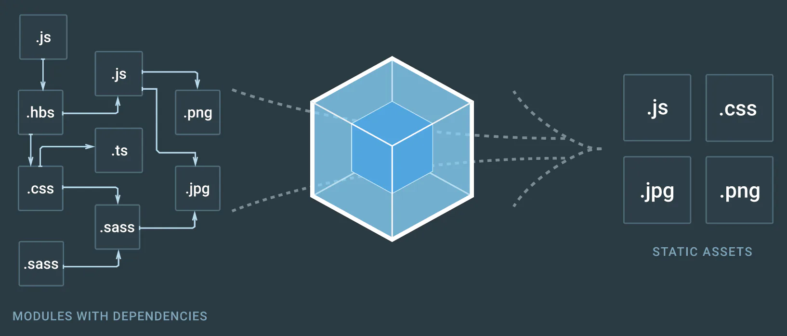
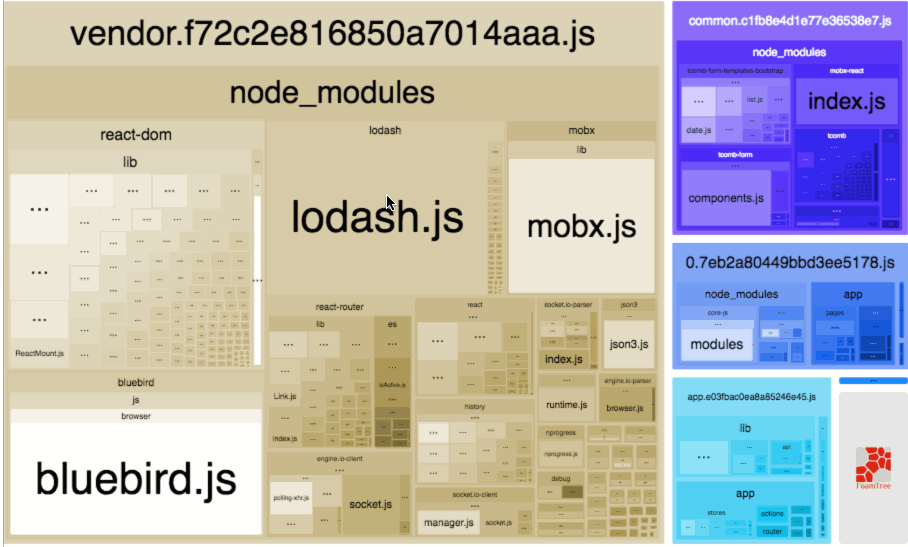

# &#x20;打包优化之体积篇

## 目录

- [定位 webpack 大的原因](#定位-webpack-大的原因)
- [引入 DllPlugin 和 DllReferencePlugin](#引入-DllPlugin-和-DllReferencePlugin)
- [外部引入模块(CDN)](#外部引入模块CDN)
- [让每个第三包“引有所值”](#让每个第三包引有所值)
  - [确定引入的必要性](#确定引入的必要性)
  - [避免类库引而不用](#避免类库引而不用)
  - [尽量使用模块化引入](#尽量使用模块化引入)
  - [尽可能引入更合适的包](#尽可能引入更合适的包)
- [按需异步加载模块](#按需异步加载模块)
- [生产环境，压缩混淆并移除console](#生产环境压缩混淆并移除console)
- [Webpack3 新功能: Scope Hoisting](#Webpack3-新功能-Scope-Hoisting)



从产品层来讲，如何使得构建的包体积小、运行快，这有必要不断摸索实践，提炼升级，使之臻于最佳。本文将从以下些许方面，对 Webpack 打包体积方面，做下优化探讨(备注： Webpack实践版本： 3.3.0)：

## 定位 webpack 大的原因

这里推荐使用 [webpack-bundle-analyzer](https://www.npmjs.com/package/webpack-bundle-analyzer "webpack-bundle-analyzer")` `—— Webpack 插件和 CLI 实用程序，她可以将**内容束展示为方便交互的直观树状图，让你明白你所构建包中真正引入的内容**；我们可以借助她，发现它大体有哪些模块组成，找到不合时宜的存在，然后优化它。我们可以在 项目的 package.json 文件中注入如下命令，以方便运行她(npm run analyz)，默认会打开 [http://127.0.0.1:8888](http://127.0.0.1:8888/ "http://127.0.0.1:8888") 作为展示。

> “analyz”: “NODE\_ENV=production npm\_config\_report=true npm run build”



webpack-bundle-analyzer

当然，同类型的还有 [webpack-chart](http://alexkuz.github.io/webpack-chart/ "webpack-chart") 以及 [webpack-analyse](http://webpack.github.io/analyse/ "webpack-analyse")，这两个站点也是以可视方式呈现构造的组件，可以让你清楚的看到模块的组成部分；不过稍显麻烦的是，你需要运行以下命令，生成工具分析所需要的 json 文件：

```javascript 
webpack --profile --json > stats.json

// 如果，运行指定的 weboack 文件，可用此命令
webpack --config build/webpack.prod.conf.js --profile --json > stats.json
```


## 引入 DllPlugin 和 DllReferencePlugin

DllPlugin 和 DllReferencePlugin 提供了以**大幅度提高构建时间性能的方式拆分软件包的方法**。其中原理是，**将特定的第三方NPM包模块提前构建**，**然后通过页面引入**。这不仅能够使得 vendor 文件可以大幅度减小，同时，也极大的提高了构件速度。鉴于篇幅，具体用法可参见：[webpack.dll.conf.js](https://github.com/nicejade/vue-boilerplate-template/blob/master/build/webpack.dll.conf.js "webpack.dll.conf.js")。

## 外部引入模块(CDN)

如今前端开发，自然是使用ES6甚至更高版本，撸将起来才更嗨。但由于浏览器兼容问题，仍得使用 babel 转换。而这 babel-polyfill 也得引入以确保兼容；还比如项目开发中常用到的 moment, lodash等，都是挺大的存在，如果必须引入的话，即考虑外部引入之，再借助 externals 予以指定， **webpack可以处理使之不参与打包，而依旧可以在代码中通过CMD、AMD或者window/global全局的方式访问。**

```javascript 
// webpack 中予以指定
externals: {
  // 'vue': 'Vue',
  // 'lodash': '_',
  'babel-polyfill': 'window'
}

//
<script src="//cdn.bootcss.com/autotrack/2.4.1/autotrack.js"></script>
<script src="//cdn.bootcss.com/babel-polyfill/7.0.0-alpha.15/polyfill.min.js"></script>
```


需要补充的是 externals 中：key 是 require 的包名，value 是全局的变量。

## 让每个第三包“引有所值”

### 确定引入的必要性

前端发展到如今时期，倘若项目采用了 MVVM模式框架，数据双向绑定，那么像 jQuery 这般类库，不能说没有丝毫引入的必要，至少可以说确实没有引入的必要。对此，如果还有些顾虑，完全可以参考下 [YOU MIGHT NOT NEED JQUERY](http://youmightnotneedjquery.com/ "YOU MIGHT NOT NEED JQUERY")；用原生写几行代码就可以解决的事儿，实在不易引入这么个庞然大物，平添烦恼。

### 避免类库引而不用

倘若这类情况发生，对整个打包体积，不仅大而且亏。项目一旦大了，很难人为保证每个引入的类库，都被有用到，尤其是二次开发。所以工具的利用十分必要，强烈推荐类如 Eslint 这般工具，并且注入对应规则，对声明却未使用的代码，给予强制提醒；这不仅可以有效的规避类似情形发生(也适用于普通变量的检测)，而且还能使得团队代码风格，尽可能地保持相似；要知道代码足够遵守规则，也可让压缩工具更有效压缩代码，一举多得，何乐不为？

### 尽量使用模块化引入

如果说 jQuery 确实没有引入必要，很多人会同意；但对于 lodash 这类依赖的工具，并不是所有人都会去造一发轮子的。然而全包引入 400kb 的体量，可否有让你心肝一颤？幸好的是，lodash 提供了模块化的引入方式；可按需引入，快哉快哉：

```javascript 
import { debounce } from 'lodash'
import { throttle } from 'lodash'

// 改成如下写法 （webpack 5+ 对此已经有了优化）

import debounce from 'lodash/debounce'
import throttle from 'lodash/throttle'
```


擅懒如你的优秀程序员，是否也发现这样写颇为麻烦？那么恭喜你，这个问题已经被解决；[lodash-webpack-plugin](https://github.com/lodash/lodash-webpack-plugin "lodash-webpack-plugin") 和 [babel-plugin-lodash](https://www.npmjs.com/package/babel-plugin-lodash "babel-plugin-lodash") 的存在（组合使用），即是解决这问题的。它可将全路径引用的 lodash， 自动转变为模块化按使用引入（如下例示）；并且所需配置也十分简单，就不在此赘述(温馨提示：当涉及些特殊方法时，尚需些留意)。

```javascript 
// 引入组件，自动转换
import _ from 'lodash'
_.debounce()
_.throttle()
```


额外补充的是，即便采用如上写法，还是不够快捷，每个用到的文件，都写一遍 import，实在多有不便。更可取的是，将项目所需的方法，统一引入，按需添加，组建出本地 lodash 类库，然后 export 给框架层（比如 Vue.prototype），以便全局使用；详情可参见：[vue-modular-import-lodash](https://github.com/nicejade/vue-boilerplate-template "vue-modular-import-lodash")。

```javascript 
// helper 文件夹下 lodash，统一引入你需要的方法
import _ from 'lodash'
export default {
  cloneDeep: _.cloneDeep,
  debounce: _.debounce,
  throttle: _.throttle,
  size: _.size,
  pick: _.pick,
  isEmpty: _.isEmpty
}

// 注入到全局
import _ from '@helper/lodash.js'
Vue.prototype.$_ = _

// vue 组件内运用
this.$_.debounce()
```


### 尽可能引入更合适的包

作为前端开发的你，想必知道有 [momentjs](https://github.com/moment/moment "momentjs") 的存在（Parse, validate, manipulate, and display dates in javascript.）；更多的是，你想必知道它很好用，然而它的体态却十分丰满(丰盈)，没念及此，是否有重新造轮子的冲动？[SpaceTime](https://github.com/smallwins/spacetime "SpaceTime"): A lightweight way to manipulate, traverse, compare, and format dates and times across planet Earth。 具有与 monent 相似 api 的新类库，其体积又相对小很多（当然，据观察其灵活度略逊一筹）；[date-fns](https://github.com/date-fns/date-fns "date-fns")：现代JavaScript日期实用程序库（ Modern JavaScript date utility library ），如 lodash 一样，可支持模块化；以及最近出来的 [DAY.JS](https://github.com/xx45/dayjs "DAY.JS"): Fast 2kB alternative to Moment.js with the same modern API。知道这些或者更多的你，会如何选择呢？

***

(Update @2018-05-10) [GoogleChromeLabs](https://github.com/GoogleChromeLabs "GoogleChromeLabs") 团队在 Github 上有建设仓库：[Optimize your libraries with webpack](https://github.com/GoogleChromeLabs/webpack-libs-optimizations "Optimize your libraries with webpack")，对于如何更好的使用 Webpack，在写代码层面上，给出了很多不错的建议，值得一读，这有助于更进一步的所构建包的体积。

***

## 按需异步加载模块

关于前端开发优化，重要的一条是，尽可能合并请求及资源，如常用的请求数据合并，压缩合并 js，构造雪碧图诸此等等（当然得适当，注意体积，过大不宜）；但，同时也当因需制宜，根据需要去异步加载，避免无端就引入早成的浪费。webpack 也是内置对这方面的支持； 假如，你使用的是 Vue，将一个组件（以及其所有依赖）改为异步加载，所需要的只是把：

```javascript 
import Foo from './Foo.vue'
改为如下写法:
const Foo = () => import('./Foo.vue')

```


如此分割之时，该组件所依赖的其他组件或其他模块，都会自动被分割进对应的 chunk 里，**实现异步加载，当然也支持把组件按组分块，将同组中组件**，打包在同个异步 chunk 中。如此能够非常有效的抑制 Javascript 包过大，同时也使得资源的利用更加合理化。

## 生产环境，压缩混淆并移除console

现代化中等规模以上的开发中，区分开发环境、测试环境和生产环境，并根据需要予以区别对待，已然成为行业共识；可能的话，还会有预发布环境。对待生产环境，压缩混淆可以很有效的减小包的体积；同时，如果能够移除使用比较频繁的 console，而不是简单的替换为空方法，也是精彩的一笔小优化。如果使用 UglifyJsPlugin 插件来压缩代码，加入如下配置，**即可移除掉代码中的 console**：

```javascript 
new webpack.optimize.UglifyJsPlugin({
  compress: {
    warnings: false,
    drop_console: true,
    pure_funcs: ['console.log']
  },
  sourceMap: false
})
```


## Webpack3 新功能: Scope Hoisting

截止目前(17-08-06), Webpack 最新版本是 3.4.1；Webpack在 3.0 版本，提供了一个新的功能：Scope Hoisting，又译作“作用域提升”。只需在配置文件中添加一个新的插件，就可以让 Webpack 打包出来的代码文件更小、运行的更快：

```javascript 
module.exports = {
  plugins: [
    new webpack.optimize.ModuleConcatenationPlugin()
  ]
}
```


据悉这个 Scope Hoisting 与 Tree Shaking，最初都是由 Rollup 实现的。在个人中实践中，这个功能的注入，对打包体积虽有影响，却不甚明显，有兴趣的盆友可以试下；更对关于此功能讯息，可参见 [Webpack 3 的新功能：Scope Hoisting](https://zhuanlan.zhihu.com/p/27980441 "Webpack 3 的新功能：Scope Hoisting")。

***
