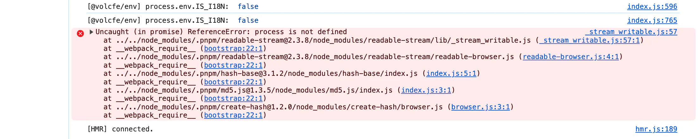

# 兼容node resolve.fallback

## 目录

- [一、为什么需要 fallback？](#一为什么需要-fallback)
- [二、核心用法与示例](#二核心用法与示例)
  - [1. 基础配置格式](#1-基础配置格式)
  - [2. 常用场景示例](#2-常用场景示例)
    - [场景 1：解决process is not defined（你之前的问题）](#场景-1解决process-is-not-defined你之前的问题)
    - [场景 2：禁用不需要的 Node 模块（如fs 浏览器用不到）](#场景-2禁用不需要的-Node-模块如fs-浏览器用不到)
    - [场景 3：完全忽略某个模块（避免解析报错）](#场景-3完全忽略某个模块避免解析报错)
- [三、关键注意点](#三关键注意点)
- [问题](#问题)
  - [一、错误栈阅读顺序](#一错误栈阅读顺序)
  - [二、针对 Webpack 5 的修复方案](#二针对-Webpack-5-的修复方案)
    - [1. 安装必要的兼容包](#1-安装必要的兼容包)
    - [2. 修改webpack.config.js](#2-修改webpackconfigjs)
    - [3. 如果不需要这些 Node 模块（更推荐的轻量方案）](#3-如果不需要这些-Node-模块更推荐的轻量方案)
  - [四、核心原理](#四核心原理)
  - [五、错误栈阅读总结](#五错误栈阅读总结)

`resolve.fallback`是 Webpack 5+ 版本新增的核心配置项，核心作用是：**当 Webpack 解析模块时，如果某个 Node.js 核心模块（如**\*\*`path`****、****`fs`****、****`process`）在浏览器环境中不存在 / 无法使用，就为这些模块指定「降级替代方案」（比如用浏览器兼容的包替换，或直接禁用） \*\*。

简单来说，它是 Webpack 为「浏览器环境适配 Node.js 核心模块」提供的「兜底 / 降级策略」—— 解决你之前遇到的`process is not defined` 这类 “浏览器缺少 Node 全局变量 / 模块” 的问题。

## 一、为什么需要 fallback？

Webpack 5 之前，会默认内置 Node.js 核心模块的浏览器兼容版本（通过`node-libs-browser`）；但 Webpack 5 为了精简体积，移除了这些默认兼容，改为让开发者通过`fallback` 手动配置。

比如：

- 你的代码 / 依赖中用到了 Node.js 的`path` 模块 → 浏览器没有这个模块 → Webpack 解析时报错；
- 配置`fallback: { path: require.resolve('path-browserify') }`→ Webpack 会用`path-browserify`（`path`的浏览器兼容版）替代原生`path`，解决报错。

## 二、核心用法与示例

### 1. 基础配置格式

```javascript 
// webpack.config.js
module.exports = {
  resolve: {
    fallback: {
      // 配置规则：key = 要降级的 Node 核心模块名，value = 替代方案
      "模块名": "替代包路径" | false | require.resolve("兼容包")
    }
  }
}
```


### 2. 常用场景示例

#### 场景 1：解决`process is not defined`（你之前的问题）

```javascript 
// 先安装兼容包：npm install process-browserify --save-dev
module.exports = {
  resolve: {
    fallback: {
      "process": require.resolve("process-browserify") // 用浏览器版 process 替代
    }
  },
  plugins: [
    new webpack.ProvidePlugin({
      process: 'process/browser' // 全局注入 process 变量
    })
  ]
}
```


#### 场景 2：禁用不需要的 Node 模块（如`fs` 浏览器用不到）

```javascript 
module.exports = {
  resolve: {
    fallback: {
      "fs": false, // 直接禁用 fs 模块（解析时忽略）
      "path": require.resolve("path-browserify"), // 用兼容包替代 path
      "crypto": require.resolve("crypto-browserify") // 替代 crypto
    }
  }
}
```


#### 场景 3：完全忽略某个模块（避免解析报错）

如果依赖中用到了浏览器完全用不到的 Node 模块（如`child_process`），直接设为`false`：

```javascript 
resolve: {
  fallback: {
    "child_process": false,
    "net": false,
    "tls": false
  }
}
```


## 三、关键注意点

1. **仅针对 Node.js 核心模块**：`fallback`只处理 Node.js 内置的核心模块（如`path`、`fs`、`process`），**不处理自定义模块或第三方 npm 包；**
2. **需要手动安装兼容包**：比如`path-browserify`、`process-browserify`等，需先通过`npm install` 安装；
3. **优先级**：`fallback` 的配置优先级高于 Webpack 默认解析规则，会覆盖默认行为；
4. **Webpack 4 兼容**：Webpack 4 没有`fallback`，需用`node`配置项（如`node: { fs: 'empty' }`），但 5+ 已废弃该写法。

# 问题



### 一、错误栈阅读顺序

**从下往上看**：

- 最下方是最初的模块引入入口（`create-hash/browser.js`）
- 往上是层层依赖的调用链
- 最上方是最终抛出错误的位置（`_stream_writable.js:57`）

这个错误的根源是：`readable-stream`这个 Node.js 流库在浏览器环境中调用了`process`，但浏览器没有这个全局变量。

***

### 二、针对 Webpack 5 的修复方案

#### 1. 安装必要的兼容包

```markdown 
pnpm add process-browserify stream-browserify readable-stream --save-dev
```


#### 2. 修改`webpack.config.js`

```javascript 
const webpack = require('webpack');

module.exports = {
  // ...其他配置
  resolve: {
    fallback: {
      // 为 Node.js 核心模块配置浏览器兼容版
      "process": require.resolve("process-browserify"),
      "stream": require.resolve("stream-browserify"),
      "readable-stream": require.resolve("readable-stream")
    }
  },
  plugins: [
    // 全局注入 process，让所有模块都能访问到
    new webpack.ProvidePlugin({
      process: 'process/browser'
    })
  ]
};
```


#### 3. 如果不需要这些 Node 模块（更推荐的轻量方案）

如果你的业务代码**根本不需要**`md5.js`/`create-hash` 这类依赖，只是被间接引入，可以直接禁用：

```javascript 
module.exports = {
  resolve: {
    fallback: {
      "fs": false,
      "path": false,
      "stream": false,
      "process": false
    }
  }
};
```


然后检查代码，把依赖`md5.js`/`create-hash`的地方替换成浏览器原生的`crypto.subtle.digest`或纯前端哈希库（比如`crypto-js`）。

### 四、核心原理

- **错误原因**：`readable-stream`是为 Node.js 设计的流库，内部使用了`process` 等 Node 全局变量，在浏览器环境中不存在。
- **修复逻辑**：通过 Webpack/Vite 的`fallback`或`define`配置，为这些 Node 模块提供**浏览器兼容的替代实现**，或者直接禁用不需要的模块。
- **最佳实践**：尽量避免在前端项目中引入纯 Node.js 库，优先选择浏览器原生 API 或专门为前端设计的库。

***

### 五、错误栈阅读总结

- **从下往上**：找到最初触发依赖的模块（比如`create-hash/browser.js`），判断是否是业务必需的。
- **从上往下**：找到最终报错的代码位置（比如`_stream_writable.js:57`），确认是哪个 Node 变量 / 模块被调用了。
