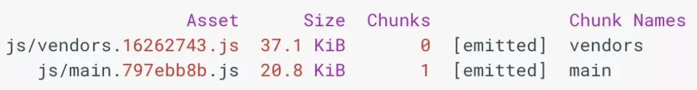
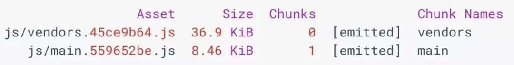

# 摇树

## 目录

- [什么是摇树？](#什么是摇树)
  - [不要让 Babel 将 ES6 模块转换为 CommonJS 模块](#不要让-Babel-将-ES6-模块转换为-CommonJS-模块)
  - [小心副作用](#小心副作用)
  - [只导入需要的东西](#只导入需要的东西)
  - [更复杂的场景](#更复杂的场景)

引擎开发者在不断努力提升 `JavaScript` 引擎的执行效率，但说到底，提升 `JavaScript` 代码的性能更多的是开发人员的责任。

有一些技术可以用于提升 `JavaScript` 的性能。**代码拆分**就是这样的一种技术，它将应用程序 `JavaScript` 划分为较小的块，并只向应用程序路由提供它们必需的块，以此来提升性能。这种方式是有效的，但它并**没有解决 JavaScript 应用程序的其他常见问题**，比如那**些被包含但从未使用的代码**。为了解决这个问题，我们需要使用摇树（tree shaking）优化技术。

# **什么是摇树？**

**摇树是一****种消除死代码的方法****。这个词最初是由 Rollup 发起的，并逐渐流行开来，但消除死代码的概念却早已存在。webpack 中也涉及了这个概念，本文将通过示例进行演示。**

**这项技术之所以****被称为“摇树”****，主要是因****为应用程序的依赖项是树状结构****。树中****的每个节点都代表了一个依赖项****，这些依赖项为应用程序提供了不同的功能。在现代应用程序中，这些依赖项通过静态导入语句进行引入，如下所示：**

```javascript 
// Import all the array utilities!   
import arrayUtils from "array-utils";

```


**在你的应用程序还很年轻的时候（如果你愿意，可以把它叫作“树苗”），应用程序的依赖项相对较少，而且你使用了大多数（如果不是全部）添加的依赖项。但是，随着应用程序的老化，****更多的依赖项被添加进来，更糟糕的是，较旧的依赖项不再被使用，但可能无法从代码库中删除。****最终的结果就是应用程序会传输大量未使用的 JavaScript 到客户端。摇树****利用了静态导入语句来导入 ES6 模块****的特定部分，从而解决了这个问题：**

```typescript 
// Import only some of the utilities!   
import { unique, implode, explode } from "array-utils";
```


**这个示例和之前示例之间的区别在于，它没有从“array-utils”模块中导入所有内容，而是导入它的特定部分。****在开发阶段的构建中，这样做并不会有真正的效果****，****因为不管怎样它都会导入整个模块****。但是，在生产阶段的构建中，我们可以通过配置 webpack**\*\* 让它“摇掉”未明确指定的 ES6 模块，从而减小最终的构建体积\*\* **。在本文中，你将学会如何做到这一点！** ​

**在任何一个应用程序中，****在寻找摇树机会时，都会先查找静态导入语句****。在主组件文件的顶部附近，你将看到如下所示的行：**

```typescript 
import * as utils from "../../utils/utils";
```


**也许你之前也见过这样的东西。导入 ES6 模块的方式有很多，但你要特别注意这个****。这行语句好像在说：“导入 utils 模块的所有内容，并把它们放在名称空间 utils 中****”。问题是，“这个模块中究竟有多少东西？”** ​

**如果你去看一下 utils 模块的源代码，你会发现它包含的东西非常多，可能有 1,300 行代码。**

**或许所有这些东西都会被用到？事实是这样的吗？让我们搜索一下主组件文件，看看出现了多少 utils 命名空间里的东西。**

**我们从 utils 导入了大量的模块，但在主组件文件中只调用了三次。**

**这样不太好。我们只在应用程****序代码的三个地方使用了 utils 命名空间****里的东西。那么它们是用来实现什么功能的呢？如果再看一下主组件文件，我们会发现，似乎只调用了一个函数，即 utils.simpleSort，用于在下拉列表发生变化时按照一定的条件对搜索结果进行排序：**

```javascript 
if (this.state.sortBy === "model") {  

  // Simple sort gets used here...  

  json = utils.simpleSort(json, "model", this.state.sortOrder);  

} else if (this.state.sortBy === "type") {  

  // ..and here...  

  json = utils.simpleSort(json, "type", this.state.sortOrder);  

} else {  

  // ..and here.  

  json = utils.simpleSort(json, "manufacturer", this.state.sortOrder);  

}
```


**我们导入了 1,300 行的文件，却只使用了其中一个函数。**

**需要注意的是，这个示例特意做得这么简单，所以可以很容易地找出膨胀代码的来源。但****在包含大量模块的大型项目中，很难找出哪些导入造成了捆绑包的数量激增****，不过我们可以借助**\*\* ****`Webpack Bundle Analyzer`**** 和 ****`source-map-explorer`**** 这些工具。\*\*

**这个示例是专门为这篇文章定制的，似乎有点牵强，但在实际的项目当中，遇到这样的情况是不可避免的。也就是说，你已经发现了可以进行摇树的机会了，那么接下来应该怎么做呢？**

### **不要让 Babel 将 ES6 模块转换为 CommonJS 模块**

**Babel 是大多数应用程序不可或缺的工具。可惜的是，它会给摇树优化带来一些麻烦。如果使用了 ****`babel-preset-env`****，它会自动将 ****`ES6`**** 模块转换为 ****`CommonJS`**** 模块（即你 require 的模块，而不是 import 的模块）。这本来是件好事，但在进行摇树优化时问题就来了。**

**针对 CommonJS 模块进行摇树优化会比较困难，而且 webpack 不知道需要从捆绑中去掉哪些东西**\*\*。解决方案很简单：****在配置 babel-preset-env 时，让它不要处理 ES6 模块****。无论你在哪里配置 Babel（无论是.babelrc 还是 package.json），只要增加一些额外的东西：\*\*

```javascript 
{  
  "presets": [  
    ["env", {  
      "modules": false  
    }]  
  ]  
}
```


**在 babel-preset-env 配置中指定“modules”: false，webpack 就可以分析依赖关系树**\*\*，并去掉那些未使用的依赖项。此外，它不会导致兼容性问题，因为 ****`webpack`**** 最终会将代码转换为广泛兼容的格式。\*\*

### **小心副作用**

**在对应用程序进行摇树优化时，还需要****注意项目依赖的模块是否有副作用****。例如，当函数修改自身作用域以外的某些内容时，就会产生执行副作用：**

```javascript 
let fruits = ["apple", "orange", "pear"];

console.log(fruits); // (3) ["apple", "orange", "pear"]

const addFruit = function(fruit) {
  fruits.push(fruit);
};
addFruit("kiwi");
console.log(fruits); // (4) ["apple", "orange", "pear", "kiwi"]
```


**在这个简单的例子中，** ​**addFruit 在修改 fruits 数组时会产生副作用，因为它超出了 addFruit 函数的作用域。**

**副作用也适用于 ES6 模块，所以会影响到摇树优化****。有些模块接收可预测的输入，返回可预测的结果，并且不会修改自身作用域之外的任何东西，如果我们没有使用到这些模块，那么就可以安全地将它们“摇”掉。它们是模块化的独立代码片段。** ​

**我们可以在 package.json 文件中指定“****`sideEffects”: false`****，告诉 ****`webpack`**** 哪个模块及其依赖项是无副作用的：**

```javascript 
{  
  "name": "webpack-tree-shaking-example",  
  "version": "1.0.0",  
  "sideEffects": false  
}
```


\*\*或者，你也可以告诉 ****`webpack`**** \*\***哪些特定文件是无副作用的**：

```javascript 
{  

  "name": "webpack-tree-shaking-example",  
  "version": "1.0.0",  
  "sideEffects": [  
    "./src/utils/utils.js"  
  ]  
}
```


**在后一个示例中，未指定的文件将被视为无副作用的。如果你不想在 package.json 文件中添加这些内容，可以在 webpack 配置的 module.rules 中指定（**[**https://github.com/webpack/webpack/issues/6065#issuecomment-351060570）。**](https://github.com/webpack/webpack/issues/6065#issuecomment-351060570）。 "https://github.com/webpack/webpack/issues/6065#issuecomment-351060570）。")

### **只导入需要的东西**

**之前我们让 ****`Babel`**** 不要处理 ****`ES6`**** 模块，现在需要对导入语法稍作调整，只从 ****`utils`**** 模块中导入我们需要的函数。在本示例中，我们只需要 simpleSort：**

```javascript 
import { simpleSort } from "../../utils/utils";
```


**我们像是在说：“****只要把 utils 模块中的 simpleSort 给我就行了****”。因为我们只将 simpleSort 而不是整个 utils 模块导入到全局作用域，所以需要将 utils.simpleSort 改为 simpleSort：**

```javascript 
if (this.state.sortBy === "model") {
  json = simpleSort(json, "model", this.state.sortOrder);
} else if (this.state.sortBy === "type") {
  json = simpleSort(json, "type", this.state.sortOrder);
} else {
  json = simpleSort(json, "manufacturer", this.state.sortOrder);
}

```


现在，我们已经完成了摇树所需的工作。以下是进行摇树优化之前的 webpack 输出：



**下面是进行摇树优化后的输出：**



\*\*两个捆绑包都缩小了，不过 ****`main`**** 捆绑包的缩小幅度更大。通过去掉 ****`utils`**** 模块的未使用部分，我们已经设法从这个****捆绑中砍掉****了大约`60％`\*\***的代码。这不仅可以缩短脚本下载所需的时间，还可以缩短处理脚本的时间。**

### **更复杂的场景**

**在大多数情况下，只要在近期版本的 ****`webpack`**** 中稍作调整就可以进行摇树优化，但总有一些例外情况会让你感到头疼。例如，本文所描述的方法对 ****`lodash`**** 就不起作用。由于 ****`lodash`**** 自身的架构问题，你需要安装 lodash-es（**[**https://www.npmjs.com/package/lodash-es）来代替常规的**](https://www.npmjs.com/package/lodash-es）来代替常规的 "https://www.npmjs.com/package/lodash-es）来代替常规的")\*\* lodash，并且使用不同的语法（被叫作“cherry-picking”）来去掉依赖项：\*\* ​

```javascript 
// This still pulls in all of lodash even if everything is configured right.

import { sortBy } from "lodash";

// This will only pull in the sortBy routine.

import sortBy from "lodash-es/sortBy";
```


**如果你希望保持一致的导入语法，那么可以在使用标准**\*\* lodash 包的同时安装 babel-plugin-lodash 插件\*\* \*\*（**[**http://babel-plugin-lodash/）。在将这个插件添加到**](http://babel-plugin-lodash/）。在将这个插件添加到 "http://babel-plugin-lodash/）。在将这个插件添加到")** Babel 中后，你可以使用典型的导入语法去掉未使用的依赖项。\*\*

**如果遇到一个很顽固的库，先看看它是****否使用 ES6 语法进行导出****。****如果它用 CommonJS 格式进行导出（例如 module.exports），那么这些代码将不能通过 webpack 进行摇树优化****。****有一些插件为 CommonJS 模块提供了摇树功能，例如 webpack-common-shake，但仍然有一些模式的 CommonJS 是无法进行摇树优化的****。如果你想要进行****可靠的依赖项消除，最好只针对 ES6 模块****。**

[显示声明副作用](./显示声明副作用/index.md "显示声明副作用")

[实际使用](./实际使用/index.md "实际使用")
