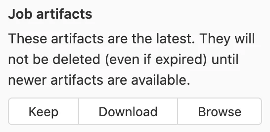

# artifacts

## 目录

- [ARTIFACTS关键字](#ARTIFACTS关键字)

## ARTIFACTS关键字

这个关键字的作用是：将**生成的资源作为pipeline运行成功的附件上传，并在gitlab交互界面上提供下载**

例如我们新增以下YML

```bash 
Build-job:
  stage: build
  script:
  - 'npm run build'
  artifacts:
    name: 'bundle'
    paths: 
      - build/
```


```react 
build_job:
  script: npm run build
  artifacts:
    name: "$CI_COMMIT_REF_NAME"
    paths: dist/
```


artifacts最终会被打包成一个压缩文件，这里的path表示要添加到压缩文件的文件或文件夹，name表示生成的压缩文件的名字。然后在对应的任务详情特面就可以下载：


