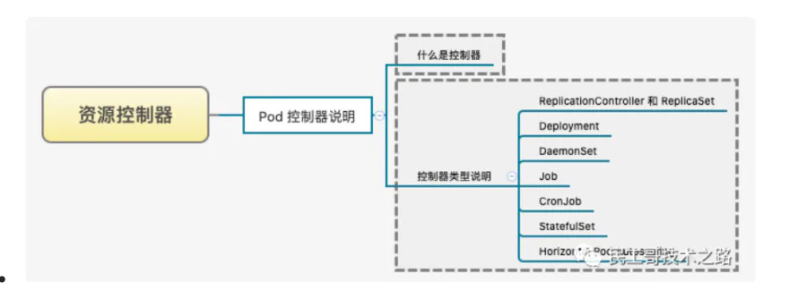
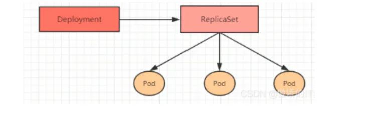

# Pod 控制器

## 目录

- [简单介绍](#简单介绍)
  - [Pod控制器类型](#Pod控制器类型)
    - [ReplicaSet](#ReplicaSet)
    - [Deployment](#Deployment)

⽤**来控制 Pod 的具体状态和⾏为的，我们称为 Pod 控制器**。在 Kubernetes 中内建控制器有如下⼏种，它们的功能和特点各不相同。

## 简单介绍

Pod 是在 Kubernetes 集群中运⾏**部署应⽤或服务的最⼩单元**，它是**可以⽀持多容器的**。Pod 的设计理念是⽀持多个容器在⼀个 Pod 中共享⽹络地址和⽂件系统，可以通过进程间通信和⽂件共享，这种简单⾼效的⽅式组合完成服务。
在同⼀个 Pod 中，有⼏个概念特别值得关注，⾸先就是容器，在 **Pod 中其实可以同时运⾏⼀个或者多个容器**，这**些容器能够共享⽹络、存储以及 CPU/内存等资源**

### Pod控制器类型

如上图，创建Pod的类型有多种⽅式，主要介绍⼀下ReplicaSet和Deployment

#### ReplicaSet

Kubernetes 建议使⽤ ReplicaSet 来取代 ReplicationController 来管理 Pod。虽然 ReplicaSet和ReplicationController 并没有本质上的不同，只是名字不⼀样⽽已，唯⼀的区别就是 ReplicaSet ⽀持集合式的 selector，可供标签筛选。
虽然 ReplicaSet 可以独⽴使⽤，但⼀般还是建议使⽤ Deployment 来⾃动管理 ReplicaSet 创建的Pod，这样就⽆需担⼼跟其他机制的不兼容问题。⽐如 ReplicaSet ⾃身并不⽀持滚动更新(rollingupdate)，但是使⽤ Deployment 来部署就原⽣⽀持。

#### Deployment

官⽅推荐的 Pod 部署⽅式是`Deployment`，为了更好地解决服务编排问题，kubernetes在V1.2版本开
始，引⼊了Deployment控制器。值得⼀提的是，这种控制器并不是直接管理pod，⽽是通**过管理
ReplicaSet简洁的管理pod，** 即：**Deployment管理ReplicaSet，ReplicaSet管理Pod。所以Deployment
⽐ReplicaSet功能更加强⼤。**

