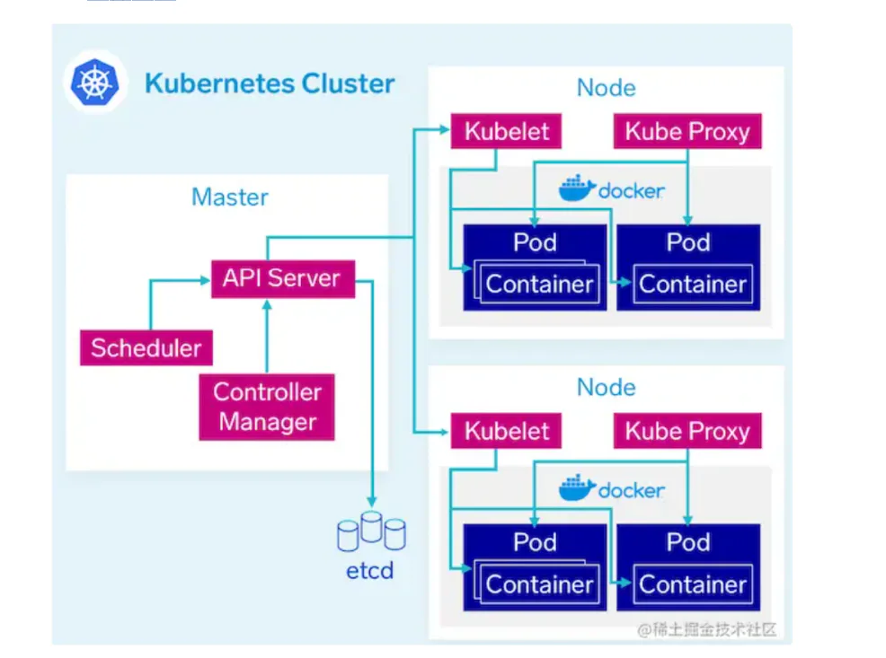

# k8s整体结构

## 目录

- [⼯作节点 - Node 架构](#作节点---Node-架构)

**每⼀个 Kubernetes 集群都是由⼀组 Master 节点和⼀系列的 Worker节点组成**

作为管理集群状态的 Master 节点，它主要负责**存储集群的状态**并为 Kubernetes **对象分配和调度资源**。Master 节点内部由下⾯三个组件构成：

- API Server: 所有**服务访问的唯⼀⼊⼝**，提供认证、授权、访问控制、API 注册和发现等机制，也是**唯⼀⼀个与etcd 通信的组件。**
- etcd: 是兼具⼀致性和⾼可⽤性的**键值数据库**，可以作为**保存** Kubernetes **所有集群数据的后台数据**库。
- Scheduler: 主节点上的组件，该组**件监视那些新创建的未指定运⾏节点的 Pod**，**并选择节点让 Pod在上⾯运⾏**。调度决策考虑的**因素包括单个 Pod 和 Pod 集合**的资源需求 \*\*、硬件/软件/策略约束、亲和性和**反亲和性规范、数据位置**、⼯作负载间的⼲扰\*\*和最后时限。
- controller-manager: 作为**集群内部的管理控制中⼼**，可以看作是 Kubernetes 的\*\*⼤脑\*\*。内部由⼀系列的**控制器组成**，负责集群内的**Node、Pod副本、服务端点（Endpoint）、命名空间（Namespace）、服务账号（ServiceAccount）、资源定额（ResourceQuota）的管理**。通过APIServer提供的接⼝实时监控整个集群的每个资源对象的当前状态，当发⽣各种故障导致系统状态发⽣变化时，会尝试将系统状态修复到“期望状态”。

Scheduler: 主节点上的组件，该组件监视那些新创建的未指定运⾏节点的 Pod，并选择节点让 Pod
在上⾯运⾏。调度决策考虑的因素包括单个 Pod 和 Pod 集合的资源需求、硬件/软件/策略约束、亲
和性和反亲和性规范、数据位置、⼯作负载间的⼲扰和最后时限。

# ⼯作节点 - Node 架构

其他的 `Worker `节点实现就相对⽐较简单了，它主要由 `kubelet `和 `kube-proxy` 两部分组成。

kubelet: 负责具体的**容器⽣命周期管理**，根据从数据库中获取的信息来管理容器，并上报 pod 运⾏状态等,主要是管理节点⾥⾯的\*\* Pod 和容器，确保他们健康稳定运⾏\*\*

kube-proxy: 是⼀个**简单的⽹络访问代理**。它负责将访问到**某个服务的请求具体分配给⼯作节点**上同⼀类标签的 Pod。kube-proxy 实质就是通过操作防⽕墙规则(iptables或者ipvs)来实现 Pod 的映射，简单点理解**负责节点⾥⾯⽹络相关的⼯作**。

Pod，Kubernetes集群中资源的最⼩单位。

[Pod 控制器](<./Pod 控制器/index.md> "Pod 控制器")

[服务与服务发现及路由](./服务与服务发现及路由/index.md "服务与服务发现及路由")

[endpoint](./endpoint/index.md "endpoint")

[K8s探针](./K8s探针/index.md "K8s探针")
