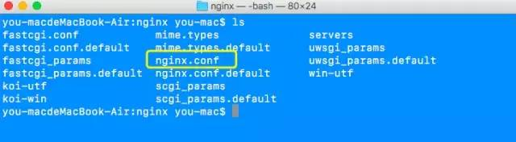
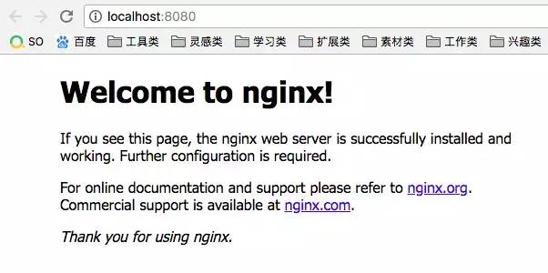
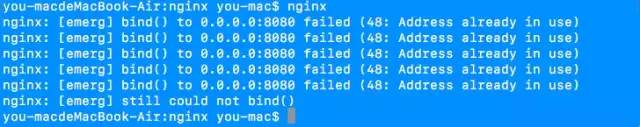

# 操作nginx

## 目录

- [安装](#安装)
- [nginx常用命令](#nginx常用命令)
  - [在/usr/local/nginx/sbin 目录下](#在usrlocalnginxsbin-目录下)
- [-p](#-p)
- [查看nginx 监听了哪些端口](#查看nginx-监听了哪些端口)

# 安装

下面修改配置方面我就从mac系统下来进行简单的演示，如何安装的话也暂以mac为主了，windows系统直接去Nginx官网下载安装即可

> 安装nginx   &#x20;
> 1-进到homebrew官网，然后复制命令，预安装需要的东西   &#x20;
> 2-brew install nginx    安装nginx   &#x20;
> 3-nginx -v  显示版本号
> 进入nginx    cd /usr/local/etc/nginx

下图为进入nginx文件夹下的文件内容



当进到这个目录下，我们就可以操作nginx了，接下来就列举一些非常非常有用的命令，多敲几遍，一定要记住

# **nginx常用命令**

- 启动nginx
- nginx
- 当你敲完nginx这5个键的时候，并没有任何反应，此时你只需访问localhost:8080(默认)即可



- 关闭nginx
- 如果出现下图情况，不要惊慌，是因为之前nginx被启动过了
- 只需**nginx -s stop**，停止nginx服务
- 然后再次启动nginx即可



- 重启nginx
- nginx -s reload
- 每次修改完.conf文件就需要重启nginx
- 检查配置
- 检查修改的nginx.conf配置是否正确
- nginx -t
- 如果出现下面ok和successfull就代表正确了，其他的都不对

> nginx: the configuration file /usr/local/etc/nginx/nginx.conf syntax is ok
> nginx: configuration file /usr/local/etc/nginx/nginx.conf test is successful

对于我们前端来说正常工作当中，倒是不需要过多的修改nginx的。我们之所以修改nginx配置，是为了做一些反向代理罢了

```markdown 
其中最主要的配置文件nginx.conf在conf文件夹中

简单介绍下几个nginx命令 ： 
 首先把nginx 配置到环境变量  
 nginx -s stop 强制关闭 :  快速停止nginx 
 nginx -s quit 安全关闭 ：完整有序的停止nginx 
 nginx -s reopen 打开日志文件
nginx -t -c /path/to/nginx.conf 测试nginx配置文件是否正确 


nginx的启动脚步配置:
    middleware/scripts
```


### 在/usr/local/nginx/sbin 目录下

```bash title="nginx/sbin"
./nginx -v #查看nginx 版本
./nginx  #启动命令
./nginx -s stop #关闭命令
./nginx -s reload #重新加载命令（修改配置文件后进行）
./nginx -p `pwd`/ -c conf/nginx.conf #指定配置文件启动
./nginx -p `pwd`/ -c conf/nginx.conf -s quit  #nginx指定配置文件的，停止时也需指定参数

```


# -p

在Nginx的命令行工具中，`-p` 参数允许用户指定一个路径作为Nginx配置文件、日志文件和其他相关文件的前缀。这有助于在多服务器环境中管理Nginx配置，特别是当你有多个Nginx实例运行在不同的目录结构中时。通过使用 `-p` 参数，你可以明确指定哪些文件和目录与特定的Nginx实例相关联。

例如，如果你有一个Nginx实例安装在 `/opt/nginx` 目录下，并且你的配置文件位于 `/opt/nginx/conf/nginx.conf`，你可以使用 `nginx -p /opt/nginx` 命令来启动或管理这个特定位置的Nginx实例。这样，Nginx将知道在哪里查找其配置文件和其他相关资源，从而正确地启动或管理该实例。

此外，`-p` 参数还可以与其他命令一起使用，如 `nginx -s reload -p /opt/nginx`，这样可以在不重启Nginx的情况下重新加载配置文件，但仅针对位于 `/opt/nginx` 目录下的Nginx实例。这种灵活性使得在复杂的系统环境中管理和维护多个Nginx实例变得更加容易‌12。

# 查看nginx 监听了哪些端口

```bash 
ps -ef  | grep nginx
netstat -anp | grep ${pid} # pid 为上面查询出来的nginx进程号

```
